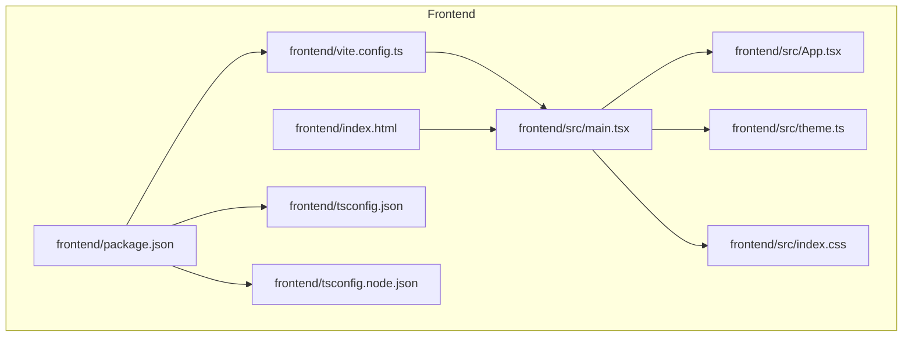
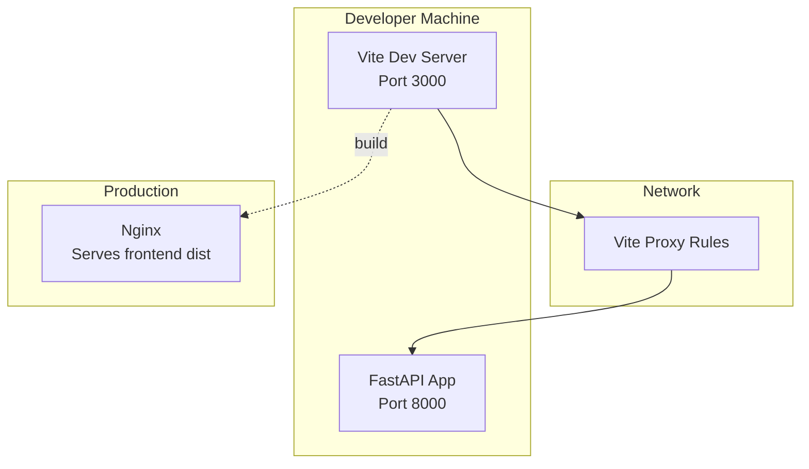
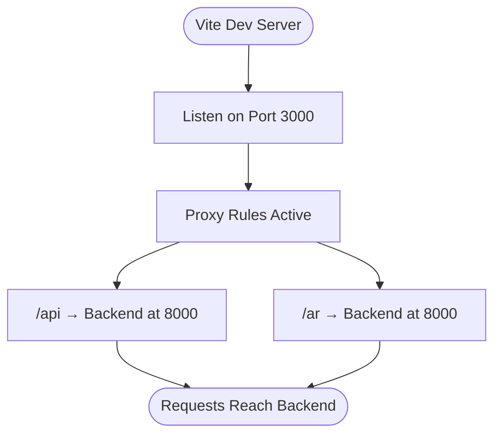
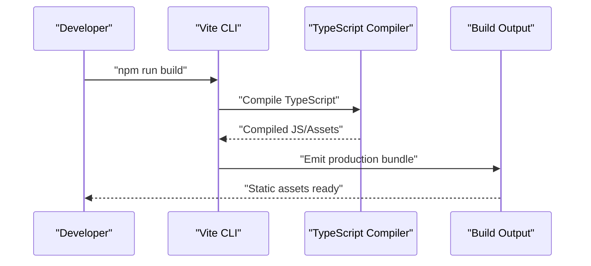
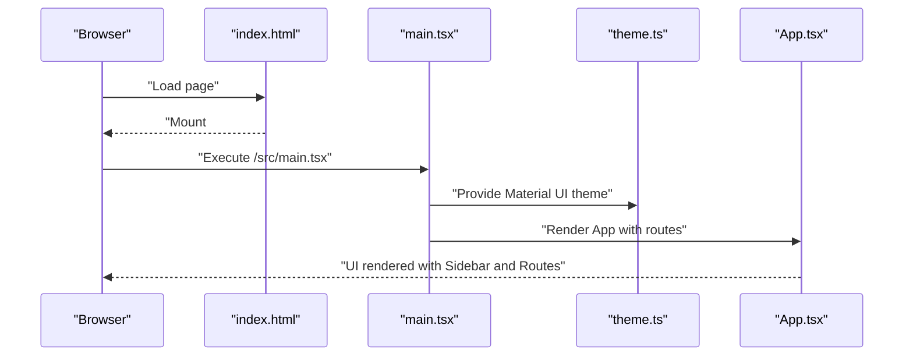
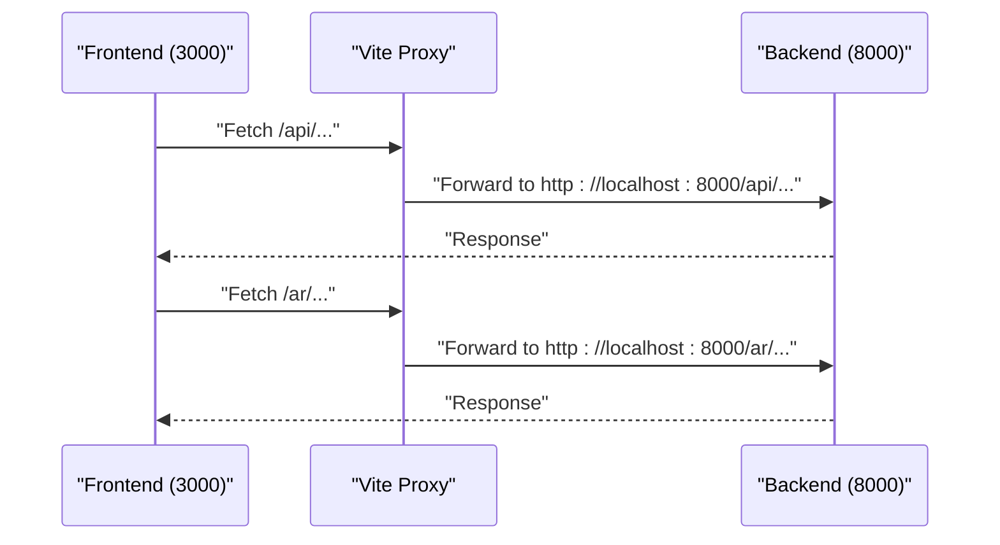
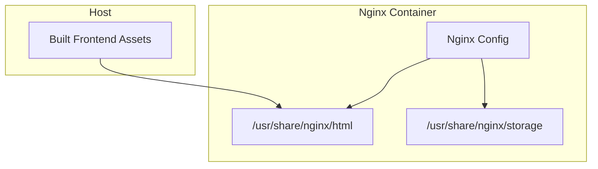
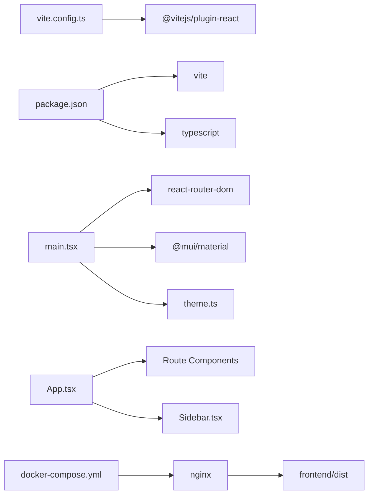

# Vite Configuration

<cite>
**Referenced Files in This Document**
- [vite.config.ts](file://frontend/vite.config.ts)
- [package.json](file://frontend/package.json)
- [tsconfig.json](file://frontend/tsconfig.json)
- [tsconfig.node.json](file://frontend/tsconfig.node.json)
- [index.html](file://frontend/index.html)
- [main.tsx](file://frontend/src/main.tsx)
- [App.tsx](file://frontend/src/App.tsx)
- [theme.ts](file://frontend/src/theme.ts)
- [index.css](file://frontend/src/index.css)
- [Dockerfile](file://Dockerfile)
- [docker-compose.yml](file://docker-compose.yml)
- [docker-compose.override.yml](file://docker-compose.override.yml)
- [config.py](file://app/core/config.py)
- [main.py](file://app/main.py)
</cite>

## Table of Contents
1. [Introduction](#introduction)
2. [Project Structure](#project-structure)
3. [Core Components](#core-components)
4. [Architecture Overview](#architecture-overview)
5. [Detailed Component Analysis](#detailed-component-analysis)
6. [Dependency Analysis](#dependency-analysis)
7. [Performance Considerations](#performance-considerations)
8. [Troubleshooting Guide](#troubleshooting-guide)
9. [Conclusion](#conclusion)

## Introduction
This document explains the Vite configuration for the frontend of the Vertex AR Admin Panel. It covers how Vite is configured, how it integrates with the development server and proxy, how TypeScript and React are set up, and how the frontend interacts with the backend API during development. It also outlines the build and preview commands and how the frontend is served in production via Nginx.

## Project Structure
The frontend is organized under the frontend directory with the following key files:
- Vite configuration defines the dev server, plugin, and proxy rules.
- Package scripts define how to run the dev server, build, and preview.
- TypeScript configuration files define bundler mode and strictness.
- HTML entry point mounts the React application.
- React entry renders the app inside a Material UI theme provider and router.

**Diagram sources**
- [vite.config.ts](file://frontend/vite.config.ts#L1-L21)
- [package.json](file://frontend/package.json#L1-L40)
- [tsconfig.json](file://frontend/tsconfig.json#L1-L26)
- [tsconfig.node.json](file://frontend/tsconfig.node.json#L1-L12)
- [index.html](file://frontend/index.html#L1-L14)
- [main.tsx](file://frontend/src/main.tsx#L1-L19)
- [App.tsx](file://frontend/src/App.tsx#L1-L53)
- [theme.ts](file://frontend/src/theme.ts#L1-L76)
- [index.css](file://frontend/src/index.css#L1-L18)

**Section sources**
- [vite.config.ts](file://frontend/vite.config.ts#L1-L21)
- [package.json](file://frontend/package.json#L1-L40)
- [tsconfig.json](file://frontend/tsconfig.json#L1-L26)
- [tsconfig.node.json](file://frontend/tsconfig.node.json#L1-L12)
- [index.html](file://frontend/index.html#L1-L14)
- [main.tsx](file://frontend/src/main.tsx#L1-L19)
- [App.tsx](file://frontend/src/App.tsx#L1-L53)
- [theme.ts](file://frontend/src/theme.ts#L1-L76)
- [index.css](file://frontend/src/index.css#L1-L18)

## Core Components
- Vite configuration
  - Plugin: React plugin is enabled.
  - Dev server: Port is set to 3000.
  - Proxy: Routes under /api and /ar are proxied to the backend at localhost:8000 with origin change enabled.
- Package scripts
  - dev: Starts the Vite dev server.
  - build: Runs TypeScript compiler then builds the Vite bundle.
  - preview: Serves the built assets locally.
  - lint: Runs ESLint on TypeScript and TSX files.
- TypeScript configuration
  - Bundler mode with moduleResolution set to bundler.
  - JSX transform set to react-jsx.
  - Strict type checking enabled.
- HTML entry point
  - Mounts the React root div and loads the main entry script.

**Section sources**
- [vite.config.ts](file://frontend/vite.config.ts#L1-L21)
- [package.json](file://frontend/package.json#L1-L40)
- [tsconfig.json](file://frontend/tsconfig.json#L1-L26)
- [index.html](file://frontend/index.html#L1-L14)

## Architecture Overview
The frontend development workflow proxies API calls to the backend. During development, the frontend runs on port 3000 and the backend on port 8000. The Vite proxy forwards /api and /ar requests to the backend. In production, the built frontend is served by Nginx.

**Diagram sources**
- [vite.config.ts](file://frontend/vite.config.ts#L1-L21)
- [docker-compose.yml](file://docker-compose.yml#L155-L169)
- [main.py](file://app/main.py#L265-L268)

## Detailed Component Analysis

### Vite Configuration
- Plugins
  - React plugin is enabled for JSX transform and Fast Refresh.
- Dev server
  - Port 3000 is configured for the dev server.
  - Proxy rules:
    - /api → http://localhost:8000
    - /ar → http://localhost:8000
  - changeOrigin is enabled to handle cross-origin requests from the dev server to the backend.
- Implications
  - Frontend requests to /api/* and /ar/* are forwarded to the backend.
  - This avoids CORS issues during development.

**Diagram sources**
- [vite.config.ts](file://frontend/vite.config.ts#L1-L21)

**Section sources**
- [vite.config.ts](file://frontend/vite.config.ts#L1-L21)

### Build and Preview Scripts
- Scripts
  - dev: Starts Vite dev server.
  - build: Compiles TypeScript then builds the Vite production bundle.
  - preview: Serves the built assets locally for testing.
  - lint: Runs ESLint on TS/TSX files.
- Build output
  - The build produces static assets placed under the Vite default output directory.
  - In production, Nginx serves these assets from the mounted volume.

**Diagram sources**
- [package.json](file://frontend/package.json#L1-L40)

**Section sources**
- [package.json](file://frontend/package.json#L1-L40)

### TypeScript Configuration
- Bundler mode
  - moduleResolution set to bundler for modern module resolution.
  - allowImportingTsExtensions and resolveJsonModule enabled.
- Strictness
  - Strict type checking enabled with unused locals/parameters and switch coverage checks.
- References
  - tsconfig.json references tsconfig.node.json to include Vite config.

**Section sources**
- [tsconfig.json](file://frontend/tsconfig.json#L1-L26)
- [tsconfig.node.json](file://frontend/tsconfig.node.json#L1-L12)

### HTML Entry Point and React Root
- index.html
  - Provides the root div with id "root".
  - Loads the main entry script at /src/main.tsx.
- main.tsx
  - Creates the React root and mounts the application.
  - Wraps the app with:
    - BrowserRouter for routing.
    - ThemeProvider with a custom theme.
    - CssBaseline for baseline styles.
- App.tsx
  - Defines routes for dashboard, companies, projects, AR content, analytics, storage, notifications, and settings.
  - Uses a sidebar layout and redirects unknown routes to the dashboard.

**Diagram sources**
- [index.html](file://frontend/index.html#L1-L14)
- [main.tsx](file://frontend/src/main.tsx#L1-L19)
- [theme.ts](file://frontend/src/theme.ts#L1-L76)
- [App.tsx](file://frontend/src/App.tsx#L1-L53)

**Section sources**
- [index.html](file://frontend/index.html#L1-L14)
- [main.tsx](file://frontend/src/main.tsx#L1-L19)
- [theme.ts](file://frontend/src/theme.ts#L1-L76)
- [App.tsx](file://frontend/src/App.tsx#L1-L53)

### Backend Integration and CORS
- Backend CORS configuration
  - Allowed origins include frontend localhost:3000 and backend localhost:8000.
  - CORS middleware is enabled with credentials allowed.
- Frontend proxy
  - Vite proxy forwards /api and /ar to backend at 8000.
- Development flow
  - Frontend runs on 3000; backend on 8000.
  - Requests to /api and /ar are proxied to backend.
  - CORS is handled by backend settings and proxy.

**Diagram sources**
- [vite.config.ts](file://frontend/vite.config.ts#L1-L21)
- [config.py](file://app/core/config.py#L31-L57)
- [main.py](file://app/main.py#L98-L105)

**Section sources**
- [vite.config.ts](file://frontend/vite.config.ts#L1-L21)
- [config.py](file://app/core/config.py#L31-L57)
- [main.py](file://app/main.py#L98-L105)

### Production Serving with Nginx
- Docker Compose
  - Nginx service serves the built frontend from /usr/share/nginx/html.
  - The frontend dist directory is mounted from the host.
  - Nginx also serves static storage content.
- Workflow
  - Build frontend assets locally or in CI.
  - Mount the dist folder into Nginx container.
  - Nginx serves the SPA and static assets.

**Diagram sources**
- [docker-compose.yml](file://docker-compose.yml#L155-L169)

**Section sources**
- [docker-compose.yml](file://docker-compose.yml#L155-L169)

## Dependency Analysis
- Internal dependencies
  - vite.config.ts depends on @vitejs/plugin-react.
  - package.json scripts depend on Vite and TypeScript.
  - main.tsx depends on React, React Router, Material UI, and theme.ts.
  - App.tsx depends on route components and Sidebar.
- External dependencies
  - Backend CORS settings and proxy configuration coordinate with Vite dev server.
  - Docker Compose mounts the built dist to Nginx for production serving.

**Diagram sources**
- [vite.config.ts](file://frontend/vite.config.ts#L1-L21)
- [package.json](file://frontend/package.json#L1-L40)
- [main.tsx](file://frontend/src/main.tsx#L1-L19)
- [App.tsx](file://frontend/src/App.tsx#L1-L53)
- [docker-compose.yml](file://docker-compose.yml#L155-L169)

**Section sources**
- [vite.config.ts](file://frontend/vite.config.ts#L1-L21)
- [package.json](file://frontend/package.json#L1-L40)
- [main.tsx](file://frontend/src/main.tsx#L1-L19)
- [App.tsx](file://frontend/src/App.tsx#L1-L53)
- [docker-compose.yml](file://docker-compose.yml#L155-L169)

## Performance Considerations
- Development server
  - Port 3000 is used for the dev server; ensure no conflicts with other services.
  - Proxy reduces latency by forwarding requests directly to the backend.
- Build pipeline
  - Running TypeScript before Vite build ensures type-safe compilation prior to bundling.
- Production serving
  - Nginx serves static assets efficiently; ensure caching headers are configured appropriately in Nginx.
- Bundle size
  - Keep dependencies minimal; remove unused libraries to reduce bundle size.
- Environment-specific settings
  - Use environment variables for API base URLs and feature flags to optimize behavior per environment.

[No sources needed since this section provides general guidance]

## Troubleshooting Guide
- Proxy not working
  - Verify Vite proxy rules for /api and /ar targets.
  - Ensure backend is running on port 8000 and accessible.
- CORS errors in development
  - Confirm backend CORS settings include frontend origin.
  - Check that changeOrigin is enabled in the proxy configuration.
- Build fails
  - Run TypeScript compilation separately to identify type errors.
  - Ensure Vite and TypeScript versions match the project’s devDependencies.
- Preview shows blank screen
  - Confirm the dist directory is mounted into Nginx and contains built assets.
  - Validate that index.html is present and references the correct main entry script.
- Hot reload issues
  - In development, ensure the app service is mounted with source code for hot reload.
  - Verify environment variables for debug mode are set appropriately.

**Section sources**
- [vite.config.ts](file://frontend/vite.config.ts#L1-L21)
- [config.py](file://app/core/config.py#L31-L57)
- [docker-compose.override.yml](file://docker-compose.override.yml#L1-L32)
- [docker-compose.yml](file://docker-compose.yml#L155-L169)

## Conclusion
The Vite configuration for the Vertex AR Admin Panel is straightforward and focused on a smooth developer experience. It enables React with Fast Refresh, sets up a development server on port 3000, and proxies API and AR viewer endpoints to the backend. The build pipeline compiles TypeScript before bundling, and production serving is handled by Nginx mounting the built assets. Proper CORS configuration and Docker orchestration ensure seamless integration between frontend and backend during development and in production.