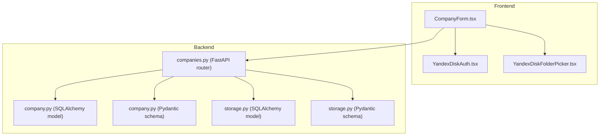
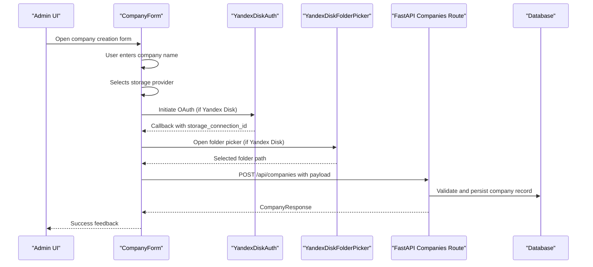
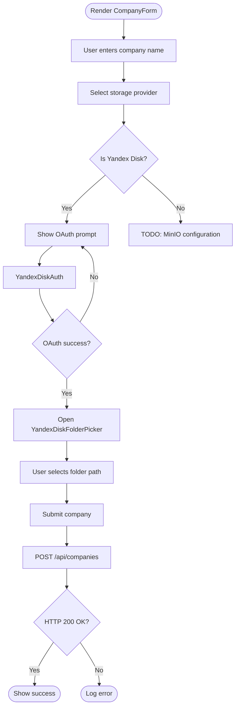
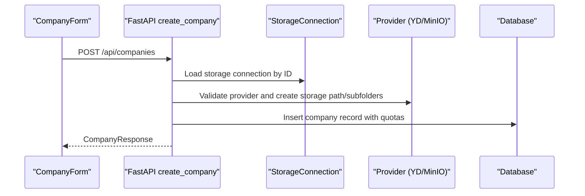
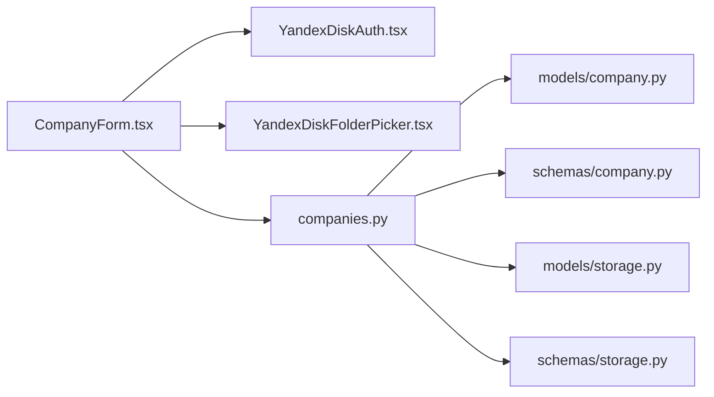

# CompanyForm Component

<cite>
**Referenced Files in This Document**
- [CompanyForm.tsx](file://frontend/components/CompanyForm.tsx)
- [YandexDiskAuth.tsx](file://frontend/components/YandexDiskAuth.tsx)
- [YandexDiskFolderPicker.tsx](file://frontend/components/YandexDiskFolderPicker.tsx)
- [companies.py](file://app/api/routes/companies.py)
- [company.py](file://app/models/company.py)
- [company.py](file://app/schemas/company.py)
- [storage.py](file://app/models/storage.py)
- [storage.py](file://app/schemas/storage.py)
- [index.html](file://frontend/index.html)
</cite>

## Table of Contents
1. [Introduction](#introduction)
2. [Project Structure](#project-structure)
3. [Core Components](#core-components)
4. [Architecture Overview](#architecture-overview)
5. [Detailed Component Analysis](#detailed-component-analysis)
6. [Dependency Analysis](#dependency-analysis)
7. [Performance Considerations](#performance-considerations)
8. [Troubleshooting Guide](#troubleshooting-guide)
9. [Conclusion](#conclusion)
10. [Appendices](#appendices)

## Introduction
This document describes the CompanyForm component used in the ARV admin panel for creating and managing company records within a B2B SaaS platform. It explains the component’s purpose, TypeScript state management, validation, integration with backend APIs, UI/UX design choices, accessibility considerations, and guidance for future extensions.

## Project Structure
The CompanyForm resides in the frontend under the components directory and integrates with Material UI components and Axios for HTTP communication. It also composes two sub-components for Yandex Disk OAuth and folder selection. On the backend, FastAPI routes handle company creation and updates, while SQLAlchemy models and Pydantic schemas define persistence and validation.

**Diagram sources**
- [CompanyForm.tsx](file://frontend/components/CompanyForm.tsx#L1-L124)
- [YandexDiskAuth.tsx](file://frontend/components/YandexDiskAuth.tsx#L1-L77)
- [YandexDiskFolderPicker.tsx](file://frontend/components/YandexDiskFolderPicker.tsx#L1-L242)
- [companies.py](file://app/api/routes/companies.py#L1-L137)
- [company.py](file://app/models/company.py#L1-L41)
- [company.py](file://app/schemas/company.py#L1-L68)
- [storage.py](file://app/models/storage.py#L1-L81)
- [storage.py](file://app/schemas/storage.py#L1-L101)

**Section sources**
- [CompanyForm.tsx](file://frontend/components/CompanyForm.tsx#L1-L124)
- [companies.py](file://app/api/routes/companies.py#L1-L137)

## Core Components
- CompanyForm: A React functional component that manages form state, handles storage provider selection, orchestrates Yandex Disk OAuth and folder selection, and submits company creation to the backend.
- YandexDiskAuth: A dialog-driven OAuth helper that opens a popup to authorize Yandex Disk and receives a callback with a storage connection ID.
- YandexDiskFolderPicker: A modal dialog for browsing and selecting a folder path on Yandex Disk, including breadcrumb navigation, search, and folder creation.

Key responsibilities:
- Form state: company name, storage provider, storage connection ID, selected folder path, and submission state.
- Conditional rendering: prompts and actions based on storage provider and connection status.
- Submission: constructs a payload and posts to the /api/companies endpoint.
- Integration: delegates OAuth and folder selection to dedicated sub-components.

**Section sources**
- [CompanyForm.tsx](file://frontend/components/CompanyForm.tsx#L1-L124)
- [YandexDiskAuth.tsx](file://frontend/components/YandexDiskAuth.tsx#L1-L77)
- [YandexDiskFolderPicker.tsx](file://frontend/components/YandexDiskFolderPicker.tsx#L1-L242)

## Architecture Overview
The CompanyForm participates in a client-server architecture:
- Frontend: React + Material UI + Axios
- Backend: FastAPI + SQLAlchemy + Pydantic
- Storage providers: Yandex Disk and MinIO (client companies must use external storage)

**Diagram sources**
- [CompanyForm.tsx](file://frontend/components/CompanyForm.tsx#L1-L124)
- [YandexDiskAuth.tsx](file://frontend/components/YandexDiskAuth.tsx#L1-L77)
- [YandexDiskFolderPicker.tsx](file://frontend/components/YandexDiskFolderPicker.tsx#L1-L242)
- [companies.py](file://app/api/routes/companies.py#L1-L89)

## Detailed Component Analysis

### CompanyForm.tsx
- Purpose: Create a new company with storage configuration and basic quotas.
- State management:
  - Local state tracks company name, storage provider, storage connection ID, selected folder, visibility of folder picker, and submission flag.
- Validation:
  - HTML5 constraints are not enforced in the component; validation occurs on the backend via Pydantic schemas.
  - Frontend disables the submit button when required fields are missing.
- Submission flow:
  - Constructs a payload with name, storage_connection_id, storage_path, subscription tier, quotas, and limits.
  - Posts to /api/companies and logs success or error.
- UI/UX:
  - Material UI components for inputs and alerts.
  - Real-time feedback via alerts and button states.
  - Conditional rendering for OAuth prompt and folder picker.
- Accessibility:
  - Uses Material UI components with built-in labeling and keyboard navigation.
  - No explicit ARIA attributes are added in the component; rely on MUI defaults.

**Diagram sources**
- [CompanyForm.tsx](file://frontend/components/CompanyForm.tsx#L1-L124)
- [YandexDiskAuth.tsx](file://frontend/components/YandexDiskAuth.tsx#L1-L77)
- [YandexDiskFolderPicker.tsx](file://frontend/components/YandexDiskFolderPicker.tsx#L1-L242)
- [companies.py](file://app/api/routes/companies.py#L1-L89)

**Section sources**
- [CompanyForm.tsx](file://frontend/components/CompanyForm.tsx#L1-L124)

### YandexDiskAuth.tsx
- Purpose: Open a popup to authorize Yandex Disk and receive a storage connection ID via a postMessage callback.
- State management:
  - Tracks loading state and popup window reference.
- Interaction:
  - Opens an OAuth URL in a centered popup.
  - Listens for a message event containing the connection ID.
  - Closes the popup upon successful authorization.
- UX:
  - Shows a loading indicator during authorization.
  - Provides a dialog with instructions.

**Section sources**
- [YandexDiskAuth.tsx](file://frontend/components/YandexDiskAuth.tsx#L1-L77)

### YandexDiskFolderPicker.tsx
- Purpose: Browse Yandex Disk folders, create new folders, and select a target path for company storage.
- State management:
  - Tracks current path, list of folders, loading state, new folder name, and search query.
- Features:
  - Breadcrumb navigation.
  - Folder creation with a new folder name.
  - Search filtering.
  - Loading indicators and empty state messaging.
- Integration:
  - Fetches folders via GET /api/oauth/yandex/{connectionId}/folders.
  - Creates folders via POST /api/oauth/yandex/{connectionId}/create-folder.

**Section sources**
- [YandexDiskFolderPicker.tsx](file://frontend/components/YandexDiskFolderPicker.tsx#L1-L242)

### Backend Integration: /api/companies
- Endpoint: POST /api/companies
- Request payload: name, storage_connection_id, storage_path, subscription_tier, storage_quota_gb, projects_limit.
- Validation and behavior:
  - Validates storage connection existence and disallows default Vertex AR storage for client companies.
  - Generates a slug from the company name and ensures uniqueness.
  - Creates provider-specific storage paths and subfolders for Yandex Disk and MinIO.
  - Persists company with quotas and limits.
- Response: CompanyResponse model with company details.

**Diagram sources**
- [companies.py](file://app/api/routes/companies.py#L1-L89)
- [company.py](file://app/models/company.py#L1-L41)
- [company.py](file://app/schemas/company.py#L1-L68)
- [storage.py](file://app/models/storage.py#L1-L81)
- [storage.py](file://app/schemas/storage.py#L1-L101)

**Section sources**
- [companies.py](file://app/api/routes/companies.py#L1-L89)
- [company.py](file://app/models/company.py#L1-L41)
- [company.py](file://app/schemas/company.py#L1-L68)
- [storage.py](file://app/models/storage.py#L1-L81)
- [storage.py](file://app/schemas/storage.py#L1-L101)

## Dependency Analysis
- Frontend dependencies:
  - Material UI components for form controls and dialogs.
  - Axios for HTTP requests.
  - Sub-components for OAuth and folder selection.
- Backend dependencies:
  - FastAPI router for companies.
  - SQLAlchemy models for storage connections and companies.
  - Pydantic schemas for request/response validation.
- Coupling:
  - CompanyForm depends on YandexDiskAuth and YandexDiskFolderPicker for provider-specific flows.
  - Backend enforces provider-specific logic and storage path creation.

**Diagram sources**
- [CompanyForm.tsx](file://frontend/components/CompanyForm.tsx#L1-L124)
- [YandexDiskAuth.tsx](file://frontend/components/YandexDiskAuth.tsx#L1-L77)
- [YandexDiskFolderPicker.tsx](file://frontend/components/YandexDiskFolderPicker.tsx#L1-L242)
- [companies.py](file://app/api/routes/companies.py#L1-L137)
- [company.py](file://app/models/company.py#L1-L41)
- [company.py](file://app/schemas/company.py#L1-L68)
- [storage.py](file://app/models/storage.py#L1-L81)
- [storage.py](file://app/schemas/storage.py#L1-L101)

**Section sources**
- [CompanyForm.tsx](file://frontend/components/CompanyForm.tsx#L1-L124)
- [companies.py](file://app/api/routes/companies.py#L1-L137)

## Performance Considerations
- Network latency: OAuth popup and folder browsing can be slow; show loading indicators and avoid unnecessary re-renders.
- Payload size: Keep the creation payload minimal; backend validates and persists efficiently.
- UI responsiveness: Debounce search input in folder picker; batch updates where possible.
- Storage provider overhead: Creating subfolders on Yandex Disk and MinIO adds latency; inform users and handle failures gracefully.

[No sources needed since this section provides general guidance]

## Troubleshooting Guide
Common issues and resolutions:
- OAuth popup blocked: Ensure popups are enabled; the component checks for closed windows and resets loading state.
- Missing storage connection ID: The form disables submission until a valid connection ID is present.
- Folder selection errors: Verify the selected path and provider support; the backend creates subfolders automatically for supported providers.
- Backend validation errors: The backend enforces provider restrictions and uniqueness; handle 400/404 responses and surface messages to the user.

**Section sources**
- [YandexDiskAuth.tsx](file://frontend/components/YandexDiskAuth.tsx#L1-L77)
- [CompanyForm.tsx](file://frontend/components/CompanyForm.tsx#L1-L124)
- [companies.py](file://app/api/routes/companies.py#L1-L89)

## Conclusion
CompanyForm provides a streamlined workflow for creating companies with external storage configurations. It integrates seamlessly with Yandex Disk OAuth and folder selection, posts to the backend, and relies on robust server-side validation and persistence. The component’s design emphasizes clarity, real-time feedback, and extensibility for additional storage providers and fields.

[No sources needed since this section summarizes without analyzing specific files]

## Appendices

### TypeScript Interfaces and State Management
- Local state:
  - company name: string
  - storage provider: string
  - storage connection ID: number | null
  - selected folder: string
  - show folder picker: boolean
  - submitting: boolean
- Sub-component props:
  - YandexDiskAuth: onSuccess callback, connectionName
  - YandexDiskFolderPicker: open, connectionId, onClose, onSelect, initialPath

**Section sources**
- [CompanyForm.tsx](file://frontend/components/CompanyForm.tsx#L1-L124)
- [YandexDiskAuth.tsx](file://frontend/components/YandexDiskAuth.tsx#L1-L77)
- [YandexDiskFolderPicker.tsx](file://frontend/components/YandexDiskFolderPicker.tsx#L1-L242)

### Backend Data Models and Schemas
- Company model fields include name, slug, contacts, storage_connection_id, storage_path, quotas, billing fields, status flags, and timestamps.
- CompanyCreate schema defines required and optional fields, including storage_connection_id and quotas.
- StorageConnection model defines provider, credentials, and status fields.

**Section sources**
- [company.py](file://app/models/company.py#L1-L41)
- [company.py](file://app/schemas/company.py#L1-L68)
- [storage.py](file://app/models/storage.py#L1-L81)
- [storage.py](file://app/schemas/storage.py#L1-L101)

### UI/UX Design Choices
- Real-time feedback: Alerts indicate OAuth status and folder selection readiness.
- Conditional rendering: OAuth prompt appears only for Yandex Disk; folder picker appears after successful OAuth.
- Disabled states: Submit button is disabled until required fields are filled.
- Material UI: Consistent spacing, labels, and accessible controls.

**Section sources**
- [CompanyForm.tsx](file://frontend/components/CompanyForm.tsx#L1-L124)

### Accessibility Guidance
- Use Material UI components that provide built-in labeling and keyboard navigation.
- Ensure focus management in dialogs (folder picker) and modals (OAuth).
- Add explicit aria-labels if custom controls are introduced.
- Provide visible focus indicators and clear error messages.

[No sources needed since this section provides general guidance]

### Extending the Form
- Adding new fields:
  - Extend the form state and payload construction to include new fields.
  - Update the backend schema and route to accept and validate new fields.
- Integrating new storage providers:
  - Add provider option in the form and implement provider-specific configuration steps.
  - Update backend to create storage resources and enforce provider-specific rules.
- Error handling improvements:
  - Surface backend errors to the UI with user-friendly messages.
  - Implement retry logic for transient failures (e.g., network issues).
- Success feedback:
  - Redirect to company details page or show a success snackbar.
  - Reset form state after successful submission.

[No sources needed since this section provides general guidance]