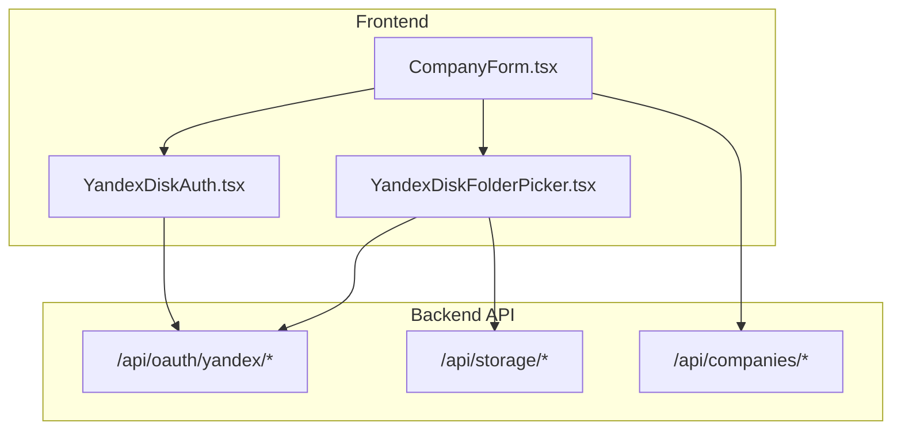
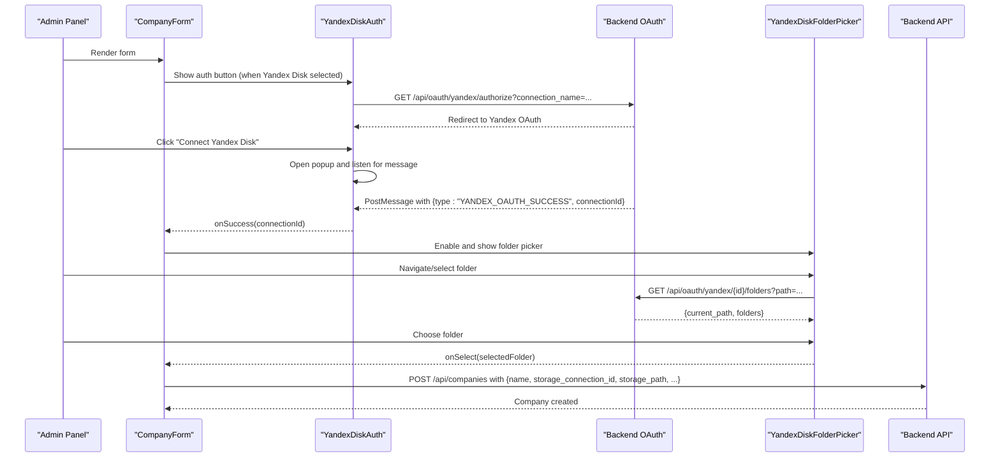
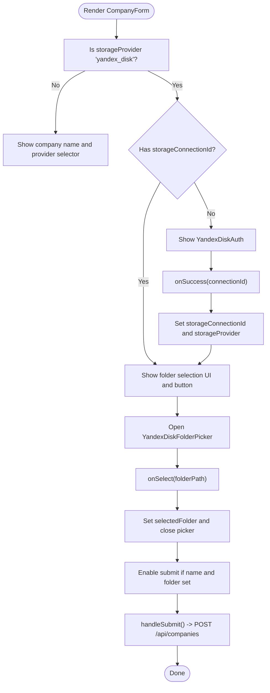
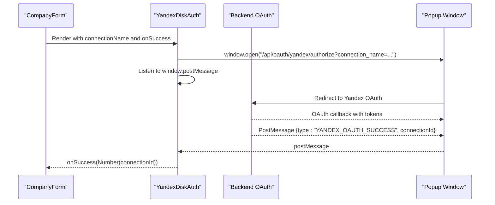
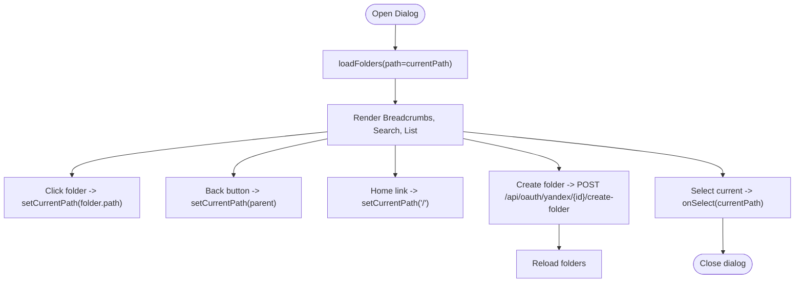
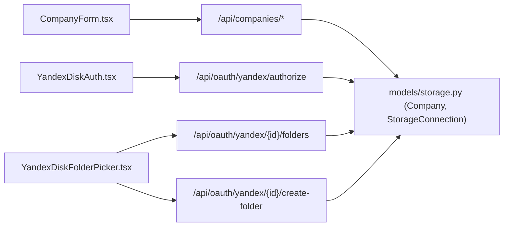

# Component Structure

<cite>
**Referenced Files in This Document**
- [CompanyForm.tsx](file://frontend/components/CompanyForm.tsx)
- [YandexDiskAuth.tsx](file://frontend/components/YandexDiskAuth.tsx)
- [YandexDiskFolderPicker.tsx](file://frontend/components/YandexDiskFolderPicker.tsx)
- [oauth.py](file://app/api/routes/oauth.py)
- [storage.py](file://app/api/routes/storage.py)
- [companies.py](file://app/api/routes/companies.py)
- [storage.py](file://app/schemas/storage.py)
- [company.py](file://app/schemas/company.py)
- [storage.py](file://app/models/storage.py)
</cite>

## Table of Contents
1. [Introduction](#introduction)
2. [Project Structure](#project-structure)
3. [Core Components](#core-components)
4. [Architecture Overview](#architecture-overview)
5. [Detailed Component Analysis](#detailed-component-analysis)
6. [Dependency Analysis](#dependency-analysis)
7. [Performance Considerations](#performance-considerations)
8. [Troubleshooting Guide](#troubleshooting-guide)
9. [Conclusion](#conclusion)
10. [Appendices](#appendices)

## Introduction
This document explains the frontend component structure of the ARV admin panel with a focus on the CompanyForm, YandexDiskAuth, and YandexDiskFolderPicker components. It covers JSX structure, TypeScript interfaces, state management patterns, event handling, and how these components integrate with backend API endpoints. It also describes composition patterns, props/attributes, validation rules, error states, loading behaviors, accessibility considerations, responsive design, and guidance for reuse and extension.

## Project Structure
The relevant frontend components are located under the frontend/components directory. They are React functional components built with Material UI and Axios for API communication. The backend API routes under app/api/routes define the OAuth and storage endpoints used by these components.

**Diagram sources**
- [CompanyForm.tsx](file://frontend/components/CompanyForm.tsx#L1-L125)
- [YandexDiskAuth.tsx](file://frontend/components/YandexDiskAuth.tsx#L1-L77)
- [YandexDiskFolderPicker.tsx](file://frontend/components/YandexDiskFolderPicker.tsx#L1-L242)
- [oauth.py](file://app/api/routes/oauth.py#L1-L184)
- [storage.py](file://app/api/routes/storage.py#L1-L63)
- [companies.py](file://app/api/routes/companies.py#L1-L137)

**Section sources**
- [CompanyForm.tsx](file://frontend/components/CompanyForm.tsx#L1-L125)
- [YandexDiskAuth.tsx](file://frontend/components/YandexDiskAuth.tsx#L1-L77)
- [YandexDiskFolderPicker.tsx](file://frontend/components/YandexDiskFolderPicker.tsx#L1-L242)

## Core Components
- CompanyForm: A form for creating a new company with storage selection and Yandex Disk integration. It manages state for company name, storage provider, storage connection ID, selected folder, and submission status. It coordinates with YandexDiskAuth and YandexDiskFolderPicker to enable OAuth and folder selection.
- YandexDiskAuth: A popup-based OAuth authorizer for connecting a Yandex Disk account. It opens a popup, listens for a postMessage signal containing a connection ID, and invokes a success callback.
- YandexDiskFolderPicker: A modal dialog for browsing and selecting a folder in Yandex Disk. It lists folders, supports navigation, search, and creation of new folders, and returns the selected path to the parent component.

**Section sources**
- [CompanyForm.tsx](file://frontend/components/CompanyForm.tsx#L1-L125)
- [YandexDiskAuth.tsx](file://frontend/components/YandexDiskAuth.tsx#L1-L77)
- [YandexDiskFolderPicker.tsx](file://frontend/components/YandexDiskFolderPicker.tsx#L1-L242)

## Architecture Overview
The CompanyForm orchestrates the OAuth flow and folder selection. On successful OAuth, it receives a connection ID and enables the folder picker. When a folder is selected, it stores the path and allows submission of the company creation request. The backend exposes endpoints for initiating OAuth, listing folders, creating folders, and creating companies.

**Diagram sources**
- [CompanyForm.tsx](file://frontend/components/CompanyForm.tsx#L1-L125)
- [YandexDiskAuth.tsx](file://frontend/components/YandexDiskAuth.tsx#L1-L77)
- [YandexDiskFolderPicker.tsx](file://frontend/components/YandexDiskFolderPicker.tsx#L1-L242)
- [oauth.py](file://app/api/routes/oauth.py#L1-L184)
- [companies.py](file://app/api/routes/companies.py#L1-L137)

## Detailed Component Analysis

### CompanyForm Analysis
- Purpose: Collect company details, select storage provider, connect Yandex Disk via OAuth, pick a folder, and submit to create a company.
- Props and state:
  - Local state: companyName, storageProvider, storageConnectionId, selectedFolder, showFolderPicker, submitting.
  - Event handlers: handleYandexAuthSuccess, handleFolderSelect, handleSubmit.
- Composition:
  - Conditionally renders YandexDiskAuth when Yandex Disk is selected and no connection exists.
  - Conditionally renders folder selection UI and a button to open the picker when connected.
  - Renders YandexDiskFolderPicker as a controlled dialog with open/close and onSelect callbacks.
- Backend integration:
  - Submits to /api/companies with payload including name, storage_connection_id, storage_path, subscription_tier, storage_quota_gb, projects_limit.
- Validation and error states:
  - Disabled submit button when required fields are missing or while submitting.
  - No explicit client-side validation shown; relies on backend validation.
- Loading behavior:
  - Submitting flag toggles button text and disables interaction during submission.
- Accessibility and responsiveness:
  - Uses Material UI components with standard semantics.
  - Responsive layout via MUI Box and TextField widths.

**Diagram sources**
- [CompanyForm.tsx](file://frontend/components/CompanyForm.tsx#L1-L125)
- [YandexDiskAuth.tsx](file://frontend/components/YandexDiskAuth.tsx#L1-L77)
- [YandexDiskFolderPicker.tsx](file://frontend/components/YandexDiskFolderPicker.tsx#L1-L242)
- [companies.py](file://app/api/routes/companies.py#L1-L137)

**Section sources**
- [CompanyForm.tsx](file://frontend/components/CompanyForm.tsx#L1-L125)
- [companies.py](file://app/api/routes/companies.py#L1-L137)

### YandexDiskAuth Analysis
- Purpose: Initiate OAuth with Yandex Disk in a popup and receive the resulting connection ID via postMessage.
- Props:
  - onSuccess: (connectionId: number) => void
  - connectionName: string
- State:
  - authLoading: boolean
  - popupRef: Window | null
- Event handling:
  - Opens a centered popup to /api/oauth/yandex/authorize?connection_name=...
  - Sets up a window message listener for a specific message type carrying the connectionId.
  - Periodically checks if the popup was closed and clears state accordingly.
- Backend integration:
  - Calls GET /api/oauth/yandex/authorize to redirect to Yandex OAuth.
  - Receives a postMessage from the OAuth flow with type "YANDEX_OAUTH_SUCCESS" and connectionId.
- Validation and error states:
  - No explicit client-side validation; relies on backend to validate state and tokens.
- Loading behavior:
  - Shows a spinner and disables the button while waiting for the popup to complete.
- Accessibility and responsiveness:
  - Uses MUI Button and Dialog; ensure focus management and keyboard accessibility in dialogs.

**Diagram sources**
- [YandexDiskAuth.tsx](file://frontend/components/YandexDiskAuth.tsx#L1-L77)
- [oauth.py](file://app/api/routes/oauth.py#L1-L184)

**Section sources**
- [YandexDiskAuth.tsx](file://frontend/components/YandexDiskAuth.tsx#L1-L77)
- [oauth.py](file://app/api/routes/oauth.py#L1-L184)

### YandexDiskFolderPicker Analysis
- Purpose: Browse Yandex Disk folders, navigate, search, create folders, and select a destination path for the company.
- Props:
  - open: boolean
  - connectionId: number
  - onClose: () => void
  - onSelect: (folderPath: string) => void
  - initialPath?: string (defaults to "/")
- State:
  - currentPath: string
  - folders: Folder[]
  - loading: boolean
  - newFolderName: string
  - creatingFolder: boolean
  - searchQuery: string
- Backend integration:
  - GET /api/oauth/yandex/{connection_id}/folders?path=... to list folders and current_path.
  - POST /api/oauth/yandex/{connection_id}/create-folder?folder_path=... to create a new folder.
- Event handling:
  - loadFolders: fetches folders when dialog opens or path changes.
  - handleFolderClick: navigates into a selected folder.
  - handleGoBack/handleGoHome: breadcrumb navigation.
  - handleCreateFolder: creates a new folder in the current path.
  - handleSelectCurrent: returns the current path to the parent.
- Validation and error states:
  - Filters folders by searchQuery.
  - Disabled actions when inputs are invalid or operations are in progress.
- Loading behavior:
  - Shows a spinner while fetching folders or creating a folder.
- Accessibility and responsiveness:
  - Uses MUI List, ListItem, Breadcrumbs, and TextField with appropriate roles and labels.
  - Responsive dialog with maxWidth and scrollable list.

**Diagram sources**
- [YandexDiskFolderPicker.tsx](file://frontend/components/YandexDiskFolderPicker.tsx#L1-L242)
- [oauth.py](file://app/api/routes/oauth.py#L108-L184)

**Section sources**
- [YandexDiskFolderPicker.tsx](file://frontend/components/YandexDiskFolderPicker.tsx#L1-L242)
- [oauth.py](file://app/api/routes/oauth.py#L108-L184)

## Dependency Analysis
- Frontend-to-backend dependencies:
  - CompanyForm depends on:
    - POST /api/companies for company creation.
    - YandexDiskAuth triggers GET /api/oauth/yandex/authorize.
    - YandexDiskFolderPicker depends on:
      - GET /api/oauth/yandex/{connection_id}/folders?path=...
      - POST /api/oauth/yandex/{connection_id}/create-folder?folder_path=...
- Backend models and schemas:
  - StorageConnection and Company models define the persistence structure.
  - Pydantic schemas validate and serialize requests/responses for storage connections and company creation.

**Diagram sources**
- [CompanyForm.tsx](file://frontend/components/CompanyForm.tsx#L1-L125)
- [YandexDiskAuth.tsx](file://frontend/components/YandexDiskAuth.tsx#L1-L77)
- [YandexDiskFolderPicker.tsx](file://frontend/components/YandexDiskFolderPicker.tsx#L1-L242)
- [companies.py](file://app/api/routes/companies.py#L1-L137)
- [oauth.py](file://app/api/routes/oauth.py#L1-L184)
- [storage.py](file://app/models/storage.py#L1-L81)

**Section sources**
- [CompanyForm.tsx](file://frontend/components/CompanyForm.tsx#L1-L125)
- [YandexDiskAuth.tsx](file://frontend/components/YandexDiskAuth.tsx#L1-L77)
- [YandexDiskFolderPicker.tsx](file://frontend/components/YandexDiskFolderPicker.tsx#L1-L242)
- [companies.py](file://app/api/routes/companies.py#L1-L137)
- [oauth.py](file://app/api/routes/oauth.py#L1-L184)
- [storage.py](file://app/models/storage.py#L1-L81)

## Performance Considerations
- Network efficiency:
  - YandexDiskFolderPicker loads folders with a limit parameter and paginates via path traversal; consider caching recent paths to reduce repeated network calls.
- UI responsiveness:
  - Spinner indicators during long-running operations (folder listing, folder creation) improve perceived performance.
- Rendering:
  - Filtering folders by searchQuery is client-side; for large datasets, consider server-side filtering or virtualization.

[No sources needed since this section provides general guidance]

## Troubleshooting Guide
- OAuth popup closes without receiving a connection ID:
  - Ensure the backend OAuth callback posts a message with the expected type and connectionId.
  - Verify that the popup is not blocked and that the message listener is attached before the popup closes.
- Folder picker fails to load:
  - Confirm that the connectionId is valid and belongs to a Yandex Disk provider.
  - Check that the OAuth token exists in the stored credentials.
- Folder creation errors:
  - Validate that the folder_path is constructed correctly and does not include trailing slashes unnecessarily.
  - Inspect the backend error messages for permission or path issues.
- Company creation failures:
  - Ensure storage_connection_id and storage_path are set before submission.
  - Review backend validation messages for unsupported providers or missing default connections.

**Section sources**
- [YandexDiskAuth.tsx](file://frontend/components/YandexDiskAuth.tsx#L1-L77)
- [YandexDiskFolderPicker.tsx](file://frontend/components/YandexDiskFolderPicker.tsx#L1-L242)
- [oauth.py](file://app/api/routes/oauth.py#L1-L184)
- [companies.py](file://app/api/routes/companies.py#L1-L137)

## Conclusion
The ARV admin panel’s frontend integrates seamlessly with backend OAuth and storage endpoints. CompanyForm composes YandexDiskAuth and YandexDiskFolderPicker to enable cloud storage integration for new companies. The components use clear state management, controlled dialogs, and straightforward event handling to deliver a smooth user experience. Extending these components involves adding new storage providers similarly and maintaining consistent prop contracts and error/loading states.

[No sources needed since this section summarizes without analyzing specific files]

## Appendices

### Props and Attributes Reference
- CompanyForm
  - Props: none
  - State: companyName, storageProvider, storageConnectionId, selectedFolder, showFolderPicker, submitting
  - Events: handleYandexAuthSuccess, handleFolderSelect, handleSubmit
- YandexDiskAuth
  - Props: onSuccess(connectionId), connectionName
  - State: authLoading, popupRef
  - Events: handleAuthorize
- YandexDiskFolderPicker
  - Props: open, connectionId, onClose(), onSelect(folderPath), initialPath?
  - State: currentPath, folders[], loading, newFolderName, creatingFolder, searchQuery
  - Events: loadFolders, handleFolderClick, handleGoBack, handleGoHome, handleCreateFolder, handleSelectCurrent

**Section sources**
- [CompanyForm.tsx](file://frontend/components/CompanyForm.tsx#L1-L125)
- [YandexDiskAuth.tsx](file://frontend/components/YandexDiskAuth.tsx#L1-L77)
- [YandexDiskFolderPicker.tsx](file://frontend/components/YandexDiskFolderPicker.tsx#L1-L242)

### Backend API Contracts
- OAuth
  - GET /api/oauth/yandex/authorize?connection_name=...
  - GET /api/oauth/yandex/{connection_id}/folders?path=...
  - POST /api/oauth/yandex/{connection_id}/create-folder?folder_path=...
- Storage
  - POST /api/storage/connections
  - POST /api/storage/connections/{connection_id}/test
  - PUT /api/companies/{company_id}/storage
- Companies
  - POST /api/companies/

**Section sources**
- [oauth.py](file://app/api/routes/oauth.py#L1-L184)
- [storage.py](file://app/api/routes/storage.py#L1-L63)
- [companies.py](file://app/api/routes/companies.py#L1-L137)

### Data Models and Schemas
- StorageConnection
  - Fields: id, name, provider, credentials, base_path, is_default, is_active, metadata, timestamps
- Company
  - Fields: id, name, slug, storage_connection_id, storage_path, storage_quota_gb, storage_used_bytes, timestamps
- YandexDiskCredentials
  - Fields: oauth_token, refresh_token, expires_at
- CompanyCreate
  - Fields: name, storage_connection_id, storage_path, subscription_tier, storage_quota_gb, projects_limit

**Section sources**
- [storage.py](file://app/models/storage.py#L1-L81)
- [storage.py](file://app/schemas/storage.py#L1-L101)
- [company.py](file://app/schemas/company.py#L1-L68)