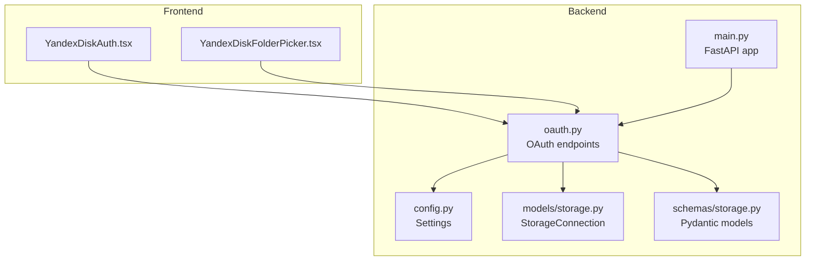
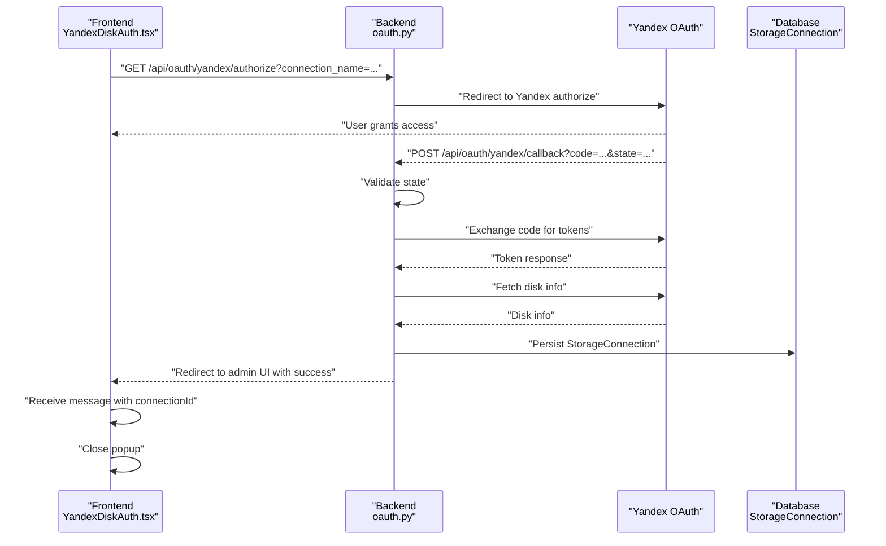
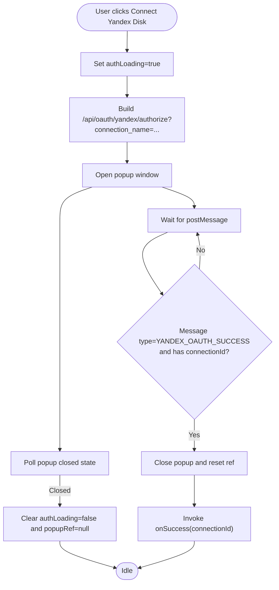
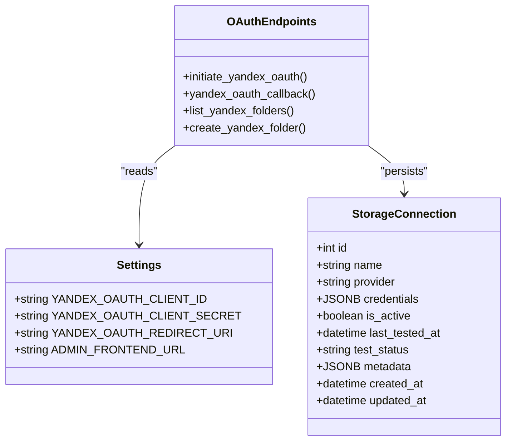
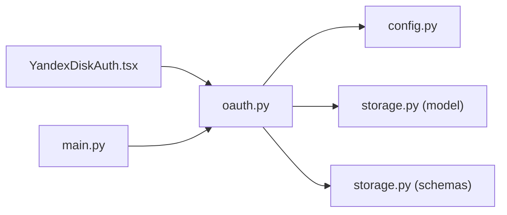

# YandexDiskAuth Component

<cite>
**Referenced Files in This Document**
- [YandexDiskAuth.tsx](file://frontend/components/YandexDiskAuth.tsx)
- [oauth.py](file://app/api/routes/oauth.py)
- [config.py](file://app/core/config.py)
- [storage.py](file://app/models/storage.py)
- [storage.py (schemas)](file://app/schemas/storage.py)
- [main.py](file://app/main.py)
- [YandexDiskFolderPicker.tsx](file://frontend/components/YandexDiskFolderPicker.tsx)
- [.env.example](file://.env.example)
</cite>

## Table of Contents
1. [Introduction](#introduction)
2. [Project Structure](#project-structure)
3. [Core Components](#core-components)
4. [Architecture Overview](#architecture-overview)
5. [Detailed Component Analysis](#detailed-component-analysis)
6. [Dependency Analysis](#dependency-analysis)
7. [Performance Considerations](#performance-considerations)
8. [Troubleshooting Guide](#troubleshooting-guide)
9. [Conclusion](#conclusion)
10. [Appendices](#appendices)

## Introduction
This document explains the YandexDiskAuth component that initiates OAuth2 authentication with Yandex Disk for secure cloud storage integration in AR content workflows. It covers the component’s JSX structure, state variables for authentication status, event handlers that trigger the OAuth flow via a browser popup, environment-driven authorization URL construction, backend callback handling and token exchange, connection status indicators, error handling, and security considerations. It also provides reusable patterns for adapting this component to other OAuth providers.

## Project Structure
The YandexDiskAuth component resides in the frontend under components and integrates with backend OAuth endpoints. The backend implements the OAuth2 flow for Yandex Disk, stores connection credentials, and exposes endpoints for listing and creating folders.

**Diagram sources**
- [YandexDiskAuth.tsx](file://frontend/components/YandexDiskAuth.tsx#L1-L77)
- [YandexDiskFolderPicker.tsx](file://frontend/components/YandexDiskFolderPicker.tsx#L1-L242)
- [oauth.py](file://app/api/routes/oauth.py#L1-L184)
- [config.py](file://app/core/config.py#L1-L134)
- [storage.py](file://app/models/storage.py#L1-L81)
- [storage.py (schemas)](file://app/schemas/storage.py#L1-L101)
- [main.py](file://app/main.py#L230-L262)

**Section sources**
- [YandexDiskAuth.tsx](file://frontend/components/YandexDiskAuth.tsx#L1-L77)
- [oauth.py](file://app/api/routes/oauth.py#L1-L184)
- [config.py](file://app/core/config.py#L1-L134)
- [storage.py](file://app/models/storage.py#L1-L81)
- [storage.py (schemas)](file://app/schemas/storage.py#L1-L101)
- [main.py](file://app/main.py#L230-L262)

## Core Components
- Frontend YandexDiskAuth component:
  - Triggers OAuth authorization via a popup window.
  - Manages loading state and displays a dialog while the user authorizes.
  - Receives a message from the popup upon successful authorization and invokes a success callback with the new connection identifier.
- Backend OAuth endpoints:
  - Authorization endpoint constructs the Yandex authorization URL using environment-provided client credentials and redirect URI.
  - Callback endpoint validates state, exchanges authorization code for tokens, retrieves Yandex Disk metadata, persists connection, and redirects back to the admin UI.
  - Folder listing and creation endpoints enable subsequent folder selection for AR content storage.

Key implementation references:
- Popup launch and message handling: [YandexDiskAuth.tsx](file://frontend/components/YandexDiskAuth.tsx#L13-L25), [YandexDiskAuth.tsx](file://frontend/components/YandexDiskAuth.tsx#L27-L53)
- Authorization URL construction and redirect: [oauth.py](file://app/api/routes/oauth.py#L19-L39)
- Token exchange and connection persistence: [oauth.py](file://app/api/routes/oauth.py#L41-L106)
- Environment configuration: [config.py](file://app/core/config.py#L73-L77), [.env.example](file://.env.example#L30-L34)

**Section sources**
- [YandexDiskAuth.tsx](file://frontend/components/YandexDiskAuth.tsx#L1-L77)
- [oauth.py](file://app/api/routes/oauth.py#L1-L184)
- [config.py](file://app/core/config.py#L73-L77)
- [.env.example](file://.env.example#L30-L34)

## Architecture Overview
The OAuth flow is a standard authorization code flow with a popup window. The frontend opens a popup to the backend authorization endpoint, which redirects to Yandex. After consent, Yandex redirects back to the backend callback endpoint, which exchanges the code for tokens, persists the connection, and redirects back to the admin UI. The frontend receives a message indicating success and closes the popup.

**Diagram sources**
- [YandexDiskAuth.tsx](file://frontend/components/YandexDiskAuth.tsx#L27-L53)
- [oauth.py](file://app/api/routes/oauth.py#L19-L39)
- [oauth.py](file://app/api/routes/oauth.py#L41-L106)
- [storage.py](file://app/models/storage.py#L1-L39)

**Section sources**
- [YandexDiskAuth.tsx](file://frontend/components/YandexDiskAuth.tsx#L27-L53)
- [oauth.py](file://app/api/routes/oauth.py#L19-L39)
- [oauth.py](file://app/api/routes/oauth.py#L41-L106)
- [storage.py](file://app/models/storage.py#L1-L39)

## Detailed Component Analysis

### Frontend: YandexDiskAuth Component
Responsibilities:
- Open a popup to the backend authorization endpoint.
- Poll the popup to detect closure and update loading state.
- Listen for a postMessage from the popup to receive the connection identifier and signal success.
- Render a button with loading state and a dialog prompting the user to authorize.

State variables:
- authLoading: Tracks whether the authorization flow is active.
- popupRef: Holds a reference to the opened popup window.

Event handlers:
- handleAuthorize: Builds the authorization URL with connection_name, opens a centered popup, and starts polling for closure.
- useEffect: Subscribes to window message events to handle success messages from the popup.

Visual feedback:
- Button text changes to indicate authorization in progress.
- A dialog appears while the popup is open.
- Loading spinner shown on the button during authorization.

Security considerations:
- The component does not handle tokens directly; it relies on the backend for secure token exchange and storage.
- The popup is closed automatically upon receiving a success message.

Implementation references:
- Popup launch and polling: [YandexDiskAuth.tsx](file://frontend/components/YandexDiskAuth.tsx#L27-L53)
- Message listener and success handling: [YandexDiskAuth.tsx](file://frontend/components/YandexDiskAuth.tsx#L13-L25)
- Button and dialog rendering: [YandexDiskAuth.tsx](file://frontend/components/YandexDiskAuth.tsx#L55-L76)

**Diagram sources**
- [YandexDiskAuth.tsx](file://frontend/components/YandexDiskAuth.tsx#L13-L25)
- [YandexDiskAuth.tsx](file://frontend/components/YandexDiskAuth.tsx#L27-L53)
- [YandexDiskAuth.tsx](file://frontend/components/YandexDiskAuth.tsx#L55-L76)

**Section sources**
- [YandexDiskAuth.tsx](file://frontend/components/YandexDiskAuth.tsx#L1-L77)

### Backend: OAuth Endpoints for Yandex Disk
Responsibilities:
- Authorization endpoint: Generates a random state, stores it temporarily, and redirects to Yandex with client_id, redirect_uri, and state.
- Callback endpoint: Validates state, exchanges authorization code for tokens, fetches disk metadata, persists a StorageConnection record, and redirects back to the admin UI.
- Folder endpoints: List and create folders using the stored OAuth token.

Environment configuration:
- Client ID, client secret, and redirect URI are loaded from settings and used to build the authorization URL and exchange tokens.

Data models:
- StorageConnection stores provider, credentials, and metadata for the connection.

Implementation references:
- Authorization URL construction: [oauth.py](file://app/api/routes/oauth.py#L19-L39), [config.py](file://app/core/config.py#L73-L77)
- Token exchange and connection persistence: [oauth.py](file://app/api/routes/oauth.py#L41-L106)
- Folder listing and creation: [oauth.py](file://app/api/routes/oauth.py#L108-L184)
- StorageConnection model: [storage.py](file://app/models/storage.py#L1-L39)
- Settings wiring: [main.py](file://app/main.py#L258-L261)

**Diagram sources**
- [oauth.py](file://app/api/routes/oauth.py#L1-L184)
- [config.py](file://app/core/config.py#L73-L77)
- [storage.py](file://app/models/storage.py#L1-L39)

**Section sources**
- [oauth.py](file://app/api/routes/oauth.py#L1-L184)
- [config.py](file://app/core/config.py#L73-L77)
- [storage.py](file://app/models/storage.py#L1-L39)
- [main.py](file://app/main.py#L258-L261)

### Folder Picker Integration
After successful authorization, the admin UI can use the YandexDiskFolderPicker component to select a folder for storing AR content. It lists folders via the backend and allows creating new folders.

Implementation references:
- Folder listing and creation calls: [YandexDiskFolderPicker.tsx](file://frontend/components/YandexDiskFolderPicker.tsx#L72-L107)
- Backend endpoints: [oauth.py](file://app/api/routes/oauth.py#L108-L184)

**Section sources**
- [YandexDiskFolderPicker.tsx](file://frontend/components/YandexDiskFolderPicker.tsx#L1-L242)
- [oauth.py](file://app/api/routes/oauth.py#L108-L184)

## Dependency Analysis
- Frontend depends on backend OAuth endpoints for initiating and completing the OAuth flow.
- Backend depends on environment settings for client credentials and redirect URI.
- Backend persists connection data using SQLAlchemy models and Pydantic schemas.
- FastAPI app includes the OAuth router and sets up CORS.

**Diagram sources**
- [YandexDiskAuth.tsx](file://frontend/components/YandexDiskAuth.tsx#L1-L77)
- [oauth.py](file://app/api/routes/oauth.py#L1-L184)
- [config.py](file://app/core/config.py#L1-L134)
- [storage.py](file://app/models/storage.py#L1-L39)
- [storage.py (schemas)](file://app/schemas/storage.py#L1-L101)
- [main.py](file://app/main.py#L230-L262)

**Section sources**
- [YandexDiskAuth.tsx](file://frontend/components/YandexDiskAuth.tsx#L1-L77)
- [oauth.py](file://app/api/routes/oauth.py#L1-L184)
- [config.py](file://app/core/config.py#L1-L134)
- [storage.py](file://app/models/storage.py#L1-L39)
- [storage.py (schemas)](file://app/schemas/storage.py#L1-L101)
- [main.py](file://app/main.py#L230-L262)

## Performance Considerations
- Popup polling interval is set to a reasonable cadence; keep it balanced to avoid excessive CPU usage while remaining responsive.
- Backend token exchange and disk info retrieval are network-bound; ensure timeouts and retries are configured appropriately.
- Folder listing paginates with a fixed limit; adjust as needed for large directory structures.
- Storing state in memory is acceptable for development; in production, use a persistent store (e.g., Redis) to prevent state loss across restarts.

## Troubleshooting Guide
Common issues and resolutions:
- Invalid state parameter:
  - Symptom: Backend rejects the callback with an invalid state error.
  - Cause: State mismatch or missing state in temporary storage.
  - Resolution: Ensure state is generated on authorization and validated on callback; use a persistent store for state in production.
  - Reference: [oauth.py](file://app/api/routes/oauth.py#L50-L53)
- Missing client credentials:
  - Symptom: Authorization URL fails or token exchange fails.
  - Cause: Missing or empty client_id/client_secret/redirect_uri.
  - Resolution: Verify environment variables and ensure they match Yandex application configuration.
  - References: [config.py](file://app/core/config.py#L73-L77), [.env.example](file://.env.example#L30-L34)
- Popup closed without completion:
  - Symptom: Loading remains true and popupRef is cleared.
  - Cause: User closed the popup or navigation interrupted the flow.
  - Resolution: Allow users to retry; ensure popup is centered and sized appropriately.
  - Reference: [YandexDiskAuth.tsx](file://frontend/components/YandexDiskAuth.tsx#L45-L53)
- Token exchange failure:
  - Symptom: Backend raises an error during token exchange.
  - Cause: Invalid code, expired code, or incorrect client credentials.
  - Resolution: Re-initiate authorization; verify client credentials and redirect URI.
  - Reference: [oauth.py](file://app/api/routes/oauth.py#L56-L69)
- Missing OAuth token in credentials:
  - Symptom: Folder listing or creation endpoints fail.
  - Cause: Stored credentials lack an OAuth token.
  - Resolution: Re-authorize the connection; ensure token persistence succeeds.
  - Reference: [oauth.py](file://app/api/routes/oauth.py#L118-L126)

**Section sources**
- [oauth.py](file://app/api/routes/oauth.py#L41-L106)
- [config.py](file://app/core/config.py#L73-L77)
- [.env.example](file://.env.example#L30-L34)
- [YandexDiskAuth.tsx](file://frontend/components/YandexDiskAuth.tsx#L45-L53)
- [oauth.py](file://app/api/routes/oauth.py#L108-L184)

## Conclusion
The YandexDiskAuth component provides a clean, reusable pattern for initiating OAuth2 with Yandex Disk. It delegates secure token handling to the backend, persists connection data, and integrates with folder management utilities. By following the outlined security and operational practices, teams can confidently integrate Yandex Disk for AR content storage and adapt the same pattern for other OAuth providers.

## Appendices

### Environment Variables and Configuration
- YANDEX_OAUTH_CLIENT_ID: Provided by Yandex application registration.
- YANDEX_OAUTH_CLIENT_SECRET: Provided by Yandex application registration.
- YANDEX_OAUTH_REDIRECT_URI: Must match the registered redirect URI in Yandex application settings.
- ADMIN_FRONTEND_URL: Used for redirect after successful authorization.

References:
- [config.py](file://app/core/config.py#L73-L77)
- [.env.example](file://.env.example#L30-L34)

**Section sources**
- [config.py](file://app/core/config.py#L73-L77)
- [.env.example](file://.env.example#L30-L34)

### Reusing the Component Pattern with Other OAuth Providers
To adapt this pattern for another provider:
- Frontend:
  - Replace the authorization URL construction with the target provider’s authorize endpoint and required parameters.
  - Ensure the popup is opened to the new endpoint and that the success message type and payload align with the provider’s callback.
- Backend:
  - Add a new router prefix for the provider and implement authorize and callback endpoints following the same state validation and token exchange pattern.
  - Persist provider-specific credentials and metadata in StorageConnection.
  - Expose provider-specific folder listing and creation endpoints.
- Security:
  - Validate redirect URIs against registered values.
  - Store tokens securely; consider encryption or secret management systems.
  - Use a persistent state store for CSRF protection in production.

References:
- [YandexDiskAuth.tsx](file://frontend/components/YandexDiskAuth.tsx#L27-L53)
- [oauth.py](file://app/api/routes/oauth.py#L19-L39)
- [storage.py](file://app/models/storage.py#L1-L39)

**Section sources**
- [YandexDiskAuth.tsx](file://frontend/components/YandexDiskAuth.tsx#L27-L53)
- [oauth.py](file://app/api/routes/oauth.py#L19-L39)
- [storage.py](file://app/models/storage.py#L1-L39)