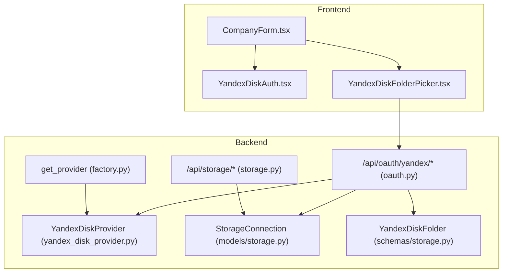
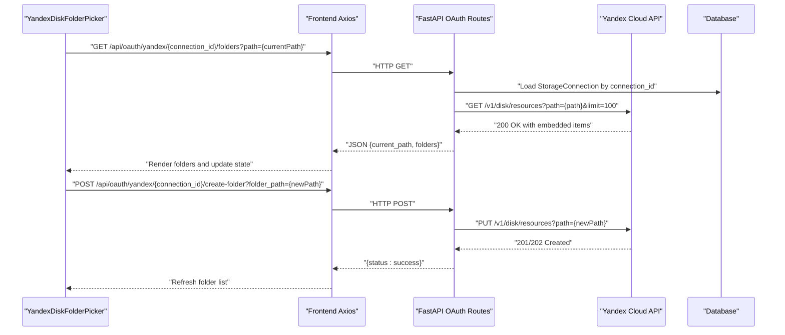
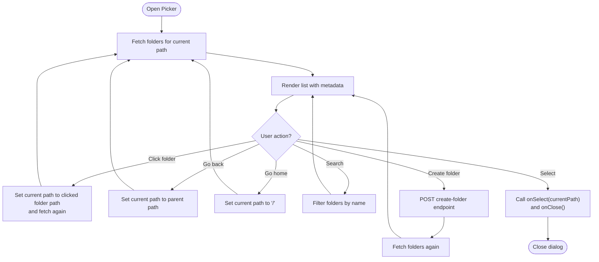
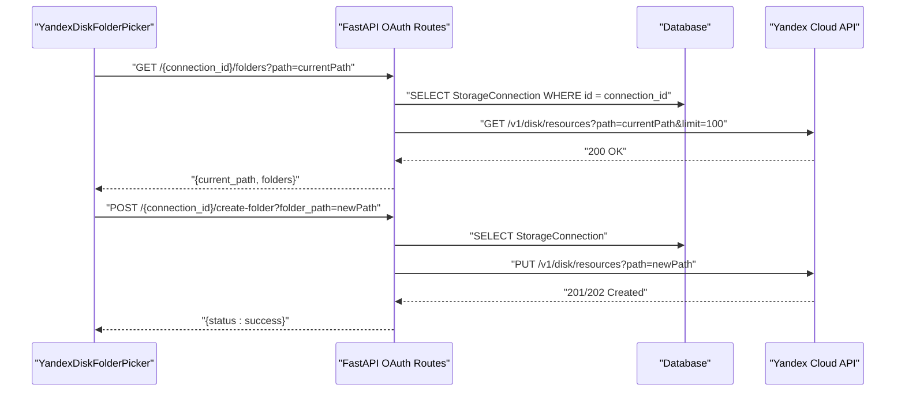
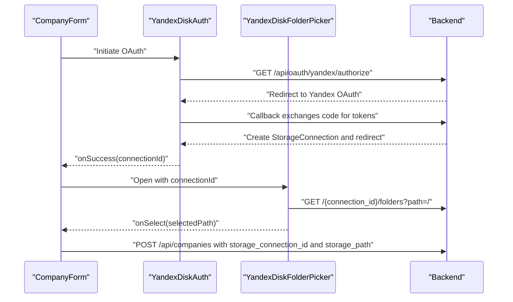
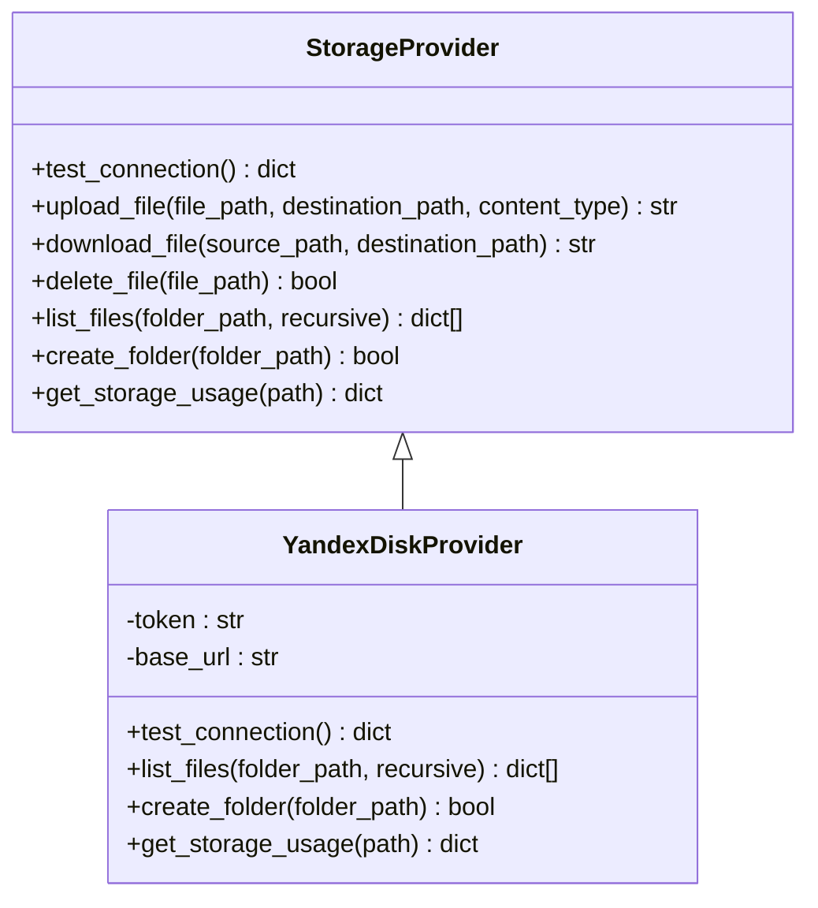
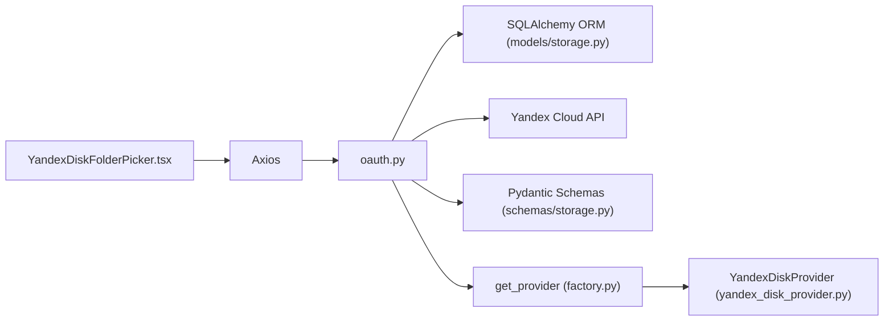

# YandexDiskFolderPicker Component

<cite>
**Referenced Files in This Document**
- [YandexDiskFolderPicker.tsx](file://frontend/components/YandexDiskFolderPicker.tsx)
- [YandexDiskAuth.tsx](file://frontend/components/YandexDiskAuth.tsx)
- [CompanyForm.tsx](file://frontend/components/CompanyForm.tsx)
- [oauth.py](file://app/api/routes/oauth.py)
- [storage.py](file://app/api/routes/storage.py)
- [yandex_disk_provider.py](file://app/services/storage/providers/yandex_disk_provider.py)
- [factory.py](file://app/services/storage/factory.py)
- [storage.py](file://app/models/storage.py)
- [storage.py](file://app/schemas/storage.py)
</cite>

## Table of Contents
1. [Introduction](#introduction)
2. [Project Structure](#project-structure)
3. [Core Components](#core-components)
4. [Architecture Overview](#architecture-overview)
5. [Detailed Component Analysis](#detailed-component-analysis)
6. [Dependency Analysis](#dependency-analysis)
7. [Performance Considerations](#performance-considerations)
8. [Troubleshooting Guide](#troubleshooting-guide)
9. [Conclusion](#conclusion)
10. [Appendices](#appendices)

## Introduction
This document explains the YandexDiskFolderPicker component that enables users to browse and select folders from their authenticated Yandex Disk account. It covers how the component integrates with the backend to fetch directory structures, renders a navigable tree-like UI, handles loading states, and propagates the selected folder path back to parent components such as CompanyForm. It also documents the backend endpoints used for listing folders and creating folders, along with UI patterns for breadcrumbs, expansion/collapse, and selection confirmation. Guidance is included for adapting the component for other hierarchical storage systems and extending it with search functionality.

## Project Structure
The YandexDiskFolderPicker lives in the frontend under components and integrates with backend routes and services. The backend exposes OAuth endpoints for Yandex Disk and a dedicated endpoint to list folders and create folders for the picker. The storage provider abstraction allows pluggable providers, including Yandex Disk.

**Diagram sources**
- [CompanyForm.tsx](file://frontend/components/CompanyForm.tsx#L1-L125)
- [YandexDiskAuth.tsx](file://frontend/components/YandexDiskAuth.tsx#L1-L77)
- [YandexDiskFolderPicker.tsx](file://frontend/components/YandexDiskFolderPicker.tsx#L1-L242)
- [oauth.py](file://app/api/routes/oauth.py#L1-L183)
- [storage.py](file://app/api/routes/storage.py#L1-L63)
- [yandex_disk_provider.py](file://app/services/storage/providers/yandex_disk_provider.py#L1-L110)
- [factory.py](file://app/services/storage/factory.py#L1-L31)
- [storage.py](file://app/models/storage.py#L1-L81)
- [storage.py](file://app/schemas/storage.py#L65-L72)

**Section sources**
- [YandexDiskFolderPicker.tsx](file://frontend/components/YandexDiskFolderPicker.tsx#L1-L242)
- [YandexDiskAuth.tsx](file://frontend/components/YandexDiskAuth.tsx#L1-L77)
- [CompanyForm.tsx](file://frontend/components/CompanyForm.tsx#L1-L125)
- [oauth.py](file://app/api/routes/oauth.py#L1-L183)
- [storage.py](file://app/api/routes/storage.py#L1-L63)
- [yandex_disk_provider.py](file://app/services/storage/providers/yandex_disk_provider.py#L1-L110)
- [factory.py](file://app/services/storage/factory.py#L1-L31)
- [storage.py](file://app/models/storage.py#L1-L81)
- [storage.py](file://app/schemas/storage.py#L65-L72)

## Core Components
- YandexDiskFolderPicker: A Material UI dialog-based folder picker that lists folders, supports navigation, search, and selection. It communicates with backend endpoints to list folders and create new folders.
- YandexDiskAuth: A popup-based OAuth flow that initiates Yandex Disk authorization and returns a connection identifier upon success.
- CompanyForm: Parent component that orchestrates authentication, opens the folder picker, and receives the selected folder path to persist company storage settings.

Key responsibilities:
- Fetch and render folder metadata from the backend.
- Manage current path, breadcrumbs, and navigation actions.
- Provide search filtering and folder creation capabilities.
- Propagate selection to parent components.

**Section sources**
- [YandexDiskFolderPicker.tsx](file://frontend/components/YandexDiskFolderPicker.tsx#L1-L242)
- [YandexDiskAuth.tsx](file://frontend/components/YandexDiskAuth.tsx#L1-L77)
- [CompanyForm.tsx](file://frontend/components/CompanyForm.tsx#L1-L125)

## Architecture Overview
The component follows a straightforward frontend-to-backend flow:
- Frontend triggers folder listing via a GET endpoint that returns a list of folders and the current path.
- Optional folder creation is performed via a POST endpoint.
- Backend validates the storage connection, extracts OAuth tokens, and calls the Yandex Disk API to list resources or create folders.
- The provider abstraction encapsulates Yandex Disk specifics, enabling reuse and extension.

**Diagram sources**
- [YandexDiskFolderPicker.tsx](file://frontend/components/YandexDiskFolderPicker.tsx#L72-L107)
- [oauth.py](file://app/api/routes/oauth.py#L108-L183)
- [yandex_disk_provider.py](file://app/services/storage/providers/yandex_disk_provider.py#L55-L93)

## Detailed Component Analysis

### YandexDiskFolderPicker Component
Responsibilities:
- State management for current path, folder list, loading, search query, and new folder name.
- Navigation actions: go back, go home, and click to navigate into subfolders.
- Folder creation: creates a new folder at the current path and refreshes the list.
- Selection propagation: invokes onSelect with the current path and closes the dialog.
- UI patterns: breadcrumbs, search bar, list rendering with metadata, and selection confirmation.

Backend integration:
- GET endpoint: /api/oauth/yandex/{connection_id}/folders?path={currentPath}
- POST endpoint: /api/oauth/yandex/{connection_id}/create-folder?folder_path={newPath}

Loading and error handling:
- Loading spinner appears while fetching folders.
- Errors are logged; no explicit user feedback is shown in the component itself.

Selection mechanics:
- The current path is displayed prominently and used as the selected value.
- onSelect is called with the current path and onClose closes the dialog.

Recursive rendering logic:
- The component does not implement recursive rendering. Instead, it relies on the backend to return only the immediate children of the requested path. Navigation updates the current path, which triggers a new fetch.

Pagination and rate limiting:
- The backend sets a fixed limit for folder listing. There is no frontend pagination UI in the component. Rate limiting is handled by the backend and Yandex API.

**Diagram sources**
- [YandexDiskFolderPicker.tsx](file://frontend/components/YandexDiskFolderPicker.tsx#L72-L112)
- [YandexDiskFolderPicker.tsx](file://frontend/components/YandexDiskFolderPicker.tsx#L148-L150)

**Section sources**
- [YandexDiskFolderPicker.tsx](file://frontend/components/YandexDiskFolderPicker.tsx#L1-L242)
- [oauth.py](file://app/api/routes/oauth.py#L108-L153)

### Backend Endpoints Used by the Component
- GET /api/oauth/yandex/{connection_id}/folders?path=...
  - Validates connection and provider type.
  - Uses stored OAuth token to call Yandex Disk API.
  - Returns current_path, parent_path, and a filtered list of folders (directories).
- POST /api/oauth/yandex/{connection_id}/create-folder?folder_path=...
  - Validates connection and provider type.
  - Uses stored OAuth token to call Yandex Disk API to create a folder resource.
  - Returns success status and path.

**Diagram sources**
- [oauth.py](file://app/api/routes/oauth.py#L108-L183)

**Section sources**
- [oauth.py](file://app/api/routes/oauth.py#L108-L183)

### Integration with CompanyForm
- CompanyForm manages storage provider selection and triggers authentication.
- On successful OAuth, it stores the connectionId and opens the folder picker.
- When the user selects a folder, CompanyForm receives the path and can submit company creation with storage settings.

**Diagram sources**
- [CompanyForm.tsx](file://frontend/components/CompanyForm.tsx#L1-L125)
- [YandexDiskAuth.tsx](file://frontend/components/YandexDiskAuth.tsx#L1-L77)
- [oauth.py](file://app/api/routes/oauth.py#L19-L107)

**Section sources**
- [CompanyForm.tsx](file://frontend/components/CompanyForm.tsx#L1-L125)
- [YandexDiskAuth.tsx](file://frontend/components/YandexDiskAuth.tsx#L1-L77)
- [oauth.py](file://app/api/routes/oauth.py#L19-L107)

### Provider Abstraction and Yandex Disk Implementation
- The provider factory resolves the appropriate provider based on the connection’s provider type and credentials.
- The YandexDiskProvider encapsulates Yandex Disk API calls for listing files, creating folders, and retrieving storage usage.

**Diagram sources**
- [base.py](file://app/services/storage/providers/base.py#L1-L47)
- [yandex_disk_provider.py](file://app/services/storage/providers/yandex_disk_provider.py#L1-L110)
- [factory.py](file://app/services/storage/factory.py#L1-L31)

**Section sources**
- [base.py](file://app/services/storage/providers/base.py#L1-L47)
- [yandex_disk_provider.py](file://app/services/storage/providers/yandex_disk_provider.py#L1-L110)
- [factory.py](file://app/services/storage/factory.py#L1-L31)

## Dependency Analysis
- Frontend depends on:
  - Axios for HTTP requests to backend endpoints.
  - Material UI components for UI rendering.
- Backend depends on:
  - SQLAlchemy for database operations.
  - httpx for external API calls to Yandex Disk.
  - Pydantic models for request/response schemas.
- Provider abstraction decouples frontend from provider specifics.

**Diagram sources**
- [YandexDiskFolderPicker.tsx](file://frontend/components/YandexDiskFolderPicker.tsx#L1-L242)
- [oauth.py](file://app/api/routes/oauth.py#L1-L183)
- [storage.py](file://app/models/storage.py#L1-L81)
- [storage.py](file://app/schemas/storage.py#L65-L72)
- [factory.py](file://app/services/storage/factory.py#L1-L31)
- [yandex_disk_provider.py](file://app/services/storage/providers/yandex_disk_provider.py#L1-L110)

**Section sources**
- [YandexDiskFolderPicker.tsx](file://frontend/components/YandexDiskFolderPicker.tsx#L1-L242)
- [oauth.py](file://app/api/routes/oauth.py#L1-L183)
- [storage.py](file://app/models/storage.py#L1-L81)
- [storage.py](file://app/schemas/storage.py#L65-L72)
- [factory.py](file://app/services/storage/factory.py#L1-L31)
- [yandex_disk_provider.py](file://app/services/storage/providers/yandex_disk_provider.py#L1-L110)

## Performance Considerations
- Network latency dominates folder listing performance. Consider caching recent folder listings in memory to reduce repeated network calls.
- Pagination: The backend currently uses a fixed limit. If folder counts grow large, implement frontend pagination or infinite scrolling to avoid long lists.
- Debounce search input to minimize frequent re-renders and API calls.
- Concurrency: Avoid overlapping requests for the same path; cancel previous requests when a new navigation occurs.
- UI responsiveness: Keep the list virtualized for very large directories to improve rendering performance.

[No sources needed since this section provides general guidance]

## Troubleshooting Guide
Common issues and resolutions:
- Unauthenticated session:
  - Symptom: Backend returns 404 for connection not found or 400 for missing OAuth token.
  - Resolution: Ensure OAuth flow completes and a valid connectionId is passed to the picker.
- API failures:
  - Symptom: Backend returns 500 with error messages indicating failure to list or create folders.
  - Resolution: Verify OAuth token validity and Yandex Disk API availability; retry after a delay.
- Rate limiting:
  - Symptom: Frequent 500 errors or throttled responses from Yandex Disk.
  - Resolution: Implement exponential backoff and user feedback; avoid rapid successive requests.
- No folders displayed:
  - Symptom: Empty list after navigation.
  - Resolution: Confirm path correctness and that the directory contains subfolders; refresh the view.
- Folder creation fails:
  - Symptom: POST returns error.
  - Resolution: Validate folder name and path; ensure the parent directory exists and permissions allow creation.

Error handling in the component:
- The component logs errors to the console and does not show explicit user feedback. Consider adding toast notifications or inline alerts for better UX.

**Section sources**
- [YandexDiskFolderPicker.tsx](file://frontend/components/YandexDiskFolderPicker.tsx#L72-L107)
- [oauth.py](file://app/api/routes/oauth.py#L128-L153)

## Conclusion
The YandexDiskFolderPicker provides a focused, dialog-based interface for browsing and selecting Yandex Disk folders. It integrates cleanly with backend endpoints that validate connections, manage OAuth tokens, and interact with the Yandex Cloud API. While the component currently relies on backend-side pagination and does not implement recursive rendering, it offers essential UI patterns (breadcrumbs, search, selection confirmation) and can be extended to support pagination, improved error handling, and broader storage provider compatibility.

[No sources needed since this section summarizes without analyzing specific files]

## Appendices

### Backend Endpoint Definitions
- GET /api/oauth/yandex/{connection_id}/folders?path=...
  - Purpose: List child directories for the given path.
  - Response: current_path, parent_path, folders (filtered to directories).
- POST /api/oauth/yandex/{connection_id}/create-folder?folder_path=...
  - Purpose: Create a new folder at the specified path.
  - Response: success status and path.

**Section sources**
- [oauth.py](file://app/api/routes/oauth.py#L108-L183)

### Adapting for Other Hierarchical Storage Systems
- Provider abstraction:
  - Extend the provider interface to support list_files, create_folder, and get_storage_usage for other providers.
  - Implement provider-specific adapters (e.g., MinIO, S3-compatible) following the same patterns.
- Frontend:
  - Add provider-specific UI toggles and credential prompts.
  - Reuse the picker component by swapping provider-specific endpoints and schemas.

**Section sources**
- [base.py](file://app/services/storage/providers/base.py#L1-L47)
- [factory.py](file://app/services/storage/factory.py#L1-L31)
- [yandex_disk_provider.py](file://app/services/storage/providers/yandex_disk_provider.py#L1-L110)

### Extending with Search Functionality
- Current state:
  - The component filters folders client-side by name.
- Recommendations:
  - Introduce server-side search to handle large datasets efficiently.
  - Add debounced search input and clear search button.
  - Display search hints and results count.

**Section sources**
- [YandexDiskFolderPicker.tsx](file://frontend/components/YandexDiskFolderPicker.tsx#L148-L150)