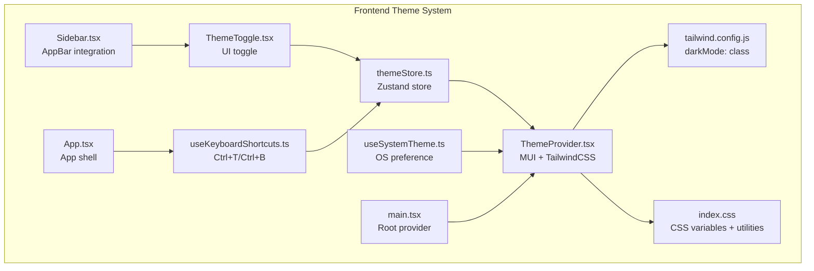
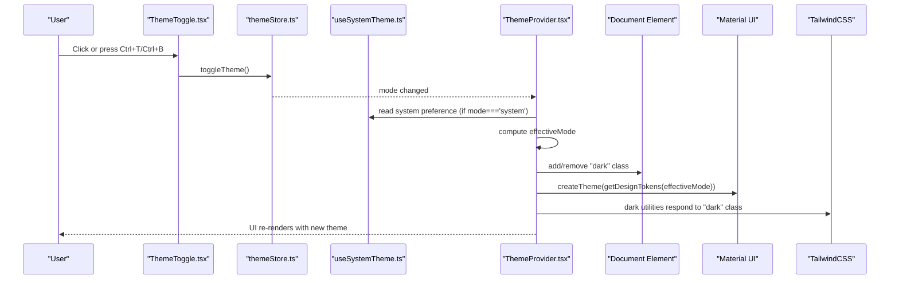
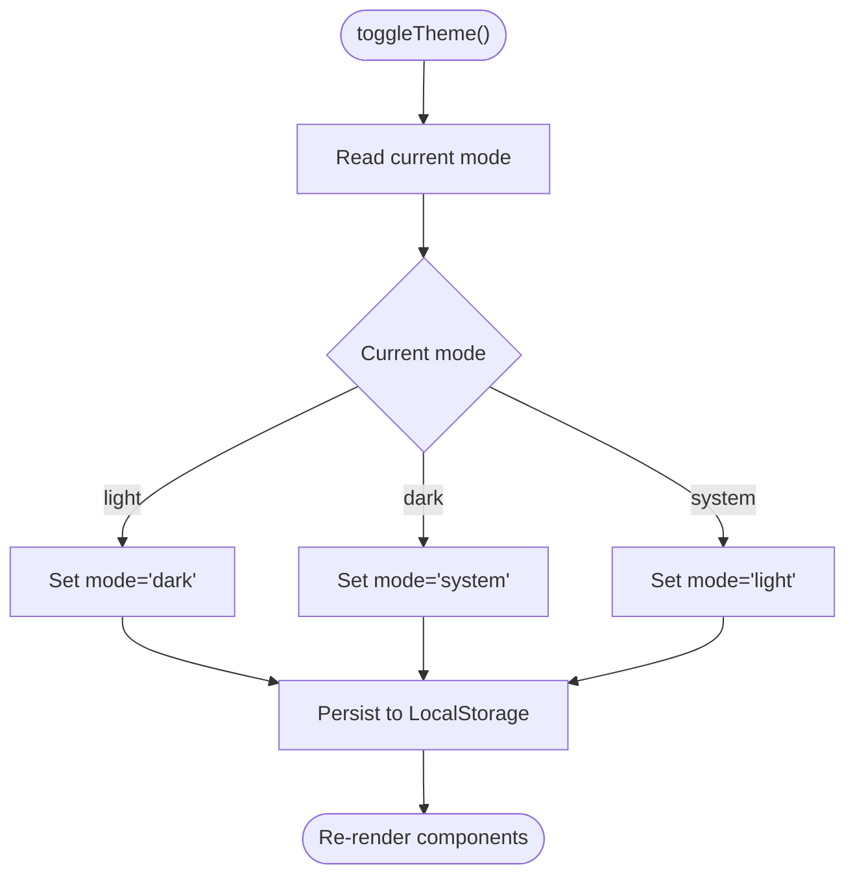
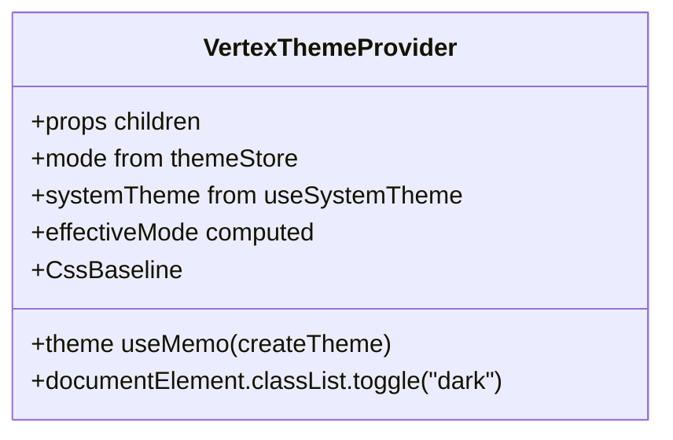
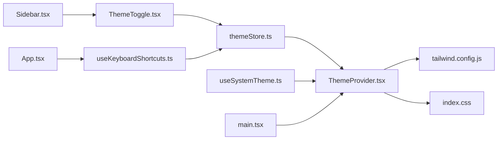

# Dark/Light Theme System

<cite>
**Referenced Files in This Document**
- [theme.ts](file://frontend/src/theme.ts)
- [ThemeProvider.tsx](file://frontend/src/providers/ThemeProvider.tsx)
- [themeStore.ts](file://frontend/src/store/themeStore.ts)
- [useSystemTheme.ts](file://frontend/src/hooks/useSystemTheme.ts)
- [ThemeToggle.tsx](file://frontend/src/components/common/ThemeToggle.tsx)
- [useKeyboardShortcuts.ts](file://frontend/src/hooks/useKeyboardShortcuts.ts)
- [main.tsx](file://frontend/src/main.tsx)
- [App.tsx](file://frontend/src/App.tsx)
- [Sidebar.tsx](file://frontend/src/components/layout/Sidebar.tsx)
- [tailwind.config.js](file://frontend/tailwind.config.js)
- [index.css](file://frontend/src/index.css)
- [DARK_THEME_SYSTEM.md](file://frontend/DARK_THEME_SYSTEM.md)
- [THEME_IMPLEMENTATION_SUMMARY.md](file://THEME_IMPLEMENTATION_SUMMARY.md)
</cite>

## Table of Contents
1. [Introduction](#introduction)
2. [Project Structure](#project-structure)
3. [Core Components](#core-components)
4. [Architecture Overview](#architecture-overview)
5. [Detailed Component Analysis](#detailed-component-analysis)
6. [Dependency Analysis](#dependency-analysis)
7. [Performance Considerations](#performance-considerations)
8. [Troubleshooting Guide](#troubleshooting-guide)
9. [Conclusion](#conclusion)
10. [Appendices](#appendices)

## Introduction
This document explains the Dark/Light Theme System implemented in the frontend. It covers how theme modes are stored and synchronized, how the Material UI theme is generated, how TailwindCSS dark mode is enabled, and how users can toggle themes via UI or keyboard shortcuts. It also documents the integration points and provides troubleshooting guidance.

## Project Structure
The theme system spans several frontend files:
- Theme store and persistence
- System preference detection
- Theme provider that composes MUI and TailwindCSS
- UI toggle component
- Keyboard shortcuts
- Integration in the application shell and sidebar

**Diagram sources**
- [themeStore.ts](file://frontend/src/store/themeStore.ts#L1-L34)
- [useSystemTheme.ts](file://frontend/src/hooks/useSystemTheme.ts#L1-L26)
- [ThemeProvider.tsx](file://frontend/src/providers/ThemeProvider.tsx#L1-L148)
- [ThemeToggle.tsx](file://frontend/src/components/common/ThemeToggle.tsx#L1-L53)
- [useKeyboardShortcuts.ts](file://frontend/src/hooks/useKeyboardShortcuts.ts#L1-L26)
- [main.tsx](file://frontend/src/main.tsx#L1-L17)
- [App.tsx](file://frontend/src/App.tsx#L1-L78)
- [Sidebar.tsx](file://frontend/src/components/layout/Sidebar.tsx#L1-L165)
- [tailwind.config.js](file://frontend/tailwind.config.js#L1-L35)
- [index.css](file://frontend/src/index.css#L1-L70)

**Section sources**
- [DARK_THEME_SYSTEM.md](file://frontend/DARK_THEME_SYSTEM.md#L1-L120)
- [THEME_IMPLEMENTATION_SUMMARY.md](file://THEME_IMPLEMENTATION_SUMMARY.md#L1-L120)

## Core Components
- Theme store: manages mode state and persists it to LocalStorage.
- System theme hook: detects OS preference via media query and updates reactively.
- Theme provider: builds MUI theme dynamically and toggles TailwindCSS dark class on the document element.
- Theme toggle: a button that cycles through modes and displays current mode.
- Keyboard shortcuts: global hotkeys to toggle theme.
- TailwindCSS and CSS variables: define dark mode behavior and smooth transitions.

**Section sources**
- [themeStore.ts](file://frontend/src/store/themeStore.ts#L1-L34)
- [useSystemTheme.ts](file://frontend/src/hooks/useSystemTheme.ts#L1-L26)
- [ThemeProvider.tsx](file://frontend/src/providers/ThemeProvider.tsx#L1-L148)
- [ThemeToggle.tsx](file://frontend/src/components/common/ThemeToggle.tsx#L1-L53)
- [useKeyboardShortcuts.ts](file://frontend/src/hooks/useKeyboardShortcuts.ts#L1-L26)
- [tailwind.config.js](file://frontend/tailwind.config.js#L1-L35)
- [index.css](file://frontend/src/index.css#L1-L70)

## Architecture Overview
The theme system is composed of:
- State management: themeStore holds the current mode and exposes toggle/set functions.
- Effective mode computation: when mode is “system”, the effective mode is derived from the OS preference.
- Theme generation: ThemeProvider constructs a Material UI theme based on the effective mode and applies CssBaseline.
- TailwindCSS integration: ThemeProvider adds/removes the “dark” class on the document element so TailwindCSS utilities respond accordingly.
- UI and shortcuts: ThemeToggle cycles modes; useKeyboardShortcuts listens globally for Ctrl+T/Ctrl+B.

**Diagram sources**
- [ThemeToggle.tsx](file://frontend/src/components/common/ThemeToggle.tsx#L1-L53)
- [themeStore.ts](file://frontend/src/store/themeStore.ts#L1-L34)
- [useSystemTheme.ts](file://frontend/src/hooks/useSystemTheme.ts#L1-L26)
- [ThemeProvider.tsx](file://frontend/src/providers/ThemeProvider.tsx#L1-L148)
- [useKeyboardShortcuts.ts](file://frontend/src/hooks/useKeyboardShortcuts.ts#L1-L26)

## Detailed Component Analysis

### Theme Store (Zustand)
- Stores the current mode and exposes toggle and set functions.
- Persists only the mode to LocalStorage under a dedicated key.
- Provides a cycling order: light → dark → system → light.

**Diagram sources**
- [themeStore.ts](file://frontend/src/store/themeStore.ts#L1-L34)

**Section sources**
- [themeStore.ts](file://frontend/src/store/themeStore.ts#L1-L34)
- [THEME_IMPLEMENTATION_SUMMARY.md](file://THEME_IMPLEMENTATION_SUMMARY.md#L1-L40)

### System Theme Detection
- Detects OS preference via media query and updates reactively.
- Safe for SSR by checking window availability.
- Emits real-time updates when OS theme changes.

**Section sources**
- [useSystemTheme.ts](file://frontend/src/hooks/useSystemTheme.ts#L1-L26)
- [THEME_IMPLEMENTATION_SUMMARY.md](file://THEME_IMPLEMENTATION_SUMMARY.md#L41-L66)

### Theme Provider (MUI + TailwindCSS)
- Builds MUI theme tokens for light and dark modes.
- Applies CssBaseline with color scheme support.
- Adds/removes the “dark” class on the document element to enable TailwindCSS dark utilities.
- Computes effective mode by combining store mode and system preference.

**Diagram sources**
- [ThemeProvider.tsx](file://frontend/src/providers/ThemeProvider.tsx#L1-L148)

**Section sources**
- [ThemeProvider.tsx](file://frontend/src/providers/ThemeProvider.tsx#L1-L148)
- [DARK_THEME_SYSTEM.md](file://frontend/DARK_THEME_SYSTEM.md#L98-L120)

### Theme Toggle Component
- Displays an icon representing the current mode.
- Tooltip shows current mode and a hint about keyboard shortcuts.
- Rotates on hover for a subtle animation.
- Integrates into the AppBar via Sidebar.

**Section sources**
- [ThemeToggle.tsx](file://frontend/src/components/common/ThemeToggle.tsx#L1-L53)
- [Sidebar.tsx](file://frontend/src/components/layout/Sidebar.tsx#L100-L135)
- [THEME_IMPLEMENTATION_SUMMARY.md](file://THEME_IMPLEMENTATION_SUMMARY.md#L67-L96)

### Keyboard Shortcuts
- Global listeners for Ctrl+T and Ctrl+B to toggle theme.
- Prevents default browser actions to avoid conflicts.

**Section sources**
- [useKeyboardShortcuts.ts](file://frontend/src/hooks/useKeyboardShortcuts.ts#L1-L26)
- [App.tsx](file://frontend/src/App.tsx#L22-L30)
- [THEME_IMPLEMENTATION_SUMMARY.md](file://THEME_IMPLEMENTATION_SUMMARY.md#L121-L150)

### TailwindCSS and CSS Variables
- TailwindCSS configured to use class-based dark mode.
- CSS variables define HSL-based color tokens for light and dark.
- Dark mode utility classes adjust background, surface, card, and borders.

**Section sources**
- [tailwind.config.js](file://frontend/tailwind.config.js#L1-L35)
- [index.css](file://frontend/src/index.css#L1-L70)
- [DARK_THEME_SYSTEM.md](file://frontend/DARK_THEME_SYSTEM.md#L148-L204)

### Integration Points
- Root provider wraps the application in ThemeProvider.
- App initializes keyboard shortcuts.
- Sidebar places ThemeToggle in the AppBar.

**Section sources**
- [main.tsx](file://frontend/src/main.tsx#L1-L17)
- [App.tsx](file://frontend/src/App.tsx#L22-L30)
- [Sidebar.tsx](file://frontend/src/components/layout/Sidebar.tsx#L100-L135)
- [THEME_IMPLEMENTATION_SUMMARY.md](file://THEME_IMPLEMENTATION_SUMMARY.md#L151-L178)

## Dependency Analysis
The theme system exhibits low coupling and clear separation of concerns:
- ThemeProvider depends on themeStore and useSystemTheme.
- ThemeToggle and useKeyboardShortcuts depend on themeStore.
- TailwindCSS and index.css are decoupled from MUI but coordinated via the “dark” class.
- Integration points are minimal and centralized.

**Diagram sources**
- [themeStore.ts](file://frontend/src/store/themeStore.ts#L1-L34)
- [useSystemTheme.ts](file://frontend/src/hooks/useSystemTheme.ts#L1-L26)
- [ThemeProvider.tsx](file://frontend/src/providers/ThemeProvider.tsx#L1-L148)
- [ThemeToggle.tsx](file://frontend/src/components/common/ThemeToggle.tsx#L1-L53)
- [useKeyboardShortcuts.ts](file://frontend/src/hooks/useKeyboardShortcuts.ts#L1-L26)
- [tailwind.config.js](file://frontend/tailwind.config.js#L1-L35)
- [index.css](file://frontend/src/index.css#L1-L70)
- [main.tsx](file://frontend/src/main.tsx#L1-L17)
- [App.tsx](file://frontend/src/App.tsx#L1-L78)
- [Sidebar.tsx](file://frontend/src/components/layout/Sidebar.tsx#L1-L165)

**Section sources**
- [DARK_THEME_SYSTEM.md](file://frontend/DARK_THEME_SYSTEM.md#L1-L40)
- [THEME_IMPLEMENTATION_SUMMARY.md](file://THEME_IMPLEMENTATION_SUMMARY.md#L1-L40)

## Performance Considerations
- Theme calculation is lightweight and memoized.
- Transitions are smooth with short durations.
- Persistence uses LocalStorage with minimal overhead.
- SSR-safe hooks prevent hydration mismatches.

[No sources needed since this section provides general guidance]

## Troubleshooting Guide
Common issues and resolutions:
- Theme not persisting: verify LocalStorage availability and quota.
- TailwindCSS dark utilities not working: confirm darkMode is set to class.
- Keyboard shortcuts not responding: ensure the hook is initialized in App.
- Theme flicker on load: ensure system preference hook checks window availability.

**Section sources**
- [THEME_IMPLEMENTATION_SUMMARY.md](file://THEME_IMPLEMENTATION_SUMMARY.md#L296-L345)
- [DARK_THEME_SYSTEM.md](file://frontend/DARK_THEME_SYSTEM.md#L416-L436)

## Conclusion
The theme system integrates Zustand for state and persistence, Material UI for theming, TailwindCSS for utilities, and React hooks for system detection and keyboard shortcuts. It offers three modes (light, dark, system), smooth transitions, and robust integration points. The implementation is production-ready, accessible, and easy to extend.

[No sources needed since this section summarizes without analyzing specific files]

## Appendices

### Theme Modes and Colors
- Modes: light, dark, system.
- MUI theme tokens differ between light and dark.
- TailwindCSS uses CSS variables and class-based dark mode.

**Section sources**
- [DARK_THEME_SYSTEM.md](file://frontend/DARK_THEME_SYSTEM.md#L28-L49)
- [ThemeProvider.tsx](file://frontend/src/providers/ThemeProvider.tsx#L1-L148)
- [tailwind.config.js](file://frontend/tailwind.config.js#L1-L35)
- [index.css](file://frontend/src/index.css#L1-L70)

### Usage Examples
- Toggle programmatically, set specific mode, or derive effective dark mode conditionally.

**Section sources**
- [THEME_IMPLEMENTATION_SUMMARY.md](file://THEME_IMPLEMENTATION_SUMMARY.md#L180-L210)
- [DARK_THEME_SYSTEM.md](file://frontend/DARK_THEME_SYSTEM.md#L277-L307)