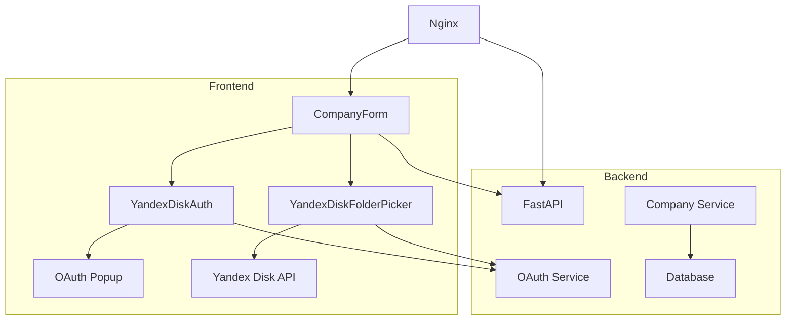
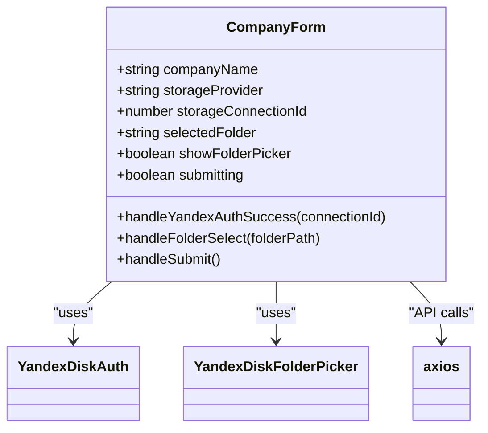
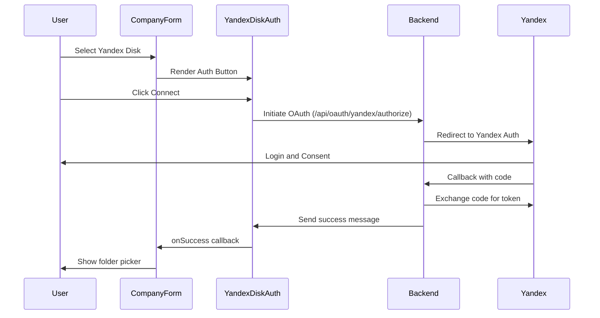
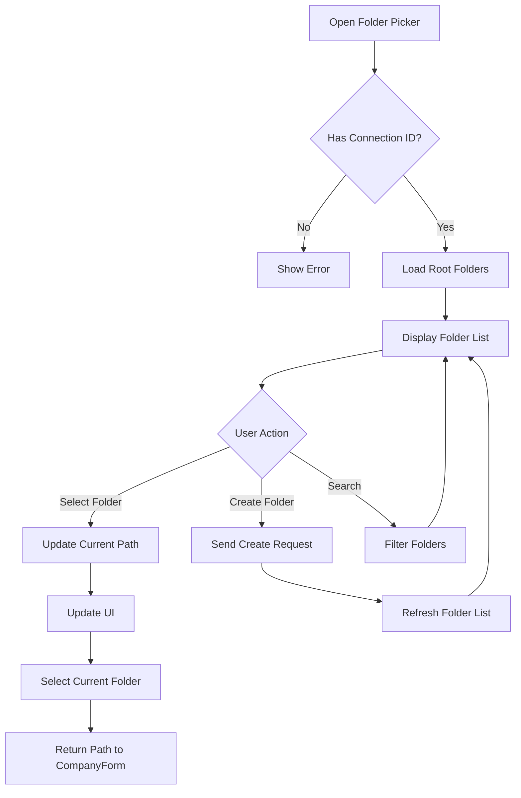
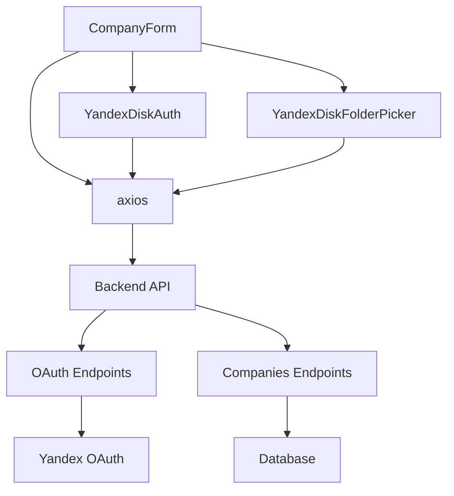

# Frontend Architecture

<cite>
**Referenced Files in This Document**   
- [CompanyForm.tsx](file://frontend/components/CompanyForm.tsx)
- [YandexDiskAuth.tsx](file://frontend/components/YandexDiskAuth.tsx)
- [YandexDiskFolderPicker.tsx](file://frontend/components/YandexDiskFolderPicker.tsx)
- [index.html](file://frontend/index.html)
- [nginx.conf](file://nginx/nginx.conf)
- [oauth.py](file://app/api/routes/oauth.py)
- [companies.py](file://app/api/routes/companies.py)
- [main.py](file://app/main.py)
</cite>

## Table of Contents
1. [Introduction](#introduction)
2. [Project Structure](#project-structure)
3. [Core Components](#core-components)
4. [Architecture Overview](#architecture-overview)
5. [Detailed Component Analysis](#detailed-component-analysis)
6. [Dependency Analysis](#dependency-analysis)
7. [Performance Considerations](#performance-considerations)
8. [Troubleshooting Guide](#troubleshooting-guide)
9. [Conclusion](#conclusion)

## Introduction
The ARV frontend system is a React-based admin panel built with TypeScript, Material-UI 5, and TailwindCSS. It serves as the administrative interface for managing companies, storage connections, and AR content within the Vertex AR B2B platform. The frontend is currently under development, with core functionality focused on company creation and Yandex Disk integration. This documentation details the architecture, component structure, integration patterns with the backend API, build process, and deployment configuration through Nginx.

## Project Structure
The frontend components are organized within the `frontend` directory, which contains the main entry point `index.html` and a `components` subdirectory housing the key React components for company management and storage integration. The build process and static asset serving are configured through Docker and Nginx, with the frontend assets served from the `/usr/share/nginx/html` directory in the production environment.

```mermaid
graph TD
A[Frontend] --> B[index.html]
A --> C[components/]
C --> D[CompanyForm.tsx]
C --> E[YandexDiskAuth.tsx]
C --> F[YandexDiskFolderPicker.tsx]
G[Nginx] --> H[/usr/share/nginx/html]
H --> I[Frontend Assets]
```

**Diagram sources**
- [index.html](file://frontend/index.html)
- [nginx.conf](file://nginx/nginx.conf)

**Section sources**
- [index.html](file://frontend/index.html)
- [nginx.conf](file://nginx/nginx.conf)

## Core Components
The frontend architecture centers around three core components that enable company creation and Yandex Disk integration: `CompanyForm`, `YandexDiskAuth`, and `YandexDiskFolderPicker`. These components work together to provide a seamless user experience for setting up new companies with external storage connections. The `CompanyForm` component orchestrates the workflow, while the Yandex Disk components handle authentication and folder selection.

**Section sources**
- [CompanyForm.tsx](file://frontend/components/CompanyForm.tsx)
- [YandexDiskAuth.tsx](file://frontend/components/YandexDiskAuth.tsx)
- [YandexDiskFolderPicker.tsx](file://frontend/components/YandexDiskFolderPicker.tsx)

## Architecture Overview
The frontend architecture follows a component-based React pattern with TypeScript for type safety and Material-UI 5 for UI components. The admin panel communicates with a FastAPI backend through RESTful endpoints, with authentication flows implemented using OAuth 2.0 for Yandex Disk integration. Static assets are served through Nginx, which acts as a reverse proxy for both the frontend and backend services.



**Diagram sources**
- [CompanyForm.tsx](file://frontend/components/CompanyForm.tsx)
- [YandexDiskAuth.tsx](file://frontend/components/YandexDiskAuth.tsx)
- [YandexDiskFolderPicker.tsx](file://frontend/components/YandexDiskFolderPicker.tsx)
- [oauth.py](file://app/api/routes/oauth.py)
- [companies.py](file://app/api/routes/companies.py)

## Detailed Component Analysis

### CompanyForm Analysis
The `CompanyForm` component serves as the central interface for creating new companies within the ARV system. It manages form state, validates inputs, and coordinates with Yandex Disk integration components to establish storage connections.

#### Component Structure:


**Diagram sources**
- [CompanyForm.tsx](file://frontend/components/CompanyForm.tsx)

**Section sources**
- [CompanyForm.tsx](file://frontend/components/CompanyForm.tsx)

### Yandex Disk Integration Analysis
The Yandex Disk integration consists of two components that handle authentication and folder selection, enabling secure access to user storage accounts.

#### Authentication Flow:


**Diagram sources**
- [YandexDiskAuth.tsx](file://frontend/components/YandexDiskAuth.tsx)
- [oauth.py](file://app/api/routes/oauth.py)

#### Folder Selection Workflow:


**Diagram sources**
- [YandexDiskFolderPicker.tsx](file://frontend/components/YandexDiskFolderPicker.tsx)
- [oauth.py](file://app/api/routes/oauth.py)

**Section sources**
- [YandexDiskAuth.tsx](file://frontend/components/YandexDiskAuth.tsx)
- [YandexDiskFolderPicker.tsx](file://frontend/components/YandexDiskFolderPicker.tsx)

## Dependency Analysis
The frontend components have a clear dependency hierarchy, with the `CompanyForm` depending on both Yandex Disk components, and all components relying on axios for API communication. The backend services are exposed through the FastAPI application, with specific endpoints for OAuth and company management.



**Diagram sources**
- [CompanyForm.tsx](file://frontend/components/CompanyForm.tsx)
- [YandexDiskAuth.tsx](file://frontend/components/YandexDiskAuth.tsx)
- [YandexDiskFolderPicker.tsx](file://frontend/components/YandexDiskFolderPicker.tsx)
- [oauth.py](file://app/api/routes/oauth.py)
- [companies.py](file://app/api/routes/companies.py)

**Section sources**
- [CompanyForm.tsx](file://frontend/components/CompanyForm.tsx)
- [YandexDiskAuth.tsx](file://frontend/components/YandexDiskAuth.tsx)
- [YandexDiskFolderPicker.tsx](file://frontend/components/YandexDiskFolderPicker.tsx)

## Performance Considerations
The frontend architecture includes several performance considerations:
- The admin panel is served as a static SPA through Nginx with appropriate caching headers
- API requests are rate-limited at the Nginx level to prevent abuse
- Folder listing in the Yandex Disk picker includes client-side search filtering
- Loading states are implemented for all asynchronous operations
- The build process uses Docker for consistent deployment

The current implementation shows attention to responsive design with Material-UI components that adapt to different screen sizes. Accessibility is supported through proper semantic HTML and ARIA attributes in the Material-UI components.

## Troubleshooting Guide
Common issues and their solutions:

1. **Yandex Disk Authentication Fails**
   - Check that the OAuth redirect URI in backend settings matches the frontend URL
   - Verify that Yandex OAuth credentials are properly configured in environment variables
   - Ensure popup blockers are disabled for the admin panel

2. **Folder Picker Not Loading Folders**
   - Confirm the storage connection ID is valid and active
   - Check network requests for API errors
   - Verify the Yandex OAuth token is still valid

3. **Company Creation Fails**
   - Ensure all required fields are filled
   - Validate that a storage connection is established
   - Check backend logs for database or storage errors

**Section sources**
- [CompanyForm.tsx](file://frontend/components/CompanyForm.tsx)
- [YandexDiskAuth.tsx](file://frontend/components/YandexDiskAuth.tsx)
- [YandexDiskFolderPicker.tsx](file://frontend/components/YandexDiskFolderPicker.tsx)
- [companies.py](file://app/api/routes/companies.py)

## Conclusion
The ARV frontend system provides a foundation for an administrative interface that enables management of companies and storage connections. Built with modern React patterns and TypeScript, the architecture demonstrates a clean separation of concerns between components. The integration with Yandex Disk through OAuth 2.0 provides a secure method for accessing external storage. While the admin panel is currently under development, the existing components establish a solid foundation for future expansion. The deployment architecture using Nginx and Docker ensures consistent delivery and performance in production environments.