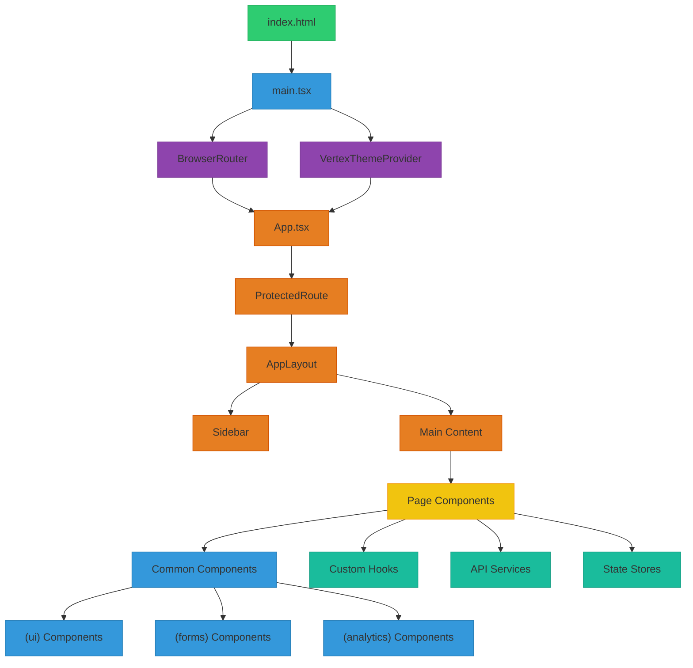
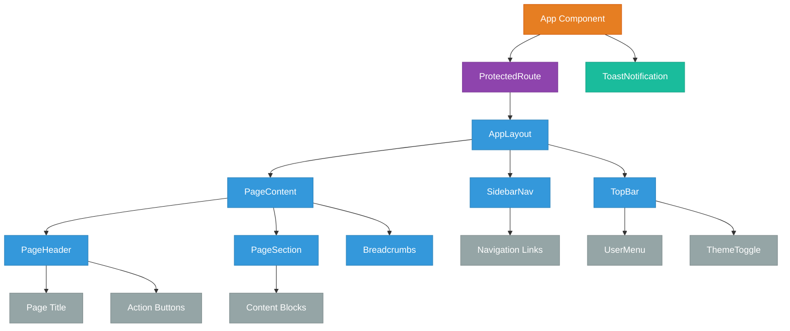
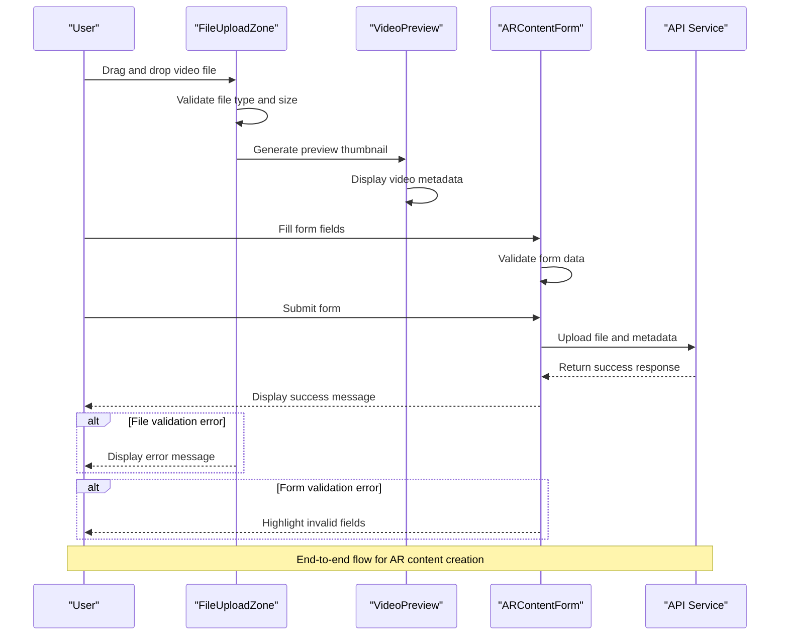
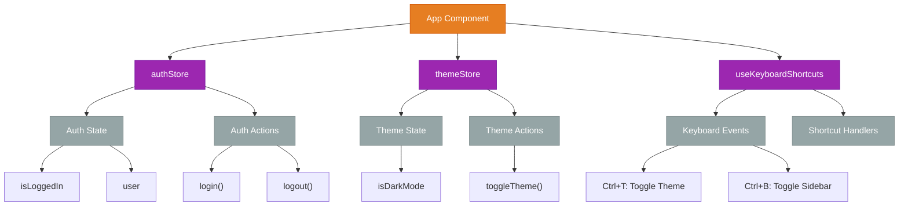
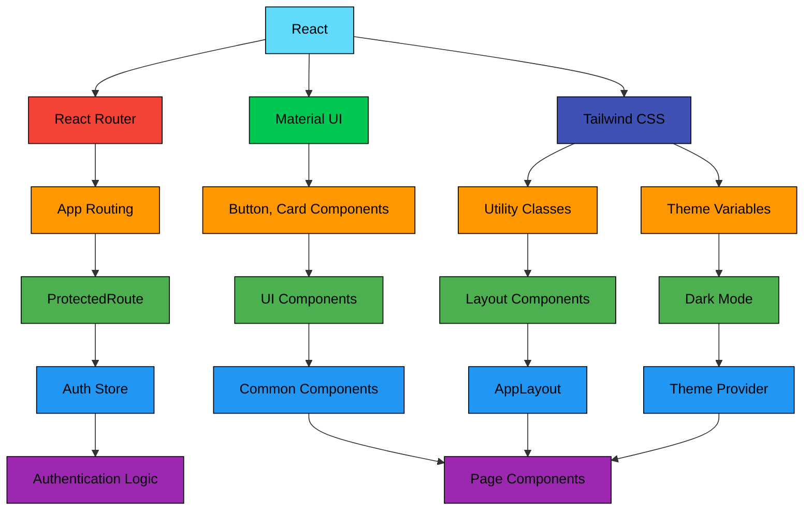

# Frontend Component Library

<cite>
**Referenced Files in This Document**   
- [App.tsx](file://frontend/src/App.tsx)
- [main.tsx](file://frontend/src/main.tsx)
- [index.css](file://frontend/src/index.css)
- [theme.ts](file://frontend/src/theme.ts)
- [tailwind.config.js](file://frontend/tailwind.config.js)
- [vite.config.ts](file://frontend/vite.config.ts)
- [package.json](file://frontend/package.json)
- [tsconfig.json](file://frontend/tsconfig.json)
- [components/index.ts](file://frontend/src/components/index.ts)
- [components/(ui)/Button/Button.tsx](file://frontend/src/components/(ui)/Button/Button.tsx)
- [components/(ui)/Card/Card.tsx](file://frontend/src/components/(ui)/Card/Card.tsx)
- [components/(ui)/Loading/Loading.tsx](file://frontend/src/components/(ui)/Loading/Loading.tsx)
- [components/common/ToastNotification.tsx](file://frontend/src/components/common/ToastNotification.tsx)
- [components/layout/AppLayout.tsx](file://frontend/src/components/layout/AppLayout.tsx)
- [components/auth/ProtectedRoute.tsx](file://frontend/src/components/auth/ProtectedRoute.tsx)
- [components/forms/FileUploadZone.tsx](file://frontend/src/components/forms/FileUploadZone.tsx)
- [components/(analytics)/KpiCard.tsx](file://frontend/src/components/(analytics)/KpiCard.tsx)
- [components/(media)/VideoPreview.tsx](file://frontend/src/components/(media)/VideoPreview.tsx)
- [providers/ThemeProvider.tsx](file://frontend/src/providers/ThemeProvider.tsx)
- [hooks/useKeyboardShortcuts.ts](file://frontend/src/hooks/useKeyboardShortcuts.ts)
- [store/authStore.ts](file://frontend/src/store/authStore.ts)
- [store/themeStore.ts](file://frontend/src/store/themeStore.ts)
</cite>

## Table of Contents
1. [Introduction](#introduction)
2. [Project Structure](#project-structure)
3. [Core Components](#core-components)
4. [Architecture Overview](#architecture-overview)
5. [Detailed Component Analysis](#detailed-component-analysis)
6. [Dependency Analysis](#dependency-analysis)
7. [Performance Considerations](#performance-considerations)
8. [Troubleshooting Guide](#troubleshooting-guide)
9. [Conclusion](#conclusion)

## Introduction
The Vertex AR Admin Panel frontend component library is a comprehensive React-based UI system designed for managing augmented reality content, companies, projects, and analytics. Built with modern web technologies including React 18, TypeScript, Tailwind CSS, and Material UI, the library provides a structured, reusable component architecture with robust theming, routing, and state management capabilities. This documentation provides a comprehensive overview of the component library's structure, design patterns, and implementation details.

## Project Structure
The frontend component library follows a well-organized structure with categorized components, reusable utilities, and a clear separation of concerns. Components are grouped into functional categories using a bracketed naming convention (e.g., `(ui)`, `(layout)`) to distinguish core reusable components from application-specific implementations.

```mermaid
graph TB
subgraph "Frontend Components"
A["(ui) - Primitive Components"]
B["(layout) - Layout Components"]
C["(forms) - Form Components"]
D["(analytics) - Data Visualization"]
E["(media) - Media Handlers"]
F["(auth) - Authentication UI"]
G["(feedback) - User Feedback"]
H["common - Shared Components"]
I["forms - Form Implementations"]
J["layout - Layout Implementations"]
end
A --> |Reused by| H
B --> |Reused by| J
C --> |Reused by| H
D --> |Used in| Pages
E --> |Used in| AR Content Pages
F --> |Used in| Auth Pages
G --> |Used in| Multiple Pages
H --> |Used in| Pages
J --> |Used in| AppLayout
subgraph "Application Structure"
K["pages - Page Components"]
L["hooks - Custom Hooks"]
M["store - State Management"]
N["providers - Context Providers"]
O["services - API Services"]
P["types - Type Definitions"]
end
K --> |Uses| H
K --> |Uses| J
L --> |Used by| K
M --> |Consumed by| K
N --> |Provides| M
O --> |Called by| K
P --> |Imported by| All
style A fill:#4A90E2,stroke:#357ABD
style B fill:#4A90E2,stroke:#357ABD
style C fill:#4A90E2,stroke:#357ABD
style D fill:#4A90E2,stroke:#357ABD
style E fill:#4A90E2,stroke:#357ABD
style F fill:#4A90E2,stroke:#357ABD
style G fill:#4A90E2,stroke:#357ABD
style H fill:#50C878,stroke:#3D9970
style I fill:#50C878,stroke:#3D9970
style J fill:#50C878,stroke:#3D9970
style K fill:#FFD700,stroke:#FFC107
style L fill:#9C27B0,stroke:#7B1FA2
style M fill:#9C27B0,stroke:#7B1FA2
style N fill:#9C27B0,stroke:#7B1FA2
style O fill:#9C27B0,stroke:#7B1FA2
style P fill:#9C27B0,stroke:#7B1FA2
```

**Diagram sources**
- [components/index.ts](file://frontend/src/components/index.ts)
- [components/(ui)/Button/Button.tsx](file://frontend/src/components/(ui)/Button/Button.tsx)
- [components/layout/AppLayout.tsx](file://frontend/src/components/layout/AppLayout.tsx)

**Section sources**
- [components/index.ts](file://frontend/src/components/index.ts)
- [components](file://frontend/src/components)

## Core Components
The component library is organized into nine distinct categories, with a barrel export system that enables clean, organized imports. The core components include UI primitives (Button, Card, Badge), layout components (AppLayout, Sidebar), form components (FileUploadZone, FormCard), and specialized components for analytics, media, authentication, and user feedback. The library implements a hybrid styling approach using Tailwind CSS for utility-first styling and Material UI for complex components, with a custom theme system that supports both light and dark modes.

**Section sources**
- [components/index.ts](file://frontend/src/components/index.ts)
- [components/(ui)/Button/Button.tsx](file://frontend/src/components/(ui)/Button/Button.tsx)
- [components/(ui)/Card/Card.tsx](file://frontend/src/components/(ui)/Card/Card.tsx)
- [components/layout/AppLayout.tsx](file://frontend/src/components/layout/AppLayout.tsx)

## Architecture Overview
The frontend architecture follows a modern React application pattern with component categorization, state management using Zustand, routing with React Router, and theming via both Tailwind CSS and Material UI. The application bootstraps through main.tsx, which wraps the App component with BrowserRouter and VertexThemeProvider, enabling routing and theme context across the application. The component library is designed for reusability, with atomic components in the `(ui)` directory serving as building blocks for higher-level components in the `common` and page-specific directories.



**Diagram sources**
- [main.tsx](file://frontend/src/main.tsx)
- [App.tsx](file://frontend/src/App.tsx)
- [providers/ThemeProvider.tsx](file://frontend/src/providers/ThemeProvider.tsx)

## Detailed Component Analysis

### Component Categories and Organization
The component library uses a categorized approach with parentheses in directory names (e.g., `(ui)`, `(layout)`) to distinguish foundational, reusable components from higher-level implementations. This organization enables clear separation between atomic UI elements and composed components while maintaining a logical import structure.

#### Component Category Structure:
```mermaid
classDiagram
class ComponentCategories {
<<Enumeration>>
UI_PRIMITIVES
LAYOUT
FORMS
ANALYTICS
MEDIA
AUTH
FEEDBACK
COMMON
PAGES
}
class ComponentLibrary {
+string version
+string name
+Map~string, Component~ components
+getComponent(name) Component
+registerComponent(component) void
}
class Component {
+string name
+string category
+string description
+string[] dependencies
+render() JSX.Element
}
ComponentCategories --> Component : "contains"
ComponentLibrary --> Component : "manages"
ComponentLibrary --> ComponentCategories : "organizes by"
note right of ComponentLibrary
Central registry for all components
Provides barrel exports via index.ts
Enables consistent import patterns
end note
note left of ComponentCategories
Nine defined categories with potential
for future expansion (data, system, icons)
Parentheses in directory names indicate
foundational component categories
end note
```

**Diagram sources**
- [components/index.ts](file://frontend/src/components/index.ts)
- [components](file://frontend/src/components)

**Section sources**
- [components/index.ts](file://frontend/src/components/index.ts)
- [components](file://frontend/src/components)

### UI Primitive Components
The `(ui)` directory contains atomic, reusable components that serve as the foundation for the entire component library. These include Button, Card, Badge, EmptyState, and Loading components, each designed with consistent styling, accessibility, and extensibility in mind.

#### UI Component Architecture:
```mermaid
classDiagram
class Button {
+string variant : 'primary' | 'secondary' | 'outline'
+string size : 'sm' | 'md' | 'lg'
+boolean disabled
+ReactNode children
+onClick() void
+render() JSX.Element
}
class Card {
+string variant : 'default' | 'elevated' | 'outlined'
+ReactNode header
+ReactNode content
+ReactNode footer
+render() JSX.Element
}
class StatusBadge {
+string status : 'online' | 'offline' | 'warning' | 'error'
+string label
+render() JSX.Element
}
class EmptyState {
+string title
+string description
+ReactNode action
+ReactNode image
+render() JSX.Element
}
class Loading {
+string variant : 'spinner' | 'skeleton'
+string size : 'sm' | 'md' | 'lg'
+render() JSX.Element
}
Button --> TailwindCSS : "styled with"
Card --> TailwindCSS : "styled with"
StatusBadge --> TailwindCSS : "styled with"
EmptyState --> TailwindCSS : "styled with"
Loading --> TailwindCSS : "styled with"
Button --> MaterialUI : "extends MuiButton"
Card --> MaterialUI : "extends MuiCard"
note right of Button
Implements textTransform : none and
borderRadius : 8 from MUI theme
Supports multiple variants and sizes
Fully accessible with proper ARIA labels
end note
note right of Card
Uses borderRadius : 12 from MUI theme
Flexible composition with header,
content, and footer slots
Responsive design for all screen sizes
end note
```

**Diagram sources**
- [components/(ui)/Button/Button.tsx](file://frontend/src/components/(ui)/Button/Button.tsx)
- [components/(ui)/Card/Card.tsx](file://frontend/src/components/(ui)/Card/Card.tsx)
- [components/(ui)/Loading/Loading.tsx](file://frontend/src/components/(ui)/Loading/Loading.tsx)

**Section sources**
- [components/(ui)/Button/Button.tsx](file://frontend/src/components/(ui)/Button/Button.tsx)
- [components/(ui)/Card/Card.tsx](file://frontend/src/components/(ui)/Card/Card.tsx)
- [components/(ui)/Loading/Loading.tsx](file://frontend/src/components/(ui)/Loading/Loading.tsx)

### Layout and Structure Components
The layout system provides a consistent application structure with AppLayout, Sidebar, TopBar, and page composition components. These components handle the overall application frame, navigation, and content organization, ensuring a cohesive user experience across all pages.

#### Layout Component Flow:


**Diagram sources**
- [App.tsx](file://frontend/src/App.tsx)
- [components/layout/AppLayout.tsx](file://frontend/src/components/layout/AppLayout.tsx)
- [components/(layout)/SidebarNav.tsx](file://frontend/src/components/(layout)/SidebarNav.tsx)
- [components/(layout)/TopBar.tsx](file://frontend/src/components/(layout)/TopBar.tsx)

**Section sources**
- [App.tsx](file://frontend/src/App.tsx)
- [components/layout/AppLayout.tsx](file://frontend/src/components/layout/AppLayout.tsx)
- [components/(layout)/SidebarNav.tsx](file://frontend/src/components/(layout)/SidebarNav.tsx)

### Form and Media Components
The component library includes specialized components for handling forms and media content, which are critical for the AR content management functionality. The FileUploadZone provides drag-and-drop file handling, while media components like VideoPreview and ImagePreview offer preview capabilities for uploaded content.

#### Form and Media Component Interactions:


**Diagram sources**
- [components/forms/FileUploadZone.tsx](file://frontend/src/components/forms/FileUploadZone.tsx)
- [components/(media)/VideoPreview.tsx](file://frontend/src/components/(media)/VideoPreview.tsx)
- [pages/ar-content/ARContentForm.tsx](file://frontend/src/pages/ar-content/ARContentForm.tsx)

**Section sources**
- [components/forms/FileUploadZone.tsx](file://frontend/src/components/forms/FileUploadZone.tsx)
- [components/(media)/VideoPreview.tsx](file://frontend/src/components/(media)/VideoPreview.tsx)

### State Management and Hooks
The application uses Zustand for state management, with dedicated stores for authentication and theme state. Custom hooks like useKeyboardShortcuts provide reusable logic across components, promoting code reuse and maintainability.

#### State Management Architecture:


**Diagram sources**
- [store/authStore.ts](file://frontend/src/store/authStore.ts)
- [store/themeStore.ts](file://frontend/src/store/themeStore.ts)
- [hooks/useKeyboardShortcuts.ts](file://frontend/src/hooks/useKeyboardShortcuts.ts)

**Section sources**
- [store/authStore.ts](file://frontend/src/store/authStore.ts)
- [store/themeStore.ts](file://frontend/src/store/themeStore.ts)
- [hooks/useKeyboardShortcuts.ts](file://frontend/src/hooks/useKeyboardShortcuts.ts)

## Dependency Analysis
The component library has a well-defined dependency structure with clear relationships between components, utilities, and external libraries. The architecture minimizes circular dependencies and promotes loose coupling through props-based composition and context-based state management.



**Diagram sources**
- [package.json](file://frontend/package.json)
- [App.tsx](file://frontend/src/App.tsx)
- [theme.ts](file://frontend/src/theme.ts)
- [tailwind.config.js](file://frontend/tailwind.config.js)

**Section sources**
- [package.json](file://frontend/package.json)
- [App.tsx](file://frontend/src/App.tsx)
- [theme.ts](file://frontend/src/theme.ts)

## Performance Considerations
The component library implements several performance optimizations including code splitting through React Router, lazy loading of pages, efficient state management with Zustand, and optimized rendering with React's concurrent features. The build process uses Vite for fast development server startup and optimized production builds. The component architecture promotes reusability and minimizes redundant rendering through proper prop management and memoization patterns.

## Troubleshooting Guide
Common issues in the component library typically relate to theme configuration, routing setup, or component composition. Ensure that all components are wrapped with the VertexThemeProvider and that routing is properly configured with BrowserRouter. When creating new components, follow the established pattern of placing atomic components in the `(ui)` directory and composed components in the `common` directory. For styling issues, verify that Tailwind classes are properly applied and that the dark mode class is correctly toggled on the document element.

**Section sources**
- [main.tsx](file://frontend/src/main.tsx)
- [App.tsx](file://frontend/src/App.tsx)
- [index.css](file://frontend/src/index.css)
- [tailwind.config.js](file://frontend/tailwind.config.js)

## Conclusion
The Vertex AR Admin Panel frontend component library provides a robust, well-structured foundation for building AR content management interfaces. With its categorized component organization, hybrid styling approach combining Tailwind CSS and Material UI, and comprehensive state management system, the library enables rapid development of consistent, accessible user interfaces. The architecture supports both light and dark modes, responsive layouts, and efficient performance characteristics, making it suitable for enterprise-level applications. By following the established patterns and conventions, developers can extend the library to meet evolving requirements while maintaining code quality and consistency.