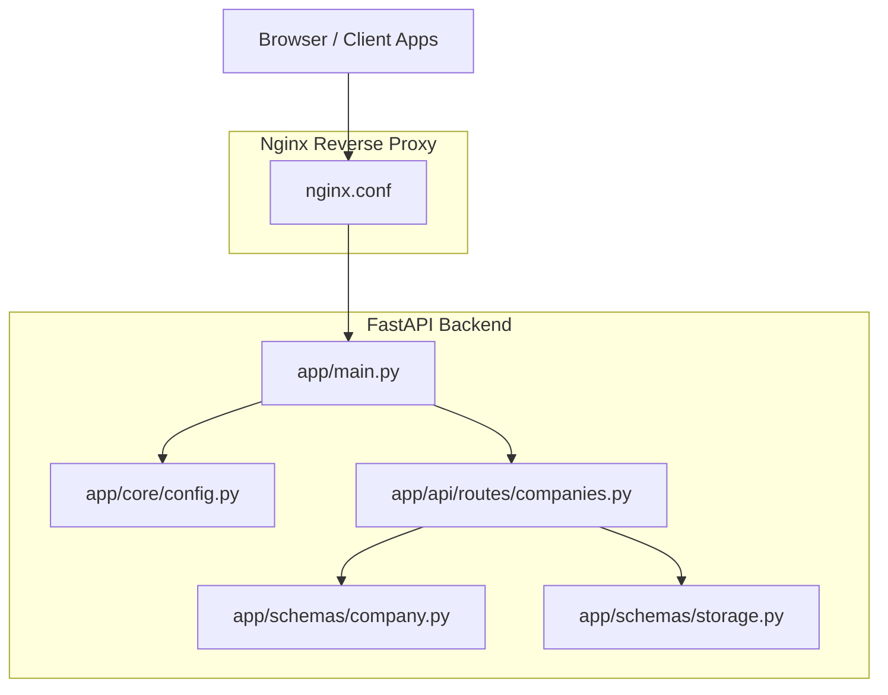
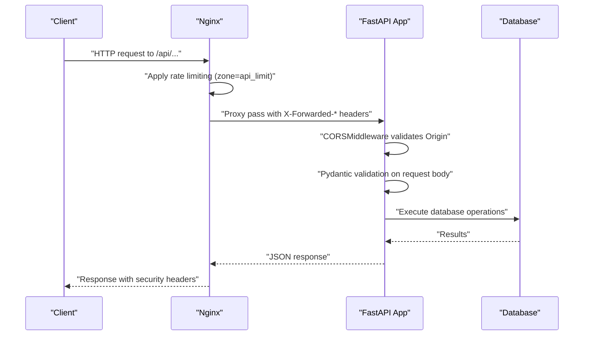
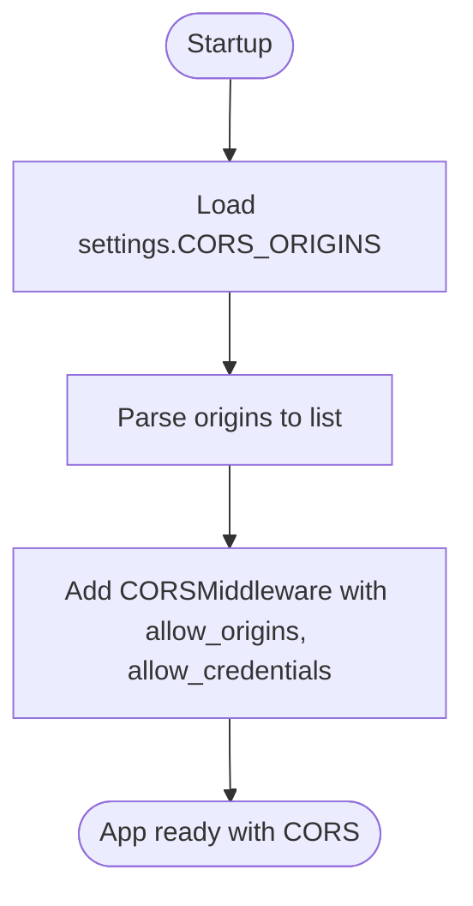
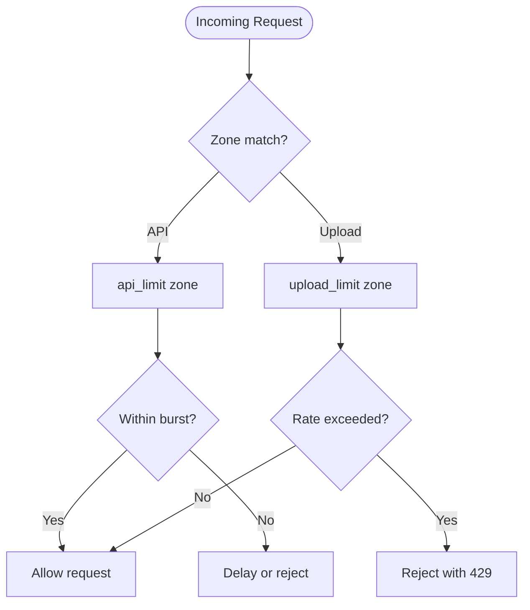
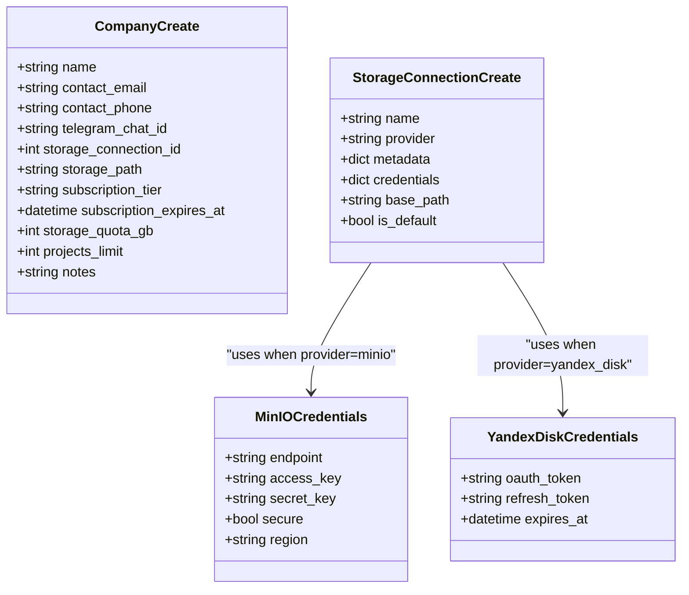
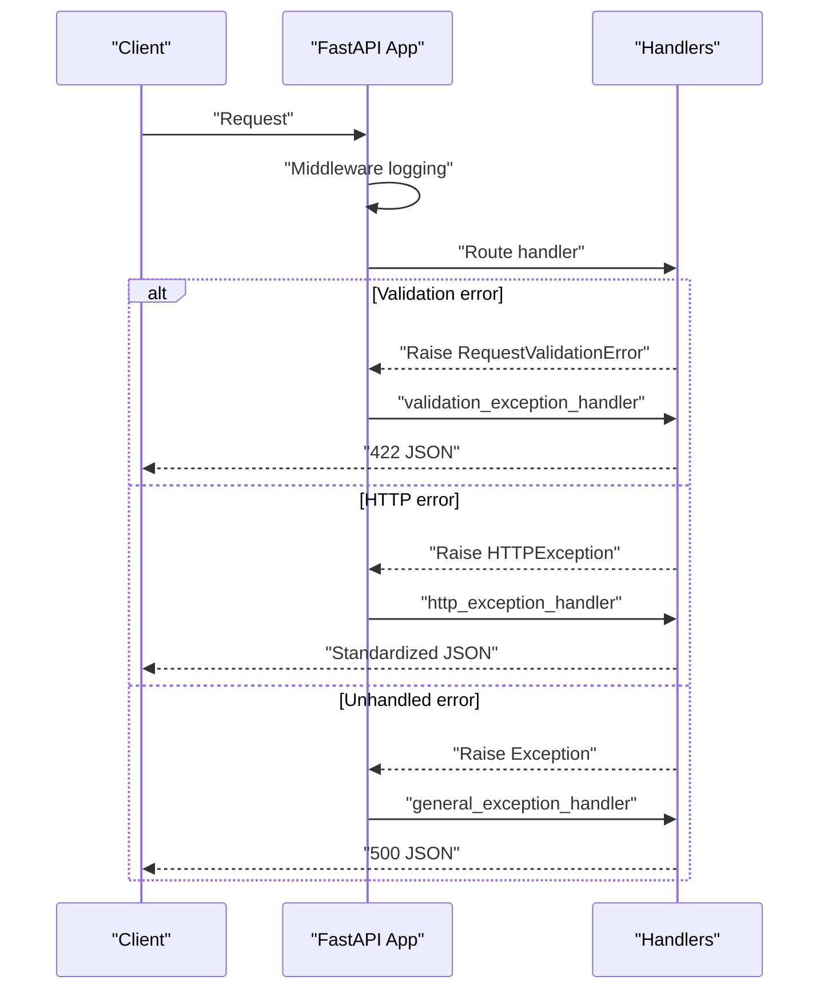
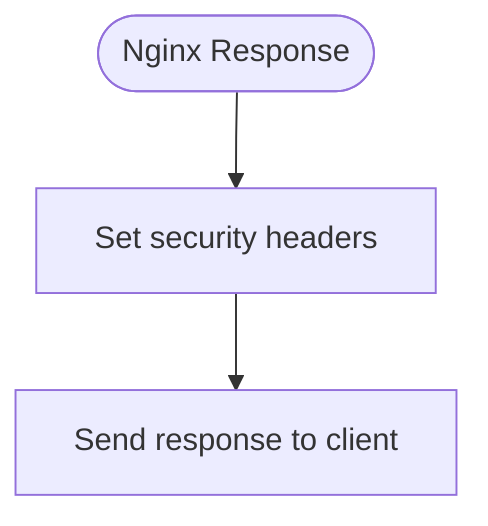
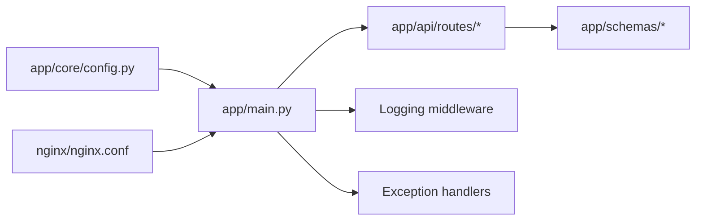

# API Security

<cite>
**Referenced Files in This Document**
- [app/main.py](file://app/main.py)
- [app/core/config.py](file://app/core/config.py)
- [nginx/nginx.conf](file://nginx/nginx.conf)
- [app/schemas/company.py](file://app/schemas/company.py)
- [app/schemas/storage.py](file://app/schemas/storage.py)
- [app/api/routes/companies.py](file://app/api/routes/companies.py)
- [README.md](file://README.md)
</cite>

## Table of Contents
1. [Introduction](#introduction)
2. [Project Structure](#project-structure)
3. [Core Components](#core-components)
4. [Architecture Overview](#architecture-overview)
5. [Detailed Component Analysis](#detailed-component-analysis)
6. [Dependency Analysis](#dependency-analysis)
7. [Performance Considerations](#performance-considerations)
8. [Troubleshooting Guide](#troubleshooting-guide)
9. [Conclusion](#conclusion)

## Introduction
This document explains the API security posture of the ARV platform, focusing on:
- Cross-Origin Resource Sharing (CORS) configuration via FastAPI’s CORSMiddleware and the CORS_ORIGINS setting
- Rate limiting enforced at the Nginx layer for API and upload endpoints
- Input validation using Pydantic models and automatic request validation with centralized error handling
- Secure HTTP headers set in Nginx to mitigate common web vulnerabilities
- Middleware setup and exception handling in the FastAPI application
- Common CORS misconfigurations and debugging tips
- Performance considerations for rate limiting thresholds and their impact on user experience

## Project Structure
Security-related components are distributed across the FastAPI application, configuration, and Nginx reverse proxy:
- FastAPI application initializes CORS, logging, and exception handlers
- Configuration loads CORS origins from environment variables and exposes parsed lists
- Nginx enforces rate limits and security headers, proxies API traffic to the backend
- Pydantic schemas define strict input validation for API payloads

**Diagram sources**
- [app/main.py](file://app/main.py#L95-L141)
- [app/core/config.py](file://app/core/config.py#L54-L66)
- [nginx/nginx.conf](file://nginx/nginx.conf#L54-L116)
- [app/schemas/company.py](file://app/schemas/company.py#L1-L68)
- [app/schemas/storage.py](file://app/schemas/storage.py#L1-L101)
- [app/api/routes/companies.py](file://app/api/routes/companies.py#L1-L137)

**Section sources**
- [README.md](file://README.md#L38-L58)
- [app/main.py](file://app/main.py#L95-L141)
- [app/core/config.py](file://app/core/config.py#L54-L66)
- [nginx/nginx.conf](file://nginx/nginx.conf#L54-L116)

## Core Components
- CORS middleware: Configured in the FastAPI app using settings.cors_origins_list and CORS_ALLOW_CREDENTIALS
- Rate limiting: Implemented in Nginx with separate zones for API and uploads
- Input validation: Pydantic models define field constraints and validators
- Exception handling: Centralized handlers for HTTP exceptions, validation errors, and unhandled exceptions
- Security headers: X-Content-Type-Options, X-XSS-Protection, X-Frame-Options, and Referrer-Policy set in Nginx

**Section sources**
- [app/main.py](file://app/main.py#L95-L141)
- [app/main.py](file://app/main.py#L144-L209)
- [app/core/config.py](file://app/core/config.py#L54-L66)
- [nginx/nginx.conf](file://nginx/nginx.conf#L33-L36)
- [nginx/nginx.conf](file://nginx/nginx.conf#L111-L116)

## Architecture Overview
The security architecture combines Nginx-layer protections with FastAPI-layer controls:

**Diagram sources**
- [nginx/nginx.conf](file://nginx/nginx.conf#L54-L116)
- [app/main.py](file://app/main.py#L95-L141)
- [app/main.py](file://app/main.py#L144-L209)
- [app/api/routes/companies.py](file://app/api/routes/companies.py#L1-L137)

## Detailed Component Analysis

### CORS Implementation
- Origins policy: Controlled by CORS_ORIGINS in configuration, parsed into a list and passed to CORSMiddleware
- Credentials: Allow credentials flag is configurable
- Headers/methods: Wildcard allow for headers and methods is enabled in middleware
- Flexibility: CORS_ORIGINS supports comma-separated values and is parsed into a list

**Diagram sources**
- [app/core/config.py](file://app/core/config.py#L54-L66)
- [app/core/config.py](file://app/core/config.py#L112-L126)
- [app/main.py](file://app/main.py#L95-L105)

**Section sources**
- [app/core/config.py](file://app/core/config.py#L54-L66)
- [app/core/config.py](file://app/core/config.py#L112-L126)
- [app/main.py](file://app/main.py#L95-L105)

### Rate Limiting at Nginx Layer
- Zones:
  - api_limit: 100 requests per minute per IP
  - upload_limit: 10 requests per minute per IP
- API endpoints: Apply api_limit with burst and nodelay
- Upload endpoints: Apply upload_limit (define upload endpoints in your routes to target them accordingly)
- Additional protections: Client max body size, timeouts, and gzip compression

**Diagram sources**
- [nginx/nginx.conf](file://nginx/nginx.conf#L33-L36)
- [nginx/nginx.conf](file://nginx/nginx.conf#L54-L68)

**Section sources**
- [nginx/nginx.conf](file://nginx/nginx.conf#L33-L36)
- [nginx/nginx.conf](file://nginx/nginx.conf#L54-L68)

### Input Validation with Pydantic
- Strict field constraints: Length bounds, numeric ranges, and required fields
- Email validation: Built-in email type enforcement
- Conditional validation: Provider-specific credential validation and base path requirements
- Automatic validation: FastAPI integrates Pydantic validation automatically; invalid requests trigger validation errors handled centrally

**Diagram sources**
- [app/schemas/company.py](file://app/schemas/company.py#L1-L68)
- [app/schemas/storage.py](file://app/schemas/storage.py#L1-L101)

**Section sources**
- [app/schemas/company.py](file://app/schemas/company.py#L1-L68)
- [app/schemas/storage.py](file://app/schemas/storage.py#L1-L101)
- [app/api/routes/companies.py](file://app/api/routes/companies.py#L1-L137)

### Exception Handling and Logging
- HTTP exceptions: Centralized handler logs warnings and returns standardized JSON
- Request validation errors: Centralized handler logs validation errors and returns 422 with structured details
- General exceptions: Centralized handler logs errors and returns 500
- Request logging middleware: Measures request duration and logs request/response metadata

**Diagram sources**
- [app/main.py](file://app/main.py#L144-L209)
- [app/main.py](file://app/main.py#L108-L141)

**Section sources**
- [app/main.py](file://app/main.py#L144-L209)
- [app/main.py](file://app/main.py#L108-L141)

### Secure HTTP Headers in Nginx
- X-Content-Type-Options: nosniff prevents MIME-type sniffing
- X-XSS-Protection: 1; mode=block enables XSS protection
- X-Frame-Options: SAMEORIGIN mitigates clickjacking
- Referrer-Policy: strict-origin-when-cross-origin controls referrer leakage
- These headers are applied globally in the server block

**Diagram sources**
- [nginx/nginx.conf](file://nginx/nginx.conf#L111-L116)

**Section sources**
- [nginx/nginx.conf](file://nginx/nginx.conf#L111-L116)

### Middleware Setup and Exception Handling Example Paths
- CORS middleware registration and configuration
  - [app/main.py](file://app/main.py#L95-L105)
- Request logging middleware
  - [app/main.py](file://app/main.py#L108-L141)
- HTTP exception handler
  - [app/main.py](file://app/main.py#L144-L164)
- Validation exception handler
  - [app/main.py](file://app/main.py#L167-L186)
- General exception handler
  - [app/main.py](file://app/main.py#L189-L209)

**Section sources**
- [app/main.py](file://app/main.py#L95-L105)
- [app/main.py](file://app/main.py#L108-L141)
- [app/main.py](file://app/main.py#L144-L209)

## Dependency Analysis
- CORS depends on configuration parsing and settings exposure
- Nginx rate limiting depends on request routing and zones
- Pydantic validation depends on route handlers and schemas
- Exception handling depends on FastAPI’s exception system and logging

**Diagram sources**
- [app/core/config.py](file://app/core/config.py#L54-L66)
- [app/main.py](file://app/main.py#L95-L141)
- [nginx/nginx.conf](file://nginx/nginx.conf#L54-L116)

**Section sources**
- [app/core/config.py](file://app/core/config.py#L54-L66)
- [app/main.py](file://app/main.py#L95-L141)
- [nginx/nginx.conf](file://nginx/nginx.conf#L54-L116)

## Performance Considerations
- Rate limiting thresholds:
  - API zone: 100r/m with burst=20 and nodelay allows short bursts while throttling sustained load
  - Upload zone: 10r/m targets file upload abuse while preserving usability
- Impact on user experience:
  - Lower rates reduce risk but increase chance of throttling under load
  - Higher rates improve throughput but increase vulnerability to abuse
- Recommendations:
  - Monitor request volumes and adjust zones per environment
  - Consider per-route zones if certain endpoints require stricter limits
  - Use burst judiciously to balance latency and throughput

[No sources needed since this section provides general guidance]

## Troubleshooting Guide
Common CORS misconfigurations and debugging tips:
- Symptom: Preflight requests blocked or credentials not allowed
  - Verify CORS_ORIGINS contains the exact origin used by the client
  - Ensure allow_credentials aligns with whether credentials are used
  - Confirm CORSMiddleware is registered before route handlers
  - Check that the client sends the appropriate Origin header
- Symptom: Unexpected 429 responses from Nginx
  - Inspect rate limiting zones and consider increasing thresholds for legitimate clients
  - Separate upload endpoints into upload_limit zone and tune accordingly
- Symptom: Validation errors on API requests
  - Review Pydantic schema constraints and ensure payloads meet field requirements
  - Use the standardized 422 response to identify problematic fields
- Logging and observability:
  - Inspect structured logs for http_request_started/http_request_completed entries
  - Review validation_error and http_exception logs for quick diagnosis

**Section sources**
- [app/core/config.py](file://app/core/config.py#L54-L66)
- [app/main.py](file://app/main.py#L95-L105)
- [app/main.py](file://app/main.py#L108-L141)
- [app/main.py](file://app/main.py#L167-L186)
- [nginx/nginx.conf](file://nginx/nginx.conf#L33-L36)

## Conclusion
The ARV platform employs layered security:
- Nginx enforces rate limiting and robust security headers
- FastAPI applies CORS, structured logging, and centralized exception handling
- Pydantic schemas enforce strict input validation
Together, these measures provide strong protection against common web threats while maintaining developer productivity and operational visibility.

[No sources needed since this section summarizes without analyzing specific files]