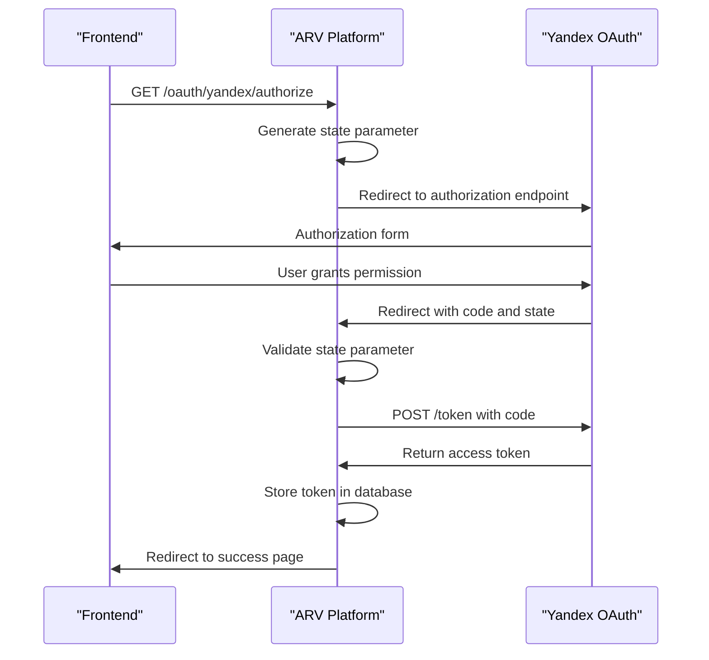

# Authentication Security

<cite>
**Referenced Files in This Document**   
- [config.py](file://app/core/config.py)
- [oauth.py](file://app/api/routes/oauth.py)
- [main.py](file://app/main.py)
</cite>

## Table of Contents
1. [Introduction](#introduction)
2. [JWT-Based Authentication](#jwt-based-authentication)
3. [OAuth 2.0 Integration with Yandex Disk](#oauth-20-integration-with-yandex-disk)
4. [Session Management and CSRF Protection](#session-management-and-csrf-protection)
5. [FastAPI Dependency System for Authentication Enforcement](#fastapi-dependency-system-for-authentication-enforcement)
6. [Common Issues and Troubleshooting](#common-issues-and-troubleshooting)
7. [Best Practices for Secret Rotation and Admin Security](#best-practices-for-secret-rotation-and-admin-security)

## Introduction
The ARV platform implements a robust authentication and authorization system to secure access to its resources. This document details the security mechanisms in place, focusing on JWT-based authentication, OAuth 2.0 integration with Yandex Disk, session management, and protection against common threats. The system leverages FastAPI's dependency injection to enforce authentication across protected routes, ensuring that only authorized users can access sensitive endpoints. Configuration settings in `config.py` play a crucial role in defining the security parameters, including token expiration, encryption algorithms, and default credentials.

**Section sources**
- [config.py](file://app/core/config.py#L49-L53)
- [oauth.py](file://app/api/routes/oauth.py#L1-L184)

## JWT-Based Authentication

The ARV platform uses JWT (JSON Web Tokens) for stateless authentication, allowing clients to securely authenticate and access protected resources. The JWT implementation relies on cryptographic signing using a secret key and a specified algorithm, with token expiration enforced to limit the validity period of issued tokens.

Key configuration parameters from `config.py`:
- `SECRET_KEY`: A 32-character minimum secret used to sign JWT tokens. This must be changed from the default value in production.
- `ALGORITHM`: The cryptographic algorithm used for signing tokens, set to HS256 (HMAC with SHA-256).
- `ACCESS_TOKEN_EXPIRE_MINUTES`: Token expiration time set to 1440 minutes (24 hours).

The JWT authentication flow follows standard practices:
1. Upon successful login, the server generates a signed JWT token containing user claims
2. The token is returned to the client for storage (typically in HTTP-only cookies or secure local storage)
3. For subsequent requests, the client includes the token in the Authorization header
4. The server verifies the token signature and checks expiration before granting access

This approach provides a secure, scalable authentication mechanism that does not require server-side session storage.

**Section sources**
- [config.py](file://app/core/config.py#L49-L53)

## OAuth 2.0 Integration with Yandex Disk

The ARV platform integrates with Yandex Disk using OAuth 2.0 for secure third-party authentication and authorization. This integration allows users to connect their Yandex Disk accounts to store and manage AR content without exposing their credentials to the platform.

The OAuth 2.0 implementation follows the authorization code flow:
1. The client initiates authorization by calling the `/oauth/yandex/authorize` endpoint
2. The server generates a cryptographically secure `state` parameter and redirects the user to Yandex's authorization endpoint
3. After user consent, Yandex redirects back to the platform's callback URL with an authorization code
4. The platform exchanges the authorization code for an access token by making a server-to-server request to Yandex's token endpoint

Critical security parameters from `config.py`:
- `YANDEX_OAUTH_CLIENT_ID`: Client identifier for the OAuth application
- `YANDEX_OAUTH_CLIENT_SECRET`: Client secret for authenticating the application
- `YANDEX_OAUTH_REDIRECT_URI`: Callback URL where Yandex returns the authorization code

The implementation includes several security measures:
- State parameter validation to prevent CSRF attacks
- Server-side token exchange to protect the authorization code
- Secure storage of OAuth tokens in the database
- Use of HTTPS for all communication



**Diagram sources**
- [oauth.py](file://app/api/routes/oauth.py#L19-L106)
- [config.py](file://app/core/config.py#L74-L76)

**Section sources**
- [oauth.py](file://app/api/routes/oauth.py#L19-L106)
- [config.py](file://app/core/config.py#L74-L76)

## Session Management and CSRF Protection

The ARV platform implements secure session management practices to protect against common web vulnerabilities such as CSRF (Cross-Site Request Forgery) and session fixation attacks.

For OAuth integration, the platform uses a temporary in-memory store (`oauth_states`) to track pending authorization requests. Each authorization request is associated with a cryptographically secure random `state` parameter generated using `secrets.token_urlsafe(32)`. This state parameter serves as a CSRF token, ensuring that the callback request is associated with a legitimate authorization request initiated by the platform.

The CSRF protection workflow:
1. When initiating OAuth authorization, the server generates a unique state parameter
2. The state parameter is stored server-side with metadata about the request
3. The state parameter is included in the redirect to Yandex
4. Upon callback, the server validates that the received state parameter exists in its store
5. If valid, the state is removed from the store and processing continues
6. If invalid or missing, the request is rejected with a 400 error

This approach prevents attackers from forging authorization callbacks, as they cannot predict or access the randomly generated state parameters.

The current implementation uses an in-memory dictionary for state storage, which is suitable for single-instance deployments. In production environments with multiple instances or need for persistence, this should be replaced with a distributed cache like Redis to ensure state parameters are accessible across all instances.

**Section sources**
- [oauth.py](file://app/api/routes/oauth.py#L17-L54)

## FastAPI Dependency System for Authentication Enforcement

The ARV platform leverages FastAPI's dependency injection system to enforce authentication across protected routes. While the specific authentication dependency is not visible in the provided code (likely in a commented or separate auth module), the pattern follows FastAPI best practices for securing endpoints.

The dependency system allows for:
- Centralized authentication logic that can be reused across multiple routes
- Automatic validation of JWT tokens on protected endpoints
- Extraction of user information from validated tokens
- Role-based access control through additional dependency checks

Protected routes would typically use the `Depends()` function to require authentication, for example:
```python
@router.get("/protected")
async def protected_route(current_user: User = Depends(get_current_user)):
    return {"message": "This is protected"}
```

The `get_current_user` dependency would handle token validation, expiration checking, and user retrieval from the database. This approach ensures consistent authentication enforcement while keeping route handlers focused on business logic.

The platform also uses dependency injection for database access (`get_db`), demonstrating the pattern that would be applied to authentication dependencies.

**Section sources**
- [main.py](file://app/main.py#L30-L45)
- [oauth.py](file://app/api/routes/oauth.py#L45)

## Common Issues and Troubleshooting

Several common issues may arise with the authentication system, particularly related to configuration and OAuth integration.

### Expired Tokens
When JWT tokens expire after 24 hours (as configured), clients will receive authentication errors. The troubleshooting steps include:
- Implement token refresh mechanisms in the client application
- Ensure proper handling of 401 Unauthorized responses
- Consider adjusting `ACCESS_TOKEN_EXPIRE_MINUTES` based on security requirements
- Implement graceful re-authentication flows

### Misconfigured OAuth Applications
Issues with Yandex Disk integration often stem from incorrect OAuth configuration:
- Verify `YANDEX_OAUTH_CLIENT_ID` and `YANDEX_OAUTH_CLIENT_SECRET` match the registered application
- Ensure `YANDEX_OAUTH_REDIRECT_URI` exactly matches the callback URL registered with Yandex
- Check that the OAuth application has the necessary permissions for Yandex Disk
- Validate that the redirect URI uses HTTPS in production environments

### Invalid State Parameters
The error "Invalid state parameter" indicates a CSRF protection trigger:
- Ensure the state parameter is preserved throughout the OAuth flow
- Check for session expiration between authorization initiation and callback
- Verify server clock synchronization if using time-based validation
- In multi-instance deployments, ensure shared state storage (e.g., Redis)

### Database Connection Issues
OAuth token storage relies on database connectivity:
- Verify database connection settings in `DATABASE_URL`
- Check that the `storage_connections` table exists and is writable
- Monitor database connection pool settings (`DB_POOL_SIZE`, `DB_MAX_OVERFLOW`)

**Section sources**
- [config.py](file://app/core/config.py#L52)
- [oauth.py](file://app/api/routes/oauth.py#L50-L53)

## Best Practices for Secret Rotation and Admin Security

Proper management of secrets and admin accounts is critical for maintaining platform security.

### Secret Rotation
The platform uses several sensitive secrets that should be rotated regularly:
- `SECRET_KEY`: Should be rotated periodically and immediately if compromised
- `YANDEX_OAUTH_CLIENT_SECRET`: Can be regenerated in the Yandex developer console
- Database and storage credentials: Should follow organizational rotation policies

Rotation procedures:
1. Generate new secrets using cryptographically secure random generators
2. Update configuration files or environment variables
3. Restart services to load new secrets
4. Regenerate any tokens or credentials derived from the old secrets
5. Monitor for authentication issues post-rotation

### Admin Account Security
The default admin credentials present a significant security risk:
- `ADMIN_DEFAULT_PASSWORD`: Set to "ChangeMe123!" by default and must be changed immediately
- `ADMIN_EMAIL`: Default admin email address

Security recommendations:
- Change the default admin password during initial setup
- Implement multi-factor authentication for admin accounts
- Use strong, unique passwords following complexity requirements
- Limit admin account usage to essential operations
- Monitor admin account activity for suspicious behavior

The presence of default credentials in configuration files highlights the importance of proper environment management. Production deployments should use environment-specific configuration files with secrets stored in secure vaults or environment variables, rather than in code repositories.

**Section sources**
- [config.py](file://app/core/config.py#L50-L52)
- [config.py](file://app/core/config.py#L92)