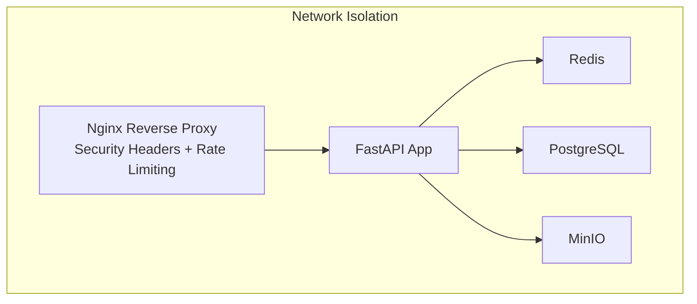
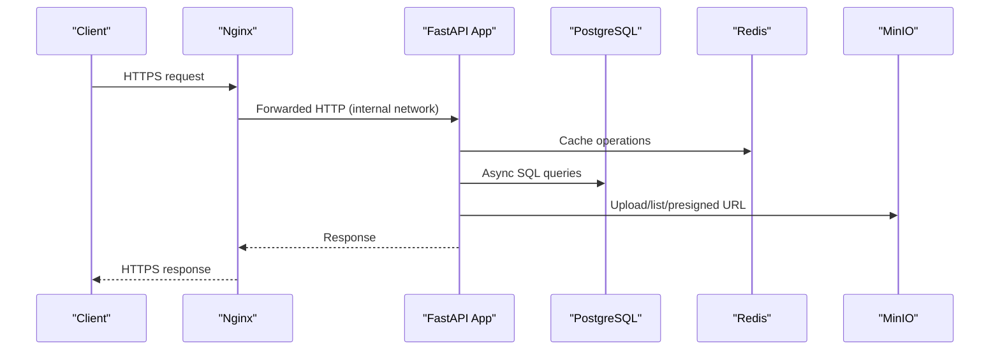
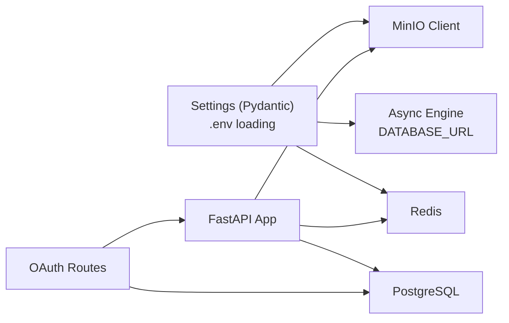

# Data Protection

<cite>
**Referenced Files in This Document**
- [app/core/config.py](file://app/core/config.py)
- [app/core/database.py](file://app/core/database.py)
- [app/core/storage.py](file://app/core/storage.py)
- [app/models/storage.py](file://app/models/storage.py)
- [app/api/routes/oauth.py](file://app/api/routes/oauth.py)
- [app/main.py](file://app/main.py)
- [docker-compose.yml](file://docker-compose.yml)
- [docker-compose.override.yml](file://docker-compose.override.yml)
- [.env.example](file://.env.example)
- [Dockerfile](file://Dockerfile)
- [nginx/nginx.conf](file://nginx/nginx.conf)
- [alembic.ini](file://alembic.ini)
</cite>

## Table of Contents
1. [Introduction](#introduction)
2. [Project Structure](#project-structure)
3. [Core Components](#core-components)
4. [Architecture Overview](#architecture-overview)
5. [Detailed Component Analysis](#detailed-component-analysis)
6. [Dependency Analysis](#dependency-analysis)
7. [Performance Considerations](#performance-considerations)
8. [Troubleshooting Guide](#troubleshooting-guide)
9. [Conclusion](#conclusion)
10. [Appendices](#appendices)

## Introduction
This section documents data protection practices across the ARV platform, focusing on encryption at rest and in transit, secure storage backends, credential management, access controls, and compliance considerations. It synthesizes configuration and runtime behaviors from the codebase to provide actionable guidance for production hardening.

## Project Structure
The platform is composed of:
- FastAPI application with structured logging and CORS middleware
- PostgreSQL database with async SQLAlchemy engine
- Redis for caching and Celery broker
- MinIO object storage with optional public URLs and pre-signed URLs
- Nginx reverse proxy with security headers and rate limiting
- Docker Compose networking and service isolation
- Environment-driven configuration via .env and Pydantic settings

**Diagram sources**
- [docker-compose.yml](file://docker-compose.yml#L1-L200)
- [nginx/nginx.conf](file://nginx/nginx.conf#L1-L118)
- [app/main.py](file://app/main.py#L95-L141)

**Section sources**
- [docker-compose.yml](file://docker-compose.yml#L1-L200)
- [nginx/nginx.conf](file://nginx/nginx.conf#L1-L118)
- [app/main.py](file://app/main.py#L95-L141)

## Core Components
- Configuration and Secrets Management
  - Centralized settings via Pydantic BaseSettings with .env loading
  - Sensitive fields marked with Field defaults and validators
  - Environment variables injected via Docker Compose and .env.example
- Database Layer
  - Async SQLAlchemy engine configured from DATABASE_URL
  - Pool sizing and connection recycling for reliability
- Storage Backends
  - Local filesystem storage seeding
  - MinIO client with bucket creation and public read policy
  - Presigned URLs for controlled access
- Authentication and Session Handling
  - OAuth with state parameter for CSRF protection
  - Credentials stored in database JSONB column
- Transport Security
  - Nginx terminating TLS and enforcing security headers
  - Internal Docker networking for service-to-service communication

**Section sources**
- [app/core/config.py](file://app/core/config.py#L1-L134)
- [app/core/database.py](file://app/core/database.py#L1-L103)
- [app/core/storage.py](file://app/core/storage.py#L1-L71)
- [app/models/storage.py](file://app/models/storage.py#L1-L81)
- [app/api/routes/oauth.py](file://app/api/routes/oauth.py#L1-L184)
- [docker-compose.yml](file://docker-compose.yml#L1-L200)
- [.env.example](file://.env.example#L1-L71)

## Architecture Overview
The platform employs layered protections:
- In-transit: Nginx terminates TLS and forwards to FastAPI; internal Docker networks isolate services
- At-rest: PostgreSQL data at rest; MinIO buckets; local storage directories
- Secrets: Environment variables loaded via .env and Pydantic settings
- Access control: OAuth state parameter and CORS configuration

**Diagram sources**
- [docker-compose.yml](file://docker-compose.yml#L1-L200)
- [nginx/nginx.conf](file://nginx/nginx.conf#L54-L117)
- [app/main.py](file://app/main.py#L95-L141)

## Detailed Component Analysis

### Encryption at Rest
- PostgreSQL
  - Database URL is configured from environment variables and used to create an async SQLAlchemy engine. While the engine configuration does not explicitly enable encryption-at-rest, the platform relies on the database server’s native capabilities. The repository does not include explicit encryption-at-rest configuration in the database layer.
  - Alembic configuration references a default database URL for migrations, indicating environment-driven configuration rather than hardcoded values.
- MinIO
  - MinIO is configured with endpoint, access key, and secret key. The code demonstrates bucket creation and public read policy. There is no explicit mention of server-side encryption configuration in the codebase.
- Local Storage
  - Local storage seeding creates directories under a configurable base path. Permissions and encryption are not enforced by the codebase.

Mitigation and best practices:
- Enable database encryption at rest via PostgreSQL server configuration and OS-level encryption.
- Enable server-side encryption for MinIO buckets and enforce least-privilege policies.
- Apply filesystem-level encryption for local storage directories and restrict OS-level permissions.

**Section sources**
- [app/core/database.py](file://app/core/database.py#L1-L103)
- [alembic.ini](file://alembic.ini#L59-L60)
- [app/core/storage.py](file://app/core/storage.py#L1-L71)
- [app/core/config.py](file://app/core/config.py#L38-L44)

### Encryption in Transit
- TLS Termination and Security Headers
  - Nginx terminates TLS and applies security headers (frame options, content type options, XSS protection, referrer policy). It also enforces rate limits for API and uploads.
- Internal Networking
  - Services communicate over internal Docker networks, reducing exposure to external networks.

Mitigation and best practices:
- Enforce HTTPS everywhere; ensure TLS termination occurs at the edge proxy.
- Use strong TLS ciphers and protocols; regularly rotate certificates.
- Maintain strict internal network segmentation and avoid exposing internal ports externally.

**Section sources**
- [nginx/nginx.conf](file://nginx/nginx.conf#L54-L117)
- [docker-compose.yml](file://docker-compose.yml#L1-L200)

### Secure Storage Backends
- Local Storage
  - The application seeds default storage connections and ensures base directories exist. No encryption is enforced by the codebase.
- MinIO
  - The MinIO client initializes with endpoint, access key, secret key, and secure flag. Buckets are ensured and public read policy is set. Presigned URLs are generated for controlled access.
- Yandex Disk
  - OAuth flow stores tokens in the database JSONB column. The code comments note that credentials could be replaced with a KMS or secret vault.

Mitigation and best practices:
- Prefer encrypted transport to MinIO and enforce bucket policies minimizing public exposure.
- Use presigned URLs with short expiration windows for temporary access.
- Store OAuth tokens securely; consider rotating tokens and using secret managers for production.

**Section sources**
- [app/core/storage.py](file://app/core/storage.py#L1-L71)
- [app/models/storage.py](file://app/models/storage.py#L1-L81)
- [app/api/routes/oauth.py](file://app/api/routes/oauth.py#L1-L184)

### Credential Management
- Environment Variables and .env
  - Settings are loaded from .env with Pydantic BaseSettings. Sensitive fields include SECRET_KEY, database credentials, MinIO credentials, and third-party API keys.
- Docker Compose
  - Services receive environment variables via env_file and explicit environment blocks. The application sets DATABASE_URL and Redis URLs pointing to internal service names.
- Pydantic Field Usage
  - Sensitive settings are declared with Field defaults to prevent accidental exposure in code. Validators and parsing helpers ensure safe configuration handling.

Common pitfalls and mitigations:
- Hardcoded secrets in code: Avoid committing secrets to version control; rely on .env and environment injection.
- Weak SECRET_KEY: Replace default keys with strong random values.
- Exposed environment variables: Restrict access to .env and Docker secrets; avoid printing sensitive values.

**Section sources**
- [app/core/config.py](file://app/core/config.py#L1-L134)
- [.env.example](file://.env.example#L1-L71)
- [docker-compose.yml](file://docker-compose.yml#L61-L75)
- [docker-compose.override.yml](file://docker-compose.override.yml#L1-L32)

### Data Access Controls and Secure Sessions
- OAuth CSRF Protection
  - The OAuth route generates a random state parameter and validates it on callback, preventing CSRF attacks.
- CORS Configuration
  - CORS middleware is configured with allowed origins and credentials support. Origins are parsed from a comma-separated string.
- Session Handling
  - The codebase does not implement explicit session cookies or JWT-based sessions. Authentication relies on OAuth flows and third-party tokens stored in the database.

Best practices:
- Enforce CSRF protection for all state-changing endpoints.
- Configure CORS strictly to trusted origins.
- For future session-based authentication, use secure, HttpOnly, SameSite cookies and consider rotating session identifiers.

**Section sources**
- [app/api/routes/oauth.py](file://app/api/routes/oauth.py#L1-L184)
- [app/main.py](file://app/main.py#L95-L141)
- [app/core/config.py](file://app/core/config.py#L112-L126)

### Compliance Considerations
- Data Privacy
  - OAuth tokens and credentials are stored in the database. Consider encrypting sensitive JSONB fields and applying access logs with minimal retention.
- Least Privilege
  - MinIO public read policy should be minimized; prefer presigned URLs and private buckets with controlled access.
- Auditability
  - Structured logging is enabled; ensure logs do not contain sensitive data and retain logs per policy.

[No sources needed since this section provides general guidance]

## Dependency Analysis
The following diagram maps key dependencies among configuration, database, storage, and routing components.

**Diagram sources**
- [app/core/config.py](file://app/core/config.py#L1-L134)
- [app/core/database.py](file://app/core/database.py#L1-L103)
- [app/core/storage.py](file://app/core/storage.py#L1-L71)
- [app/api/routes/oauth.py](file://app/api/routes/oauth.py#L1-L184)
- [app/main.py](file://app/main.py#L95-L141)

**Section sources**
- [app/core/config.py](file://app/core/config.py#L1-L134)
- [app/core/database.py](file://app/core/database.py#L1-L103)
- [app/core/storage.py](file://app/core/storage.py#L1-L71)
- [app/api/routes/oauth.py](file://app/api/routes/oauth.py#L1-L184)
- [app/main.py](file://app/main.py#L95-L141)

## Performance Considerations
- Database pooling and connection lifecycle are configured to improve throughput and reduce connection churn.
- Nginx rate limiting protects backend services from abuse while maintaining responsiveness.
- MinIO presigned URLs shift load off the application for public downloads.

[No sources needed since this section provides general guidance]

## Troubleshooting Guide
- Database connectivity failures
  - Verify DATABASE_URL and service health checks in Docker Compose.
  - Confirm PostgreSQL credentials and network reachability.
- MinIO access denied
  - Check endpoint, access key, secret key, and bucket existence.
  - Ensure secure flag aligns with TLS configuration.
- OAuth callback errors
  - Validate state parameter handling and client credentials.
  - Confirm redirect URI matches configuration.
- CORS issues
  - Ensure allowed origins match frontend hostnames and credentials are enabled when needed.

**Section sources**
- [docker-compose.yml](file://docker-compose.yml#L1-L200)
- [app/core/storage.py](file://app/core/storage.py#L1-L71)
- [app/api/routes/oauth.py](file://app/api/routes/oauth.py#L1-L184)
- [app/main.py](file://app/main.py#L95-L141)

## Conclusion
The ARV platform implements layered data protection through environment-driven configuration, internal networking, and transport security. Production readiness requires enabling database and object storage encryption at rest, tightening MinIO policies, and adopting secret managers for sensitive values. OAuth CSRF protection and CORS configuration provide foundational access control, while structured logging and rate limiting enhance operational security.

[No sources needed since this section summarizes without analyzing specific files]

## Appendices

### Practical Examples from the Codebase
- Pydantic Field for sensitive settings
  - Sensitive fields are declared with Field defaults to avoid hardcoded values in code.
  - Example reference: [app/core/config.py](file://app/core/config.py#L50-L53)
- Docker Compose internal networking
  - Services communicate over internal networks; environment variables point to internal service names.
  - Example reference: [docker-compose.yml](file://docker-compose.yml#L61-L75)
- OAuth state parameter for CSRF protection
  - Random state is generated and validated on callback.
  - Example reference: [app/api/routes/oauth.py](file://app/api/routes/oauth.py#L19-L40)

**Section sources**
- [app/core/config.py](file://app/core/config.py#L50-L53)
- [docker-compose.yml](file://docker-compose.yml#L61-L75)
- [app/api/routes/oauth.py](file://app/api/routes/oauth.py#L19-L40)