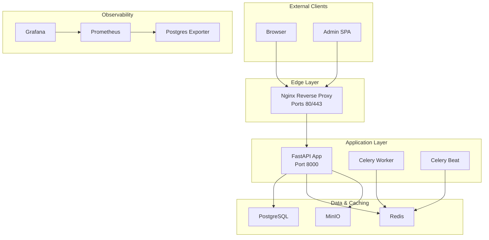
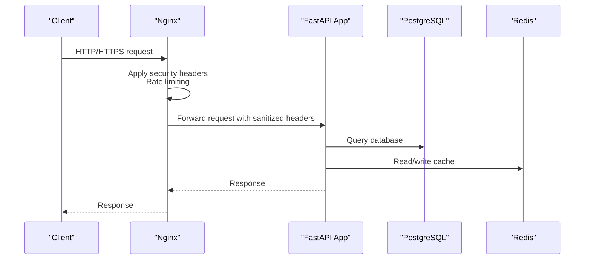
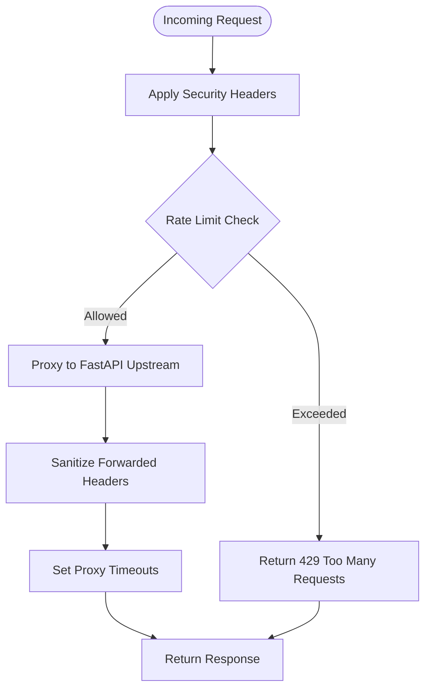
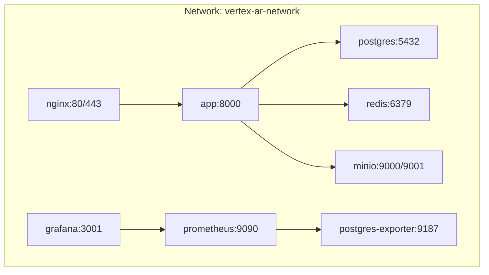
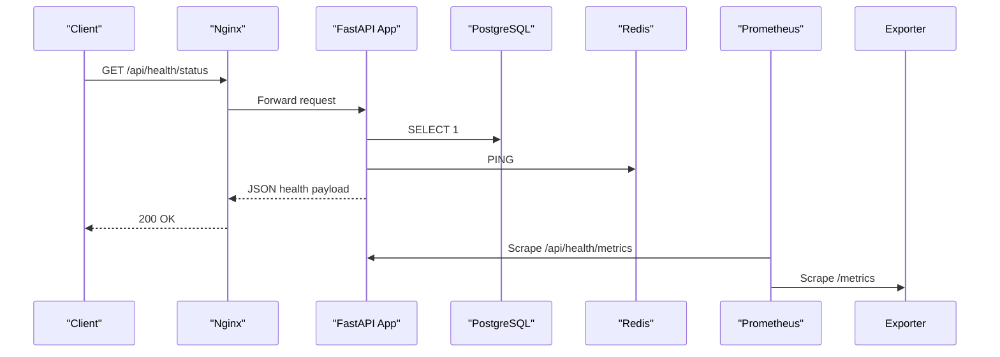
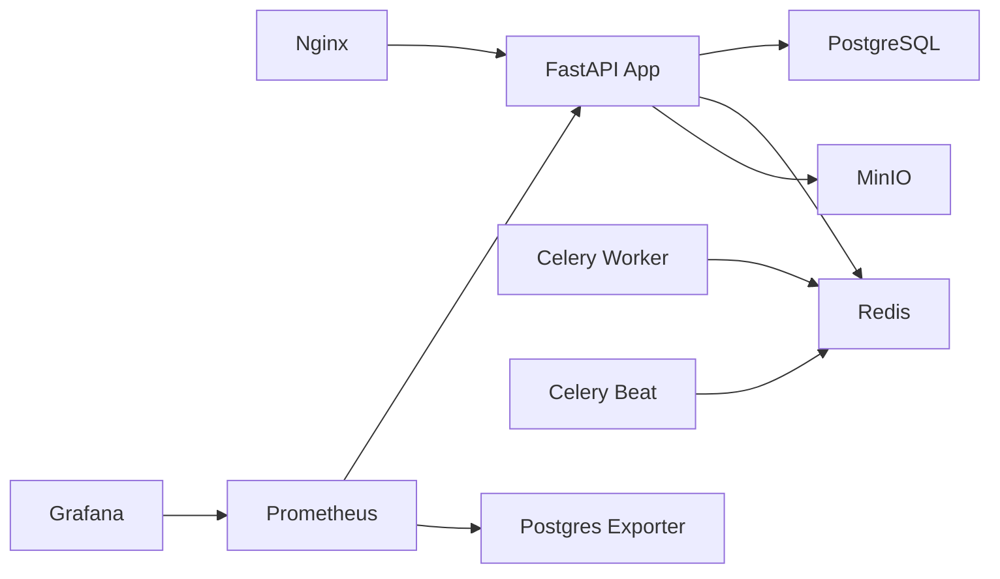

# Infrastructure Security

<cite>
**Referenced Files in This Document**
- [nginx.conf](file://nginx/nginx.conf)
- [docker-compose.yml](file://docker-compose.yml)
- [docker-compose.override.yml](file://docker-compose.override.yml)
- [Dockerfile](file://Dockerfile)
- [app/main.py](file://app/main.py)
- [app/api/routes/health.py](file://app/api/routes/health.py)
- [app/core/config.py](file://app/core/config.py)
- [prometheus.yml](file://prometheus/prometheus.yml)
- [alert.rules.yml](file://prometheus/alert.rules.yml)
</cite>

## Table of Contents
1. [Introduction](#introduction)
2. [Project Structure](#project-structure)
3. [Core Components](#core-components)
4. [Architecture Overview](#architecture-overview)
5. [Detailed Component Analysis](#detailed-component-analysis)
6. [Dependency Analysis](#dependency-analysis)
7. [Performance Considerations](#performance-considerations)
8. [Troubleshooting Guide](#troubleshooting-guide)
9. [Conclusion](#conclusion)
10. [Appendices](#appendices)

## Introduction
This document describes the infrastructure-level security posture of the ARV platform. It focuses on the Nginx reverse proxy configuration, Docker Compose network isolation, container security practices, health checks, logging and monitoring, and production considerations such as HTTPS and firewall exposure.

## Project Structure
The platform consists of:
- Nginx reverse proxy serving HTTP/HTTPS, enforcing security headers, rate limiting, and forwarding requests to the FastAPI application.
- FastAPI application with structured logging, CORS configuration, and health/metrics endpoints.
- PostgreSQL and Redis services with health checks.
- Prometheus/Grafana stack for monitoring and alerting.
- Celery workers and scheduler for background tasks.
- Optional MinIO for object storage.

**Diagram sources**
- [docker-compose.yml](file://docker-compose.yml#L1-L254)
- [nginx.conf](file://nginx/nginx.conf#L1-L118)
- [app/main.py](file://app/main.py#L81-L142)

**Section sources**
- [docker-compose.yml](file://docker-compose.yml#L1-L254)
- [nginx.conf](file://nginx/nginx.conf#L1-L118)

## Core Components
- Nginx reverse proxy: Enforces security headers, rate limits, forwards requests to FastAPI, and serves static assets.
- FastAPI application: Structured logging, CORS, health/metrics endpoints, and request logging middleware.
- PostgreSQL and Redis: Health-checked services with internal-only exposure.
- Prometheus/Grafana: Metrics scraping and alerting rules.
- Celery: Background task processing with queues and scheduling.

**Section sources**
- [nginx.conf](file://nginx/nginx.conf#L1-L118)
- [app/main.py](file://app/main.py#L81-L142)
- [app/api/routes/health.py](file://app/api/routes/health.py#L1-L139)
- [docker-compose.yml](file://docker-compose.yml#L1-L254)
- [prometheus.yml](file://prometheus/prometheus.yml#L1-L15)
- [alert.rules.yml](file://prometheus/alert.rules.yml#L1-L23)

## Architecture Overview
Traffic flows from external clients to Nginx on ports 80/443, which forwards to FastAPI on port 8000. Internal services communicate over a dedicated Docker network. Observability is achieved via Prometheus scraping and Grafana dashboards.

**Diagram sources**
- [nginx.conf](file://nginx/nginx.conf#L42-L116)
- [app/main.py](file://app/main.py#L81-L142)
- [docker-compose.yml](file://docker-compose.yml#L61-L93)

## Detailed Component Analysis

### Nginx Reverse Proxy Security Configuration
- Security headers enforced:
  - X-Frame-Options
  - X-Content-Type-Options
  - X-XSS-Protection
  - Referrer-Policy
- Rate limiting zones:
  - API zone with moderate rate for general API endpoints.
  - Upload zone with lower rate for upload-heavy endpoints.
- Request forwarding:
  - Proxies to FastAPI upstream with sanitized headers:
    - Host, X-Real-IP, X-Forwarded-For, X-Forwarded-Proto.
  - Timeouts configured for connect/send/read.
- Static assets served with caching and CORS header for storage paths.
- Health check endpoint exposed at /health returning plain text.

**Diagram sources**
- [nginx.conf](file://nginx/nginx.conf#L33-L116)

**Section sources**
- [nginx.conf](file://nginx/nginx.conf#L33-L116)

### Docker Compose Network Isolation
- Dedicated bridge network named vertex-ar-network is used for all services.
- Services are isolated from each other and the host by default.
- Ports exposed externally:
  - Nginx: 80/tcp and 443/tcp.
  - PostgreSQL: 5432/tcp (development override exposes locally).
  - Redis: 6379/tcp (development override exposes locally).
  - MinIO: 9000/tcp and 9001/tcp (development override exposes locally).
  - Prometheus: 9090/tcp.
  - Grafana: 3001/tcp.
- Health checks:
  - PostgreSQL: pg_isready check.
  - Redis: redis-cli ping.
  - FastAPI: HTTP GET to /api/health/status.

**Diagram sources**
- [docker-compose.yml](file://docker-compose.yml#L1-L254)

**Section sources**
- [docker-compose.yml](file://docker-compose.yml#L1-L254)

### Container Security Practices
- Non-root user:
  - FastAPI and Celery services run as user:group 1000:1000.
  - Dockerfile creates a non-root user and switches to it.
- Read-only mounts:
  - Nginx HTML and storage directories mounted read-only.
  - Prometheus multiprocess directory mounted read-only.
- Development override enables source code hot reload and debug logging.

**Section sources**
- [Dockerfile](file://Dockerfile#L9-L10)
- [Dockerfile](file://Dockerfile#L41-L43)
- [docker-compose.yml](file://docker-compose.yml#L94-L94)
- [docker-compose.yml](file://docker-compose.yml#L120-L120)
- [docker-compose.yml](file://docker-compose.yml#L159-L162)
- [docker-compose.yml](file://docker-compose.yml#L175-L177)
- [docker-compose.override.yml](file://docker-compose.override.yml#L1-L32)

### Health Checks and Observability
- Application health endpoint:
  - FastAPI includes a health router with status and metrics endpoints.
  - Prometheus metrics endpoint exposed at /api/health/metrics.
- Prometheus configuration:
  - Scrapes app:8000 for /api/health/metrics.
  - Scrapes postgres-exporter:9187 for database metrics.
- Alert rules:
  - High API response time p95 threshold.
  - Celery queue backlog threshold.
  - PostgreSQL connection count threshold.

**Diagram sources**
- [app/api/routes/health.py](file://app/api/routes/health.py#L36-L119)
- [app/api/routes/health.py](file://app/api/routes/health.py#L122-L139)
- [prometheus.yml](file://prometheus/prometheus.yml#L8-L12)
- [docker-compose.yml](file://docker-compose.yml#L142-L154)

**Section sources**
- [app/api/routes/health.py](file://app/api/routes/health.py#L36-L119)
- [app/api/routes/health.py](file://app/api/routes/health.py#L122-L139)
- [prometheus.yml](file://prometheus/prometheus.yml#L1-L15)
- [alert.rules.yml](file://prometheus/alert.rules.yml#L1-L23)
- [docker-compose.yml](file://docker-compose.yml#L17-L22)
- [docker-compose.yml](file://docker-compose.yml#L34-L40)
- [docker-compose.yml](file://docker-compose.yml#L81-L86)

### Logging and Structured Logging
- Nginx:
  - Access and error logs configured with a custom format.
- FastAPI:
  - Structured logging via structlog with JSON renderer in production and console renderer in development.
  - Request logging middleware records method, path, client host, and response duration.
  - Centralized exception handlers produce structured error responses.

**Section sources**
- [nginx.conf](file://nginx/nginx.conf#L9-L16)
- [app/main.py](file://app/main.py#L19-L37)
- [app/main.py](file://app/main.py#L108-L142)
- [app/main.py](file://app/main.py#L144-L210)
- [docker-compose.override.yml](file://docker-compose.override.yml#L8-L13)

### Cross-Cutting Concerns
- CORS:
  - FastAPI CORS middleware configured with origins from settings.
- Secrets and configuration:
  - Environment variables loaded from .env; sensitive values should be managed securely in production.
- Monitoring:
  - Prometheus metrics endpoint and alert rules; Grafana dashboard available on port 3001.

**Section sources**
- [app/main.py](file://app/main.py#L98-L105)
- [app/core/config.py](file://app/core/config.py#L38-L44)
- [app/core/config.py](file://app/core/config.py#L55-L57)
- [docker-compose.yml](file://docker-compose.yml#L171-L195)

## Dependency Analysis
- Nginx depends on the app service for backend routing.
- FastAPI depends on PostgreSQL and Redis for runtime operations.
- Prometheus depends on app and postgres-exporter for metrics.
- Celery workers depend on Redis for broker and result backend.

**Diagram sources**
- [docker-compose.yml](file://docker-compose.yml#L1-L254)

**Section sources**
- [docker-compose.yml](file://docker-compose.yml#L1-L254)

## Performance Considerations
- Nginx:
  - Gzip compression enabled for common text and JSON types.
  - Client max body size increased for uploads.
  - Keepalive and TCP optimizations enabled.
- Rate limiting:
  - Separate zones for API and uploads to protect resources.
- Application:
  - Prometheus metrics recorded for request duration; use these to tune timeouts and concurrency.

[No sources needed since this section provides general guidance]

## Troubleshooting Guide
- Health checks:
  - Use Nginx’s /health endpoint for basic edge health.
  - Use FastAPI’s /api/health/status for application, database, Redis, and system status.
- Logs:
  - Inspect Nginx access/error logs for request patterns and errors.
  - Inspect FastAPI logs for structured request/response traces and exceptions.
- Connectivity:
  - Verify services are on vertex-ar-network and health checks pass.
  - Confirm ports 80/443 are reachable externally; internal ports are not exposed unless needed.

**Section sources**
- [nginx.conf](file://nginx/nginx.conf#L47-L53)
- [app/api/routes/health.py](file://app/api/routes/health.py#L36-L119)
- [docker-compose.yml](file://docker-compose.yml#L17-L22)
- [docker-compose.yml](file://docker-compose.yml#L34-L40)
- [docker-compose.yml](file://docker-compose.yml#L81-L86)

## Conclusion
The ARV platform employs a layered security approach: Nginx enforces security headers and rate limiting, Docker Compose isolates services on a dedicated network, containers run as non-root with read-only mounts, and health checks ensure service integrity. Logging and monitoring are integrated via structlog and Prometheus/Grafana. For production, HTTPS termination and firewall hardening should be implemented to restrict external access to ports 80/443.

[No sources needed since this section summarizes without analyzing specific files]

## Appendices

### Production Considerations
- HTTPS:
  - Terminate TLS at Nginx using certificates and redirect HTTP to HTTPS.
  - Ensure only ports 80/443 are exposed externally; remove development port mappings for PostgreSQL, Redis, MinIO, Prometheus, and Grafana.
- Firewall:
  - Restrict inbound traffic to only necessary ports (80/443).
  - Allow outbound connections for external integrations (e.g., OAuth providers).
- Secrets:
  - Manage secrets via a secret manager or encrypted env files; avoid committing sensitive values.
- Backups:
  - Use the provided backup services and schedules; ensure offsite retention policies.

[No sources needed since this section provides general guidance]