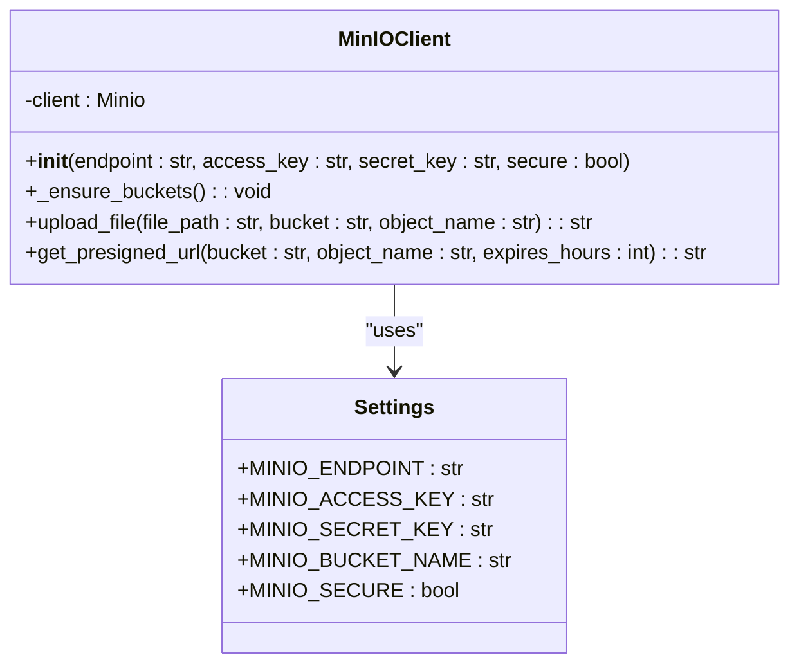
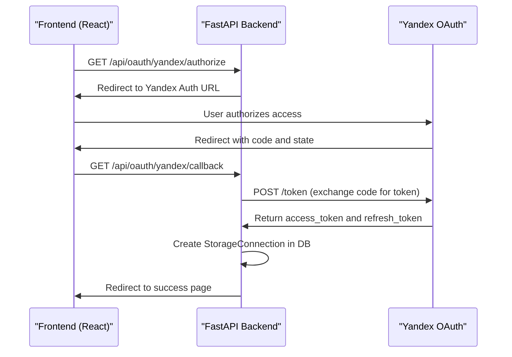
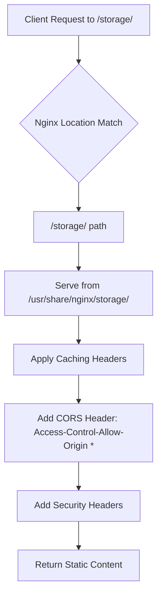
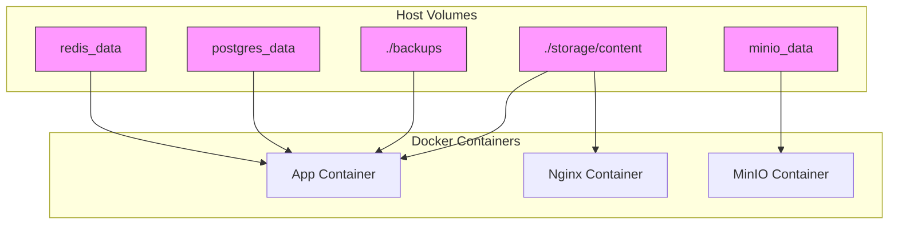
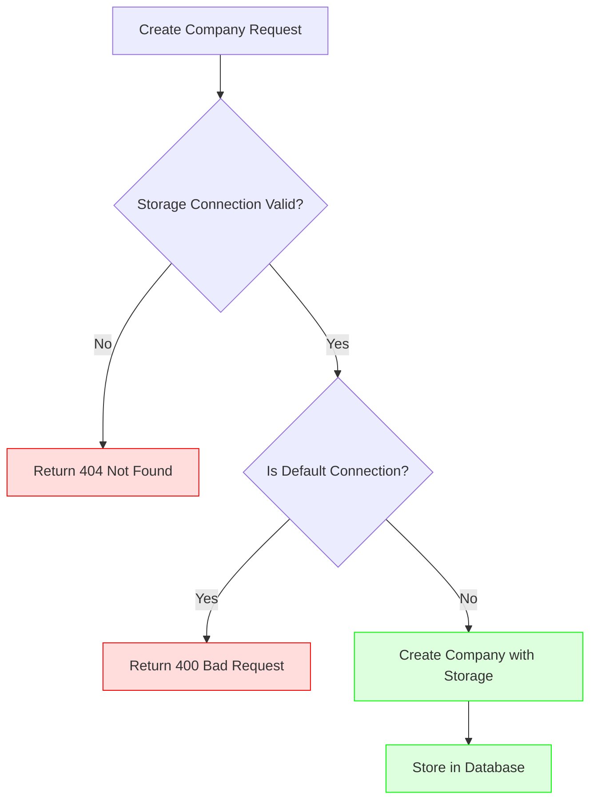

# Storage Security

<cite>
**Referenced Files in This Document**   
- [config.py](file://app/core/config.py)
- [storage.py](file://app/core/storage.py)
- [nginx.conf](file://nginx/nginx.conf)
- [docker-compose.yml](file://docker-compose.yml)
- [storage.py](file://app/models/storage.py)
- [storage.py](file://app/schemas/storage.py)
- [storage.py](file://app/api/routes/storage.py)
- [oauth.py](file://app/api/routes/oauth.py)
- [factory.py](file://app/services/storage/factory.py)
</cite>

## Table of Contents
1. [Introduction](#introduction)
2. [Storage Backend Security](#storage-backend-security)
3. [Nginx Static Content Serving](#nginx-static-content-serving)
4. [Secure Docker Volume Mounting](#secure-docker-volume-mounting)
5. [Access Control and Vulnerability Mitigation](#access-control-and-vulnerability-mitigation)
6. [Backup Security](#backup-security)
7. [Conclusion](#conclusion)

## Introduction
The ARV platform implements a comprehensive storage security architecture that supports multiple backend providers while maintaining strict access controls and secure configuration practices. This document details the security mechanisms for local storage, MinIO, and Yandex Disk integration, along with Nginx serving policies, Docker volume configurations, and backup security protocols. The system is designed to prevent common vulnerabilities such as insecure direct object references through token-based access and proper authentication flows.

## Storage Backend Security

### Local Storage Security
Local storage security is managed through Docker volume mounts with specific user permissions. The application containers run with user ID 1000:1000, ensuring that file operations are performed under a non-root user context. The storage base path is configured in the application settings at `/app/storage/content`, and the system automatically creates the necessary directory structure for different content types including portraits, videos, markers, QR codes, and thumbnails.

The default storage connection for the Vertex AR platform uses local disk storage with the base path specified in the configuration. This local storage is mounted as a Docker volume and is subject to the user permissions defined in the container configuration.

**Section sources**
- [config.py](file://app/core/config.py#L58-L61)
- [docker-compose.yml](file://docker-compose.yml#L77)
- [core/database.py](file://app/core/database.py#L93-L95)

### MinIO Security Configuration
MinIO is configured as an S3-compatible object storage backend with comprehensive security controls. The service is secured using access and secret keys, with the option to enable TLS encryption when the `MINIO_SECURE` environment variable is set to true. By default, MinIO runs with the root user credentials defined in the Docker configuration.

The application creates separate buckets for different content types (videos, markers, thumbnails) when configured, or falls back to a single bucket. Each bucket is configured with a public read policy that allows GET access to objects while maintaining control over write operations through the application's MinIO client.

The MinIO client in the application is initialized with the endpoint, access key, secret key, and secure flag from the configuration settings. The client ensures that all required buckets exist and are properly configured with the appropriate policies.

**Diagram sources**
- [storage.py](file://app/core/storage.py#L8-L70)
- [config.py](file://app/core/config.py#L62-L71)

**Section sources**
- [storage.py](file://app/core/storage.py#L8-L70)
- [config.py](file://app/core/config.py#L62-L71)
- [docker-compose.yml](file://docker-compose.yml#L44-L59)

### Yandex Disk OAuth Integration
Yandex Disk integration uses OAuth 2.0 authentication with client ID and secret credentials. The authorization flow follows the standard OAuth pattern with a redirect URI validation to prevent CSRF attacks. The system generates a random state parameter to protect against cross-site request forgery during the authorization process.

When a user authorizes access to their Yandex Disk account, the application exchanges the authorization code for an access token and refresh token. These credentials are stored in the database within the storage connection record, along with metadata about the user's disk space and display name.

The OAuth callback endpoint validates the state parameter before proceeding with the token exchange, ensuring that the request originated from a legitimate authorization flow. The access token is then used to make API requests to Yandex Disk on behalf of the user.

**Diagram sources**
- [oauth.py](file://app/api/routes/oauth.py#L19-L106)
- [YandexDiskAuth.tsx](file://frontend/components/YandexDiskAuth.tsx#L1-L76)

**Section sources**
- [oauth.py](file://app/api/routes/oauth.py#L19-L106)
- [factory.py](file://app/services/storage/factory.py#L24-L28)
- [storage.py](file://app/models/storage.py#L13)
- [YandexDiskAuth.tsx](file://frontend/components/YandexDiskAuth.tsx#L1-L76)

## Nginx Static Content Serving
Nginx serves static content from the `/storage/` path with specific security and performance configurations. The static files location is configured to serve content from the `/usr/share/nginx/storage/` directory, which is mounted from the application's storage volume.

The configuration includes caching policies with a 7-day expiration and immutable cache control headers to optimize performance while ensuring content integrity. CORS headers are set to allow access from any origin, enabling cross-origin requests for static resources.

Security headers are implemented to protect against common web vulnerabilities:
- X-Frame-Options prevents clickjacking attacks
- X-Content-Type-Options prevents MIME type sniffing
- X-XSS-Protection enables browser XSS filtering
- Referrer-Policy controls referrer information leakage

**Diagram sources**
- [nginx.conf](file://nginx/nginx.conf#L96-L101)
- [docker-compose.yml](file://docker-compose.yml#L161)

**Section sources**
- [nginx.conf](file://nginx/nginx.conf#L96-L116)
- [docker-compose.yml](file://docker-compose.yml#L161)

## Secure Docker Volume Mounting
The Docker Compose configuration implements secure volume mounting practices to protect storage data and prevent unauthorized access. Volumes are mounted with specific permissions and access controls to ensure the integrity and confidentiality of stored content.

Local storage content is mounted from the host directory `./storage/content` to the container paths `/app/storage/content` (for the application) and `/usr/share/nginx/storage` (for Nginx). These mounts are configured as read-only for the Nginx container, preventing any modifications to the stored content through the web server.

The application and Celery worker containers run with user ID 1000:1000, ensuring that file operations are performed under a non-root user context. This principle of least privilege reduces the potential impact of security vulnerabilities in the application code.

Database and Redis data volumes are also mounted to ensure persistence across container restarts, with appropriate permissions to prevent unauthorized access.

**Diagram sources**
- [docker-compose.yml](file://docker-compose.yml#L77-L78)
- [docker-compose.yml](file://docker-compose.yml#L161)
- [docker-compose.yml](file://docker-compose.yml#L94)

**Section sources**
- [docker-compose.yml](file://docker-compose.yml#L77-L78)
- [docker-compose.yml](file://docker-compose.yml#L161)
- [docker-compose.yml](file://docker-compose.yml#L94)
- [docker-compose.yml](file://docker-compose.yml#L120)

## Access Control and Vulnerability Mitigation
The ARV platform implements multiple layers of access control to prevent common security vulnerabilities, particularly insecure direct object references (IDOR). The system uses token-based authentication and authorization to ensure that users can only access resources they are permitted to view.

Storage connections are created through API endpoints that validate provider-specific credentials and configuration. The system prevents client companies from using the default Vertex AR storage connection, requiring them to establish their own storage connections with appropriate credentials.

When creating a company, the system validates that the specified storage connection exists and is not the default connection. This ensures that client data is properly isolated and stored in the appropriate backend.

The application also implements rate limiting for API endpoints to prevent abuse and brute force attacks. The Nginx configuration includes request rate limiting zones for API requests and uploads, helping to protect against denial of service attacks.

**Diagram sources**
- [companies.py](file://app/api/routes/companies.py#L22-L32)
- [storage.py](file://app/api/routes/storage.py#L15-L32)

**Section sources**
- [companies.py](file://app/api/routes/companies.py#L22-L32)
- [storage.py](file://app/api/routes/storage.py#L15-L32)
- [storage.py](file://app/models/storage.py#L22)
- [schemas/storage.py](file://app/schemas/storage.py#L9-L10)

## Backup Security
Backup security is implemented through S3-compatible storage with encrypted credentials and retention policies. The platform uses MinIO as the primary storage backend and can sync data to external S3-compatible storage for backup purposes.

The backup process is configured in the Docker Compose file with a dedicated `minio-backup` service that uses the `mc` (MinIO Client) tool to mirror data from the primary MinIO instance to the backup S3 endpoint. The backup configuration includes environment variables for the S3 endpoint, access key, secret key, and bucket name, which should be provided through secure means such as environment variables or secret management systems.

Retention policies are implemented to automatically remove old backups. The PostgreSQL backup service retains backups for 30 days, while the Redis backup service retains backups for 7 days. These policies help manage storage costs while maintaining an appropriate recovery window.

Database credentials for backups are stored in environment variables rather than hardcoded in configuration files, following security best practices.

**Section sources**
- [docker-compose.yml](file://docker-compose.yml#L228-L245)
- [docker-compose.yml](file://docker-compose.yml#L198-L211)
- [config.py](file://app/core/config.py#L105-L109)

## Conclusion
The ARV platform's storage security architecture provides a robust framework for managing content across multiple backend providers while maintaining strict security controls. By combining secure configuration practices, proper access controls, and comprehensive backup strategies, the system protects against common vulnerabilities and ensures data integrity.

Key security features include Docker volume mounting with proper user permissions, MinIO with access/secret key authentication and optional TLS, Yandex Disk OAuth integration with state parameter validation, Nginx serving with appropriate caching and security headers, and backup procedures with encrypted credentials and retention policies.

The implementation follows security best practices by using environment variables for sensitive configuration, implementing rate limiting, validating input parameters, and isolating client data through separate storage connections. These measures collectively create a secure storage environment for the ARV platform's content.