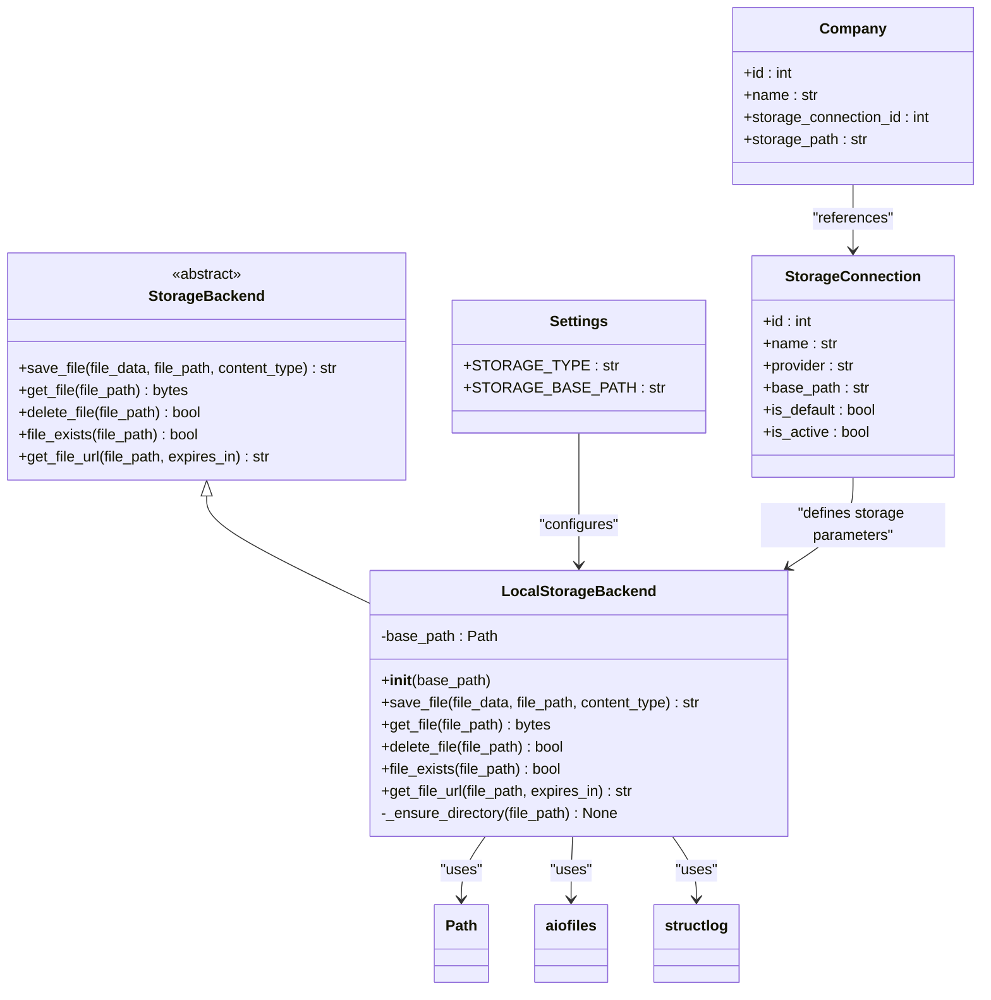
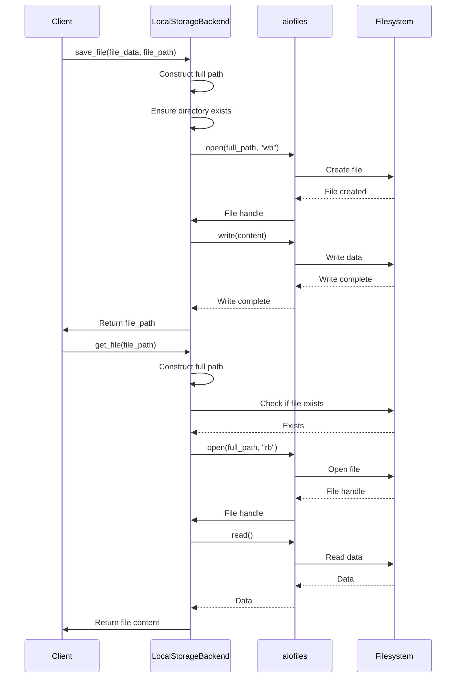
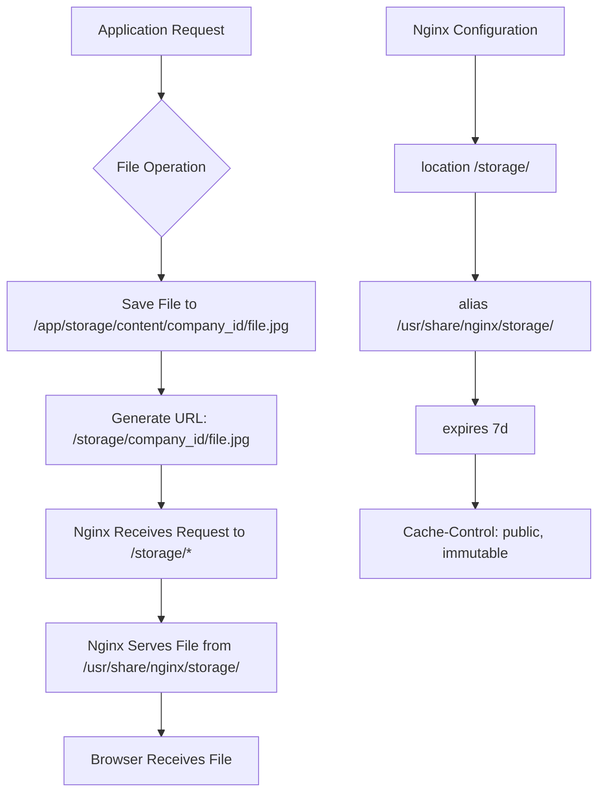

# Local Storage Backend

<cite>
**Referenced Files in This Document**   
- [local.py](file://app/services/storage/local.py)
- [config.py](file://app/core/config.py)
- [database.py](file://app/core/database.py)
- [nginx.conf](file://nginx/nginx.conf)
- [main.py](file://app/main.py)
- [storage.py](file://app/models/storage.py)
- [factory.py](file://app/services/storage/factory.py)
- [base.py](file://app/services/storage/base.py)
- [local_disk_provider.py](file://app/services/storage/providers/local_disk_provider.py)
</cite>

## Table of Contents
1. [Introduction](#introduction)
2. [Architecture Overview](#architecture-overview)
3. [Initialization and Configuration](#initialization-and-configuration)
4. [File Operations Implementation](#file-operations-implementation)
5. [Multi-Tenant Path Isolation](#multi-tenant-path-isolation)
6. [URL Generation and Nginx Serving](#url-generation-and-nginx-serving)
7. [Error Handling Strategy](#error-handling-strategy)
8. [Logging and Monitoring](#logging-and-monitoring)
9. [Integration with Application Context](#integration-with-application-context)

## Introduction
The LocalStorageBackend implementation provides a robust solution for storing files on the local filesystem using asynchronous operations. This document details the comprehensive implementation of the local storage system, focusing on its architecture, configuration, and operational characteristics. The backend is designed to handle file storage operations efficiently while maintaining strict separation between different tenants through company-based path isolation. Built on modern Python async patterns and leveraging aiofiles for non-blocking file operations, this storage solution integrates seamlessly with the application's overall architecture and provides reliable performance for file-intensive operations.

## Architecture Overview

**Diagram sources**
- [local.py](file://app/services/storage/local.py#L12-L170)
- [config.py](file://app/core/config.py#L58-L60)
- [storage.py](file://app/models/storage.py#L8-L38)

## Initialization and Configuration

The LocalStorageBackend initialization process begins with the configuration of the base storage path, which is derived from the application settings. The backend is initialized with a base path that defaults to the value specified in the `STORAGE_BASE_PATH` setting, which is configured in the application's settings module. During initialization, the backend creates a Path object from the provided base path string, ensuring proper filesystem path handling across different operating systems.

The initialization process includes creating the necessary directory structure if it doesn't already exist, particularly for the default storage configuration. This occurs during the application startup sequence in the `seed_defaults()` function, which ensures that the base directory and essential subdirectories (such as portraits, videos, markers, qr-codes, and thumbnails) are created with the appropriate permissions. The initialization also sets up structured logging through structlog, which records the successful initialization of the local storage backend with the specific base path used.

Configuration of the LocalStorageBackend is primarily controlled through environment variables and application settings. The `STORAGE_BASE_PATH` setting defines the root directory for all stored files, while the `STORAGE_TYPE` setting determines whether the local storage backend is active. The configuration supports both direct path specification and dynamic path construction based on tenant identifiers, allowing for flexible deployment scenarios.

**Section sources**
- [local.py](file://app/services/storage/local.py#L15-L23)
- [config.py](file://app/core/config.py#L58-L60)
- [database.py](file://app/core/database.py#L90-L96)

## File Operations Implementation

The LocalStorageBackend implements four core file operations: saving, retrieving, deleting, and checking file existence. Each operation leverages aiofiles for asynchronous file handling, ensuring non-blocking I/O operations that maintain application responsiveness during file processing.

The `save_file` method accepts binary file data and a target file path, then writes the content to the filesystem. Before writing, it ensures that the parent directory structure exists by calling the `_ensure_directory` helper method, which uses Path objects to create necessary directories with `parents=True` and `exist_ok=True` parameters. The method reads the file data either through a `read()` call if the input is a file-like object, or uses the data directly if it's already in bytes format, then writes it asynchronously to the specified location.

The `get_file` method retrieves file content from the specified path, first verifying the file's existence before attempting to read. It opens the file in binary read mode using aiofiles and returns the complete file content as bytes. The method includes comprehensive error handling to manage cases where files are missing or unreadable.

The `delete_file` method removes files from the filesystem, returning a boolean indicating success. It first checks if the file exists before attempting deletion, returning `False` if the file is not found rather than raising an exception. This behavior allows for idempotent deletion operations.

The `file_exists` method checks for the presence of a file at the specified path, verifying both that the path exists and that it points to a file rather than a directory. This method is optimized for frequent calls and is used internally by other operations to prevent unnecessary I/O operations.

**Diagram sources**
- [local.py](file://app/services/storage/local.py#L29-L122)
- [base.py](file://app/services/storage/base.py#L6-L77)

## Multi-Tenant Path Isolation

The LocalStorageBackend implements multi-tenant support through company_id-based path isolation, ensuring that files from different companies are stored in separate directories to maintain data separation and security. This isolation is achieved through the `get_storage_backend` factory function, which accepts an optional `company_id` parameter and constructs a storage path that incorporates the company identifier.

When a company-specific storage backend is requested, the factory function modifies the base storage path by appending the company_id to the `STORAGE_BASE_PATH`. This creates a hierarchical directory structure where each company has its own dedicated storage space within the overall storage system. The path construction uses Path objects to ensure proper directory separator handling across different operating systems.

The multi-tenant architecture is integrated with the application's data model through the `StorageConnection` and `Company` entities. Each company references a storage connection, which defines the storage provider and base path. For local storage, the company's `storage_path` field can be used to specify a relative path within the company's isolated storage space, allowing for further organizational structure within each tenant's storage area.

This approach to multi-tenancy provides several benefits: it ensures complete data isolation between companies, simplifies storage quota management by allowing per-company usage tracking, and enables independent backup and maintenance operations for each tenant's data. The path isolation also facilitates compliance with data protection regulations by making it easier to locate and manage data for specific organizations.

**Section sources**
- [local.py](file://app/services/storage/local.py#L142-L158)
- [storage.py](file://app/models/storage.py#L40-L59)

## URL Generation and Nginx Serving

The LocalStorageBackend includes a `get_file_url` method that generates public URLs for stored files, designed to work in conjunction with Nginx as a reverse proxy and static file server. When a file URL is requested, the method constructs a path that begins with `/storage/` followed by the relative file path, creating URLs in the format `/storage/{file_path}`.

This URL structure is specifically designed to work with the Nginx configuration, which includes a location block for `/storage/` that maps to the physical storage directory. The Nginx configuration uses the `alias` directive to serve files from `/usr/share/nginx/storage/`, which is typically mounted to the same volume as the application's `STORAGE_BASE_PATH`. This setup allows Nginx to serve static files directly without forwarding requests to the application server, improving performance and reducing server load.

The URL generation method intentionally ignores the `expires_in` parameter for local storage, as files served directly by Nginx are publicly accessible and do not require time-limited access signatures. This differs from cloud storage backends that might generate presigned URLs with expiration times. The public nature of these URLs is appropriate for the application's use case, where AR content, videos, and markers need to be accessible to end users without authentication.

Nginx is configured with appropriate caching headers for stored files, setting a 7-day expiration and marking responses as public and immutable. This caching strategy improves performance by allowing browsers and intermediate caches to store files locally, reducing bandwidth usage and improving load times for frequently accessed content.

**Diagram sources**
- [local.py](file://app/services/storage/local.py#L124-L138)
- [nginx.conf](file://nginx/nginx.conf#L95-L101)

## Error Handling Strategy

The LocalStorageBackend implements a comprehensive error handling strategy that balances robustness with usability. Each file operation is wrapped in try-except blocks that catch exceptions and convert them into appropriate responses or propagated errors, depending on the operation's requirements.

For the `save_file` operation, exceptions during the write process are caught and logged before being re-raised as generic exceptions. This ensures that callers are aware of failures while providing detailed logging for debugging. The method logs both successful operations and failures, capturing file path and size information for successful saves and error messages for failures.

The `get_file` method distinguishes between expected and unexpected errors. If a file does not exist, it raises a `FileNotFoundError` with a descriptive message, which is an expected condition that callers should handle. Other exceptions, such as permission errors or I/O errors, are logged with full details and re-raised to indicate unexpected failures.

The `delete_file` and `file_exists` methods adopt a more forgiving approach, returning boolean values rather than raising exceptions for missing files. This design choice makes these methods idempotent and easier to use in scenarios where the existence of a file is uncertain. The `delete_file` method returns `True` only when a file is successfully deleted, and `False` when the file does not exist or cannot be deleted, with only the latter case being logged as an error.

All error handling is integrated with the application's structured logging system, ensuring that error details are captured with appropriate context for debugging and monitoring. The logging includes the operation type, file path, and specific error information, enabling effective troubleshooting of storage-related issues.

**Section sources**
- [local.py](file://app/services/storage/local.py#L54-L56)
- [local.py](file://app/services/storage/local.py#L80-L82)
- [local.py](file://app/services/storage/local.py#L105-L107)

## Logging and Monitoring

The LocalStorageBackend leverages structlog for structured logging, providing detailed, machine-readable logs that facilitate monitoring and debugging. Each significant operation generates log entries with consistent field names and data types, enabling effective log aggregation and analysis.

During initialization, the backend logs an "local_storage_initialized" event that includes the base path, providing visibility into the storage configuration at startup. This log entry helps verify that the storage system is configured correctly and uses the expected directory.

File operations generate detailed log entries that capture key metrics and context. Successful file saves are logged with "file_saved" events that include the file path and size, enabling monitoring of storage usage patterns. File retrieval operations log "file_retrieved" events with similar information, while file deletions generate "file_deleted" events.

The logging system also captures warning and error events. Missing files generate "file_not_found" warnings, which are expected in certain workflows but may indicate issues in others. Actual errors during file operations generate "file_save_failed", "file_retrieval_failed", or "file_deletion_failed" events with the full error message, providing detailed information for debugging.

All log entries are structured with consistent field names, making them easy to query and analyze. The logs integrate with the application's overall logging configuration, which includes timestamping, log level filtering, and JSON formatting in production environments. This comprehensive logging approach enables effective monitoring of storage system performance and reliability.

**Section sources**
- [local.py](file://app/services/storage/local.py#L9-L10)
- [local.py](file://app/services/storage/local.py#L23)
- [main.py](file://app/main.py#L20-L37)

## Integration with Application Context

The LocalStorageBackend is integrated into the application through several key mechanisms that connect it to the broader system architecture. The primary integration point is the `get_storage_backend` factory function, which serves as the main entry point for obtaining storage backend instances throughout the application.

The storage system is initialized during application startup through the `seed_defaults()` function, which creates a default storage connection and company if they don't already exist. This ensures that the application has a functional storage system available immediately after deployment. The seeding process also creates the necessary directory structure for the default storage locations.

The backend integrates with the application's configuration system through the Settings object, which provides the `STORAGE_BASE_PATH` and `STORAGE_TYPE` values used to configure the storage backend. This allows storage configuration to be managed through environment variables, supporting different configurations for development, testing, and production environments.

The storage system is exposed through API routes that allow management of storage connections and company storage settings. The `/storage/connections` endpoint enables creation and testing of storage connections, while the `/companies/{company_id}/storage` endpoint allows assignment of storage connections to companies. These APIs use Pydantic models to validate input and ensure data integrity.

The multi-tenant architecture is supported by the database schema, which includes the `StorageConnection` and `Company` models with appropriate relationships. This data model enables the application to manage multiple storage configurations and assign them to different companies, supporting the SaaS nature of the platform.

**Section sources**
- [local.py](file://app/services/storage/local.py#L142-L170)
- [database.py](file://app/core/database.py#L54-L102)
- [config.py](file://app/core/config.py#L58-L60)
- [storage.py](file://app/api/routes/storage.py#L15-L62)