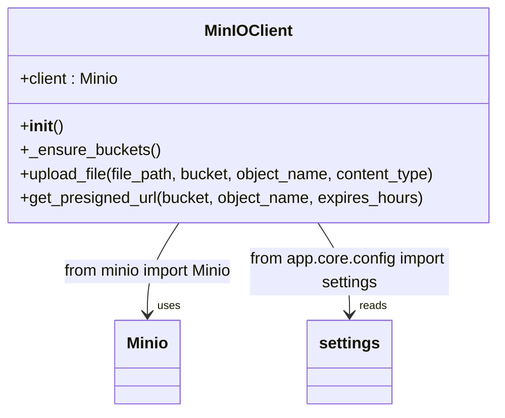
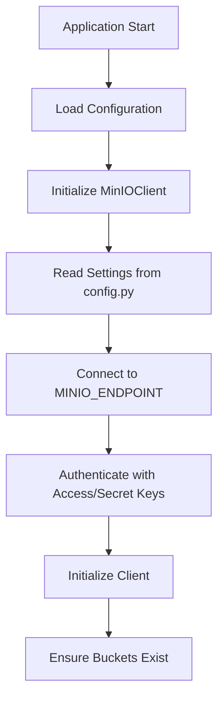
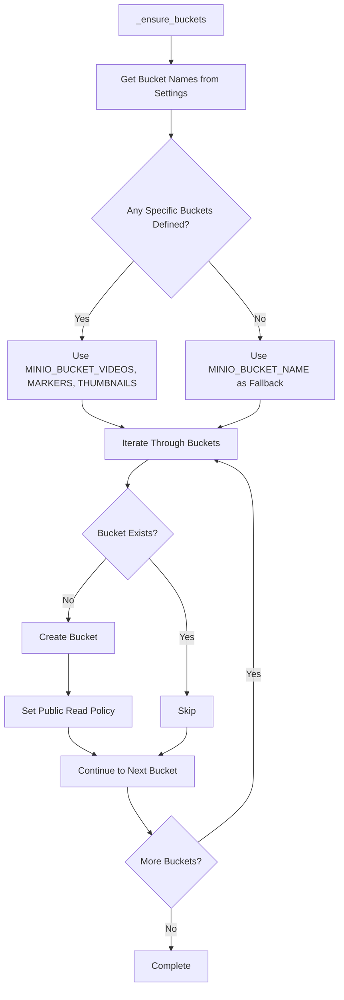
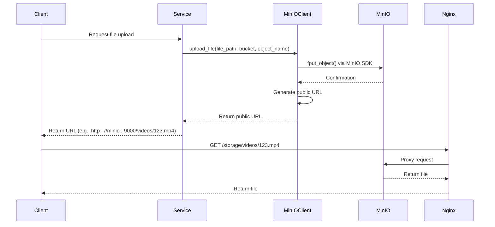
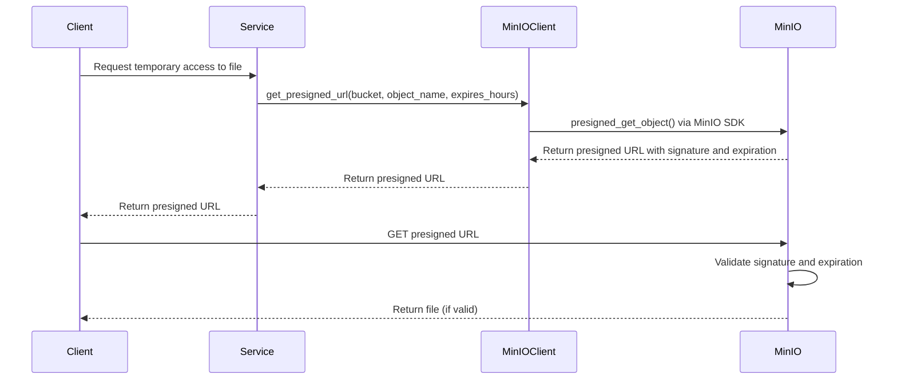
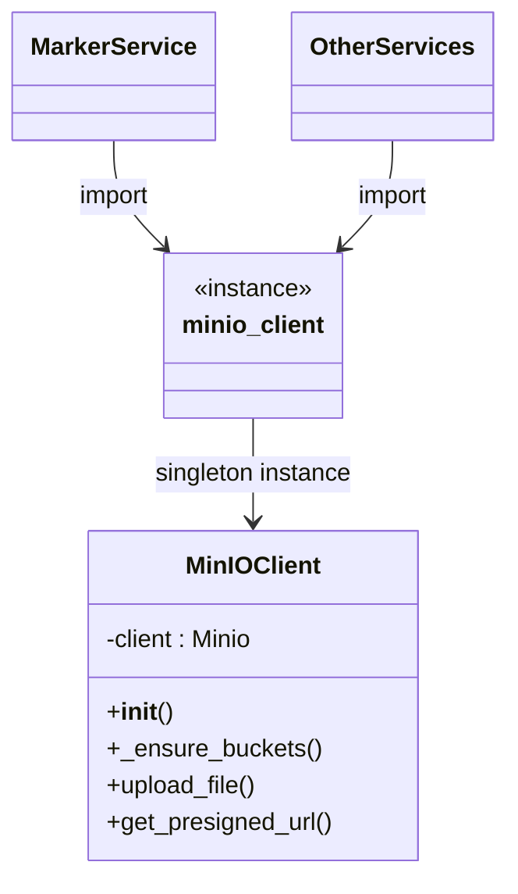
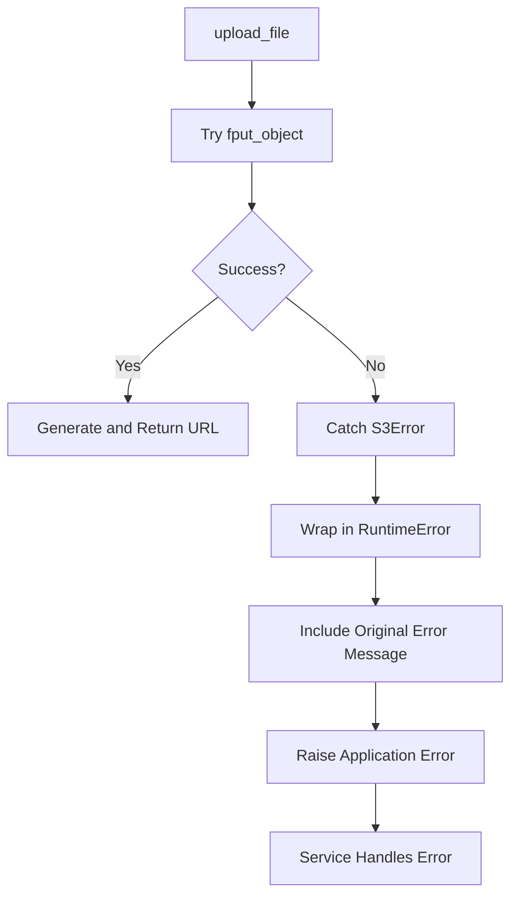
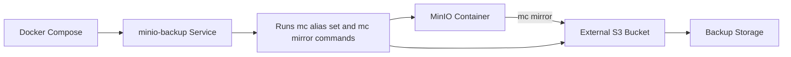

# MinIO Integration

<cite>
**Referenced Files in This Document**   
- [MinIOClient](file://app/core/storage.py#L8-L70)
- [minio_client](file://app/core/storage.py#L69)
- [settings](file://app/core/config.py#L62-L71)
- [marker_service](file://app/services/marker_service.py#L74-L80)
- [nginx.conf](file://nginx/nginx.conf#L96-L101)
- [.env.example](file://.env.example#L24-L28)
- [docker-compose.yml](file://docker-compose.yml#L228-L245)
</cite>

## Table of Contents
1. [Introduction](#introduction)
2. [MinIO Client Implementation](#minio-client-implementation)
3. [Configuration Requirements](#configuration-requirements)
4. [Bucket Management](#bucket-management)
5. [File Upload and Access](#file-upload-and-access)
6. [Singleton Pattern](#singleton-pattern)
7. [Error Handling](#error-handling)
8. [Nginx Integration](#nginx-integration)
9. [Security Considerations](#security-considerations)
10. [Backup Strategy](#backup-strategy)

## Introduction
The MinIO integration provides object storage capabilities for the ARV platform, enabling persistent storage of videos, markers, and thumbnails. This document details the implementation of the MinIO client, its configuration, bucket management, file operations, and integration with the application infrastructure.

**Section sources**
- [MinIOClient](file://app/core/storage.py#L8-L70)

## MinIO Client Implementation

The `MinIOClient` class encapsulates all interactions with the MinIO object storage service. It provides methods for uploading files, generating presigned URLs, and ensuring required buckets exist with appropriate policies.



**Diagram sources**
- [MinIOClient](file://app/core/storage.py#L8-L70)

**Section sources**
- [MinIOClient](file://app/core/storage.py#L8-L70)

## Configuration Requirements

The MinIO integration requires several configuration parameters to establish a connection and define storage behavior. These settings are defined in the application's configuration system and can be overridden via environment variables.

<cite>
**Configuration Parameters**
- **MINIO_ENDPOINT**: Host and port of the MinIO server (e.g., "minio:9000")
- **MINIO_ACCESS_KEY**: Access key for authentication
- **MINIO_SECRET_KEY**: Secret key for authentication
- **MINIO_SECURE**: Boolean indicating whether to use HTTPS
- **MINIO_BUCKET_NAME**: Default bucket name
- **MINIO_BUCKET_VIDEOS**: Dedicated bucket for video storage
- **MINIO_BUCKET_MARKERS**: Dedicated bucket for AR marker files
- **MINIO_BUCKET_THUMBNAILS**: Dedicated bucket for thumbnail images
</cite>



**Diagram sources**
- [settings](file://app/core/config.py#L62-L71)
- [MinIOClient](file://app/core/storage.py#L10-L15)

**Section sources**
- [settings](file://app/core/config.py#L62-L71)
- [.env.example](file://.env.example#L24-L28)

## Bucket Management

The `_ensure_buckets` method automatically creates required buckets and configures public read access policies. The system supports both dedicated buckets for different content types and a fallback to a single bucket.



**Diagram sources**
- [MinIOClient](file://app/core/storage.py#L18-L43)

**Section sources**
- [MinIOClient](file://app/core/storage.py#L18-L43)

## File Upload and Access

The MinIO client provides two primary methods for accessing stored objects: direct public URLs for publicly accessible content and presigned URLs for temporary access.

### Upload and Public Access


### Presigned URL Access


**Diagram sources**
- [MinIOClient](file://app/core/storage.py#L44-L66)

**Section sources**
- [MinIOClient](file://app/core/storage.py#L44-L66)

## Singleton Pattern

The MinIO client is implemented as a singleton to ensure consistent configuration and connection state across the application. A single instance is created at module level and imported wherever needed.



**Diagram sources**
- [MinIOClient](file://app/core/storage.py#L69)

**Section sources**
- [MinIOClient](file://app/core/storage.py#L69)
- [marker_service](file://app/services/marker_service.py#L7)

## Error Handling

The MinIO integration includes error handling for S3 operations, converting MinIO-specific exceptions into application-level runtime errors.



The error handling strategy ensures that MinIO-specific exceptions are properly propagated to calling services while providing meaningful error messages for debugging.

**Section sources**
- [MinIOClient](file://app/core/storage.py#L52-L63)

## Nginx Integration

Nginx serves as a reverse proxy for the application and provides direct access to static assets stored in MinIO. The configuration enables caching and CORS for stored content.

```nginx
# Static files (QR codes, markers, videos)
location /storage/ {
    alias /usr/share/nginx/storage/;
    expires 7d;
    add_header Cache-Control "public, immutable";
    add_header Access-Control-Allow-Origin *;
}
```

This integration allows clients to access stored objects directly through the application's domain, avoiding CORS issues and enabling proper caching behavior.

**Diagram sources**
- [nginx.conf](file://nginx/nginx.conf#L96-L101)

**Section sources**
- [nginx.conf](file://nginx/nginx.conf#L96-L101)

## Security Considerations

The MinIO integration involves several security considerations that must be addressed in production environments:

1. **Public Read Policy**: The bucket policy grants public read access to all objects, which is appropriate for content that should be publicly accessible (videos, thumbnails, markers) but could be a security risk if sensitive data is stored in these buckets.

2. **Credentials Management**: Access and secret keys are currently defined in configuration files, which should be protected and not committed to version control.

3. **Endpoint Security**: The MINIO_SECURE setting should be enabled in production to use HTTPS for all communications.

4. **Presigned URL Expiration**: Presigned URLs have a default expiration of 1 hour, limiting the window of access for temporary links.

5. **Network Isolation**: In the Docker Compose configuration, MinIO is deployed within the internal network, accessible only to other services.

**Section sources**
- [MinIOClient](file://app/core/storage.py#L35-L38)
- [settings](file://app/core/config.py#L71)
- [nginx.conf](file://nginx/nginx.conf#L100)

## Backup Strategy

The system includes a backup strategy that synchronizes MinIO data to an external S3-compatible storage service using the MinIO client (mc) tool.



The backup process is configured through environment variables and runs as a separate service in the Docker Compose setup, ensuring that object storage data is regularly synchronized to an external backup location.

**Diagram sources**
- [docker-compose.yml](file://docker-compose.yml#L228-L245)

**Section sources**
- [docker-compose.yml](file://docker-compose.yml#L228-L245)