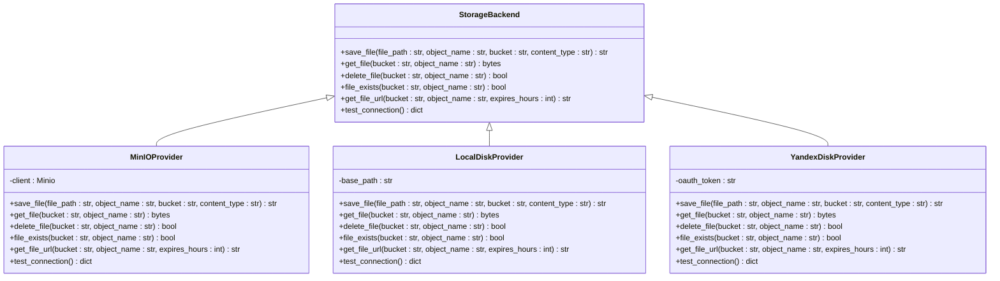

# Storage Abstraction Layer

<cite>
**Referenced Files in This Document**   
- [storage.py](file://app/core/storage.py)
- [storage.py](file://app/models/storage.py)
- [storage.py](file://app/schemas/storage.py)
- [storage.py](file://app/api/routes/storage.py)
- [factory.py](file://app/services/storage/factory.py)
</cite>

## Table of Contents
1. [Introduction](#introduction)
2. [Storage Backend Interface](#storage-backend-interface)
3. [Method Specifications](#method-specifications)
4. [Implementation Examples](#implementation-examples)
5. [Error Handling Patterns](#error-handling-patterns)
6. [Type Hints and Validation](#type-hints-and-validation)
7. [Creating New Storage Backends](#creating-new-storage-backends)
8. [Architecture Overview](#architecture-overview)

## Introduction
The Storage Abstraction Layer provides a unified interface for interacting with various storage backends in the application. This abstraction enables pluggable storage implementations, allowing the system to support multiple storage types through a consistent API. The core of this abstraction is the StorageBackend interface that defines the contract for all storage implementations, including local disk, MinIO, and Yandex Disk providers.

**Section sources**
- [storage.py](file://app/models/storage.py#L8-L38)
- [storage.py](file://app/schemas/storage.py#L7-L101)

## Storage Backend Interface
The StorageBackend abstract base class defines the contract that all storage implementations must adhere to. This interface ensures consistency across different storage providers while allowing for provider-specific optimizations. The abstraction layer separates the business logic from storage implementation details, enabling seamless switching between storage backends without affecting the rest of the application.

The interface is implemented through a factory pattern that creates appropriate provider instances based on the storage connection configuration. Each provider implementation must conform to the methods defined in the StorageBackend interface, ensuring a consistent API surface for all storage operations.

**Diagram sources**
- [storage.py](file://app/core/storage.py#L8-L70)
- [factory.py](file://app/services/storage/factory.py)

**Section sources**
- [storage.py](file://app/core/storage.py#L8-L70)
- [factory.py](file://app/services/storage/factory.py)

## Method Specifications
The StorageBackend interface defines five core methods that must be implemented by all storage providers. Each method serves a specific purpose in the storage operations lifecycle and follows consistent parameter and return type patterns.

### save_file
This method uploads a file from the local filesystem to the storage backend. It takes the local file path, object name (destination path in storage), bucket/container name, and optional content type as parameters. The method returns the public URL of the uploaded file.

**Parameters:**
- file_path: Local path to the file to upload
- object_name: Destination path/name in the storage backend
- bucket: Storage container/bucket name
- content_type: MIME type of the file (optional)

**Return:** Public URL of the uploaded file as string

### get_file
Retrieves a file from the storage backend and returns its contents as bytes. This method is used when the application needs to process or serve file content directly.

**Parameters:**
- bucket: Storage container/bucket name
- object_name: Path/name of the file to retrieve

**Return:** File contents as bytes

### delete_file
Removes a file from the storage backend. Returns a boolean indicating success or failure of the operation.

**Parameters:**
- bucket: Storage container/bucket name
- object_name: Path/name of the file to delete

**Return:** Boolean indicating operation success

### file_exists
Checks whether a file exists in the storage backend without retrieving its contents. This method is useful for validating file references before attempting operations.

**Parameters:**
- bucket: Storage container/bucket name
- object_name: Path/name of the file to check

**Return:** Boolean indicating file existence

### get_file_url
Generates a publicly accessible URL for a stored file. For providers supporting presigned URLs (like MinIO), this URL can have an expiration time. For others, it returns a direct public URL.

**Parameters:**
- bucket: Storage container/bucket name
- object_name: Path/name of the file
- expires_hours: Number of hours until URL expiration (optional)

**Return:** Publicly accessible URL as string

**Section sources**
- [storage.py](file://app/core/storage.py#L44-L67)
- [factory.py](file://app/services/storage/factory.py)

## Implementation Examples
Concrete implementations of the StorageBackend interface must adhere to the defined contract while handling provider-specific details. The factory pattern ensures that the correct provider instance is created based on the storage connection configuration.

The MinIO implementation uses the MinIO Python client to interact with the S3-compatible storage system, handling bucket creation and policy configuration during initialization. The LocalDisk provider maps storage operations to filesystem operations using Python's pathlib module, with the base path configured from settings. The YandexDisk provider uses OAuth authentication and the Yandex Disk API to perform storage operations.

Each implementation follows the same method signatures and return types, ensuring consistency across providers. Error handling is standardized, with provider-specific exceptions wrapped in common application exceptions.

**Diagram sources**
- [factory.py](file://app/services/storage/factory.py)
- [storage.py](file://app/core/storage.py#L8-L70)

**Section sources**
- [factory.py](file://app/services/storage/factory.py)
- [storage.py](file://app/core/storage.py#L8-L70)

## Error Handling Patterns
The storage abstraction layer implements consistent error handling across all providers. Provider-specific exceptions are caught and wrapped in standard application exceptions to maintain a uniform error interface. This approach allows the calling code to handle storage errors without needing to know the underlying provider.

All storage operations are designed to be idempotent where possible, and methods return appropriate boolean values or throw exceptions based on operation success. The test_connection method provides a standardized way to verify provider connectivity and credentials, updating the storage connection status in the database.

Network-related errors, authentication failures, and storage quota limitations are handled at the provider level, with appropriate error messages returned to the application layer. This ensures that transient failures can be handled gracefully while permanent errors are reported clearly.

**Section sources**
- [storage.py](file://app/core/storage.py#L61-L62)
- [factory.py](file://app/services/storage/factory.py)

## Type Hints and Validation
The storage abstraction layer makes extensive use of Python type hints to ensure code clarity and catch errors at development time. All method parameters and return values are annotated with appropriate types, including complex types like Optional and Union where needed.

Input validation is performed at multiple levels: Pydantic models validate incoming API requests, while provider implementations validate internal method parameters. The StorageConnection model in the database includes constraints to ensure data integrity, with JSONB fields storing provider-specific configuration.

The use of Literal types for provider identification ensures that only supported storage providers can be configured, preventing runtime errors from invalid provider names. Default values are provided for optional parameters, making the API easier to use while maintaining flexibility.

**Section sources**
- [storage.py](file://app/schemas/storage.py#L7-L41)
- [storage.py](file://app/models/storage.py#L13-L17)

## Creating New Storage Backends
To implement a new storage backend, developers must create a class that inherits from the StorageBackend interface and implements all required methods. The new provider must be registered in the storage factory to be available for use.

The implementation should handle provider-specific configuration through the credentials field in the StorageConnection model, using Pydantic models to validate configuration structure. Authentication, connection pooling, and other provider-specific concerns should be managed within the provider class.

New providers should follow the same error handling patterns as existing implementations, wrapping provider-specific exceptions in standard application exceptions. Performance considerations such as connection reuse, streaming operations for large files, and efficient metadata handling should be addressed in the implementation.

**Section sources**
- [factory.py](file://app/services/storage/factory.py)
- [storage.py](file://app/core/storage.py#L8-L70)

## Architecture Overview
The storage abstraction layer follows a clean architecture pattern, with the interface definition separated from implementation details. The factory pattern enables dependency inversion, allowing the application to depend on abstractions rather than concrete implementations.

Configuration is managed through the database, with storage connections storing provider type and credentials. This allows storage configurations to be modified at runtime without code changes. The system supports multiple storage connections simultaneously, enabling different companies or use cases to use different storage backends.

The abstraction layer integrates with the application's security model, ensuring that storage operations respect user permissions and data isolation requirements. Audit logging and monitoring are implemented at the interface level, providing visibility into storage operations across all providers.

**Diagram sources**
- [factory.py](file://app/services/storage/factory.py)
- [storage.py](file://app/core/storage.py)
- [storage.py](file://app/models/storage.py)

**Section sources**
- [factory.py](file://app/services/storage/factory.py)
- [storage.py](file://app/core/storage.py)
- [storage.py](file://app/models/storage.py)