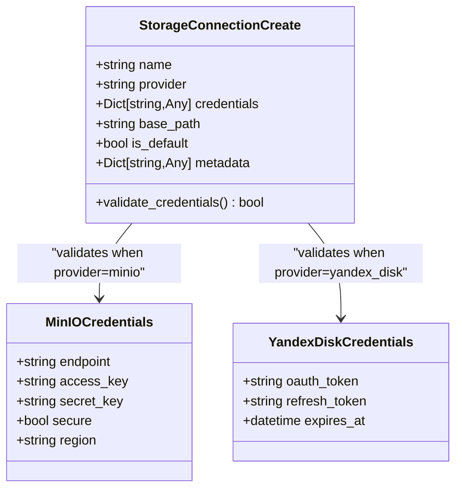
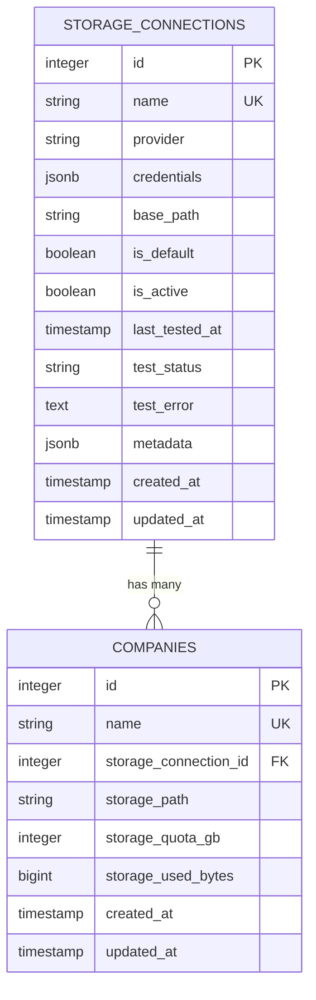
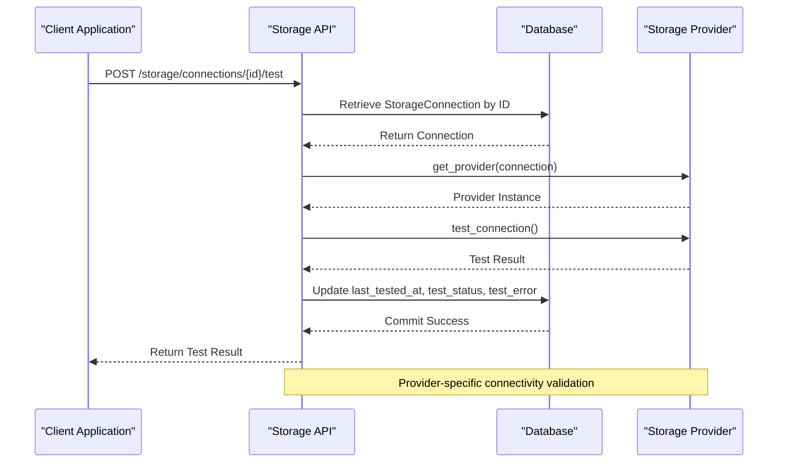
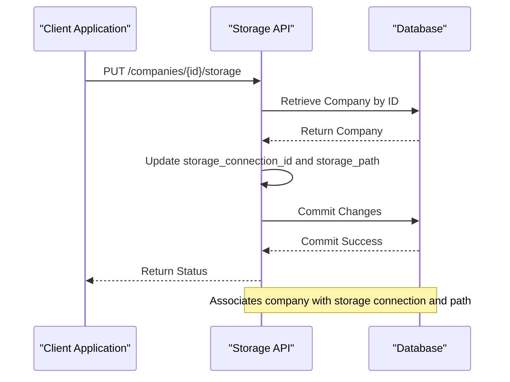
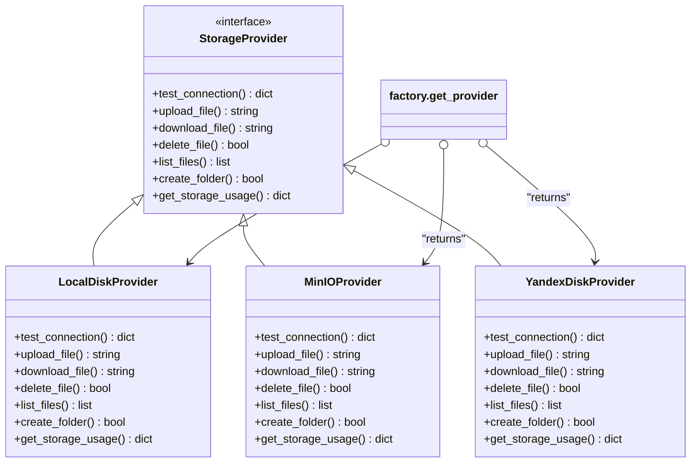

# Storage Configuration Management

<cite>
**Referenced Files in This Document**   
- [storage.py](file://app/api/routes/storage.py)
- [storage.py](file://app/models/storage.py)
- [storage.py](file://app/schemas/storage.py)
- [factory.py](file://app/services/storage/factory.py)
- [local_disk_provider.py](file://app/services/storage/providers/local_disk_provider.py)
- [minio_provider.py](file://app/services/storage/providers/minio_provider.py)
- [yandex_disk_provider.py](file://app/services/storage/providers/yandex_disk_provider.py)
</cite>

## Table of Contents
1. [Introduction](#introduction)
2. [Storage Configuration Endpoints](#storage-configuration-endpoints)
3. [Storage Connection Schema](#storage-connection-schema)
4. [Database Storage Model](#database-storage-model)
5. [Connection Testing Mechanism](#connection-testing-mechanism)
6. [Company Storage Configuration](#company-storage-configuration)
7. [Storage Provider Factory](#storage-provider-factory)
8. [Security Considerations](#security-considerations)
9. [Error Handling](#error-handling)
10. [Integration and Runtime Behavior](#integration-and-runtime-behavior)

## Introduction
The storage configuration management system provides a comprehensive API for managing storage connections, testing connectivity, and configuring company-specific storage settings. This document details the three main endpoints for storage configuration: creating storage connections, testing connections, and setting company storage configurations. The system supports multiple storage providers including local disk, MinIO, and Yandex Disk, enabling flexible storage options for different deployment scenarios.

## Storage Configuration Endpoints

The storage configuration system exposes three primary API endpoints for managing storage connections and company storage settings:

1. **POST /storage/connections**: Creates a new storage connection with provider-specific credentials and configuration
2. **POST /storage/connections/{connection_id}/test**: Tests the connectivity of an existing storage connection
3. **PUT /companies/{company_id}/storage**: Associates a company with a specific storage connection and path

These endpoints enable administrators to configure and validate storage connections before assigning them to companies, ensuring proper connectivity and access before use.

**Section sources**
- [storage.py](file://app/api/routes/storage.py#L15-L62)

## Storage Connection Schema

The `StorageConnectionCreate` schema defines the structure for creating new storage connections. It includes provider-specific validation and configuration options:

- **name**: Required string (1-255 characters) for identifying the connection
- **provider**: Required enum with values "local_disk", "minio", or "yandex_disk"
- **credentials**: Optional JSON object containing provider-specific authentication data
- **base_path**: Optional string for specifying the base path for storage operations
- **is_default**: Optional boolean flag indicating if this is the default connection
- **metadata**: Optional JSON object for storing additional connection metadata

The schema includes provider-specific validation through a validator method that ensures proper credential structure based on the selected provider. For MinIO, it validates endpoint, access key, and secret key. For Yandex Disk, it requires an OAuth token. For local disk, it ensures a base path is provided either in credentials or as a separate field.

**Diagram sources**
- [storage.py](file://app/schemas/storage.py#L24-L41)

**Section sources**
- [storage.py](file://app/schemas/storage.py#L7-L41)

## Database Storage Model

Storage connections are persisted in the database using the `StorageConnection` model, which maps to the "storage_connections" table. The model includes the following fields:

- **id**: Primary key integer identifier
- **name**: Unique string name for the connection
- **provider**: String indicating the storage provider
- **credentials**: JSONB field storing provider-specific credentials
- **base_path**: String for local disk base path
- **is_default**: Boolean flag for default connection
- **is_active**: Boolean status indicator
- **last_tested_at**: DateTime of last connection test
- **test_status**: String status of last test ("success" or "failed")
- **test_error**: Text field for storing error details from failed tests
- **metadata**: JSONB field for additional metadata
- **created_at**: Timestamp of creation
- **updated_at**: Timestamp of last update

The model also establishes a relationship with the Company model, allowing multiple companies to reference the same storage connection.

**Diagram sources**
- [storage.py](file://app/models/storage.py#L8-L38)

**Section sources**
- [storage.py](file://app/models/storage.py#L8-L38)

## Connection Testing Mechanism

The test_connection endpoint validates storage connectivity by leveraging the storage provider factory pattern. When a test request is received:

1. The system retrieves the storage connection by ID from the database
2. The provider factory instantiates the appropriate provider implementation based on the connection's provider type
3. The provider's test_connection method is called asynchronously
4. The test results (status and optional error message) are stored back in the database
5. The test timestamp is updated

Each provider implementation has its own connectivity test:
- **Local Disk**: Checks if the base directory exists and is writable, and reports available disk space
- **MinIO**: Attempts to list buckets to verify connectivity and authentication
- **Yandex Disk**: Makes an API call to the Yandex Disk service to verify the OAuth token is valid

The test results are stored in the connection record, providing an audit trail of connectivity status over time.

**Diagram sources**
- [storage.py](file://app/api/routes/storage.py#L35-L49)
- [factory.py](file://app/services/storage/factory.py#L8-L30)
- [local_disk_provider.py](file://app/services/storage/providers/local_disk_provider.py#L22-L52)
- [minio_provider.py](file://app/services/storage/providers/minio_provider.py#L15-L21)
- [yandex_disk_provider.py](file://app/services/storage/providers/yandex_disk_provider.py#L12-L28)

**Section sources**
- [storage.py](file://app/api/routes/storage.py#L35-L49)

## Company Storage Configuration

The set_company_storage endpoint associates companies with specific storage connections and paths, enabling multi-tenancy support. When configuring storage for a company:

1. The system retrieves the company record by ID
2. The company's storage_connection_id and storage_path fields are updated
3. The changes are committed to the database

The storage_path field specifies the base path or bucket within the storage connection that the company should use. This enables multiple companies to share the same storage connection while maintaining data isolation through separate paths.

When a new company is created, the system automatically creates subfolders for different content types (portraits, videos, markers, etc.) within the specified storage path, ensuring a consistent directory structure across companies.

**Diagram sources**
- [storage.py](file://app/api/routes/storage.py#L52-L62)
- [companies.py](file://app/api/routes/companies.py#L61-L65)

**Section sources**
- [storage.py](file://app/api/routes/storage.py#L52-L62)

## Storage Provider Factory

The storage provider factory pattern enables the system to support multiple storage backends through a unified interface. The factory function `get_provider()` creates instances of provider-specific classes based on the connection configuration:

- **LocalDiskProvider**: For local file system storage
- **MinIOProvider**: For S3-compatible object storage
- **YandexDiskProvider**: For Yandex Disk cloud storage

The factory extracts provider-specific configuration from the storage connection and instantiates the appropriate provider class with the required parameters. This abstraction allows the rest of the application to interact with storage through a consistent interface regardless of the underlying provider.

**Diagram sources**
- [factory.py](file://app/services/storage/factory.py#L8-L30)
- [base.py](file://app/services/storage/providers/base.py#L5-L47)
- [local_disk_provider.py](file://app/services/storage/providers/local_disk_provider.py#L12-L209)
- [minio_provider.py](file://app/services/storage/providers/minio_provider.py#L11-L104)
- [yandex_disk_provider.py](file://app/services/storage/providers/yandex_disk_provider.py#L7-L110)

**Section sources**
- [factory.py](file://app/services/storage/factory.py#L8-L30)

## Security Considerations

The storage configuration system implements several security measures to protect sensitive credentials and ensure secure access:

1. **Credential Storage**: Provider credentials are stored in a JSONB field in the database, allowing structured storage while maintaining flexibility for different provider requirements.

2. **OAuth Token Protection**: For Yandex Disk, OAuth tokens are stored without additional encryption at the application level, relying on database-level security measures.

3. **Connection Testing**: The test_connection endpoint verifies connectivity without exposing credentials in responses, only returning status and error information.

4. **Input Validation**: The StorageConnectionCreate schema validates provider-specific credentials, preventing malformed configuration data.

5. **Access Control**: The endpoints require appropriate authentication and authorization, ensuring only authorized users can create or modify storage connections.

6. **Error Handling**: Detailed error information is captured for debugging but sanitized in responses to prevent information leakage.

The system should be deployed with additional security measures including database encryption at rest, network-level security for storage endpoints, and regular credential rotation policies.

**Section sources**
- [storage.py](file://app/schemas/storage.py#L24-L41)
- [storage.py](file://app/models/storage.py#L16)
- [yandex_disk_provider.py](file://app/services/storage/providers/yandex_disk_provider.py#L17)

## Error Handling

The storage configuration endpoints implement comprehensive error handling to provide meaningful feedback while maintaining system stability:

- **404 Not Found**: Returned when attempting to test a non-existent connection or configure storage for a non-existent company
- **Validation Errors**: Pydantic models validate input data and return detailed error messages for invalid fields
- **Provider-Specific Errors**: Connection test results include error details from the underlying provider while maintaining a consistent response format
- **Database Errors**: SQLAlchemy handles database-level errors, with appropriate rollback and error reporting

Error responses follow a consistent format that includes status codes and descriptive messages, enabling clients to handle different error conditions appropriately.

**Section sources**
- [storage.py](file://app/api/routes/storage.py#L38-L39)
- [storage.py](file://app/api/routes/storage.py#L55-L56)
- [schemas/storage.py](file://app/schemas/storage.py#L29-L41)

## Integration and Runtime Behavior

The storage configuration system integrates with the application's core components to drive runtime behavior:

1. **Configuration-Driven**: Storage connections defined through the API become available for use by other system components
2. **Multi-Tenancy Support**: Company storage settings enable isolated storage configurations for each tenant
3. **Provider Abstraction**: The factory pattern allows seamless integration of different storage backends
4. **Runtime Validation**: Connection tests verify that storage is available before use
5. **Audit Trail**: Database fields track connection test history and configuration changes

The configuration drives runtime behavior by determining which storage backend is used for company data, where files are stored within that backend, and how connectivity is validated. This flexible design supports various deployment scenarios from local development to production environments with cloud storage.

**Section sources**
- [storage.py](file://app/api/routes/storage.py)
- [factory.py](file://app/services/storage/factory.py)
- [models/storage.py](file://app/models/storage.py)