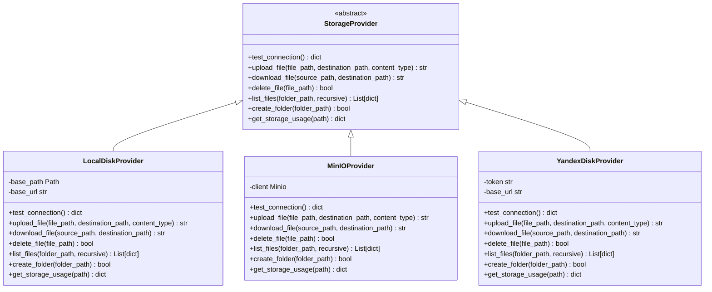
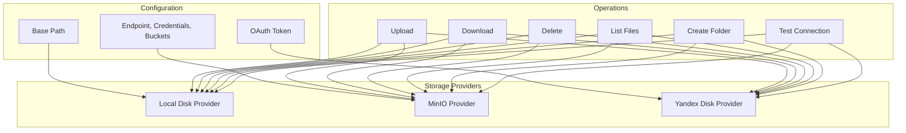
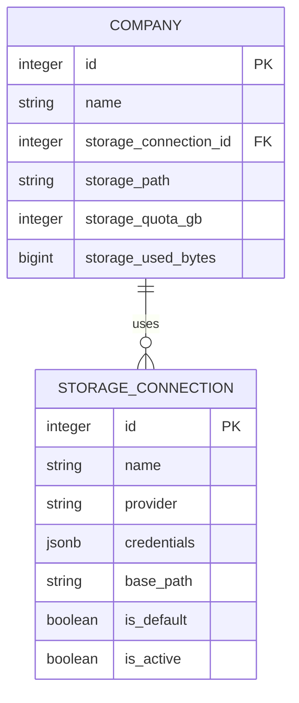
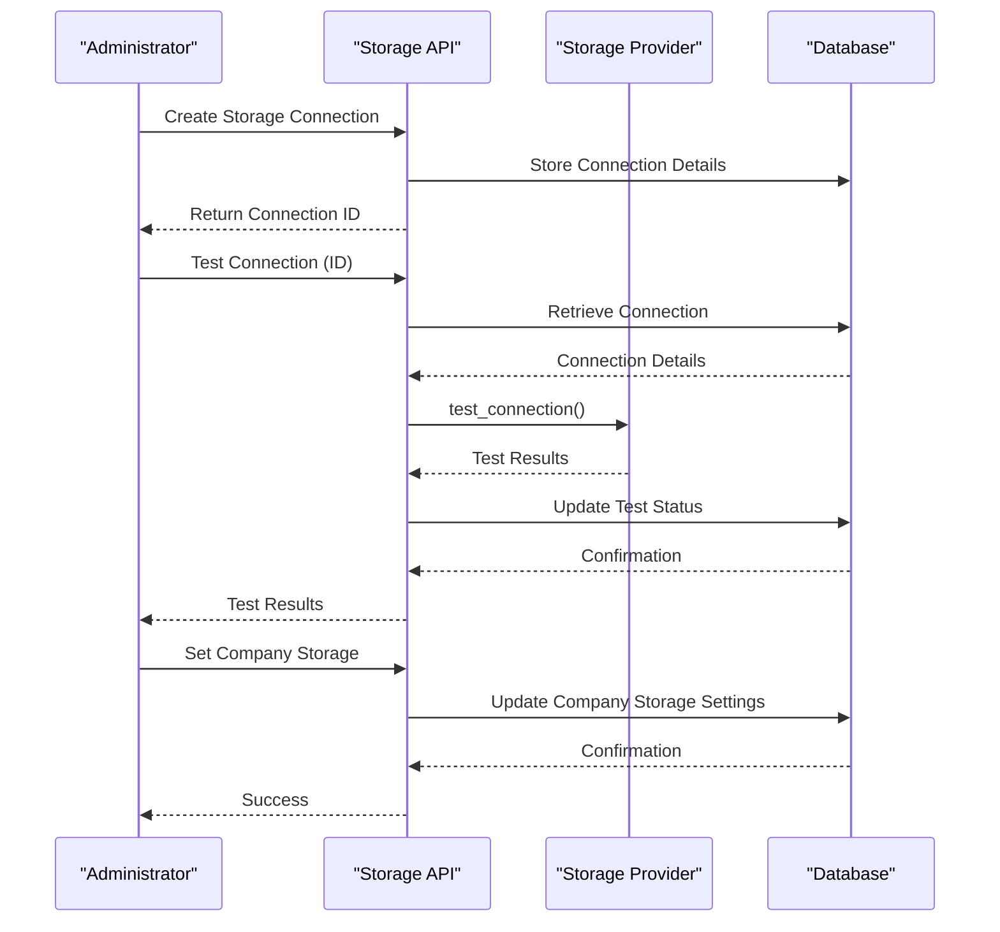
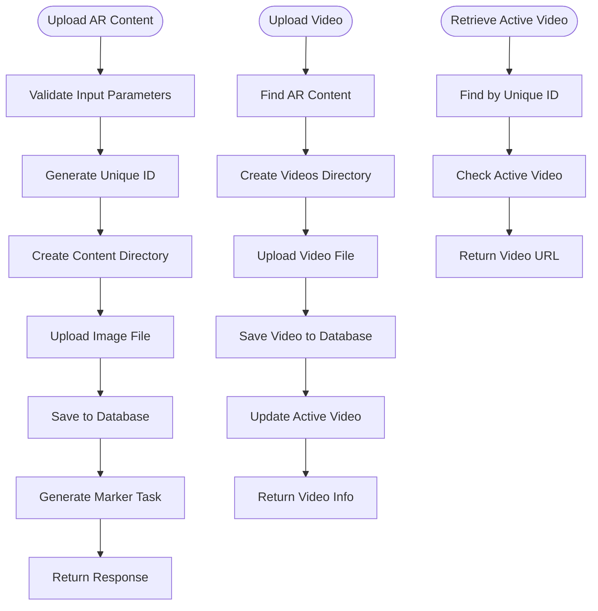
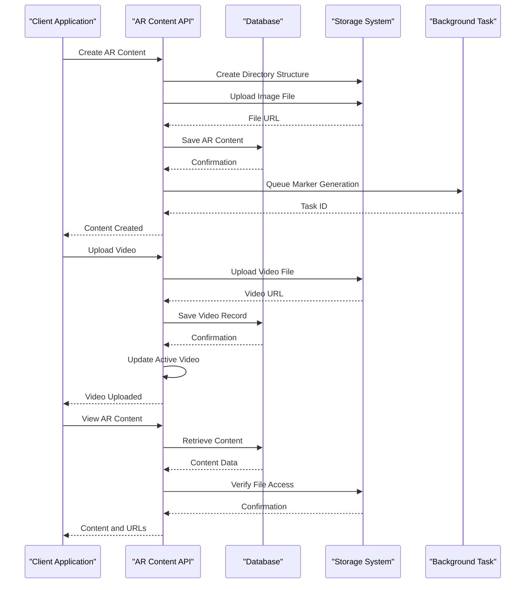

# Storage System

<cite>
**Referenced Files in This Document**   
- [app/core/storage.py](file://app/core/storage.py)
- [app/models/storage.py](file://app/models/storage.py)
- [app/schemas/storage.py](file://app/schemas/storage.py)
- [app/api/routes/storage.py](file://app/api/routes/storage.py)
- [app/core/config.py](file://app/core/config.py)
- [app/services/storage/factory.py](file://app/services/storage/factory.py)
- [app/services/storage/providers/base.py](file://app/services/storage/providers/base.py)
- [app/services/storage/providers/local_disk_provider.py](file://app/services/storage/providers/local_disk_provider.py)
- [app/services/storage/providers/minio_provider.py](file://app/services/storage/providers/minio_provider.py)
- [app/services/storage/providers/yandex_disk_provider.py](file://app/services/storage/providers/yandex_disk_provider.py)
- [app/api/routes/ar_content.py](file://app/api/routes/ar_content.py)
- [app/models/ar_content.py](file://app/models/ar_content.py)
- [app/models/company.py](file://app/models/company.py)
</cite>

## Table of Contents
1. [Storage System Overview](#storage-system-overview)
2. [Storage Abstraction Layer](#storage-abstraction-layer)
3. [Storage Backend Implementations](#storage-backend-implementations)
4. [Multi-Tenant Storage Isolation](#multi-tenant-storage-isolation)
5. [Configuration and Connection Testing](#configuration-and-connection-testing)
6. [Storage Operations and Usage Examples](#storage-operations-and-usage-examples)
7. [Performance Considerations](#performance-considerations)
8. [Error Handling Strategies](#error-handling-strategies)
9. [Integration with AR Content Management](#integration-with-ar-content-management)
10. [Security Considerations](#security-considerations)

## Storage System Overview

The ARV platform features a flexible multi-backend storage system designed to support various storage providers while maintaining a consistent interface across the application. This architecture enables organizations to choose the most appropriate storage solution for their needs, whether it's local disk storage, MinIO for self-hosted object storage, or Yandex Disk for cloud-based storage.

The storage system is built around an abstraction layer that decouples the application logic from specific storage implementations. This design allows for pluggable backends, making it easy to add new storage providers in the future without modifying the core application code. The system supports multi-tenancy through company_id isolation, ensuring that each organization's data remains separate and secure.

The storage architecture leverages asynchronous operations using aiofiles for efficient file handling, particularly important for AR content which often involves large video and image files. The system is integrated with the platform's AR content management and project lifecycle components, providing seamless storage capabilities for augmented reality assets.

**Section sources**
- [app/models/storage.py](file://app/models/storage.py#L8-L81)
- [app/schemas/storage.py](file://app/schemas/storage.py#L1-L101)
- [app/core/config.py](file://app/core/config.py#L58-L77)

## Storage Abstraction Layer

The ARV platform implements a robust storage abstraction layer that provides a consistent interface across different storage backends. At the core of this abstraction is the `StorageProvider` abstract base class defined in the providers module, which establishes a contract for all storage implementations.

The abstraction layer follows the factory pattern, with the `get_provider` function in the factory module responsible for instantiating the appropriate provider based on the storage connection configuration. This function examines the provider type specified in the storage connection and returns an instance of the corresponding provider class, ensuring that the rest of the application interacts with a uniform interface regardless of the underlying storage technology.

The abstract base class defines essential methods that all providers must implement, including connection testing, file upload and download, file deletion, directory listing, folder creation, and storage usage reporting. This consistent interface enables the application to perform storage operations without knowledge of the specific backend being used.

The abstraction layer also handles provider-specific configuration mapping, converting the generic credentials stored in the database to the specific parameters required by each provider. For example, MinIO credentials are mapped to endpoint, access key, and secret key parameters, while Yandex Disk uses OAuth tokens.

**Diagram sources**
- [app/services/storage/providers/base.py](file://app/services/storage/providers/base.py#L5-L47)
- [app/services/storage/providers/local_disk_provider.py](file://app/services/storage/providers/local_disk_provider.py#L12-L209)
- [app/services/storage/providers/minio_provider.py](file://app/services/storage/providers/minio_provider.py#L11-L104)
- [app/services/storage/providers/yandex_disk_provider.py](file://app/services/storage/providers/yandex_disk_provider.py#L7-L110)

**Section sources**
- [app/services/storage/factory.py](file://app/services/storage/factory.py#L8-L31)
- [app/services/storage/providers/base.py](file://app/services/storage/providers/base.py#L5-L47)

## Storage Backend Implementations

The ARV platform supports three distinct storage backend implementations, each designed to meet different organizational requirements and deployment scenarios.

### Local Disk Storage

The local disk storage provider offers a straightforward implementation for organizations that prefer to keep their data on-premises or within their own infrastructure. This provider uses the local file system to store AR content and related assets. Configuration requires specifying a base path where files will be stored, with a default path defined in the application settings.

The local disk provider creates a hierarchical directory structure organized by company and content type, ensuring efficient organization and retrieval of files. It supports all standard storage operations and includes comprehensive error handling for file system operations. The provider also monitors disk space and reports available storage during connection tests.

### MinIO Storage

The MinIO provider enables integration with self-hosted object storage systems, providing enterprise-grade storage capabilities with S3-compatible APIs. This implementation is ideal for organizations requiring high availability, scalability, and advanced storage features.

Configuration for MinIO includes endpoint URL, access credentials, and security settings. The provider supports both single-bucket and multi-bucket configurations, with separate buckets for different content types (videos, markers, thumbnails). During initialization, the provider ensures required buckets exist and configures appropriate access policies.

The MinIO implementation leverages the official MinIO Python client and uses asyncio to thread blocking operations, ensuring non-blocking I/O in the asynchronous application context.

### Yandex Disk Storage

The Yandex Disk provider allows organizations to leverage cloud storage through Yandex's ecosystem. This implementation uses OAuth 2.0 for authentication, providing secure access to Yandex Disk accounts without storing user credentials.

The provider supports read operations for browsing files and folders, as well as deletion and folder creation. Upload functionality is currently marked as not implemented, indicating a potential area for future development. The provider stores OAuth tokens and refresh tokens in the database, enabling persistent access to storage resources.

Each backend implementation follows the same interface defined by the abstract base class, ensuring consistent behavior across different storage technologies while accommodating provider-specific requirements and capabilities.

**Diagram sources**
- [app/services/storage/providers/local_disk_provider.py](file://app/services/storage/providers/local_disk_provider.py#L12-L209)
- [app/services/storage/providers/minio_provider.py](file://app/services/storage/providers/minio_provider.py#L11-L104)
- [app/services/storage/providers/yandex_disk_provider.py](file://app/services/storage/providers/yandex_disk_provider.py#L7-L110)

**Section sources**
- [app/services/storage/providers/local_disk_provider.py](file://app/services/storage/providers/local_disk_provider.py#L12-L209)
- [app/services/storage/providers/minio_provider.py](file://app/services/storage/providers/minio_provider.py#L11-L104)
- [app/services/storage/providers/yandex_disk_provider.py](file://app/services/storage/providers/yandex_disk_provider.py#L7-L110)

## Multi-Tenant Storage Isolation

The ARV platform implements a comprehensive multi-tenant storage isolation system that ensures data separation between organizations while maintaining a unified storage infrastructure. This isolation is achieved through a combination of database relationships and storage path organization.

Each company in the system is associated with a specific storage connection through the `storage_connection_id` field in the Company model. This relationship establishes which storage backend the company's data will be stored on. The `storage_path` field defines the root directory or bucket prefix for the company's content, creating a dedicated namespace within the storage backend.

The storage isolation model prevents cross-tenant data access by design. When a company is created, the system validates that it cannot use the default Vertex AR storage connection, requiring organizations to establish their own storage connections. This policy ensures that client companies have control over their data location and storage configuration.

Storage quotas are enforced at the company level through the `storage_quota_gb` field, with the system tracking actual usage in the `storage_used_bytes` field. This enables the platform to monitor and enforce storage limits for each organization independently.

The multi-tenant architecture also supports different storage providers for different companies, allowing organizations to choose the solution that best fits their requirements. For example, one company might use MinIO for on-premises storage, while another uses Yandex Disk for cloud-based storage, all within the same platform instance.

**Diagram sources**
- [app/models/storage.py](file://app/models/storage.py#L8-L81)
- [app/models/company.py](file://app/models/company.py#L7-L40)

**Section sources**
- [app/models/storage.py](file://app/models/storage.py#L8-L81)
- [app/models/company.py](file://app/models/company.py#L7-L40)
- [app/api/routes/companies.py](file://app/api/routes/companies.py#L16-L93)

## Configuration and Connection Testing

The ARV platform provides comprehensive configuration options for each storage backend, allowing administrators to tailor storage settings to their specific requirements. Configuration is managed through both environment variables and database-stored connection settings, providing flexibility for different deployment scenarios.

### Environment Configuration

The core application settings in `config.py` define default values for storage configuration, including the default storage type, base path for local storage, and default MinIO connection parameters. These settings can be overridden through environment variables, enabling different configurations for development, testing, and production environments.

For MinIO, configuration includes the endpoint URL, access credentials, bucket names, and security settings. Yandex Disk configuration requires OAuth client credentials and redirect URIs for the authentication flow. Local storage configuration primarily involves setting the base path where files will be stored.

### Storage Connection Management

Storage connections are managed through a dedicated API that allows administrators to create, update, and test storage configurations. Each storage connection is stored in the database with provider-specific credentials and settings. The system supports multiple storage connections, enabling organizations to configure different storage solutions for various purposes.

The `StorageConnection` model includes fields for connection status, with `last_tested_at`, `test_status`, and `test_error` fields that record the results of connection tests. This information is used to monitor the health of storage connections and alert administrators to potential issues.

### Connection Testing

The platform includes a robust connection testing mechanism that verifies the availability and functionality of storage backends. The test endpoint performs provider-specific connectivity checks and updates the connection record with the test results.

For local disk storage, the test verifies that the base directory exists and is writable, while also reporting available disk space. MinIO connections are tested by attempting to list buckets, confirming that the credentials are valid and the endpoint is accessible. Yandex Disk connections are tested by making an API call to retrieve disk information, validating the OAuth token.

The connection testing system is integrated with the storage provider abstraction, allowing the same test interface to be used across different backends while executing provider-specific validation logic.

**Diagram sources**
- [app/core/config.py](file://app/core/config.py#L58-L77)
- [app/api/routes/storage.py](file://app/api/routes/storage.py#L35-L49)
- [app/services/storage/providers/base.py](file://app/services/storage/providers/base.py#L9-L11)

**Section sources**
- [app/core/config.py](file://app/core/config.py#L58-L77)
- [app/api/routes/storage.py](file://app/api/routes/storage.py#L15-L62)
- [app/services/storage/providers/local_disk_provider.py](file://app/services/storage/providers/local_disk_provider.py#L22-L52)
- [app/services/storage/providers/minio_provider.py](file://app/services/storage/providers/minio_provider.py#L15-L22)
- [app/services/storage/providers/yandex_disk_provider.py](file://app/services/storage/providers/yandex_disk_provider.py#L12-L28)

## Storage Operations and Usage Examples

The ARV platform supports a variety of storage operations essential for managing AR content and related assets. These operations are integrated throughout the application, particularly in the AR content management system.

### Uploading AR Content

When creating AR content, the system handles file uploads through the `/ar-content` endpoint. The process begins by generating a unique identifier for the content and creating a dedicated directory structure within the company's storage path. Image files are uploaded using asynchronous file operations with aiofiles, which allows the server to handle other requests while the upload is in progress.

The uploaded image is stored with its original filename in the content-specific directory, and a public URL is generated for access. The AR content record in the database stores both the file path and URL, enabling efficient retrieval and serving of the content.

### Retrieving Videos

Video assets are managed similarly to images, with dedicated endpoints for uploading videos to specific AR content items. Videos are stored in a subdirectory within the AR content directory, maintaining a clean organizational structure. When a video is uploaded, it can be designated as the active video for the AR content, which determines which video is served when users access the content.

The system supports retrieving the active video URL through the `/ar/{unique_id}/active-video` endpoint, which queries the database to find the AR content and its associated active video, then returns the video URL for streaming or download.

### Managing Storage Quotas

The platform tracks storage usage at the company level and enforces quotas based on the `storage_quota_gb` setting. When files are uploaded, the system should update the `storage_used_bytes` counter, though this specific logic is not visible in the provided code. The storage providers include methods to calculate storage usage, which can be used to verify quota compliance.

Administrators can monitor storage usage through the storage connection and company records, with the ability to adjust quotas as needed. The system could implement automated alerts when storage usage approaches the quota limit, though this functionality would likely be handled by separate monitoring components.

The storage operations are designed to be efficient and scalable, using asynchronous processing to avoid blocking the main application thread. This is particularly important for AR applications, where users may upload large video files that could otherwise impact system performance.

**Diagram sources**
- [app/api/routes/ar_content.py](file://app/api/routes/ar_content.py#L24-L184)
- [app/models/ar_content.py](file://app/models/ar_content.py#L7-L46)

**Section sources**
- [app/api/routes/ar_content.py](file://app/api/routes/ar_content.py#L24-L184)
- [app/models/ar_content.py](file://app/models/ar_content.py#L7-L46)

## Performance Considerations

The ARV platform's storage system incorporates several performance optimizations to handle the demands of AR content, which often involves large media files and high-traffic scenarios.

### Asynchronous Operations

The system leverages Python's asyncio framework to perform non-blocking I/O operations, particularly important for file uploads and downloads. The use of aiofiles for file operations ensures that the event loop is not blocked during disk I/O, allowing the server to handle multiple concurrent requests efficiently.

For external storage providers like MinIO, the system uses `asyncio.to_thread` to run blocking operations in separate threads, preventing them from blocking the main event loop. This approach maintains responsiveness even when interacting with storage backends that don't have native async libraries.

### Caching Strategies

While not explicitly shown in the provided code, the architecture suggests opportunities for caching frequently accessed content. The storage system could implement caching at multiple levels, including in-memory caching of frequently accessed files, CDN integration for global content delivery, and database query caching for metadata.

For AR content, which may be accessed repeatedly by multiple users, implementing a caching layer could significantly reduce latency and storage backend load. The system could use Redis, which is already configured in the application, to cache file metadata and frequently accessed content.

### Storage Backend Performance

Different storage backends offer varying performance characteristics. Local disk storage typically provides the lowest latency for file operations but may have limited scalability. MinIO offers high performance and scalability, particularly when deployed in a distributed configuration, with the ability to handle large volumes of concurrent requests.

Yandex Disk performance depends on network conditions and the provider's infrastructure, with potential latency for operations that require API calls. The system should implement appropriate timeouts and retry mechanisms when interacting with external storage providers to handle temporary performance issues.

### File Organization

The platform uses a hierarchical directory structure organized by content type and company, which optimizes file retrieval and management. This structure prevents performance degradation that can occur with flat directory structures containing large numbers of files.

For large-scale deployments, the system could implement additional optimization strategies such as file sharding, where content is distributed across multiple directories based on hash values, or tiered storage, where frequently accessed content is stored on faster media.

**Section sources**
- [app/api/routes/ar_content.py](file://app/api/routes/ar_content.py#L7-L8)
- [app/services/storage/providers/minio_provider.py](file://app/services/storage/providers/minio_provider.py#L1-L104)
- [app/core/config.py](file://app/core/config.py#L45-L48)

## Error Handling Strategies

The ARV platform implements comprehensive error handling strategies to ensure reliability and provide meaningful feedback when storage operations fail.

### Provider-Specific Error Handling

Each storage provider implements its own error handling mechanisms tailored to the specific backend. The local disk provider catches filesystem exceptions such as permission errors and disk full conditions, converting them to standardized error responses. The MinIO provider handles S3Error exceptions from the MinIO client, while the Yandex Disk provider manages HTTP exceptions from API calls.

All providers follow a consistent pattern of returning structured error information that includes a status indicator and descriptive error message. This standardized format allows the application to handle errors uniformly regardless of the underlying storage backend.

### Connection Resilience

The system includes mechanisms to handle temporary connectivity issues with storage backends. For external providers like MinIO and Yandex Disk, operations include appropriate timeouts and may implement retry logic for transient failures. The connection testing system helps identify persistent issues before they impact users.

When a storage operation fails, the system logs detailed error information for troubleshooting while returning user-friendly error messages to the client. This approach balances the need for diagnostic information with the importance of not exposing sensitive system details to end users.

### Validation and Pre-Check

Before performing storage operations, the system validates inputs and checks preconditions. For example, when uploading a file, the system verifies that the source file exists and that the destination directory is writable. The storage connection test endpoint allows administrators to verify connectivity before attempting operations.

The schema validation in Pydantic models ensures that storage configuration data is valid before being stored or used. For example, the `StorageConnectionCreate` model validates that local disk providers have a base path specified, preventing configuration errors.

### Graceful Degradation

In cases where storage operations fail, the system attempts to fail gracefully. For non-critical operations, the system may continue processing while logging the error. For critical operations like AR content creation, the system rolls back any partial changes and returns an appropriate error response.

The error handling system is integrated with the platform's logging framework, using structlog to capture detailed context about storage operations and errors. This information is invaluable for diagnosing issues and improving system reliability.

**Section sources**
- [app/services/storage/providers/local_disk_provider.py](file://app/services/storage/providers/local_disk_provider.py#L48-L52)
- [app/services/storage/providers/minio_provider.py](file://app/services/storage/providers/minio_provider.py#L20-L21)
- [app/services/storage/providers/yandex_disk_provider.py](file://app/services/storage/providers/yandex_disk_provider.py#L27-L28)
- [app/api/routes/storage.py](file://app/api/routes/storage.py#L38-L39)

## Integration with AR Content Management

The storage system is deeply integrated with the AR content management functionality, providing the foundation for storing and retrieving augmented reality assets.

### Content Creation Workflow

When creating AR content through the `/ar-content` endpoint, the system follows a coordinated workflow between the API, database, and storage components. The process begins with validating the request and generating a unique identifier for the new content. The system then creates a dedicated directory structure within the company's storage path, organized by the content's unique ID.

The image file is uploaded asynchronously using aiofiles, with the file being written directly to the appropriate location in the storage backend. Once the upload is complete, the system creates a database record for the AR content, storing metadata including the file path and public URL. This integration ensures that the content is immediately available for use once the database transaction is committed.

### Video Management

The system supports uploading multiple videos to a single AR content item, with the ability to designate one as the active video. When a video is uploaded through the `/ar-content/{content_id}/videos` endpoint, it is stored in a dedicated videos subdirectory within the content's directory structure.

The integration between storage and database ensures that video metadata is synchronized with the file storage. The Video model stores both the file path and URL, allowing for efficient retrieval and playback. When a video is designated as active, the AR content record is updated to reference the video, enabling the system to serve the correct content.

### Marker Generation

The storage system supports the marker generation workflow by providing the necessary file access for processing AR content. When a marker generation task is triggered, the system can access the source image from storage, process it to generate the AR marker, and store the resulting marker file back in the appropriate location.

The integration with Celery for background tasks ensures that resource-intensive operations like marker generation do not block the main application thread, maintaining responsiveness for users.

**Diagram sources**
- [app/api/routes/ar_content.py](file://app/api/routes/ar_content.py#L24-L184)
- [app/models/ar_content.py](file://app/models/ar_content.py#L7-L46)

**Section sources**
- [app/api/routes/ar_content.py](file://app/api/routes/ar_content.py#L24-L184)
- [app/models/ar_content.py](file://app/models/ar_content.py#L7-L46)
- [app/tasks/marker_tasks.py](file://app/tasks/marker_tasks.py)

## Security Considerations

The ARV platform implements multiple security measures to protect stored content and ensure secure access to storage resources.

### Credential Management

Storage credentials are handled with appropriate security measures. For MinIO, access keys and secret keys are stored in the database using JSONB fields, with the expectation that sensitive credentials would be protected through database encryption or external secret management systems. The configuration suggests that credentials could be replaced with KMS or secret vault solutions for enhanced security.

Yandex Disk uses OAuth 2.0 for authentication, which is a secure approach as it doesn't require storing user passwords. The system stores OAuth tokens and refresh tokens in the database, with the ability to revoke access if needed. The OAuth flow is implemented through dedicated endpoints that handle the authentication process securely.

### Access Control

The multi-tenant architecture enforces strict access control by isolating each company's data within its own storage path. The system prevents cross-tenant access by validating that companies cannot use the default Vertex AR storage connection, ensuring that client data remains separate.

When accessing stored content, the system should implement authorization checks to verify that users have permission to access specific AR content. While not explicitly shown in the provided code, this would typically be handled by authentication middleware that validates user permissions before allowing access to storage resources.

### Data Protection

The platform should implement appropriate data protection measures for stored content. For local storage, this includes file system permissions to restrict access to storage directories. For external providers, security relies on the provider's infrastructure and the secure handling of authentication credentials.

The system could implement additional security features such as encryption at rest for sensitive content, access logging to track file operations, and regular security audits of storage configurations.

### Secure Configuration

The application uses environment variables for sensitive configuration settings, which is a security best practice as it prevents credentials from being hardcoded in the source code. The settings configuration includes validation for critical parameters and supports secure defaults.

For production deployments, the system should ensure that storage endpoints use secure connections (HTTPS/TLS) where available, particularly for external providers like MinIO and Yandex Disk.

**Section sources**
- [app/models/storage.py](file://app/models/storage.py#L16-L17)
- [app/api/routes/oauth.py](file://app/api/routes/oauth.py#L82-L99)
- [app/core/config.py](file://app/core/config.py#L62-L77)