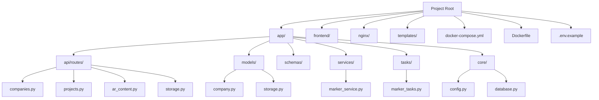
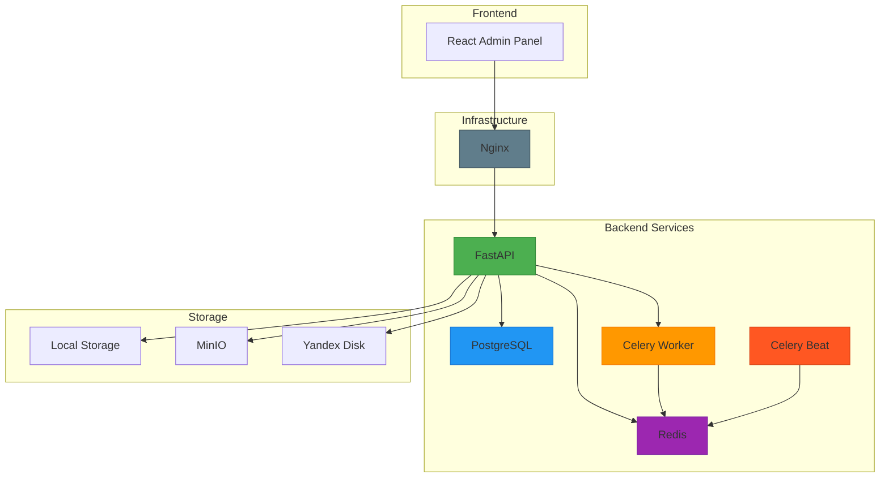
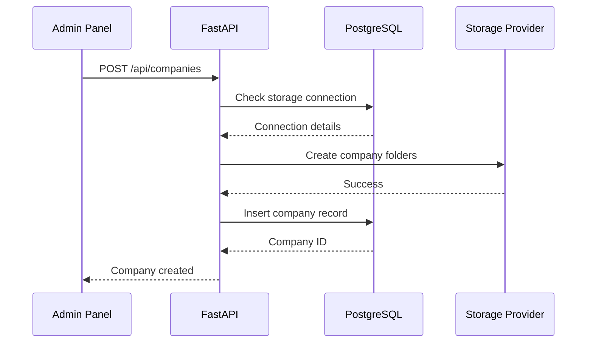
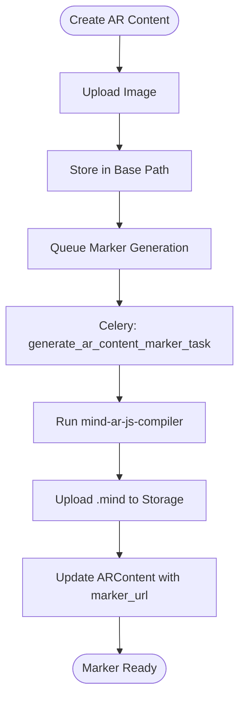
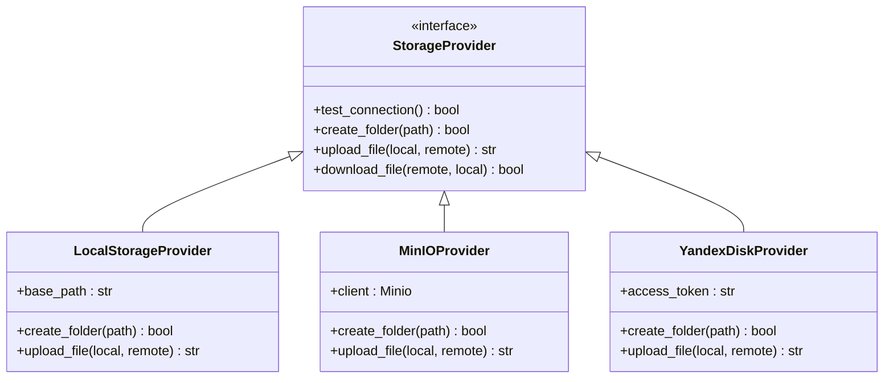
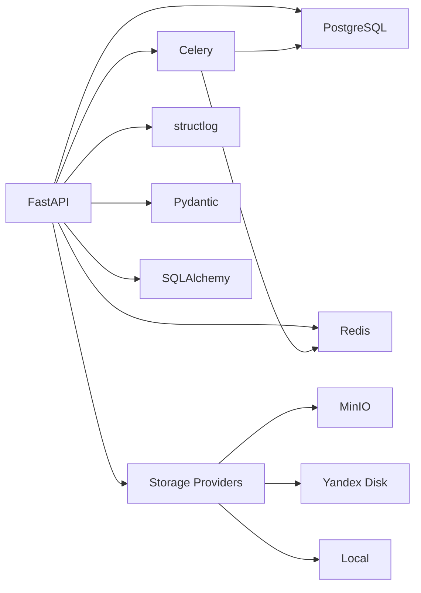

# System Overview

<cite>
**Referenced Files in This Document**   
- [README.md](file://README.md)
- [main.py](file://app/main.py)
- [docker-compose.yml](file://docker-compose.yml)
- [Dockerfile](file://Dockerfile)
- [config.py](file://app/core/config.py)
- [companies.py](file://app/api/routes/companies.py)
- [projects.py](file://app/api/routes/projects.py)
- [ar_content.py](file://app/api/routes/ar_content.py)
- [storage.py](file://app/api/routes/storage.py)
- [marker_tasks.py](file://app/tasks/marker_tasks.py)
- [marker_service.py](file://app/services/marker_service.py)
- [company.py](file://app/models/company.py)
- [storage.py](file://app/models/storage.py)
- [core/storage.py](file://app/core/storage.py)
</cite>

## Table of Contents
1. [Introduction](#introduction)
2. [Project Structure](#project-structure)
3. [Core Components](#core-components)
4. [Architecture Overview](#architecture-overview)
5. [Detailed Component Analysis](#detailed-component-analysis)
6. [Dependency Analysis](#dependency-analysis)
7. [Performance Considerations](#performance-considerations)
8. [Troubleshooting Guide](#troubleshooting-guide)
9. [Conclusion](#conclusion)

## Introduction
The ARV B2B Platform is a SaaS solution designed for creating augmented reality (AR) content using image recognition technology, specifically NFT markers. The platform enables businesses to generate, manage, and deploy AR experiences by uploading images that serve as triggers for AR content such as videos. It supports multiple storage backends including local storage, MinIO, and Yandex Disk, and uses Mind AR for marker generation. The system is built with a FastAPI backend, a React frontend, and leverages Docker, PostgreSQL, Redis, and Celery for infrastructure and task management.

**Section sources**
- [README.md](file://README.md#L1-L149)

## Project Structure
The ARV B2B Platform follows a modular structure with clear separation of concerns. The backend is implemented in Python using FastAPI and organized into core modules such as `api`, `models`, `schemas`, `services`, and `tasks`. The frontend is a React application located in the `frontend` directory. Infrastructure is managed via Docker and Docker Compose, with configuration files defining services for PostgreSQL, Redis, Nginx, and Celery workers. The project also includes Alembic for database migrations and structured logging with structlog.

**Diagram sources**
- [README.md](file://README.md#L38-L57)
- [app/main.py](file://app/main.py#L1-L285)

**Section sources**
- [README.md](file://README.md#L38-L57)

## Core Components
The core components of the ARV B2B Platform include the FastAPI application entry point, database models for companies, projects, and AR content, API routes for managing these entities, and background tasks for marker generation. The system uses SQLAlchemy with async support for database interactions, Pydantic for data validation, and Celery with Redis for asynchronous task processing. Storage connections are abstracted to support multiple providers, and AR marker generation is handled through external compilation using the Mind AR JS compiler.

**Section sources**
- [main.py](file://app/main.py#L1-L285)
- [company.py](file://app/models/company.py#L1-L41)
- [storage.py](file://app/models/storage.py#L1-L81)
- [companies.py](file://app/api/routes/companies.py#L1-L137)
- [ar_content.py](file://app/api/routes/ar_content.py#L1-L184)
- [marker_tasks.py](file://app/tasks/marker_tasks.py#L1-L173)

## Architecture Overview
The ARV B2B Platform follows a microservices-inspired architecture using Docker containers for isolation and scalability. The main components include a FastAPI backend service, PostgreSQL for persistent data storage, Redis for caching and message brokering, Celery workers for background task execution, and Nginx as a reverse proxy. The React frontend is served statically through Nginx. All services communicate over a shared Docker network, with the backend exposing RESTful APIs and the Celery workers consuming tasks from Redis queues.

**Diagram sources**
- [docker-compose.yml](file://docker-compose.yml#L1-L144)
- [Dockerfile](file://Dockerfile#L1-L53)
- [main.py](file://app/main.py#L1-L285)

**Section sources**
- [docker-compose.yml](file://docker-compose.yml#L1-L144)
- [Dockerfile](file://Dockerfile#L1-L53)

## Detailed Component Analysis

### Company Management
The platform allows administrators to create and manage client companies, each with their own storage configuration and quotas. When a company is created, it must be associated with a storage connection (MinIO or Yandex Disk), and corresponding directories are automatically created in the selected storage backend. The system enforces that client companies cannot use the default Vertex AR local storage.

**Diagram sources**
- [companies.py](file://app/api/routes/companies.py#L1-L137)
- [company.py](file://app/models/company.py#L1-L41)

**Section sources**
- [companies.py](file://app/api/routes/companies.py#L1-L137)

### AR Content and Marker Generation
AR content is created by uploading an image that serves as a recognition target (NFT marker). This triggers a background task to generate a `.mind` marker file using the Mind AR compiler. The process involves storing the original image, executing the `npx mind-ar-js-compiler` command, and uploading the resulting marker file to the configured storage backend. The status of marker generation is tracked in the database.

**Diagram sources**
- [ar_content.py](file://app/api/routes/ar_content.py#L1-L184)
- [marker_tasks.py](file://app/tasks/marker_tasks.py#L1-L173)
- [marker_service.py](file://app/services/marker_service.py#L1-L134)

**Section sources**
- [ar_content.py](file://app/api/routes/ar_content.py#L1-L184)
- [marker_tasks.py](file://app/tasks/marker_tasks.py#L1-L173)

### Storage Abstraction Layer
The platform supports multiple storage providers through a factory pattern implementation. Storage connections are defined with provider-specific credentials and can be tested for connectivity. The system currently supports local disk, MinIO (S3-compatible), and Yandex Disk. Each company is associated with a specific storage connection and path, enabling multi-tenancy with isolated storage.

**Diagram sources**
- [storage.py](file://app/api/routes/storage.py#L1-L63)
- [core/storage.py](file://app/core/storage.py#L1-L71)

**Section sources**
- [storage.py](file://app/api/routes/storage.py#L1-L63)
- [core/storage.py](file://app/core/storage.py#L1-L71)

## Dependency Analysis
The ARV B2B Platform has a well-defined dependency graph with clear separation between components. The FastAPI application depends on PostgreSQL for data persistence and Redis for task queuing. Celery workers depend on both Redis (as broker) and PostgreSQL (for database access during task execution). The marker generation functionality depends on Node.js and the `mind-ar-js-compiler` package, which are included in the Docker image. Storage providers are implemented as pluggable components with minimal coupling to the core application.

**Diagram sources**
- [requirements.txt](file://requirements.txt)
- [docker-compose.yml](file://docker-compose.yml#L1-L144)
- [Dockerfile](file://Dockerfile#L1-L53)

**Section sources**
- [docker-compose.yml](file://docker-compose.yml#L1-L144)
- [Dockerfile](file://Dockerfile#L1-L53)

## Performance Considerations
The platform is designed with performance and scalability in mind. Database connections are managed through an async connection pool, and all I/O operations are non-blocking where possible. Marker generation tasks are offloaded to Celery workers to prevent blocking the main API. The system uses structured logging with conditional JSON output in production for efficient log processing. Storage operations are optimized by using direct object storage URLs where possible, and Nginx serves static assets with caching.

[No sources needed since this section provides general guidance]

## Troubleshooting Guide
Common issues in the ARV B2B Platform typically relate to storage connectivity, marker generation failures, or Celery task processing. The system provides health check endpoints at `/api/health/status` and `/api/health/readiness`. Storage connections can be tested via the `/api/storage/connections/{id}/test` endpoint. Failed marker generation tasks can be inspected in the Celery logs, and the database records the status and error details for each AR content item.

**Section sources**
- [main.py](file://app/main.py#L209-L238)
- [storage.py](file://app/api/routes/storage.py#L35-L49)

## Conclusion
The ARV B2B Platform provides a robust foundation for creating and managing augmented reality content through image recognition. Its modular architecture, support for multiple storage backends, and asynchronous task processing make it suitable for enterprise deployment. The integration of Mind AR enables reliable marker-based AR experiences, while the SaaS model supports multi-tenancy with isolated company data. Future enhancements could include enhanced analytics, user management, and additional AR engine integrations.

[No sources needed since this section summarizes without analyzing specific files]