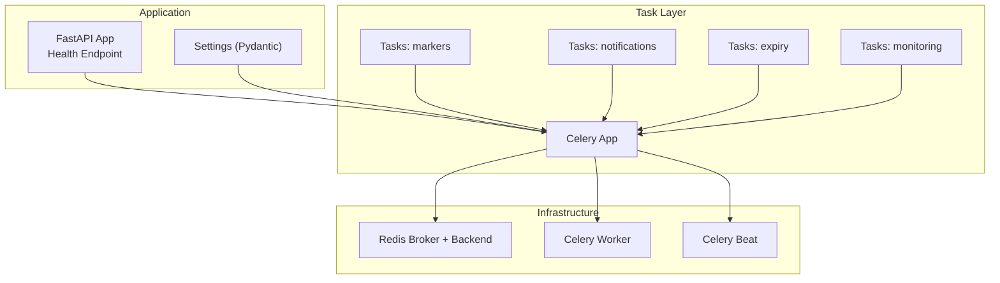
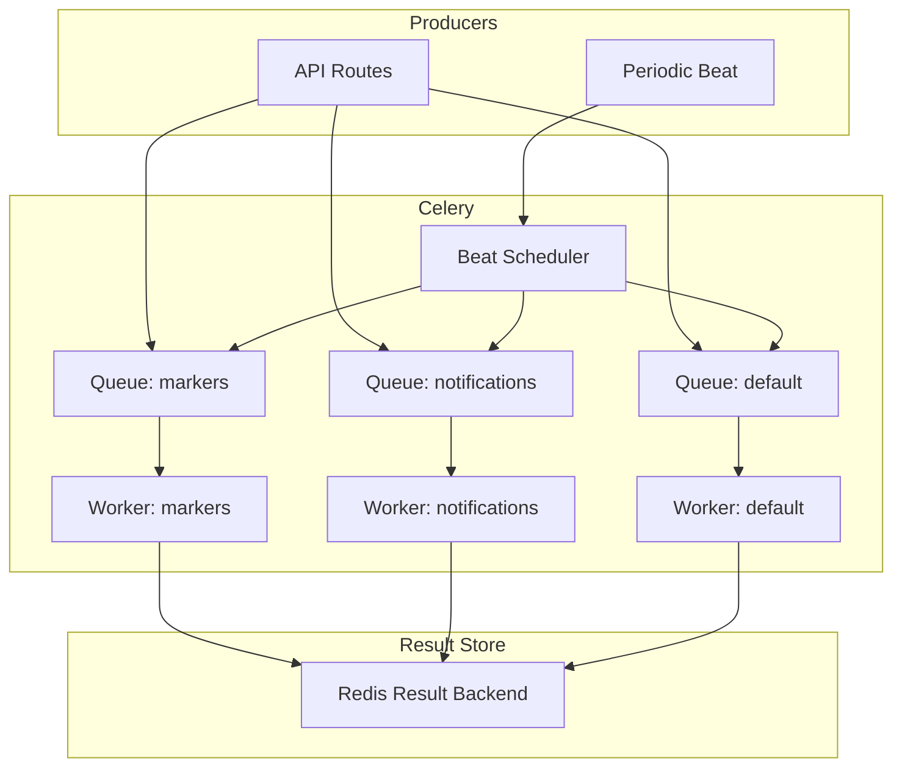
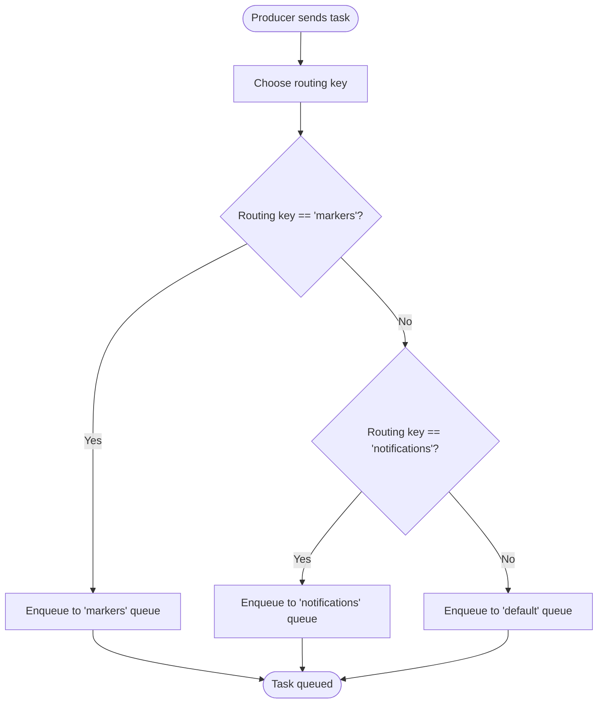
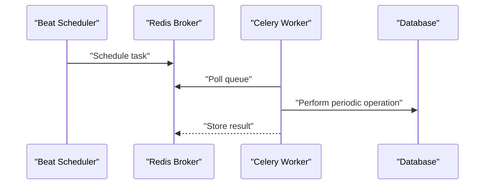
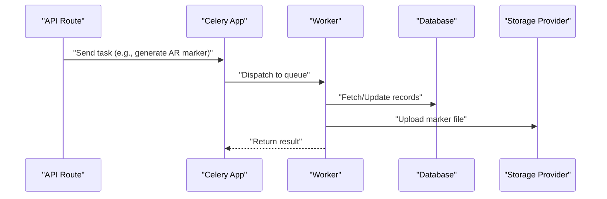
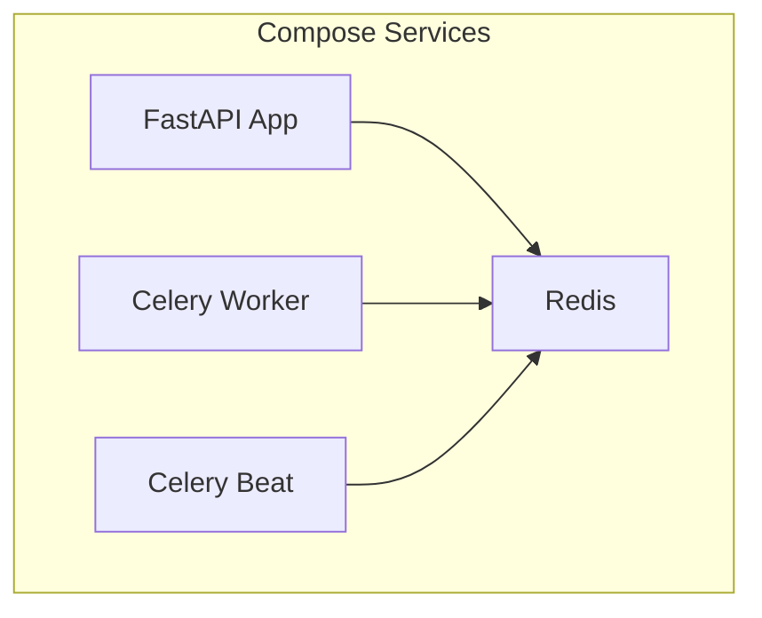
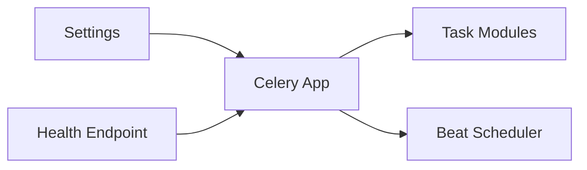

# Celery Configuration

<cite>
**Referenced Files in This Document**
- [celery_app.py](file://app/tasks/celery_app.py)
- [config.py](file://app/core/config.py)
- [marker_tasks.py](file://app/tasks/marker_tasks.py)
- [notification_tasks.py](file://app/tasks/notification_tasks.py)
- [expiry_tasks.py](file://app/tasks/expiry_tasks.py)
- [monitoring.py](file://app/tasks/monitoring.py)
- [docker-compose.yml](file://docker-compose.yml)
- [requirements.txt](file://requirements.txt)
- [health.py](file://app/api/routes/health.py)
</cite>

## Table of Contents
1. [Introduction](#introduction)
2. [Project Structure](#project-structure)
3. [Core Components](#core-components)
4. [Architecture Overview](#architecture-overview)
5. [Detailed Component Analysis](#detailed-component-analysis)
6. [Dependency Analysis](#dependency-analysis)
7. [Performance Considerations](#performance-considerations)
8. [Troubleshooting Guide](#troubleshooting-guide)
9. [Conclusion](#conclusion)
10. [Appendices](#appendices)

## Introduction
This document describes the Celery configuration in the ARV platform, focusing on how the Celery application is initialized with Redis as both the message broker and result backend, the three-queue architecture (markers, notifications, default), routing configuration, serialization and timezone settings, task tracking and time limits, integration with environment variables via Pydantic settings, and operational aspects such as infrastructure requirements for workers and the beat scheduler. It also includes a system diagram showing message flow and best practices for production deployments.

## Project Structure
The Celery configuration is centralized in a dedicated module and integrates with the broader application settings and task modules. The orchestration for running Celery workers and the beat scheduler is defined in the Docker Compose configuration.

**Diagram sources**
- [celery_app.py](file://app/tasks/celery_app.py#L1-L59)
- [config.py](file://app/core/config.py#L90-L110)
- [docker-compose.yml](file://docker-compose.yml#L94-L139)
- [health.py](file://app/api/routes/health.py#L36-L119)

**Section sources**
- [celery_app.py](file://app/tasks/celery_app.py#L1-L59)
- [config.py](file://app/core/config.py#L90-L110)
- [docker-compose.yml](file://docker-compose.yml#L94-L139)

## Core Components
- Celery application initialization and configuration
  - Broker and result backend are set from environment-backed settings.
  - Includes task modules and defines the three queues and routing keys.
  - Sets serialization to JSON, timezone to UTC, enables UTC, and sets time limits and tracking.
  - Defines periodic tasks via Celery Beat schedule.

- Pydantic settings integration
  - Environment variables are loaded from .env and mapped to typed settings.
  - Celery-specific settings include broker URL, result backend, task tracking flag, and task time limit.

- Task modules
  - Marker tasks: generate AR markers and manage asynchronous workflows.
  - Notification tasks: placeholders for expiry checks and messaging.
  - Expiry tasks: project expiration checks, deactivation, and video rotation scheduling.
  - Monitoring tasks: system health checks and alert cooldown management.

**Section sources**
- [celery_app.py](file://app/tasks/celery_app.py#L1-L59)
- [config.py](file://app/core/config.py#L90-L110)
- [marker_tasks.py](file://app/tasks/marker_tasks.py#L1-L173)
- [notification_tasks.py](file://app/tasks/notification_tasks.py#L1-L61)
- [expiry_tasks.py](file://app/tasks/expiry_tasks.py#L1-L178)
- [monitoring.py](file://app/tasks/monitoring.py#L1-L99)

## Architecture Overview
The Celery architecture uses Redis as both the broker and result backend. Tasks are routed to three queues: markers, notifications, and default. Workers consume tasks from these queues, and the beat scheduler triggers periodic tasks according to cron-like schedules.

**Diagram sources**
- [celery_app.py](file://app/tasks/celery_app.py#L1-L59)
- [docker-compose.yml](file://docker-compose.yml#L94-L139)

## Detailed Component Analysis

### Celery Application Initialization and Configuration
- Broker and result backend are configured from settings.
- Included task modules ensure Celery recognizes task definitions.
- Serialization and timezone settings ensure consistent cross-language and cross-timezone processing.
- Queue routing maps routing keys to exchanges and queues.
- Beat schedule defines periodic tasks with cron-like frequencies.

Key configuration highlights:
- Broker and backend URLs are derived from environment variables via settings.
- Task serialization is JSON; accepted content is JSON; result serializer is JSON.
- Timezone is UTC; UTC is enabled.
- Task tracking is enabled; task time limit is set from settings.
- Default queue is set to "default".
- Three queues defined: markers, notifications, default, each with distinct routing keys.

Operational implications:
- Workers must subscribe to the appropriate queues to process tasks.
- Beat runs independently and schedules periodic tasks to queues based on routing.

**Section sources**
- [celery_app.py](file://app/tasks/celery_app.py#L1-L59)
- [config.py](file://app/core/config.py#L90-L110)

### Task Routing and Queues
- Routing keys align with queue names for simplicity.
- Producers can route tasks to specific queues by name or by using the default queue.
- Workers are started with queue subscriptions to match the routing configuration.

**Diagram sources**
- [celery_app.py](file://app/tasks/celery_app.py#L24-L29)

**Section sources**
- [celery_app.py](file://app/tasks/celery_app.py#L24-L29)

### Periodic Tasks and Beat Schedule
- Beat schedules periodic tasks using cron-like schedules.
- Tasks include project expiry checks, content deactivation, video rotation, and monitoring tasks.

**Diagram sources**
- [celery_app.py](file://app/tasks/celery_app.py#L31-L58)
- [docker-compose.yml](file://docker-compose.yml#L120-L139)

**Section sources**
- [celery_app.py](file://app/tasks/celery_app.py#L31-L58)

### Task Modules and Workflows
- Marker tasks:
  - Generate AR markers asynchronously and handle retries with exponential backoff.
  - Manage database updates and storage uploads.
- Notification tasks:
  - Placeholder tasks for expiry checks and messaging.
- Expiry tasks:
  - Check expiring projects, deactivate expired content, and rotate scheduled videos.
- Monitoring tasks:
  - System health checks and alert cooldown management.

**Diagram sources**
- [marker_tasks.py](file://app/tasks/marker_tasks.py#L1-L173)
- [expiry_tasks.py](file://app/tasks/expiry_tasks.py#L1-L178)
- [monitoring.py](file://app/tasks/monitoring.py#L1-L99)

**Section sources**
- [marker_tasks.py](file://app/tasks/marker_tasks.py#L1-L173)
- [notification_tasks.py](file://app/tasks/notification_tasks.py#L1-L61)
- [expiry_tasks.py](file://app/tasks/expiry_tasks.py#L1-L178)
- [monitoring.py](file://app/tasks/monitoring.py#L1-L99)

### Infrastructure Requirements and Deployment
- Redis is used as both broker and result backend.
- Celery worker and beat services are defined in Docker Compose.
- Workers are configured with concurrency and queue subscriptions matching the routing configuration.

**Diagram sources**
- [docker-compose.yml](file://docker-compose.yml#L26-L43)
- [docker-compose.yml](file://docker-compose.yml#L94-L139)

**Section sources**
- [docker-compose.yml](file://docker-compose.yml#L26-L43)
- [docker-compose.yml](file://docker-compose.yml#L94-L139)

## Dependency Analysis
- Celery application depends on settings for broker and backend URLs.
- Task modules depend on the Celery app instance and share configuration.
- Beat depends on the Celery app’s schedule configuration.
- Health endpoint introspects Celery to report queue length and worker status.

**Diagram sources**
- [config.py](file://app/core/config.py#L90-L110)
- [celery_app.py](file://app/tasks/celery_app.py#L1-L59)
- [health.py](file://app/api/routes/health.py#L36-L119)

**Section sources**
- [config.py](file://app/core/config.py#L90-L110)
- [celery_app.py](file://app/tasks/celery_app.py#L1-L59)
- [health.py](file://app/api/routes/health.py#L36-L119)

## Performance Considerations
- Concurrency and queues: Workers are configured with a concurrency level and subscribed to all queues. Adjust concurrency and spawn multiple workers per queue for load distribution.
- Time limits: Task time limits are enforced; long-running tasks should be split or reconfigured.
- Serialization: JSON serialization is lightweight and compatible; ensure payload sizes remain reasonable.
- Result backend: Redis stores results; tune retention and memory policies for production.
- Health checks: Use the health endpoint to monitor queue lengths and worker availability.

[No sources needed since this section provides general guidance]

## Troubleshooting Guide
- Verify environment variables for broker and result backend are correctly set.
- Confirm Redis is reachable and healthy.
- Check that workers are subscribed to the correct queues.
- Inspect the health endpoint for Celery queue length and worker status.
- Review task logs for retry counts and error messages.

**Section sources**
- [config.py](file://app/core/config.py#L90-L110)
- [docker-compose.yml](file://docker-compose.yml#L94-L139)
- [health.py](file://app/api/routes/health.py#L36-L119)

## Conclusion
The ARV platform uses Celery with Redis as the broker and result backend, organized around a three-queue architecture aligned with task types. Configuration is driven by Pydantic settings, enabling environment-driven deployment. The beat scheduler automates periodic maintenance tasks, while workers consume tasks from queues. Production readiness requires careful tuning of concurrency, queue subscriptions, and monitoring.

[No sources needed since this section summarizes without analyzing specific files]

## Appendices

### Configuration Reference
- Broker URL and result backend URL are sourced from environment variables via settings.
- Task tracking is enabled; task time limit is configurable.
- Serialization: JSON for tasks, results, and accepted content.
- Timezone: UTC; UTC enabled.
- Default queue: default.
- Queues: markers, notifications, default with routing keys.

**Section sources**
- [config.py](file://app/core/config.py#L90-L110)
- [celery_app.py](file://app/tasks/celery_app.py#L14-L30)

### Dependencies and Versions
- Celery and Redis are included in requirements.
- Docker Compose defines Redis, Celery worker, and Celery beat services.

**Section sources**
- [requirements.txt](file://requirements.txt#L1-L33)
- [docker-compose.yml](file://docker-compose.yml#L26-L43)
- [docker-compose.yml](file://docker-compose.yml#L94-L139)