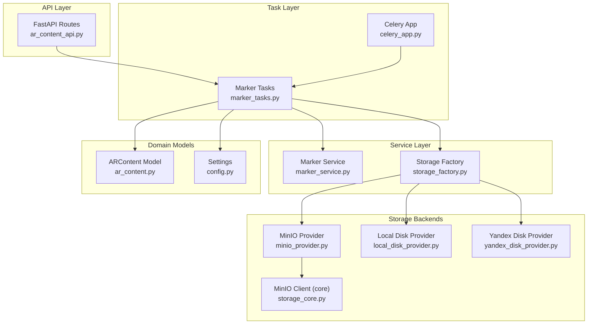
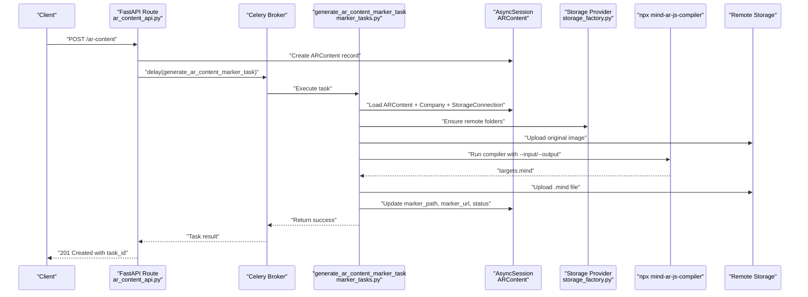
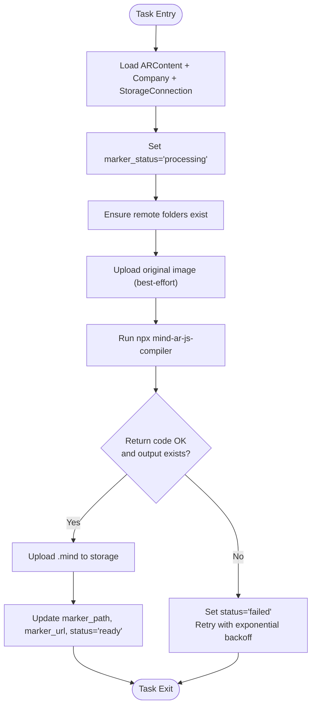
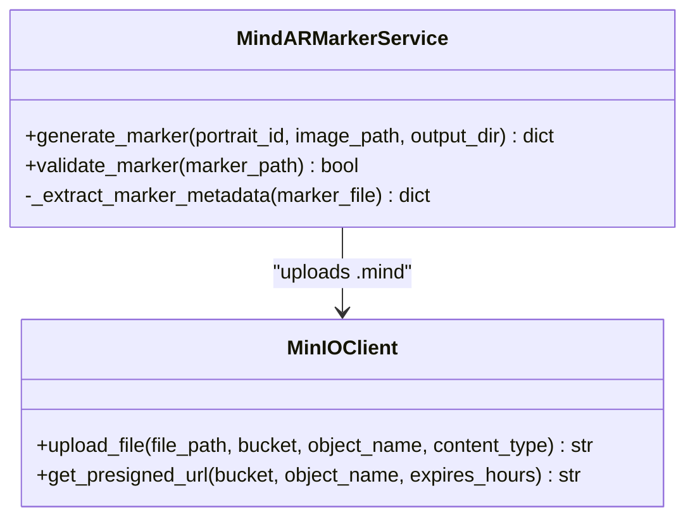
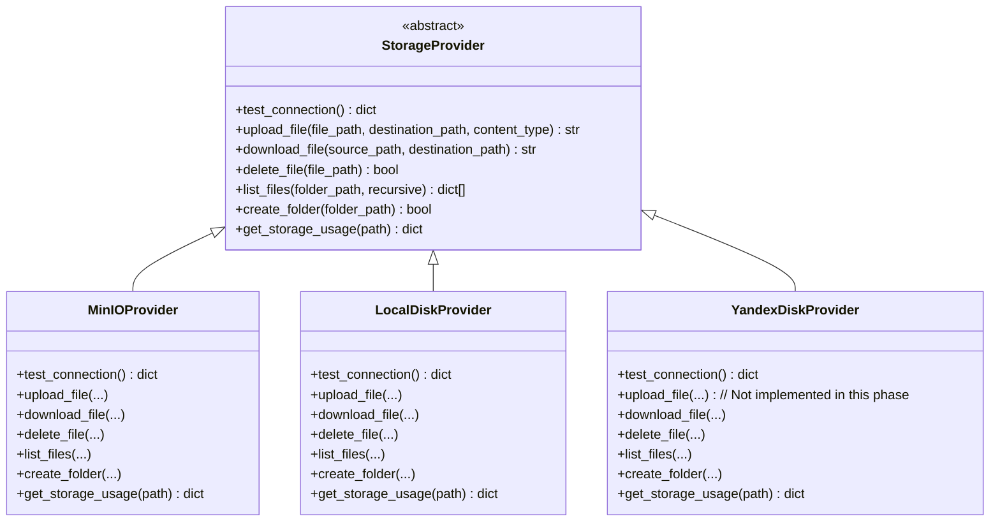
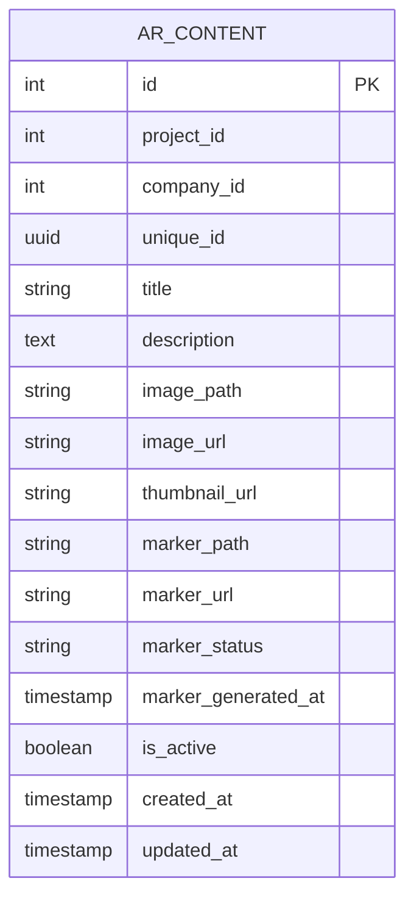
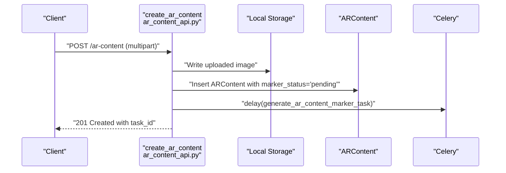
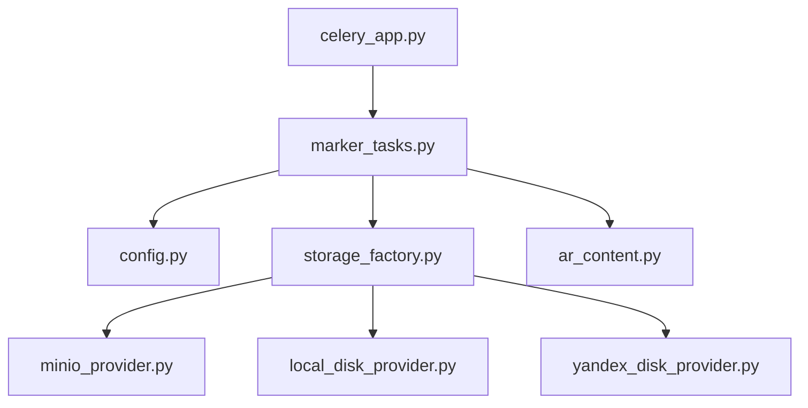

# Marker Generation Tasks

<cite>
**Referenced Files in This Document**
- [marker_tasks.py](file://app/tasks/marker_tasks.py)
- [marker_service.py](file://app/services/marker_service.py)
- [ar_content.py](file://app/models/ar_content.py)
- [ar_content_api.py](file://app/api/routes/ar_content.py)
- [storage_factory.py](file://app/services/storage/factory.py)
- [storage_core.py](file://app/core/storage.py)
- [storage_base.py](file://app/services/storage/providers/base.py)
- [minio_provider.py](file://app/services/storage/providers/minio_provider.py)
- [local_disk_provider.py](file://app/services/storage/providers/local_disk_provider.py)
- [yandex_disk_provider.py](file://app/services/storage/providers/yandex_disk_provider.py)
- [config.py](file://app/core/config.py)
- [celery_app.py](file://app/tasks/celery_app.py)
</cite>

## Table of Contents
1. [Introduction](#introduction)
2. [Project Structure](#project-structure)
3. [Core Components](#core-components)
4. [Architecture Overview](#architecture-overview)
5. [Detailed Component Analysis](#detailed-component-analysis)
6. [Dependency Analysis](#dependency-analysis)
7. [Performance Considerations](#performance-considerations)
8. [Troubleshooting Guide](#troubleshooting-guide)
9. [Conclusion](#conclusion)

## Introduction
This document explains the AR marker generation task system that compiles MindAR marker files from portrait images. It focuses on the implementation of the task that generates MindAR targets (.mind) using the external compiler, the asynchronous execution pattern with asyncio event loops, storage integration for uploading original images and marker files, and robust error handling with exponential backoff retry logic. It also covers the end-to-end workflow from task invocation to marker file generation, storage, and database updates, along with security considerations and performance optimization tips.

## Project Structure
The marker generation system spans several layers:
- API layer: exposes endpoints to create AR content and trigger marker generation.
- Task layer: Celery tasks orchestrate asynchronous processing and integrate with storage and database.
- Service layer: provides reusable logic for marker generation and storage operations.
- Storage abstraction: provider-based storage backends (MinIO, local disk, Yandex Disk).
- Configuration: settings for compiler parameters and storage endpoints.

**Diagram sources**
- [ar_content_api.py](file://app/api/routes/ar_content.py#L24-L71)
- [celery_app.py](file://app/tasks/celery_app.py#L1-L59)
- [marker_tasks.py](file://app/tasks/marker_tasks.py#L92-L173)
- [marker_service.py](file://app/services/marker_service.py#L13-L134)
- [storage_factory.py](file://app/services/storage/factory.py#L8-L31)
- [minio_provider.py](file://app/services/storage/providers/minio_provider.py#L1-L104)
- [local_disk_provider.py](file://app/services/storage/providers/local_disk_provider.py#L1-L209)
- [yandex_disk_provider.py](file://app/services/storage/providers/yandex_disk_provider.py#L1-L110)
- [storage_core.py](file://app/core/storage.py#L1-L71)
- [ar_content.py](file://app/models/ar_content.py#L1-L46)
- [config.py](file://app/core/config.py#L27-L30)

**Section sources**
- [marker_tasks.py](file://app/tasks/marker_tasks.py#L92-L173)
- [ar_content_api.py](file://app/api/routes/ar_content.py#L24-L71)
- [storage_factory.py](file://app/services/storage/factory.py#L8-L31)
- [config.py](file://app/core/config.py#L27-L30)

## Core Components
- generate_ar_content_marker_task: The Celery task that orchestrates the end-to-end workflow for generating a MindAR marker from an AR content record.
- MindARMarkerService: A service that encapsulates marker generation using the external compiler and uploads the result to storage.
- Storage providers: Abstractions for MinIO, local disk, and Yandex Disk, with a factory that selects the appropriate provider based on company storage configuration.
- ARContent model: Domain model representing AR content records with marker-related fields and status.
- FastAPI route: Creates AR content and triggers the marker generation task asynchronously.

Key responsibilities:
- Asynchronous execution: Uses asyncio event loops inside Celery tasks to run async database sessions and subprocesses.
- Compiler integration: Invokes the external MindAR compiler via npx and validates output.
- Storage integration: Ensures remote folders exist, uploads original images and generated .mind files, and returns public URLs.
- Database updates: Persists marker metadata, URLs, and status transitions.
- Error handling: Implements retries with exponential backoff and graceful failure handling.

**Section sources**
- [marker_tasks.py](file://app/tasks/marker_tasks.py#L92-L173)
- [marker_service.py](file://app/services/marker_service.py#L13-L134)
- [storage_factory.py](file://app/services/storage/factory.py#L8-L31)
- [ar_content.py](file://app/models/ar_content.py#L1-L46)
- [ar_content_api.py](file://app/api/routes/ar_content.py#L24-L71)

## Architecture Overview
The system follows a task-driven architecture:
- An HTTP request creates an AR content record and enqueues a Celery task.
- The task loads company and storage connection details, ensures remote folders, uploads the original image, runs the MindAR compiler, uploads the .mind file, and updates the database.
- The service layer centralizes compiler invocation and metadata extraction for portaits.

**Diagram sources**
- [ar_content_api.py](file://app/api/routes/ar_content.py#L24-L71)
- [marker_tasks.py](file://app/tasks/marker_tasks.py#L92-L173)
- [storage_factory.py](file://app/services/storage/factory.py#L8-L31)

## Detailed Component Analysis

### generate_ar_content_marker_task
This task performs the complete marker generation pipeline:
- Loads AR content, company, and storage connection.
- Updates status to processing.
- Ensures remote folders exist (portraits, markers, videos, QR codes, thumbnails).
- Uploads the original image to the remote storage (best-effort).
- Invokes the MindAR compiler with configured parameters.
- Uploads the generated .mind file to storage.
- Updates AR content with marker metadata and status.

Asynchronous execution pattern:
- Creates a new asyncio event loop, sets it, runs the async coroutine, and closes the loop.
- Uses async database session for ORM operations.
- Uses asyncio subprocess to run the compiler and capture output.

Error handling:
- On exceptions, sets status to failed and retries with exponential backoff using Celery’s built-in retry mechanism.

**Diagram sources**
- [marker_tasks.py](file://app/tasks/marker_tasks.py#L92-L173)

**Section sources**
- [marker_tasks.py](file://app/tasks/marker_tasks.py#L92-L173)

### MindARMarkerService
This service encapsulates marker generation for portrait-based content:
- Generates a unique output directory per portrait.
- Invokes the compiler with input image and max-features setting.
- Validates output existence and uploads to storage.
- Extracts metadata (file size) and returns structured results.

**Diagram sources**
- [marker_service.py](file://app/services/marker_service.py#L13-L134)
- [storage_core.py](file://app/core/storage.py#L1-L71)

**Section sources**
- [marker_service.py](file://app/services/marker_service.py#L13-L134)

### Storage Provider Abstraction
The storage layer abstracts provider-specific implementations:
- StorageProvider defines the contract for test_connection, upload_file, download_file, delete_file, list_files, create_folder, and get_storage_usage.
- MinIOProvider integrates with MinIO using sync SDK calls executed in threads.
- LocalDiskProvider manages local filesystem paths and returns URLs.
- YandexDiskProvider supports listing and folder creation via Yandex Cloud API.

**Diagram sources**
- [storage_base.py](file://app/services/storage/providers/base.py#L1-L47)
- [minio_provider.py](file://app/services/storage/providers/minio_provider.py#L1-L104)
- [local_disk_provider.py](file://app/services/storage/providers/local_disk_provider.py#L1-L209)
- [yandex_disk_provider.py](file://app/services/storage/providers/yandex_disk_provider.py#L1-L110)

**Section sources**
- [storage_base.py](file://app/services/storage/providers/base.py#L1-L47)
- [minio_provider.py](file://app/services/storage/providers/minio_provider.py#L1-L104)
- [local_disk_provider.py](file://app/services/storage/providers/local_disk_provider.py#L1-L209)
- [yandex_disk_provider.py](file://app/services/storage/providers/yandex_disk_provider.py#L1-L110)

### ARContent Model
The AR content domain model tracks:
- Identity and association fields (project_id, company_id, unique_id).
- Image and thumbnail URLs.
- Marker fields (marker_path, marker_url, marker_status, marker_generated_at).
- Metadata and timestamps.

**Diagram sources**
- [ar_content.py](file://app/models/ar_content.py#L1-L46)

**Section sources**
- [ar_content.py](file://app/models/ar_content.py#L1-L46)

### API Integration
The FastAPI route:
- Receives multipart/form-data for image upload.
- Saves the image locally and persists an ARContent record.
- Sets initial marker_status to pending.
- Enqueues the marker generation task and returns a task identifier.

**Diagram sources**
- [ar_content_api.py](file://app/api/routes/ar_content.py#L24-L71)

**Section sources**
- [ar_content_api.py](file://app/api/routes/ar_content.py#L24-L71)

## Dependency Analysis
- Celery configuration defines queues and schedules; the marker task is included in the Celery app.
- The marker task depends on:
  - Async database session for ORM operations.
  - Storage factory to resolve the appropriate provider based on company storage connection.
  - Settings for compiler parameters.
  - External subprocess invocation for the MindAR compiler.

**Diagram sources**
- [celery_app.py](file://app/tasks/celery_app.py#L1-L59)
- [marker_tasks.py](file://app/tasks/marker_tasks.py#L92-L173)
- [storage_factory.py](file://app/services/storage/factory.py#L8-L31)
- [config.py](file://app/core/config.py#L27-L30)
- [ar_content.py](file://app/models/ar_content.py#L1-L46)

**Section sources**
- [celery_app.py](file://app/tasks/celery_app.py#L1-L59)
- [marker_tasks.py](file://app/tasks/marker_tasks.py#L92-L173)
- [storage_factory.py](file://app/services/storage/factory.py#L8-L31)
- [config.py](file://app/core/config.py#L27-L30)
- [ar_content.py](file://app/models/ar_content.py#L1-L46)

## Performance Considerations
- Compiler parameters:
  - Adjust MINDAR_MAX_FEATURES to balance quality and performance. Higher values increase computation time and marker size.
- Large image handling:
  - Prefer smaller, optimized images to reduce compilation time and storage footprint.
  - Ensure adequate disk space for temporary output files during compilation.
- Storage throughput:
  - For MinIO, ensure network bandwidth and latency are acceptable for uploads.
  - Consider pre-uploading images to remote storage to avoid redundant transfers.
- Concurrency:
  - Tune Celery worker concurrency and queue routing to handle bursts of marker generation tasks.
- Caching:
  - Reuse previously generated markers when the same image is processed again.

[No sources needed since this section provides general guidance]

## Troubleshooting Guide
Common issues and resolutions:
- Compiler failures:
  - Verify that npx and mind-ar-js-compiler are installed and accessible in the environment where Celery workers run.
  - Check stderr output captured during subprocess execution for detailed error messages.
  - Confirm input image path validity and permissions.
- Storage connection errors:
  - For MinIO, ensure endpoint, credentials, and bucket policies are correct.
  - For local disk, confirm base_path exists and is writable.
  - For Yandex Disk, note that upload is not implemented in this phase; use MinIO or local disk for uploads.
- Timeout handling:
  - Increase Celery task time limit if compilation takes longer than default.
  - Monitor task execution logs for long-running processes.
- Exponential backoff:
  - The task retries on failure with exponential backoff; monitor retry counts and investigate root causes.
- Database updates:
  - Ensure AR content record exists and marker_status transitions are persisted correctly.

Debugging steps:
- Inspect task logs for the task_id returned by the API.
- Review storage provider logs for upload/download operations.
- Validate compiler command-line arguments and output directory permissions.

**Section sources**
- [marker_tasks.py](file://app/tasks/marker_tasks.py#L92-L173)
- [marker_service.py](file://app/services/marker_service.py#L13-L134)
- [storage_core.py](file://app/core/storage.py#L1-L71)
- [minio_provider.py](file://app/services/storage/providers/minio_provider.py#L1-L104)
- [local_disk_provider.py](file://app/services/storage/providers/local_disk_provider.py#L1-L209)
- [yandex_disk_provider.py](file://app/services/storage/providers/yandex_disk_provider.py#L1-L110)

## Conclusion
The marker generation system integrates FastAPI, Celery, async database sessions, and a provider-based storage abstraction to reliably compile MindAR markers from portrait images. It employs asynchronous subprocess execution, robust error handling with retries, and structured database updates. By tuning compiler parameters, optimizing image sizes, and selecting appropriate storage backends, teams can achieve scalable and efficient marker generation at scale.