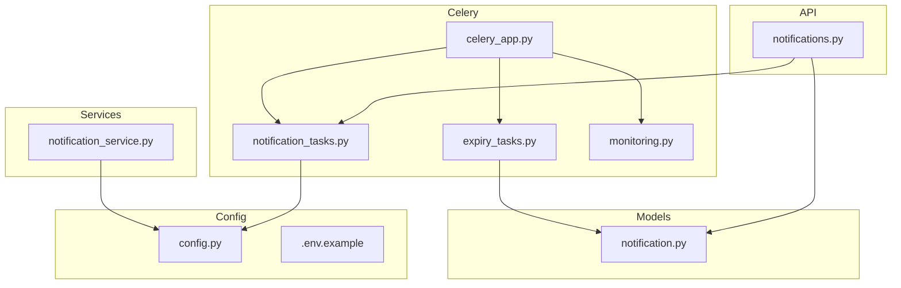
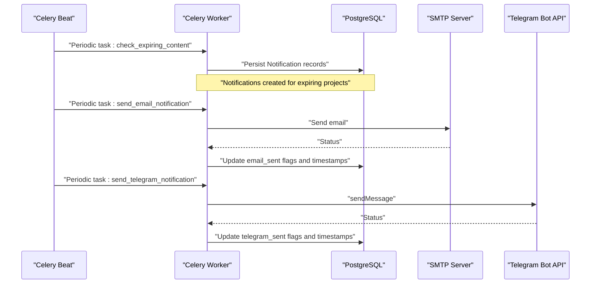
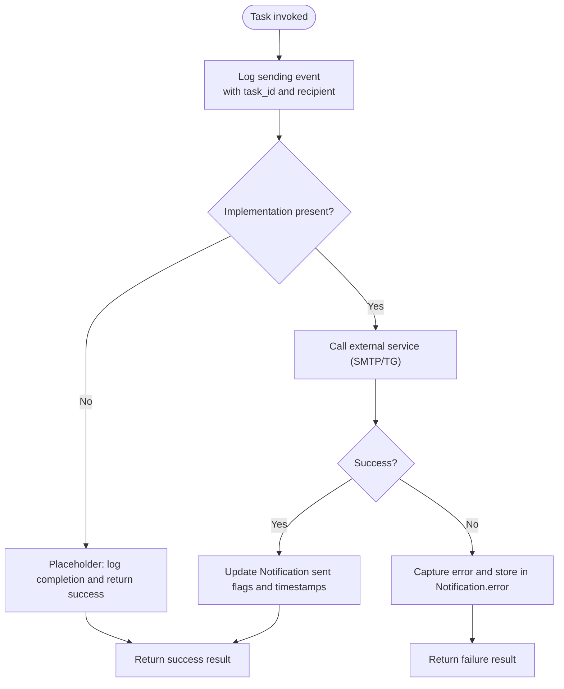
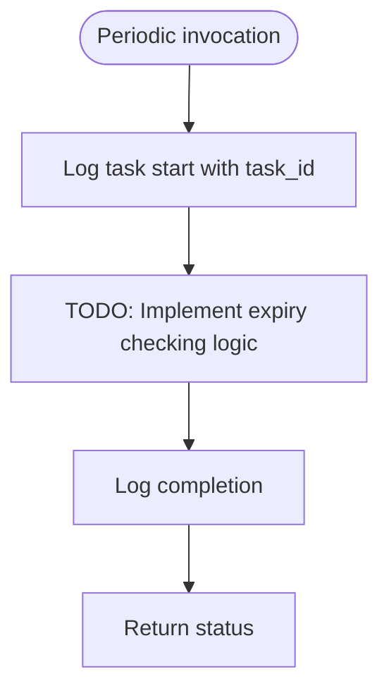
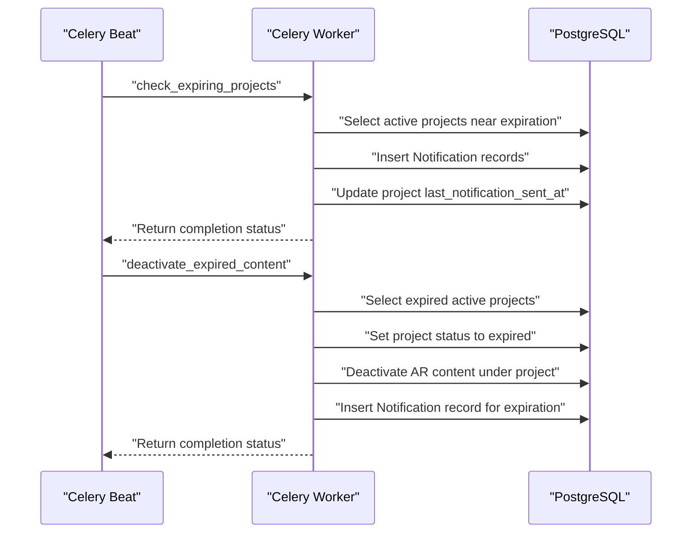
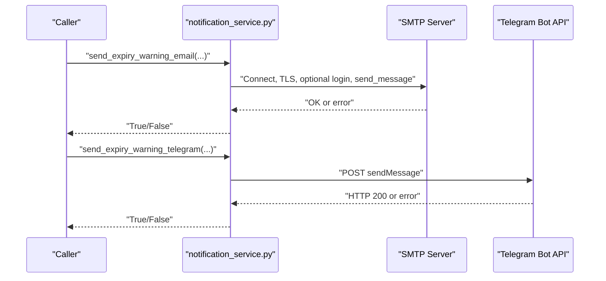
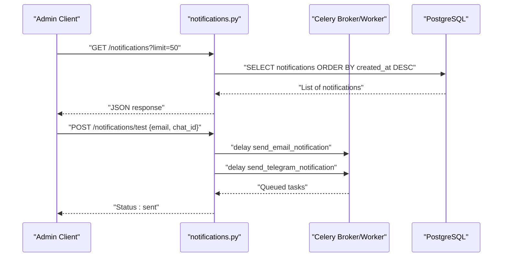
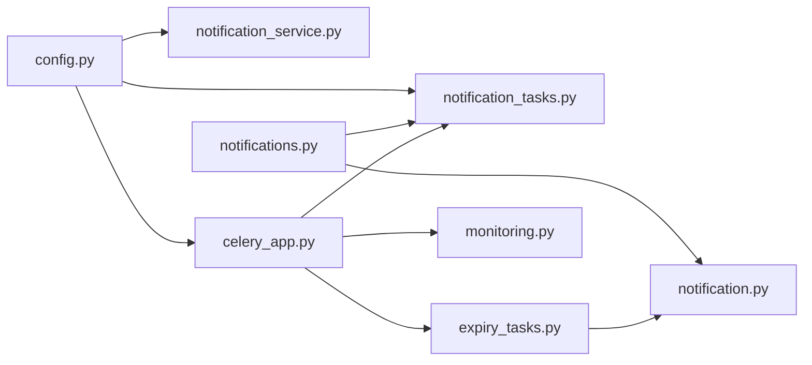

# Notification Tasks

<cite>
**Referenced Files in This Document**
- [notification_tasks.py](file://app/tasks/notification_tasks.py)
- [notification_service.py](file://app/services/notification_service.py)
- [expiry_tasks.py](file://app/tasks/expiry_tasks.py)
- [notification.py](file://app/models/notification.py)
- [notifications.py](file://app/api/routes/notifications.py)
- [celery_app.py](file://app/tasks/celery_app.py)
- [config.py](file://app/core/config.py)
- [monitoring.py](file://app/tasks/monitoring.py)
- [.env.example](file://.env.example)
</cite>

## Table of Contents
1. [Introduction](#introduction)
2. [Project Structure](#project-structure)
3. [Core Components](#core-components)
4. [Architecture Overview](#architecture-overview)
5. [Detailed Component Analysis](#detailed-component-analysis)
6. [Dependency Analysis](#dependency-analysis)
7. [Performance Considerations](#performance-considerations)
8. [Troubleshooting Guide](#troubleshooting-guide)
9. [Conclusion](#conclusion)
10. [Appendices](#appendices)

## Introduction
This document describes the notification task system, focusing on the implementation of send_email_notification and send_telegram_notification tasks, the planned integration with external services (SMTP and Telegram), and the role of check_expiring_content in triggering notifications for content nearing expiration. It also covers logging patterns, error handling, message flow, reliability considerations (retry, delivery confirmation, rate limiting), and configuration guidelines for notification channels and templates, including security practices for handling credentials.

## Project Structure
The notification system spans several modules:
- Task orchestration and scheduling via Celery
- Notification tasks for email and Telegram
- Expiration-triggered notifications
- Persistence model for notifications
- API endpoints for testing and listing notifications
- Configuration for SMTP and Telegram credentials
- Monitoring and alerting for reliability

**Diagram sources**
- [celery_app.py](file://app/tasks/celery_app.py#L1-L59)
- [notification_tasks.py](file://app/tasks/notification_tasks.py#L1-L61)
- [expiry_tasks.py](file://app/tasks/expiry_tasks.py#L1-L178)
- [notification_service.py](file://app/services/notification_service.py#L1-L81)
- [notification.py](file://app/models/notification.py#L1-L32)
- [notifications.py](file://app/api/routes/notifications.py#L1-L40)
- [config.py](file://app/core/config.py#L78-L90)
- [.env.example](file://.env.example#L35-L46)

**Section sources**
- [celery_app.py](file://app/tasks/celery_app.py#L1-L59)
- [notification_tasks.py](file://app/tasks/notification_tasks.py#L1-L61)
- [notification_service.py](file://app/services/notification_service.py#L1-L81)
- [expiry_tasks.py](file://app/tasks/expiry_tasks.py#L1-L178)
- [notification.py](file://app/models/notification.py#L1-L32)
- [notifications.py](file://app/api/routes/notifications.py#L1-L40)
- [config.py](file://app/core/config.py#L78-L90)
- [.env.example](file://.env.example#L35-L46)

## Core Components
- Celery application and queues: Defines broker/backend, queues, and periodic tasks including check_expiring_content.
- Notification tasks: Placeholder tasks for email and Telegram notifications with logging and return values.
- Expiration tasks: Creates Notification records for expiring projects and updates project cooldown timestamps.
- Notification service: Implements SMTP email and Telegram messaging APIs.
- Notification model: Stores notification metadata, sent flags, timestamps, and errors.
- API routes: Test endpoints to trigger email/Telegram tasks and list stored notifications.

Key responsibilities:
- Queue and schedule notifications
- Persist notification records
- Integrate with external services
- Log events and handle errors
- Provide admin endpoints for testing and inspection

**Section sources**
- [celery_app.py](file://app/tasks/celery_app.py#L1-L59)
- [notification_tasks.py](file://app/tasks/notification_tasks.py#L1-L61)
- [notification_service.py](file://app/services/notification_service.py#L1-L81)
- [expiry_tasks.py](file://app/tasks/expiry_tasks.py#L55-L92)
- [notification.py](file://app/models/notification.py#L1-L32)
- [notifications.py](file://app/api/routes/notifications.py#L13-L40)

## Architecture Overview
The notification system uses Celery workers to execute tasks asynchronously. Expiration tasks write Notification records to the database. Email and Telegram tasks are placeholders that will integrate with external services. The API exposes endpoints to test notifications and list recent entries.

**Diagram sources**
- [celery_app.py](file://app/tasks/celery_app.py#L31-L58)
- [notification_tasks.py](file://app/tasks/notification_tasks.py#L7-L61)
- [notification_service.py](file://app/services/notification_service.py#L13-L81)
- [notification.py](file://app/models/notification.py#L1-L32)

## Detailed Component Analysis

### Notification Tasks: send_email_notification and send_telegram_notification
- Purpose: Asynchronous tasks to send email and Telegram messages.
- Parameters:
  - send_email_notification: email, subject, body (HTML)
  - send_telegram_notification: chat_id, message
- Logging: Structured logs include task_id and recipient identifiers during sending and completion.
- Error handling: Currently placeholders; returns success-like results and logs informational events. Future implementations should capture exceptions and persist errors to the Notification model.

**Diagram sources**
- [notification_tasks.py](file://app/tasks/notification_tasks.py#L24-L61)
- [notification.py](file://app/models/notification.py#L18-L32)

**Section sources**
- [notification_tasks.py](file://app/tasks/notification_tasks.py#L24-L61)
- [notification.py](file://app/models/notification.py#L18-L32)

### Expiration-triggered Notifications: check_expiring_content
- Role: Periodic task scheduled by Celery Beat to check for content nearing expiration and trigger notifications.
- Current state: Placeholder with TODO comments indicating future implementation.
- Expected behavior: Scan for expiring content, create Notification records, and coordinate with send_email_notification and send_telegram_notification.

**Diagram sources**
- [notification_tasks.py](file://app/tasks/notification_tasks.py#L7-L22)

**Section sources**
- [notification_tasks.py](file://app/tasks/notification_tasks.py#L7-L22)

### Expiration Tasks: check_expiring_projects and deactivate_expired_content
- Purpose: Identify projects expiring soon and mark expired content inactive, respectively.
- Behavior:
  - check_expiring_projects: Selects active projects whose expiration date falls within a defined window and creates Notification records with metadata. Also updates project cooldown timestamps.
  - deactivate_expired_content: Marks expired projects as expired and deactivates associated AR content; optionally creates Notification records for expiration events.
- Persistence: Uses SQLAlchemy ORM to create Notification entries and update project fields.

**Diagram sources**
- [expiry_tasks.py](file://app/tasks/expiry_tasks.py#L55-L129)
- [notification.py](file://app/models/notification.py#L1-L32)

**Section sources**
- [expiry_tasks.py](file://app/tasks/expiry_tasks.py#L55-L129)
- [notification.py](file://app/models/notification.py#L1-L32)

### Notification Service: SMTP and Telegram Messaging
- Email:
  - Uses Python’s SMTP library to connect to the configured SMTP host/port.
  - Supports TLS and optional authentication using username/password.
  - Logs success or failure with structured events.
- Telegram:
  - Uses an asynchronous HTTP client to call the Telegram Bot API sendMessage endpoint.
  - Parses response status to determine success and logs accordingly.
- Configuration:
  - SMTP_HOST, SMTP_PORT, SMTP_USERNAME, SMTP_PASSWORD, SMTP_FROM_EMAIL
  - TELEGRAM_BOT_TOKEN

**Diagram sources**
- [notification_service.py](file://app/services/notification_service.py#L13-L81)
- [config.py](file://app/core/config.py#L78-L90)
- [.env.example](file://.env.example#L35-L46)

**Section sources**
- [notification_service.py](file://app/services/notification_service.py#L13-L81)
- [config.py](file://app/core/config.py#L78-L90)
- [.env.example](file://.env.example#L35-L46)

### API Routes for Testing and Listing Notifications
- GET /notifications: Lists recent Notification records with fields indicating sent status and timestamps.
- POST /notifications/test: Triggers send_email_notification and send_telegram_notification with provided parameters.

**Diagram sources**
- [notifications.py](file://app/api/routes/notifications.py#L13-L40)
- [notification_tasks.py](file://app/tasks/notification_tasks.py#L24-L61)
- [notification.py](file://app/models/notification.py#L1-L32)

**Section sources**
- [notifications.py](file://app/api/routes/notifications.py#L13-L40)
- [notification_tasks.py](file://app/tasks/notification_tasks.py#L24-L61)
- [notification.py](file://app/models/notification.py#L1-L32)

## Dependency Analysis
- Celery configuration defines queues and periodic tasks, including check_expiring_content.
- Notification tasks depend on Celery app and structlog for logging.
- Expiration tasks depend on SQLAlchemy models and create Notification records.
- Notification service depends on configuration settings for SMTP and Telegram.
- API routes depend on notification tasks and the Notification model.

**Diagram sources**
- [config.py](file://app/core/config.py#L78-L90)
- [notification_service.py](file://app/services/notification_service.py#L1-L81)
- [notification_tasks.py](file://app/tasks/notification_tasks.py#L1-L61)
- [celery_app.py](file://app/tasks/celery_app.py#L1-L59)
- [expiry_tasks.py](file://app/tasks/expiry_tasks.py#L1-L178)
- [notification.py](file://app/models/notification.py#L1-L32)
- [notifications.py](file://app/api/routes/notifications.py#L1-L40)
- [monitoring.py](file://app/tasks/monitoring.py#L1-L99)

**Section sources**
- [celery_app.py](file://app/tasks/celery_app.py#L1-L59)
- [notification_tasks.py](file://app/tasks/notification_tasks.py#L1-L61)
- [notification_service.py](file://app/services/notification_service.py#L1-L81)
- [expiry_tasks.py](file://app/tasks/expiry_tasks.py#L1-L178)
- [notification.py](file://app/models/notification.py#L1-L32)
- [notifications.py](file://app/api/routes/notifications.py#L1-L40)
- [monitoring.py](file://app/tasks/monitoring.py#L1-L99)

## Performance Considerations
- Queue isolation: Celery queues are defined for markers, notifications, and default. Dedicated queues help isolate traffic and improve throughput.
- Task serialization: JSON serialization ensures compatibility and reduces overhead.
- Time limits: Configurable task time limits prevent long-running tasks from blocking workers.
- Rate limiting:
  - SMTP: Respect provider rate limits and consider batching emails.
  - Telegram: Respect bot API rate limits; consider backoff and retries.
- Backlog monitoring: Health checks track queue lengths and system metrics to detect bottlenecks early.

[No sources needed since this section provides general guidance]

## Troubleshooting Guide
Common issues and remedies:
- Missing credentials:
  - Verify SMTP_HOST, SMTP_PORT, SMTP_USERNAME, SMTP_PASSWORD, SMTP_FROM_EMAIL and TELEGRAM_BOT_TOKEN in environment configuration.
- Delivery failures:
  - Inspect Notification.error fields for detailed error messages.
  - Review task logs for error events emitted by notification_service and notification_tasks.
- Queue congestion:
  - Monitor queue length via health checks and adjust worker concurrency or add more workers.
- Rate limiting:
  - Implement exponential backoff and retry logic in tasks; consider throttling to match provider limits.

**Section sources**
- [notification_service.py](file://app/services/notification_service.py#L37-L48)
- [notification_service.py](file://app/services/notification_service.py#L72-L80)
- [notification.py](file://app/models/notification.py#L18-L32)
- [monitoring.py](file://app/tasks/monitoring.py#L13-L91)

## Conclusion
The notification task system currently provides a framework for queuing and scheduling email and Telegram notifications, with persistence of notification records and basic logging. The check_expiring_content task is a placeholder awaiting implementation. SMTP and Telegram integrations are defined in the notification service and configuration. To achieve production readiness, implement the placeholder tasks, add robust error handling and retries, enforce rate limits, and integrate delivery confirmations.

[No sources needed since this section summarizes without analyzing specific files]

## Appendices

### Configuration Guidelines
- SMTP:
  - Set SMTP_HOST, SMTP_PORT, SMTP_USERNAME, SMTP_PASSWORD, SMTP_FROM_EMAIL.
  - Use app-specific sender addresses and secure credentials.
- Telegram:
  - Set TELEGRAM_BOT_TOKEN and TELEGRAM_ADMIN_CHAT_ID.
  - Ensure bot permissions to send messages to the configured chat.
- Celery:
  - Configure broker and result backend URLs.
  - Adjust task_time_limit and queue settings as needed.

**Section sources**
- [config.py](file://app/core/config.py#L78-L90)
- [.env.example](file://.env.example#L35-L46)
- [celery_app.py](file://app/tasks/celery_app.py#L1-L29)

### Security Practices for Credentials
- Store secrets in environment variables or secret managers.
- Restrict access to configuration files and CI/CD secrets.
- Rotate credentials regularly and monitor for leaks.
- Use least privilege for SMTP and Telegram bot tokens.

**Section sources**
- [.env.example](file://.env.example#L35-L46)
- [config.py](file://app/core/config.py#L78-L90)