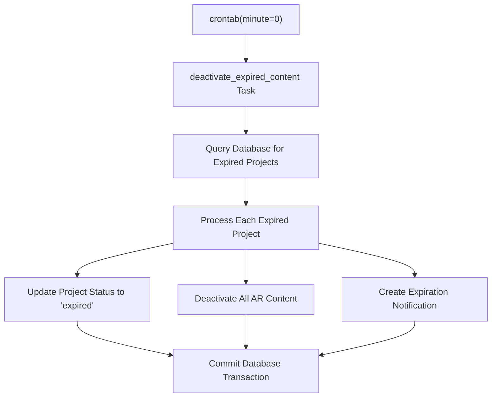
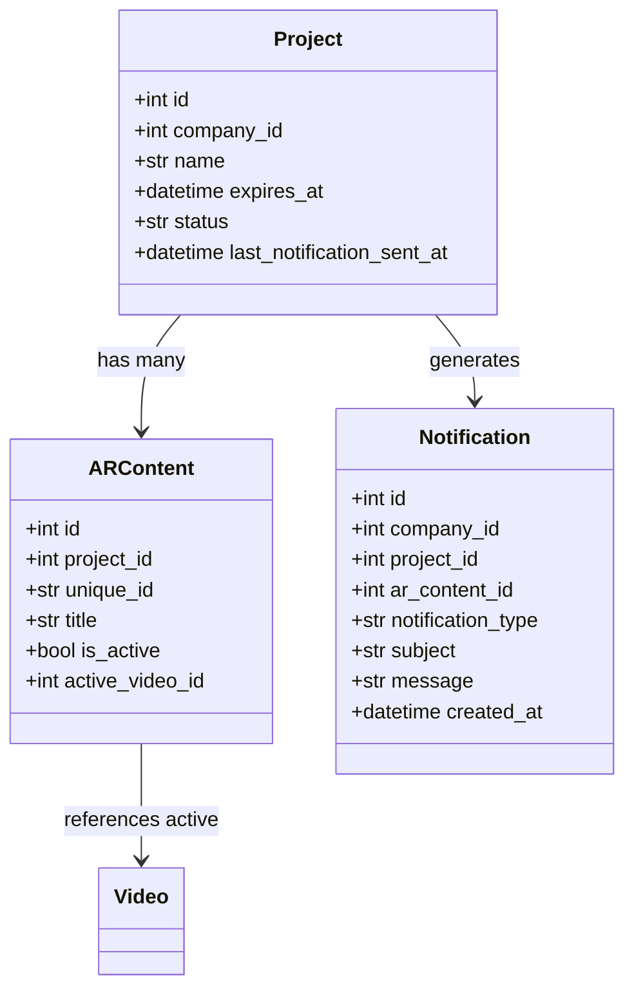
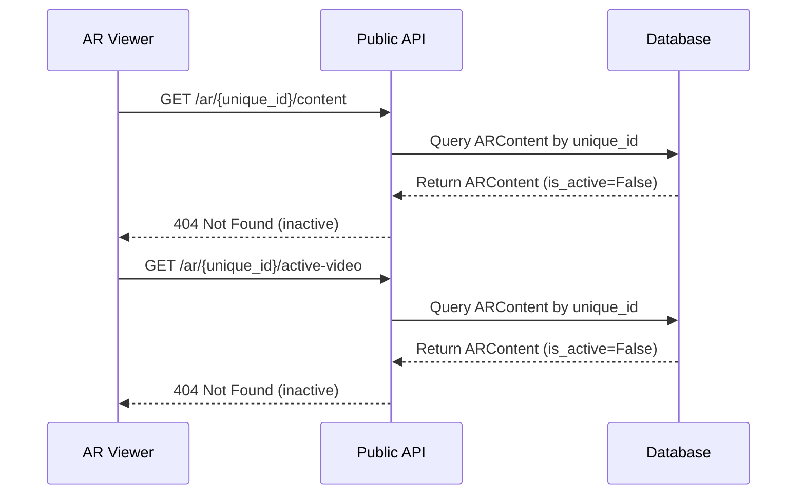
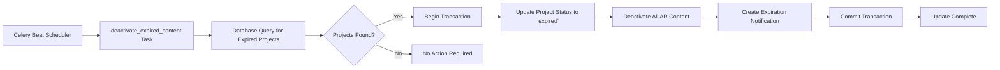

# Content Deactivation

<cite>
**Referenced Files in This Document**   
- [expiry_tasks.py](file://app/tasks/expiry_tasks.py)
- [celery_app.py](file://app/tasks/celery_app.py)
- [project.py](file://app/models/project.py)
- [ar_content.py](file://app/models/ar_content.py)
- [notification.py](file://app/models/notification.py)
- [database.py](file://app/core/database.py)
- [public.py](file://app/api/routes/public.py)
- [config.py](file://app/core/config.py)
</cite>

## Table of Contents
1. [Introduction](#introduction)
2. [Task Scheduling and Execution](#task-scheduling-and-execution)
3. [Database Transaction Process](#database-transaction-process)
4. [Cascading Impact on AR Viewer](#cascading-impact-on-ar-viewer)
5. [Data Flow Overview](#data-flow-overview)
6. [Performance Considerations](#performance-considerations)
7. [Recovery Procedures](#recovery-procedures)
8. [Testing in Development](#testing-in-development)
9. [Production Monitoring](#production-monitoring)

## Introduction
The minute-by-minute expired content deactivation system ensures timely deactivation of AR content when project expiration times are reached. This document details the implementation of the `deactivate_expired_content` Celery task that runs every minute via crontab scheduling. The system identifies projects whose `expires_at` timestamp has passed, updates their status to 'expired', deactivates all associated AR content, and creates expiration notifications. The process affects AR viewer accessibility and video playback by preventing access to expired content through the API layer.

## Task Scheduling and Execution
The `deactivate_expired_content` task is scheduled to run every minute using Celery Beat with a crontab schedule configuration. This ensures that expired content is processed promptly within a one-minute window of expiration. The task is registered in the Celery application configuration with a precise scheduling directive that triggers execution at the beginning of each minute.

**Diagram sources**
- [celery_app.py](file://app/tasks/celery_app.py#L36-L38)
- [expiry_tasks.py](file://app/tasks/expiry_tasks.py#L95-L129)

**Section sources**
- [celery_app.py](file://app/tasks/celery_app.py#L31-L58)
- [expiry_tasks.py](file://app/tasks/expiry_tasks.py#L95-L129)

## Database Transaction Process
The deactivation process executes within a single database transaction to ensure data consistency. The system queries for projects where the `expires_at` timestamp is in the past and the current status is 'active'. For each expired project, the transaction performs three key operations atomically: updating the project status to 'expired', setting `is_active=False` for all associated AR content items, and creating a notification record to document the expiration event. This transactional approach prevents partial updates that could lead to inconsistent states.

**Diagram sources**
- [project.py](file://app/models/project.py#L7-L35)
- [ar_content.py](file://app/models/ar_content.py#L7-L46)
- [notification.py](file://app/models/notification.py#L7-L32)

**Section sources**
- [expiry_tasks.py](file://app/tasks/expiry_tasks.py#L98-L123)
- [database.py](file://app/core/database.py#L18-L24)

## Cascading Impact on AR Viewer
The deactivation of expired content directly impacts AR viewer accessibility and video playback. When a project expires and its associated AR content is deactivated, the public API endpoints that serve AR content and active videos begin returning 404 errors. The AR viewer application, which relies on these endpoints to retrieve marker information and video URLs, fails to initialize when content is inactive. This effectively prevents users from accessing expired AR experiences while maintaining data integrity in the backend.

**Diagram sources**
- [public.py](file://app/api/routes/public.py#L11-L30)
- [ar_content.py](file://app/models/ar_content.py#L32)
- [templates/ar_viewer.html](file://templates/ar_viewer.html#L86-L114)

**Section sources**
- [public.py](file://app/api/routes/public.py#L11-L30)
- [templates/ar_viewer.html](file://templates/ar_viewer.html#L86-L114)

## Data Flow Overview
The data flow for content deactivation begins with the Celery Beat scheduler triggering the `deactivate_expired_content` task every minute. The task queries the database for projects that have passed their expiration timestamp, then processes each expired project by updating its status, deactivating all associated AR content, and creating a notification record. The entire operation occurs within a single database transaction to ensure atomicity. Once the transaction commits, the changes are immediately reflected in the system, preventing access to expired content through the API layer.

**Section sources**
- [celery_app.py](file://app/tasks/celery_app.py#L36-L38)
- [expiry_tasks.py](file://app/tasks/expiry_tasks.py#L95-L123)

## Performance Considerations
For high-volume scenarios, the expired content deactivation system includes several performance considerations. The database query for expired projects is optimized with indexes on the `expires_at` and `status` columns, ensuring efficient lookups. The transaction processes expired projects sequentially within a single execution context, limiting memory usage. For systems with large numbers of projects, the one-minute execution interval provides sufficient time for completion while preventing queue buildup. The use of asynchronous database operations allows the task to handle I/O efficiently without blocking.

**Section sources**
- [expiry_tasks.py](file://app/tasks/expiry_tasks.py#L99-L105)
- [project.py](file://app/models/project.py#L22-L25)
- [config.py](file://app/core/config.py#L41-L43)

## Recovery Procedures
In cases of accidental deactivation, recovery procedures involve manual database intervention through administrative interfaces. Administrators can update the project status back to 'active' and reactivate associated AR content items by setting `is_active=True`. The system does not provide automated recovery to prevent unintended access to expired content. Any recovery operation should be accompanied by creating a new notification to document the change and potentially extending the `expires_at` timestamp to prevent immediate re-expiration.

**Section sources**
- [project.py](file://app/models/project.py#L25)
- [ar_content.py](file://app/models/ar_content.py#L32)
- [notification.py](file://app/models/notification.py#L16-L17)

## Testing in Development
Testing the expired content deactivation behavior in development environments involves configuring the Celery scheduler to run at more frequent intervals or using manual task invocation. Developers can create test projects with `expires_at` timestamps set in the recent past to verify that the deactivation process correctly updates project status, deactivates AR content, and creates notification records. The database can be inspected before and after task execution to confirm the expected changes. Unit tests should validate the query logic, transaction integrity, and edge cases such as projects without expiration dates.

**Section sources**
- [expiry_tasks.py](file://app/tasks/expiry_tasks.py#L95-L129)
- [celery_app.py](file://app/tasks/celery_app.py#L36-L38)

## Production Monitoring
Monitoring the `deactivate_expired_content` task in production environments involves tracking task execution frequency, duration, and success rates through Celery monitoring tools. System administrators should verify that the task runs every minute as scheduled and completes within acceptable time limits. Database performance metrics should be monitored for any degradation related to the expiration queries. Alerting should be configured for task failures or skipped executions to ensure expired content is properly deactivated. The notification system can also serve as an audit trail for expiration events.

**Section sources**
- [celery_app.py](file://app/tasks/celery_app.py#L36-L38)
- [expiry_tasks.py](file://app/tasks/expiry_tasks.py#L95-L129)
- [monitoring.py](file://app/tasks/monitoring.py#L35-L98)