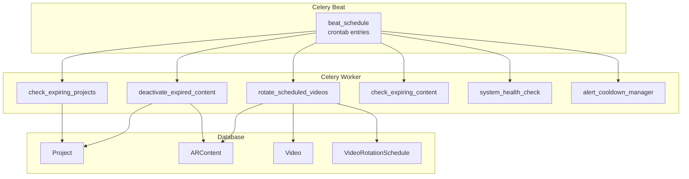
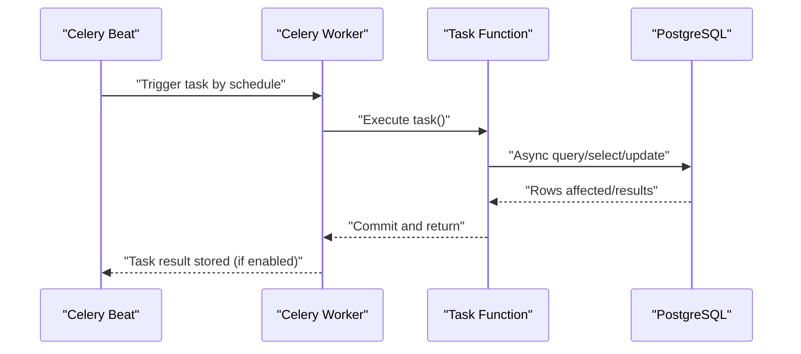
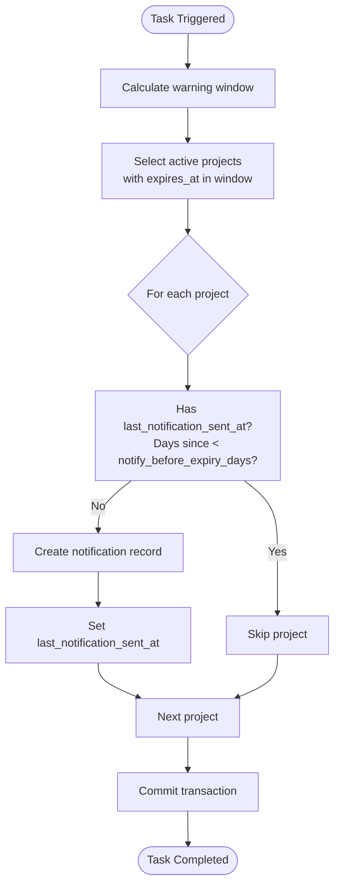
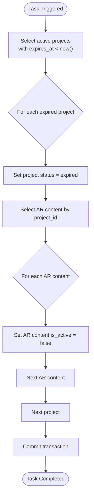
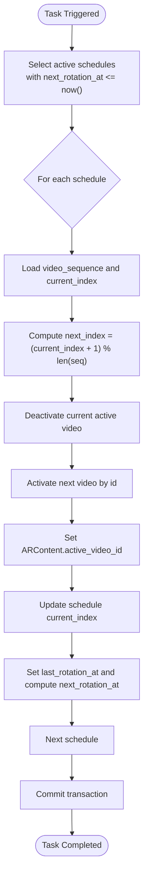
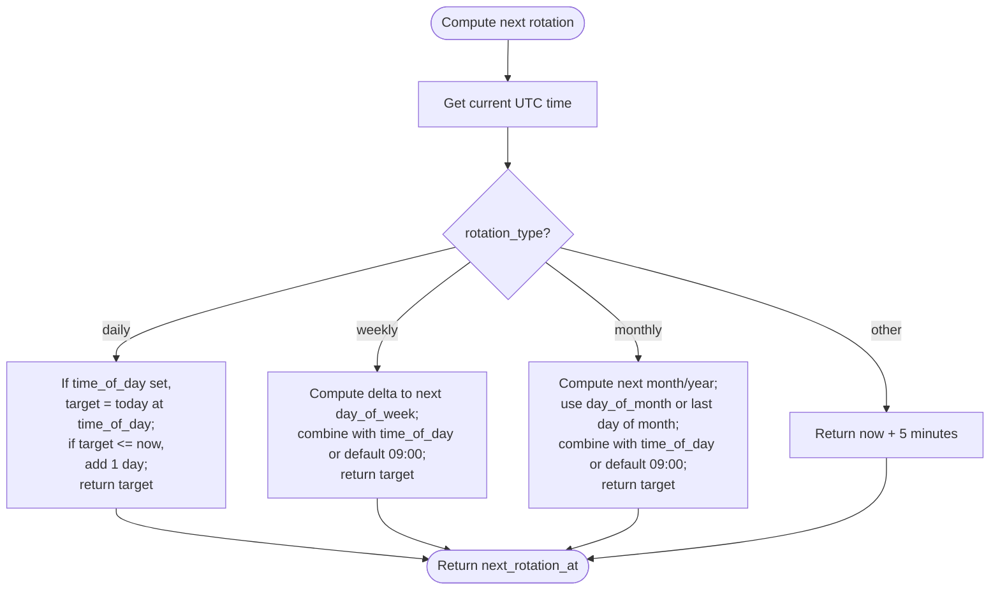
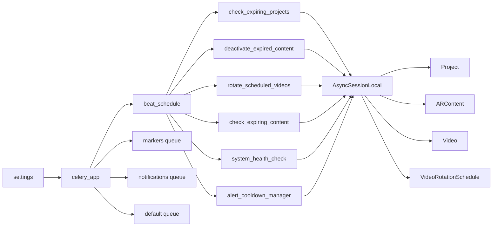

# Periodic Tasks & Scheduling

<cite>
**Referenced Files in This Document**
- [celery_app.py](file://app/tasks/celery_app.py)
- [expiry_tasks.py](file://app/tasks/expiry_tasks.py)
- [video_rotation_schedule.py](file://app/models/video_rotation_schedule.py)
- [project.py](file://app/models/project.py)
- [ar_content.py](file://app/models/ar_content.py)
- [video.py](file://app/models/video.py)
- [config.py](file://app/core/config.py)
- [database.py](file://app/core/database.py)
- [notification_tasks.py](file://app/tasks/notification_tasks.py)
- [monitoring.py](file://app/tasks/monitoring.py)
- [requirements.txt](file://requirements.txt)
</cite>

## Table of Contents
1. [Introduction](#introduction)
2. [Project Structure](#project-structure)
3. [Core Components](#core-components)
4. [Architecture Overview](#architecture-overview)
5. [Detailed Component Analysis](#detailed-component-analysis)
6. [Dependency Analysis](#dependency-analysis)
7. [Performance Considerations](#performance-considerations)
8. [Troubleshooting Guide](#troubleshooting-guide)
9. [Conclusion](#conclusion)
10. [Appendices](#appendices)

## Introduction
This document explains the periodic task scheduling system built with Celery Beat. It covers the scheduled tasks that:
- Daily check for expiring projects and send expiry warnings with cooldown
- Deactivate expired content every minute
- Rotate videos every five minutes based on schedule types (daily, weekly, monthly)

It also details the crontab scheduling configuration, time-based triggers, and the end-to-end business logic for each task. Data flow diagrams illustrate the lifecycle from trigger to database updates, along with configuration tips and troubleshooting guidance for timing-related issues.

## Project Structure
The scheduling system is centered around a Celery application configured with a beat schedule. Periodic tasks are implemented in dedicated modules and operate against SQLAlchemy models.

**Diagram sources**
- [celery_app.py](file://app/tasks/celery_app.py#L31-L58)
- [expiry_tasks.py](file://app/tasks/expiry_tasks.py#L55-L178)
- [notification_tasks.py](file://app/tasks/notification_tasks.py#L7-L21)
- [monitoring.py](file://app/tasks/monitoring.py#L13-L99)
- [project.py](file://app/models/project.py#L7-L35)
- [ar_content.py](file://app/models/ar_content.py#L7-L46)
- [video.py](file://app/models/video.py#L5-L31)
- [video_rotation_schedule.py](file://app/models/video_rotation_schedule.py#L5-L26)

**Section sources**
- [celery_app.py](file://app/tasks/celery_app.py#L1-L59)
- [requirements.txt](file://requirements.txt#L1-L33)

## Core Components
- Celery application and beat schedule: Defines task queues, serialization, timezone, and periodic tasks with crontab schedules.
- Expiry tasks: Daily project expiry warnings with cooldown and minute-by-minute deactivation of expired content.
- Video rotation task: Processes rotation schedules and rotates videos based on type.
- Supporting models: Project, ARContent, Video, VideoRotationSchedule.
- Configuration: Celery broker/result backend and task limits.
- Database: Async engine and session factory for tasks.

**Section sources**
- [celery_app.py](file://app/tasks/celery_app.py#L1-L59)
- [expiry_tasks.py](file://app/tasks/expiry_tasks.py#L55-L178)
- [video_rotation_schedule.py](file://app/models/video_rotation_schedule.py#L5-L26)
- [project.py](file://app/models/project.py#L7-L35)
- [ar_content.py](file://app/models/ar_content.py#L7-L46)
- [video.py](file://app/models/video.py#L5-L31)
- [config.py](file://app/core/config.py#L95-L100)
- [database.py](file://app/core/database.py#L1-L28)

## Architecture Overview
The system uses Celery Beat to trigger periodic tasks according to crontab schedules. Each task runs asynchronously against the PostgreSQL database via SQLAlchemy async sessions. Notifications are persisted for audit and future delivery.

**Diagram sources**
- [celery_app.py](file://app/tasks/celery_app.py#L31-L58)
- [expiry_tasks.py](file://app/tasks/expiry_tasks.py#L55-L178)
- [database.py](file://app/core/database.py#L1-L28)

## Detailed Component Analysis

### Crontab Scheduling Configuration
- Daily expiry warnings: At 09:00 UTC.
- Minute-by-minute deactivation: Every minute.
- Video rotation: Every 5 minutes.
- Additional daily notification placeholder: At 00:00 UTC.
- Monitoring tasks: Health check every 5 minutes and cooldown manager every 1 minute.

These schedules are defined in the Celery app configuration and use crontab expressions for hour/minute/day-of-week/month-of-day granularity.

**Section sources**
- [celery_app.py](file://app/tasks/celery_app.py#L31-L58)

### Daily Expiry Warning Task
- Purpose: Identify projects expiring within a window and send expiry warnings with cooldown.
- Trigger: Crontab at 09:00 UTC.
- Business logic:
  - Select projects with an expiration date within a defined window and active status.
  - Apply a cooldown period based on the project’s configured notification interval.
  - Create a notification record and update the last notification timestamp.
- Data flow:
  - Query projects by expiration window and status.
  - For eligible projects, insert a notification and update timestamps.
  - Commit transaction.

**Diagram sources**
- [expiry_tasks.py](file://app/tasks/expiry_tasks.py#L55-L92)
- [project.py](file://app/models/project.py#L7-L35)

**Section sources**
- [expiry_tasks.py](file://app/tasks/expiry_tasks.py#L55-L92)
- [project.py](file://app/models/project.py#L7-L35)

### Minute-by-Minute Deactivation of Expired Content
- Purpose: Deactivate expired projects and their associated AR content.
- Trigger: Crontab every minute.
- Business logic:
  - Find projects whose expiration date is in the past and status is active.
  - Mark projects as expired.
  - Deactivate all AR content under each expired project.
  - Optionally create a notification for expiration.
- Data flow:
  - Query expired active projects.
  - Iterate and update project status and AR content activity.
  - Commit transaction.

**Diagram sources**
- [expiry_tasks.py](file://app/tasks/expiry_tasks.py#L94-L129)
- [project.py](file://app/models/project.py#L7-L35)
- [ar_content.py](file://app/models/ar_content.py#L7-L46)

**Section sources**
- [expiry_tasks.py](file://app/tasks/expiry_tasks.py#L94-L129)
- [ar_content.py](file://app/models/ar_content.py#L7-L46)

### Video Rotation Task
- Purpose: Rotate videos for active rotation schedules based on type (daily, weekly, monthly).
- Trigger: Crontab every 5 minutes.
- Business logic:
  - Select active rotation schedules whose next rotation time is due.
  - Rotate to the next video in the sequence, deactivate current active video, activate next video, and update AR content’s active video reference.
  - Update schedule indices, timestamps, and compute the next rotation time based on schedule type.
- Data flow:
  - Query rotation schedules due now.
  - For each schedule, compute next index, update video activity, update AR content, and recalculate next rotation time.
  - Commit transaction.

**Diagram sources**
- [expiry_tasks.py](file://app/tasks/expiry_tasks.py#L131-L178)
- [video_rotation_schedule.py](file://app/models/video_rotation_schedule.py#L5-L26)
- [video.py](file://app/models/video.py#L5-L31)
- [ar_content.py](file://app/models/ar_content.py#L7-L46)

**Section sources**
- [expiry_tasks.py](file://app/tasks/expiry_tasks.py#L131-L178)
- [video_rotation_schedule.py](file://app/models/video_rotation_schedule.py#L5-L26)
- [video.py](file://app/models/video.py#L5-L31)
- [ar_content.py](file://app/models/ar_content.py#L7-L46)

### Time-Based Rotation Calculation
The next rotation time is computed based on the schedule type:
- Daily: At a configured time-of-day on the next calendar day if the target time has passed today.
- Weekly: On the next occurrence of the configured day-of-week at time-of-day.
- Monthly: On the next occurrence of the configured day-of-month at time-of-day, with leap-month handling.
- Fallback: If type is unknown or missing fields, schedule the next rotation in 5 minutes.

**Diagram sources**
- [expiry_tasks.py](file://app/tasks/expiry_tasks.py#L21-L53)
- [video_rotation_schedule.py](file://app/models/video_rotation_schedule.py#L5-L26)

**Section sources**
- [expiry_tasks.py](file://app/tasks/expiry_tasks.py#L21-L53)
- [video_rotation_schedule.py](file://app/models/video_rotation_schedule.py#L5-L26)

### Additional Periodic Tasks
- Daily notification placeholder: At 00:00 UTC. Currently a stub awaiting implementation.
- Monitoring health check: At 00:00 and 00:05 UTC. Checks API health and system metrics, and sends critical alerts.
- Alert cooldown manager: Every 1 minute. Placeholder for cooldown housekeeping.

**Section sources**
- [celery_app.py](file://app/tasks/celery_app.py#L31-L58)
- [notification_tasks.py](file://app/tasks/notification_tasks.py#L7-L21)
- [monitoring.py](file://app/tasks/monitoring.py#L13-L99)

## Dependency Analysis
- Celery app depends on configuration settings for broker/backend and defines queues and schedules.
- Expiry tasks depend on SQLAlchemy async sessions and models for Projects, ARContent, Videos, and VideoRotationSchedule.
- Database configuration provides the async engine and session factory used by tasks.
- Monitoring tasks depend on system metrics and external health checks.

**Diagram sources**
- [celery_app.py](file://app/tasks/celery_app.py#L1-L59)
- [database.py](file://app/core/database.py#L1-L28)
- [project.py](file://app/models/project.py#L7-L35)
- [ar_content.py](file://app/models/ar_content.py#L7-L46)
- [video.py](file://app/models/video.py#L5-L31)
- [video_rotation_schedule.py](file://app/models/video_rotation_schedule.py#L5-L26)

**Section sources**
- [celery_app.py](file://app/tasks/celery_app.py#L1-L59)
- [database.py](file://app/core/database.py#L1-L28)
- [config.py](file://app/core/config.py#L95-L100)

## Performance Considerations
- Task execution time: Celery task time limit is configured to prevent long-running tasks from blocking workers.
- Database pooling: Async engine uses configurable pool size and overflow to handle concurrent task loads.
- Queue routing: Dedicated queues for specialized tasks reduce contention.
- Serialization: JSON serialization ensures compatibility across workers.
- Timezone: UTC is enforced to avoid daylight saving and timezone drift issues.

[No sources needed since this section provides general guidance]

## Troubleshooting Guide
Common timing issues and resolutions:
- Tasks not firing at expected times:
  - Verify Celery Beat is running and connected to the configured broker.
  - Confirm timezone is UTC and schedules match expected UTC times.
  - Check that the worker recognizes the task module names included in the Celery app.
- Incorrect rotation timing:
  - Ensure rotation schedules have correct fields (rotation_type, time_of_day, day_of_week, day_of_month).
  - Validate that next_rotation_at is being recalculated after each rotation.
- Expiry warnings not sent:
  - Check cooldown intervals and last_notification_sent_at updates.
  - Verify project status remains active during the warning window.
- Expiration not deactivating content:
  - Confirm expires_at is in the past and status is active.
  - Ensure AR content is linked to the project and is_active is updated.
- Monitoring alerts not triggered:
  - Verify API health endpoint availability and response.
  - Check thresholds and queue length metrics.

Operational checks:
- Confirm Celery broker and result backend URLs in settings.
- Ensure Redis is reachable and has sufficient connections.
- Review logs for task execution and errors.

**Section sources**
- [celery_app.py](file://app/tasks/celery_app.py#L1-L59)
- [config.py](file://app/core/config.py#L95-L100)
- [monitoring.py](file://app/tasks/monitoring.py#L13-L99)

## Conclusion
The periodic task system uses Celery Beat with crontab schedules to manage expiry warnings, content deactivation, and video rotation. The design separates concerns across tasks and models, with explicit time-based logic for rotation and cooldown handling. Proper configuration of Celery, database pools, and monitoring ensures reliable operation across environments.

[No sources needed since this section summarizes without analyzing specific files]

## Appendices

### Configuration Adjustments for Different Scheduling Needs
- Change daily expiry warning time:
  - Modify the crontab hour/minute for the expiry warning task.
- Adjust deactivation cadence:
  - Change the crontab minute for the deactivation task to run less frequently if needed.
- Video rotation frequency:
  - Adjust the crontab minute step for rotation to a different interval.
- Enable/disable tasks:
  - Add or remove entries in the beat schedule dictionary.
- Tune task limits:
  - Increase or decrease the Celery task time limit and track started settings as needed.

**Section sources**
- [celery_app.py](file://app/tasks/celery_app.py#L31-L58)
- [config.py](file://app/core/config.py#L95-L100)