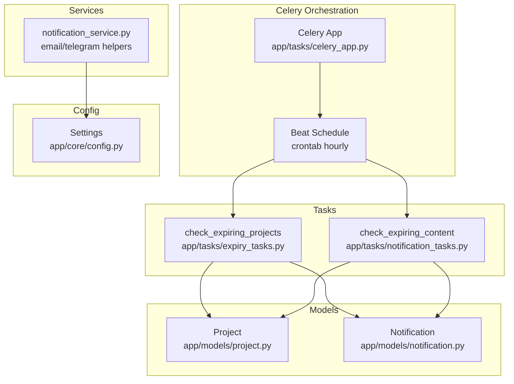
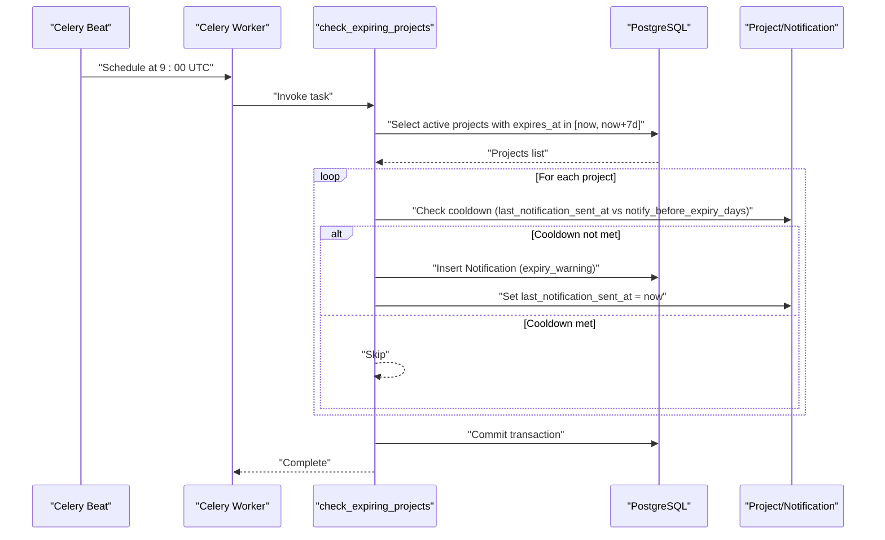
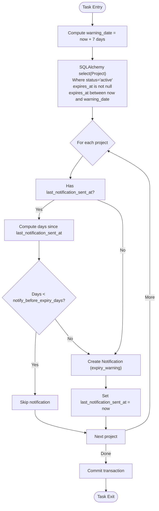
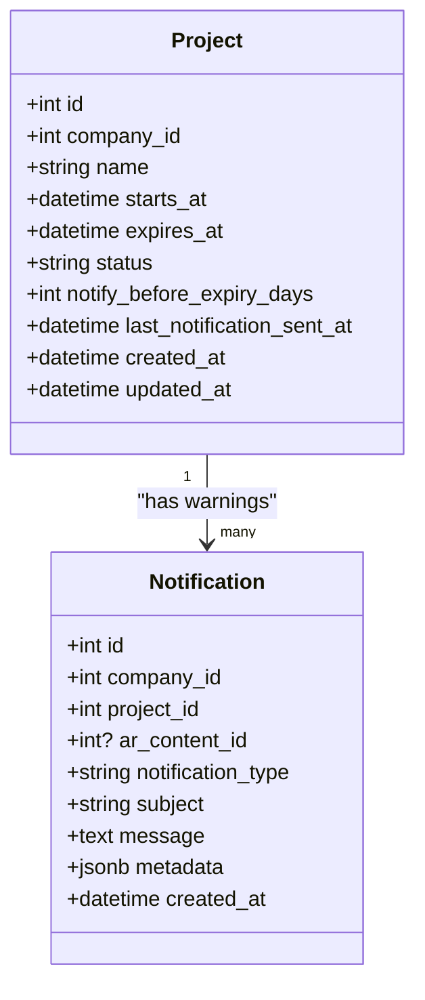
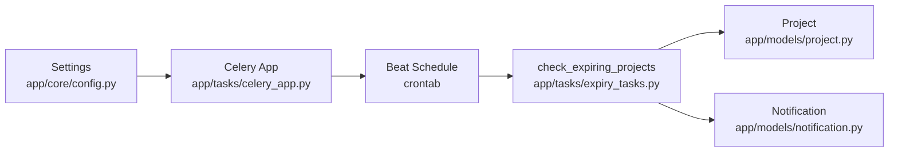

# Project Expiry Checks

<cite>
**Referenced Files in This Document**
- [app/tasks/celery_app.py](file://app/tasks/celery_app.py)
- [app/tasks/expiry_tasks.py](file://app/tasks/expiry_tasks.py)
- [app/models/project.py](file://app/models/project.py)
- [app/models/notification.py](file://app/models/notification.py)
- [app/services/notification_service.py](file://app/services/notification_service.py)
- [app/tasls/notification_tasks.py](file://app/tasks/notification_tasks.py)
- [app/core/config.py](file://app/core/config.py)
- [alembic/versions/20251205_perf_idx.py](file://alembic/versions/20251205_perf_idx.py)
</cite>

## Table of Contents
1. [Introduction](#introduction)
2. [Project Structure](#project-structure)
3. [Core Components](#core-components)
4. [Architecture Overview](#architecture-overview)
5. [Detailed Component Analysis](#detailed-component-analysis)
6. [Dependency Analysis](#dependency-analysis)
7. [Performance Considerations](#performance-considerations)
8. [Troubleshooting Guide](#troubleshooting-guide)
9. [Conclusion](#conclusion)
10. [Appendices](#appendices)

## Introduction
This document explains the daily project expiry check task that identifies projects expiring within the next seven days and creates expiry warning notifications. It covers:
- How the task is scheduled to run at 9:00 UTC daily via Celery Beat crontab
- The SQL filtering logic using SQLAlchemy to select active projects whose expiration date falls within the warning window
- The cooldown mechanism preventing duplicate notifications using last_notification_sent_at and notify_before_expiry_days
- The creation of expiry warning notifications in the database
- Business rules for alert timing and practical configuration adjustments
- Troubleshooting guidance for missed notifications or timing issues

## Project Structure
The expiry checking functionality spans Celery task orchestration, SQLAlchemy models, and notification persistence.

**Diagram sources**
- [app/tasks/celery_app.py](file://app/tasks/celery_app.py#L1-L59)
- [app/tasks/expiry_tasks.py](file://app/tasks/expiry_tasks.py#L56-L93)
- [app/tasks/notification_tasks.py](file://app/tasks/notification_tasks.py#L14-L78)
- [app/models/project.py](file://app/models/project.py#L1-L35)
- [app/models/notification.py](file://app/models/notification.py#L1-L32)
- [app/services/notification_service.py](file://app/services/notification_service.py#L1-L81)
- [app/core/config.py](file://app/core/config.py#L78-L90)

**Section sources**
- [app/tasks/celery_app.py](file://app/tasks/celery_app.py#L1-L59)
- [app/tasks/expiry_tasks.py](file://app/tasks/expiry_tasks.py#L56-L93)
- [app/models/project.py](file://app/models/project.py#L1-L35)
- [app/models/notification.py](file://app/models/notification.py#L1-L32)
- [app/services/notification_service.py](file://app/services/notification_service.py#L1-L81)
- [app/core/config.py](file://app/core/config.py#L78-L90)

## Core Components
- Celery app and scheduler: Defines the daily 9:00 UTC task and queues.
- Expiry task: Selects active projects expiring within the next 7 days and creates expiry warnings with cooldown.
- Project model: Provides fields used for filtering and cooldown.
- Notification model: Stores expiry warnings for downstream processing.
- Notification service: Provides email/Telegram helpers for future integration.
- Additional daily expiry check: A separate task that records expiry warnings for AR content and projects expiring in exactly 7 days.

**Section sources**
- [app/tasks/celery_app.py](file://app/tasks/celery_app.py#L1-L59)
- [app/tasks/expiry_tasks.py](file://app/tasks/expiry_tasks.py#L56-L93)
- [app/models/project.py](file://app/models/project.py#L1-L35)
- [app/models/notification.py](file://app/models/notification.py#L1-L32)
- [app/services/notification_service.py](file://app/services/notification_service.py#L1-L81)
- [app/tasks/notification_tasks.py](file://app/tasks/notification_tasks.py#L14-L78)

## Architecture Overview
The expiry check is a scheduled Celery task that:
- Runs daily at 9:00 UTC
- Queries active projects whose expires_at falls between now and now + 7 days
- Applies a per-project cooldown based on last_notification_sent_at and notify_before_expiry_days
- Creates a Notification record with metadata indicating the expiry date
- Commits the transaction and updates last_notification_sent_at

**Diagram sources**
- [app/tasks/celery_app.py](file://app/tasks/celery_app.py#L31-L40)
- [app/tasks/expiry_tasks.py](file://app/tasks/expiry_tasks.py#L56-L93)
- [app/models/project.py](file://app/models/project.py#L20-L35)
- [app/models/notification.py](file://app/models/notification.py#L1-L32)

## Detailed Component Analysis

### Daily Expiry Check Task: check_expiring_projects
- Scheduling: Registered in Celery Beat with crontab hour=9, minute=0, so it runs daily at 9:00 UTC.
- Filtering logic:
  - Active projects only (status equals active)
  - expires_at is not null
  - expires_at falls within the 7-day window starting from now
- Cooldown logic:
  - If last_notification_sent_at is set, compare days elapsed to notify_before_expiry_days (default 7)
  - If the elapsed days are less than the configured threshold, skip sending another notification
- Notification creation:
  - Inserts a Notification row with type expiry_warning
  - Sets subject and message fields
  - Stores expires_at in metadata for downstream processing
- Persistence:
  - Commits the transaction and updates last_notification_sent_at to now

**Diagram sources**
- [app/tasks/expiry_tasks.py](file://app/tasks/expiry_tasks.py#L56-L93)
- [app/models/project.py](file://app/models/project.py#L20-L35)
- [app/models/notification.py](file://app/models/notification.py#L1-L32)

**Section sources**
- [app/tasks/celery_app.py](file://app/tasks/celery_app.py#L31-L40)
- [app/tasks/expiry_tasks.py](file://app/tasks/expiry_tasks.py#L56-L93)
- [app/models/project.py](file://app/models/project.py#L20-L35)
- [app/models/notification.py](file://app/models/notification.py#L1-L32)

### Project Model Fields Used in Expiry Checks
- expires_at: Determines the expiration boundary for the 7-day window
- status: Filters only active projects
- notify_before_expiry_days: Controls cooldown period
- last_notification_sent_at: Tracks last notification emission to enforce cooldown

**Diagram sources**
- [app/models/project.py](file://app/models/project.py#L1-L35)
- [app/models/notification.py](file://app/models/notification.py#L1-L32)

**Section sources**
- [app/models/project.py](file://app/models/project.py#L20-L35)
- [app/models/notification.py](file://app/models/notification.py#L1-L32)

### Additional Daily Expiry Check: check_expiring_content
There is also a separate daily task that records expiry warnings for AR content and projects expiring in exactly 7 days (00:00 UTC). While it does not enforce the same cooldown, it complements the 9:00 UTC task by capturing the exact 7-day boundary.

**Section sources**
- [app/tasks/notification_tasks.py](file://app/tasks/notification_tasks.py#L14-L78)

### Notification Service Helpers
The notification service provides email and Telegram helper functions for sending expiry warnings. These are not invoked by the expiry task directly but are available for future integration.

**Section sources**
- [app/services/notification_service.py](file://app/services/notification_service.py#L1-L81)

## Dependency Analysis
- Celery app depends on settings for broker/backend URLs and timezone configuration.
- The expiry task depends on:
  - Async database session
  - Project model for filtering and updating
  - Notification model for persistence
- Beat schedule defines the daily 9:00 UTC run for the expiry task and other periodic tasks.

**Diagram sources**
- [app/core/config.py](file://app/core/config.py#L78-L90)
- [app/tasks/celery_app.py](file://app/tasks/celery_app.py#L1-L59)
- [app/tasks/expiry_tasks.py](file://app/tasks/expiry_tasks.py#L56-L93)
- [app/models/project.py](file://app/models/project.py#L1-L35)
- [app/models/notification.py](file://app/models/notification.py#L1-L32)

**Section sources**
- [app/core/config.py](file://app/core/config.py#L78-L90)
- [app/tasks/celery_app.py](file://app/tasks/celery_app.py#L1-L59)
- [app/tasks/expiry_tasks.py](file://app/tasks/expiry_tasks.py#L56-L93)
- [app/models/project.py](file://app/models/project.py#L1-L35)
- [app/models/notification.py](file://app/models/notification.py#L1-L32)

## Performance Considerations
- Indexing: The project table has a composite index on company_id and status, which can help filter active projects efficiently.
- Query scope: The task filters by expires_at within a narrow 7-day window, reducing result sets.
- Transaction boundaries: Each project is processed individually; batching could reduce overhead if many projects are expiring.
- Timezone: Celery is configured to UTC, aligning with the 9:00 UTC schedule.

**Section sources**
- [alembic/versions/20251205_perf_idx.py](file://alembic/versions/20251205_perf_idx.py#L41-L47)

## Troubleshooting Guide
Common issues and resolutions:
- Task not running at 9:00 UTC
  - Verify Celery Beat is started and configured with timezone UTC.
  - Confirm the task name in the schedule matches the registered task.
  - Check logs for scheduling errors or timezone mismatches.
- No notifications generated
  - Ensure projects have expires_at set and status equals active.
  - Confirm expires_at falls within [now, now+7 days].
  - Check that last_notification_sent_at is older than notify_before_expiry_days (default 7) or unset.
- Duplicate notifications
  - Review last_notification_sent_at and notify_before_expiry_days values.
  - Adjust notify_before_expiry_days to increase cooldown interval.
- Missed notifications due to timing
  - If a project expires at 8:59 UTC, it may not be included in the 9:00 UTC run; consider adjusting the schedule or adding a secondary task.
  - Alternatively, adjust the 7-day window calculation to include earlier cutoffs if needed.
- Database connectivity or commit failures
  - Inspect transaction commit and error logs around the task execution.
  - Verify database availability and connection pool limits.

Practical configuration adjustments:
- Change the warning window
  - Modify the 7-day window calculation in the task to widen or narrow the cutoff.
- Adjust cooldown period
  - Update notify_before_expiry_days per customer preference; lower values reduce cooldown, higher values increase it.
- Fine-tune scheduling
  - Shift the daily run time slightly to avoid overlap with other tasks or peak load windows.

**Section sources**
- [app/tasks/celery_app.py](file://app/tasks/celery_app.py#L31-L40)
- [app/tasks/expiry_tasks.py](file://app/tasks/expiry_tasks.py#L56-L93)
- [app/models/project.py](file://app/models/project.py#L20-L35)

## Conclusion
The daily project expiry check task reliably identifies projects expiring within the next seven days, enforces a configurable cooldown to prevent duplicate notifications, and persists expiry warnings for downstream processing. Its 9:00 UTC schedule ensures timely alerts while leveraging database indexes and efficient filtering logic. Adjusting notify_before_expiry_days and the 7-day window allows fine-grained control over alert cadence and timing.

## Appendices

### Business Rule Summary
- Alert trigger: Active projects with expires_at in [now, now+7 days]
- Cooldown: Skip if last_notification_sent_at is within notify_before_expiry_days
- Persistence: Create Notification with type expiry_warning and expires_at metadata
- Timing: Scheduled at 9:00 UTC daily

**Section sources**
- [app/tasks/expiry_tasks.py](file://app/tasks/expiry_tasks.py#L56-L93)
- [app/models/project.py](file://app/models/project.py#L20-L35)
- [app/models/notification.py](file://app/models/notification.py#L1-L32)
- [app/tasks/celery_app.py](file://app/tasks/celery_app.py#L31-L40)