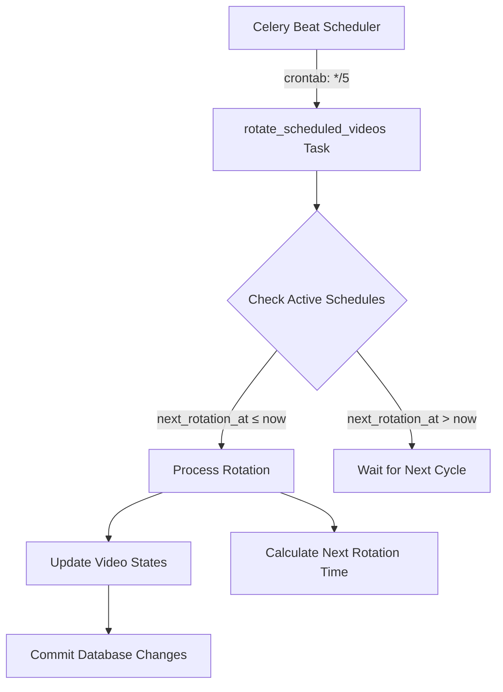
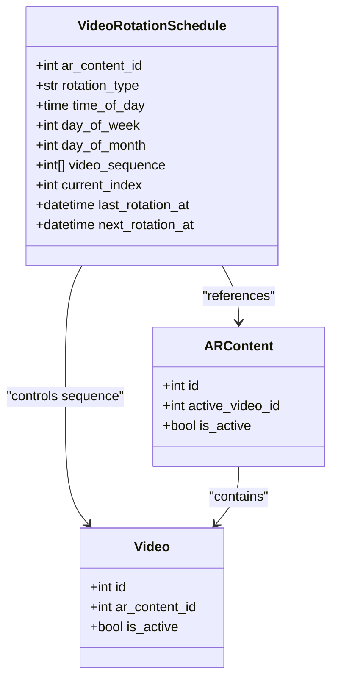
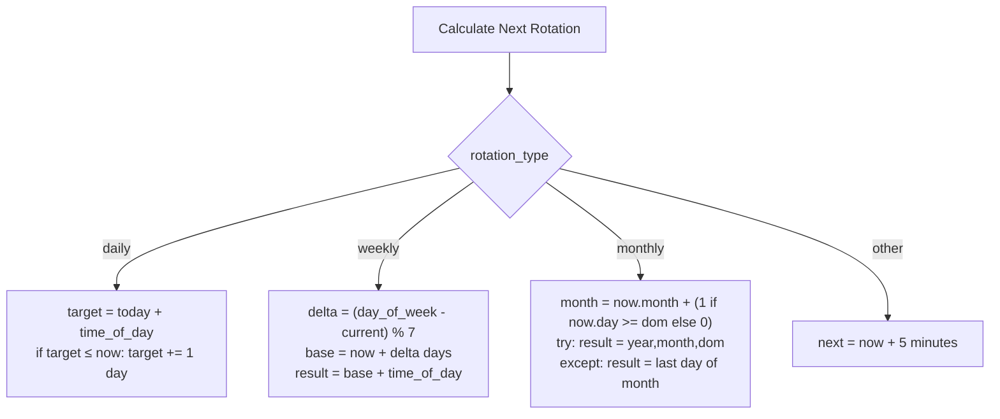

# Video Rotation

<cite>
**Referenced Files in This Document**   
- [expiry_tasks.py](file://app/tasks/expiry_tasks.py)
- [celery_app.py](file://app/tasks/celery_app.py)
- [rotation.py](file://app/api/routes/rotation.py)
- [video_rotation_schedule.py](file://app/models/video_rotation_schedule.py)
- [ar_content.py](file://app/models/ar_content.py)
- [video.py](file://app/models/video.py)
- [database.py](file://app/core/database.py)
</cite>

## Table of Contents
1. [Introduction](#introduction)
2. [Task Scheduling and Execution](#task-scheduling-and-execution)
3. [Rotation Logic and Sequence Management](#rotation-logic-and-sequence-management)
4. [Database Operations and State Management](#database-operations-and-state-management)
5. [Rotation Type Algorithms](#rotation-type-algorithms)
6. [Configuration Examples](#configuration-examples)
7. [Troubleshooting Guide](#troubleshooting-guide)
8. [Performance Optimization](#performance-optimization)

## Introduction
The scheduled video rotation system enables automated cycling of AR content videos based on configurable time-based schedules. This system allows administrators to define rotation sequences for AR content that automatically activate different videos at specified intervals (daily, weekly, or monthly). The core functionality is driven by a Celery task that runs every 5 minutes, evaluating active rotation schedules and executing video transitions when the scheduled time is reached. The system maintains state through database records that track the current video, rotation sequence, and timing for each AR content item.

## Task Scheduling and Execution

The video rotation system is orchestrated through Celery's periodic task scheduler, which triggers the `rotate_scheduled_videos` task every 5 minutes via crontab configuration. This frequent execution interval ensures timely processing of rotation events while maintaining system responsiveness.



**Diagram sources**
- [celery_app.py](file://app/tasks/celery_app.py#L31-L43)
- [expiry_tasks.py](file://app/tasks/expiry_tasks.py#L132-L182)

**Section sources**
- [celery_app.py](file://app/tasks/celery_app.py#L31-L43)
- [expiry_tasks.py](file://app/tasks/expiry_tasks.py#L132-L182)

## Rotation Logic and Sequence Management

The rotation system processes video sequences based on the configured rotation type and timing parameters. Each rotation schedule maintains a current index pointer that determines which video in the sequence is currently active. When a rotation occurs, the system advances to the next video in the sequence according to the rotation algorithm.

For standard rotations (daily, weekly, monthly), the system uses a sequential cycling algorithm that increments the current index modulo the sequence length. An alternative random rotation mode is also supported, which selects a different video from the sequence while avoiding repetition of the currently active video.

```mermaid
flowchart TD
Start([Rotation Triggered]) --> ValidateSchedule["Validate Schedule<br>is_active = 1"]
ValidateSchedule --> |Valid| CheckSequence["Check video_sequence<br>exists and not empty"]
CheckSequence --> |Sequence Valid| DetermineNext["Determine Next Video"]
DetermineNext --> RotationType{"rotation_type = 'random'?}
RotationType --> |Yes| RandomSelection["Select random index<br>excluding current"]
RotationType --> |No| SequentialAdvance["next_index = (current + 1) % length"]
RandomSelection --> NextVideoId
SequentialAdvance --> NextVideoId
NextVideoId["next_video_id = sequence[next_index]"] --> UpdateStates
```

**Diagram sources**
- [expiry_tasks.py](file://app/tasks/expiry_tasks.py#L144-L154)
- [video_rotation_schedule.py](file://app/models/video_rotation_schedule.py#L18-L19)

**Section sources**
- [expiry_tasks.py](file://app/tasks/expiry_tasks.py#L144-L154)
- [video_rotation_schedule.py](file://app/models/video_rotation_schedule.py#L18-L19)

## Database Operations and State Management

The video rotation system performs coordinated database operations across multiple tables to ensure consistent state transitions. When rotating videos, the system executes a transaction that deactivates the current video, activates the next video, and updates the AR content's active video reference.



**Diagram sources**
- [video_rotation_schedule.py](file://app/models/video_rotation_schedule.py)
- [ar_content.py](file://app/models/ar_content.py)
- [video.py](file://app/models/video.py)

**Section sources**
- [expiry_tasks.py](file://app/tasks/expiry_tasks.py#L155-L175)
- [ar_content.py](file://app/models/ar_content.py#L27)
- [video.py](file://app/models/video.py#L22)

## Rotation Type Algorithms

The system supports multiple rotation types with distinct algorithms for calculating the next rotation time. The `_calculate_next_rotation_time` helper function determines when the next rotation should occur based on the schedule configuration.

### Daily Rotation
For daily rotations, the system combines the current date with the specified time_of_day. If this time has already passed, it schedules the next rotation for the same time tomorrow.

### Weekly Rotation
Weekly rotations use the day_of_week parameter (1-7, Monday-Sunday) to determine the next occurrence. The algorithm calculates the number of days until the target day and combines it with the time_of_day (or default 09:00 if not specified).

### Monthly Rotation
Monthly rotations handle the complexity of variable month lengths. When a specified day_of_month exceeds the number of days in the target month, the system automatically falls back to the last day of that month.



**Diagram sources**
- [expiry_tasks.py](file://app/tasks/expiry_tasks.py#L22-L53)

**Section sources**
- [expiry_tasks.py](file://app/tasks/expiry_tasks.py#L22-L53)
- [video_rotation_schedule.py](file://app/models/video_rotation_schedule.py#L11-L15)

## Configuration Examples

### Daily Rotation at 9:00 AM
```json
{
  "rotation_type": "daily",
  "time_of_day": "09:00:00",
  "video_sequence": [1, 2, 3, 4],
  "current_index": 0
}
```

### Weekly Rotation on Mondays and Fridays at 10:30 AM
```json
{
  "rotation_type": "weekly",
  "day_of_week": 1,
  "time_of_day": "10:30:00",
  "video_sequence": [5, 6, 7],
  "current_index": 0
}
```

### Monthly Rotation on the 15th at 14:00
```json
{
  "rotation_type": "monthly",
  "day_of_month": 15,
  "time_of_day": "14:00:00",
  "video_sequence": [8, 9, 10, 11, 12],
  "current_index": 0
}
```

### Random Rotation Every 5 Minutes
```json
{
  "rotation_type": "random",
  "video_sequence": [13, 14, 15, 16],
  "current_index": 0
}
```

**Section sources**
- [rotation.py](file://app/api/routes/rotation.py#L12-L29)
- [expiry_tasks.py](file://app/tasks/expiry_tasks.py#L22-L53)

## Troubleshooting Guide

### Stuck Rotations
If video rotations are not occurring as expected, check the following:

1. **Verify Task Execution**: Confirm that the Celery beat scheduler is running and the `rotate_scheduled_videos` task appears in the logs every 5 minutes.
2. **Check Schedule Status**: Ensure the rotation schedule has `is_active = 1` and `next_rotation_at` is properly set.
3. **Validate Sequence Data**: Confirm that `video_sequence` contains valid video IDs and is not empty.
4. **Database Indexes**: Verify that the index on `next_rotation_at` exists for optimal query performance.

### Common Issues and Solutions
- **Issue**: Rotations occur but videos don't change
  - **Solution**: Check that the transaction commits successfully and verify database permissions
- **Issue**: Monthly rotations fail on months with fewer days
  - **Solution**: The system automatically falls back to month-end; verify this behavior meets requirements
- **Issue**: High database load from frequent polling
  - **Solution**: Ensure the `idx_rotation_schedules_next` index exists on the video_rotation_schedules table

**Section sources**
- [expiry_tasks.py](file://app/tasks/expiry_tasks.py#L137-L143)
- [database.py](file://app/core/database.py#L8-L15)
- [alembic/versions/20251205_perf_idx.py](file://alembic/versions/20251205_perf_idx.py#L50-L55)

## Performance Optimization

For large-scale deployments with numerous rotation schedules, consider the following optimizations:

1. **Database Indexing**: Ensure proper indexing on the `video_rotation_schedules` table, particularly on the `next_rotation_at` column to optimize the query that finds schedules ready for rotation.

2. **Batch Processing**: The current implementation processes schedules sequentially within a single transaction. For very large numbers of schedules, consider implementing batch processing with smaller transactions to reduce lock contention.

3. **Caching Layer**: Implement a caching layer for frequently accessed video and AR content data to reduce database queries during rotation processing.

4. **Connection Pooling**: Configure appropriate database connection pool settings in the application configuration to handle concurrent task executions efficiently.

5. **Monitoring**: Implement monitoring of the rotation task execution time and database query performance to identify bottlenecks early.

**Section sources**
- [celery_app.py](file://app/tasks/celery_app.py#L14-L28)
- [database.py](file://app/core/database.py#L8-L15)
- [alembic/versions/20251205_perf_idx.py](file://alembic/versions/20251205_perf_idx.py#L50-L55)