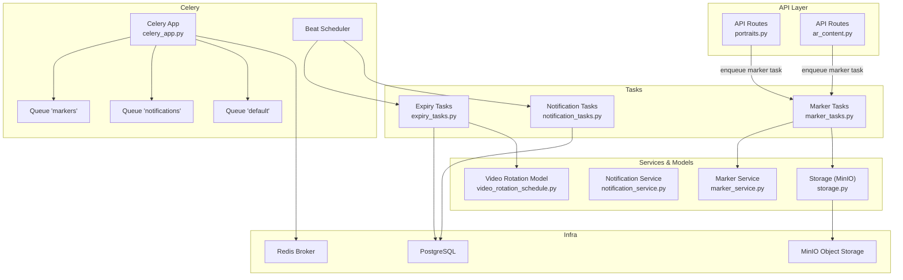
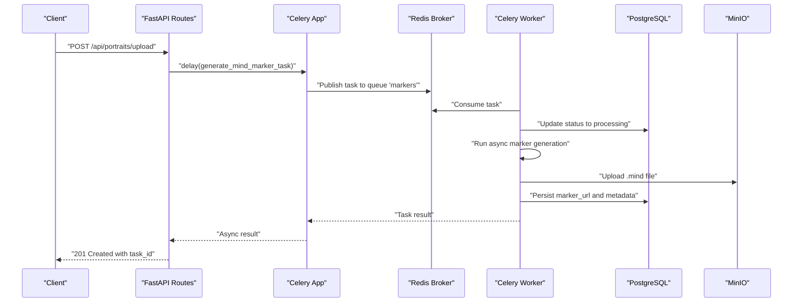
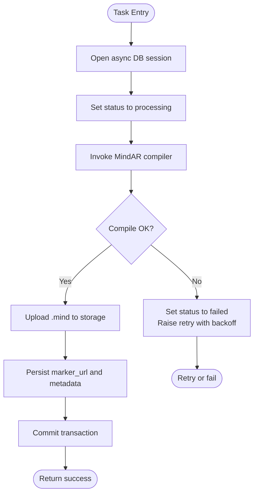
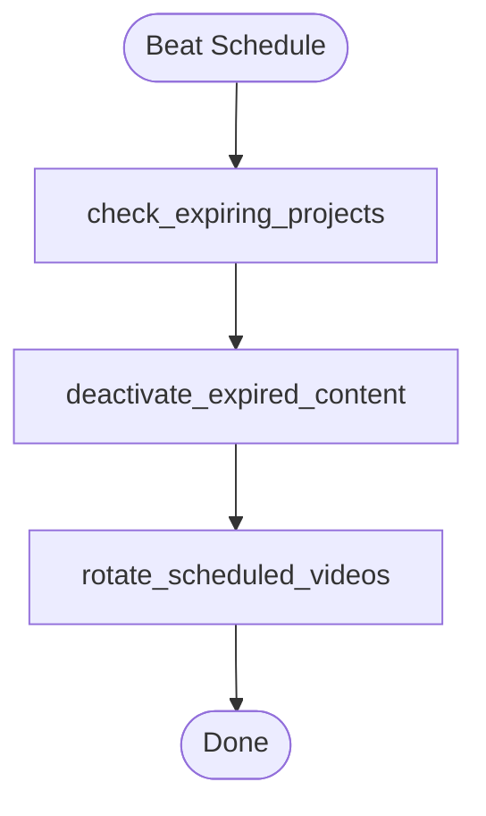
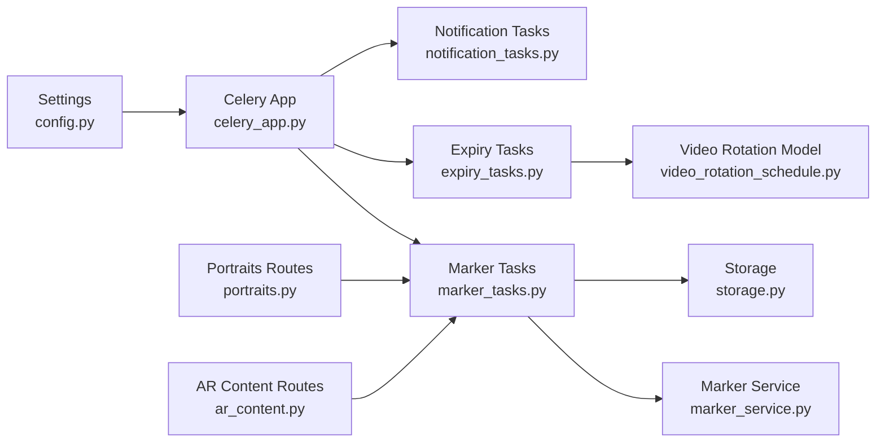
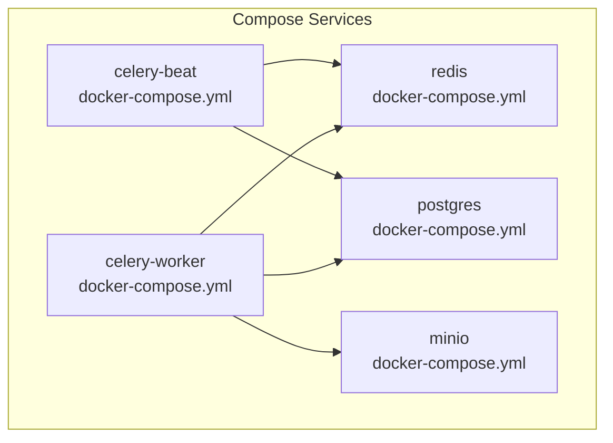

# Task Queue & Background Processing

<cite>
**Referenced Files in This Document**
- [celery_app.py](file://app/tasks/celery_app.py)
- [marker_tasks.py](file://app/tasks/marker_tasks.py)
- [notification_tasks.py](file://app/tasks/notification_tasks.py)
- [expiry_tasks.py](file://app/tasks/expiry_tasks.py)
- [config.py](file://app/core/config.py)
- [docker-compose.yml](file://docker-compose.yml)
- [Dockerfile](file://Dockerfile)
- [portraits.py](file://app/api/routes/portraits.py)
- [ar_content.py](file://app/api/routes/ar_content.py)
- [marker_service.py](file://app/services/marker_service.py)
- [notification_service.py](file://app/services/notification_service.py)
- [storage.py](file://app/core/storage.py)
- [video_rotation_schedule.py](file://app/models/video_rotation_schedule.py)
</cite>

## Table of Contents
1. [Introduction](#introduction)
2. [Project Structure](#project-structure)
3. [Core Components](#core-components)
4. [Architecture Overview](#architecture-overview)
5. [Detailed Component Analysis](#detailed-component-analysis)
6. [Dependency Analysis](#dependency-analysis)
7. [Performance Considerations](#performance-considerations)
8. [Troubleshooting Guide](#troubleshooting-guide)
9. [Conclusion](#conclusion)
10. [Appendices](#appendices)

## Introduction
This document describes the ARV platform’s background processing system built on Celery with Redis as the message broker. It covers the three-queue setup (markers, notifications, default), Celery Beat scheduling, task execution semantics, error handling and retry mechanisms, infrastructure requirements, and scalability considerations. It also includes system diagrams, practical invocation examples, and monitoring guidance.

## Project Structure
The background processing system spans the Celery application definition, task modules, API routes that enqueue tasks, and supporting services and models.

**Diagram sources**
- [celery_app.py](file://app/tasks/celery_app.py#L1-L49)
- [marker_tasks.py](file://app/tasks/marker_tasks.py#L1-L173)
- [notification_tasks.py](file://app/tasks/notification_tasks.py#L1-L61)
- [expiry_tasks.py](file://app/tasks/expiry_tasks.py#L1-L178)
- [docker-compose.yml](file://docker-compose.yml#L26-L133)
- [storage.py](file://app/core/storage.py#L1-L71)
- [video_rotation_schedule.py](file://app/models/video_rotation_schedule.py#L1-L26)

**Section sources**
- [celery_app.py](file://app/tasks/celery_app.py#L1-L49)
- [docker-compose.yml](file://docker-compose.yml#L26-L133)

## Core Components
- Celery application configured with Redis as broker and result backend, three named queues, and Beat schedule.
- Marker tasks for generating MindAR targets from images and updating DB and storage.
- Expiry tasks for project expiration checks, content deactivation, and scheduled video rotation.
- Notification tasks placeholders for expiry warnings and messaging channels.
- API routes that enqueue marker generation tasks upon content creation.

Key configuration highlights:
- Broker and result backend URLs from settings.
- Three queues: markers, notifications, default.
- Beat schedule entries for periodic tasks.
- Task serialization and time limits.

**Section sources**
- [celery_app.py](file://app/tasks/celery_app.py#L1-L49)
- [config.py](file://app/core/config.py#L95-L104)

## Architecture Overview
The system uses Redis as the message broker and result backend. API endpoints enqueue tasks to specific queues. Celery workers consume tasks from queues and execute them asynchronously. Celery Beat runs periodic tasks according to the schedule.

**Diagram sources**
- [portraits.py](file://app/api/routes/portraits.py#L22-L68)
- [marker_tasks.py](file://app/tasks/marker_tasks.py#L39-L90)
- [celery_app.py](file://app/tasks/celery_app.py#L1-L49)
- [storage.py](file://app/core/storage.py#L44-L67)

## Detailed Component Analysis

### Celery Application and Queues
- Creates Celery app with broker and backend from settings.
- Enables task tracking, sets time limit, serializer, and default queue.
- Defines three queues with exchanges and routing keys.
- Configures Beat schedule with crontab entries for periodic tasks.

Operational implications:
- Tasks routed to specific queues for isolation and scaling.
- Beat runs at defined intervals; tasks are idempotent by design.

**Section sources**
- [celery_app.py](file://app/tasks/celery_app.py#L1-L49)
- [config.py](file://app/core/config.py#L95-L104)

### Marker Generation Tasks
Two marker tasks are defined:
- generate_mind_marker_task: updates DB status, generates marker via service, persists results, and handles retries with exponential backoff.
- generate_ar_content_marker_task: orchestrates remote storage preparation, compiles MindAR target using external CLI, uploads to storage, updates DB, and returns result.

Implementation details:
- Uses async session per task execution.
- Uses asyncio event loop per task to run async code.
- Retries with exponential backoff on failure.
- External process invocation for MindAR compiler.
- Storage upload via MinIO client.

**Diagram sources**
- [marker_tasks.py](file://app/tasks/marker_tasks.py#L39-L173)
- [marker_service.py](file://app/services/marker_service.py#L13-L104)
- [storage.py](file://app/core/storage.py#L44-L67)

**Section sources**
- [marker_tasks.py](file://app/tasks/marker_tasks.py#L1-L173)
- [marker_service.py](file://app/services/marker_service.py#L1-L134)

### Expiry and Rotation Tasks
Periodic tasks managed by Celery Beat:
- check_expiring_projects: identifies projects expiring soon and records notifications with cooldown.
- deactivate_expired_content: marks expired projects and deactivates associated AR content; creates notifications.
- rotate_scheduled_videos: rotates active videos based on schedule, updates AR content active video, and recalculates next rotation time.

**Diagram sources**
- [celery_app.py](file://app/tasks/celery_app.py#L31-L49)
- [expiry_tasks.py](file://app/tasks/expiry_tasks.py#L55-L178)
- [video_rotation_schedule.py](file://app/models/video_rotation_schedule.py#L1-L26)

**Section sources**
- [celery_app.py](file://app/tasks/celery_app.py#L31-L49)
- [expiry_tasks.py](file://app/tasks/expiry_tasks.py#L1-L178)
- [video_rotation_schedule.py](file://app/models/video_rotation_schedule.py#L1-L26)

### Notification Tasks
Placeholder tasks for expiry warnings and messaging channels. These are currently marked for future implementation.

**Section sources**
- [notification_tasks.py](file://app/tasks/notification_tasks.py#L1-L61)
- [notification_service.py](file://app/services/notification_service.py#L1-L81)

### API Invocation of Tasks
- Portraits route enqueues generate_mind_marker_task upon successful upload.
- AR content route enqueues generate_ar_content_marker_task upon creation or explicit trigger.

Practical invocation examples:
- Upload portrait and enqueue marker generation: POST /api/portraits/upload
- Create AR content and enqueue marker generation: POST /api/ar-content
- Trigger marker generation for existing content: POST /api/ar-content/{content_id}/generate-marker

**Section sources**
- [portraits.py](file://app/api/routes/portraits.py#L22-L68)
- [ar_content.py](file://app/api/routes/ar_content.py#L24-L70)
- [ar_content.py](file://app/api/routes/ar_content.py#L135-L145)

## Dependency Analysis
- Celery app depends on settings for broker/result backend and queue configuration.
- Tasks depend on async DB sessions and storage clients.
- Expiry tasks depend on rotation schedule model.
- API routes depend on task modules to enqueue jobs.

**Diagram sources**
- [config.py](file://app/core/config.py#L95-L104)
- [celery_app.py](file://app/tasks/celery_app.py#L1-L49)
- [marker_tasks.py](file://app/tasks/marker_tasks.py#L1-L173)
- [expiry_tasks.py](file://app/tasks/expiry_tasks.py#L1-L178)
- [notification_tasks.py](file://app/tasks/notification_tasks.py#L1-L61)
- [marker_service.py](file://app/services/marker_service.py#L1-L134)
- [storage.py](file://app/core/storage.py#L1-L71)
- [video_rotation_schedule.py](file://app/models/video_rotation_schedule.py#L1-L26)
- [portraits.py](file://app/api/routes/portraits.py#L22-L68)
- [ar_content.py](file://app/api/routes/ar_content.py#L24-L70)

**Section sources**
- [config.py](file://app/core/config.py#L95-L104)
- [celery_app.py](file://app/tasks/celery_app.py#L1-L49)
- [marker_tasks.py](file://app/tasks/marker_tasks.py#L1-L173)
- [expiry_tasks.py](file://app/tasks/expiry_tasks.py#L1-L178)
- [notification_tasks.py](file://app/tasks/notification_tasks.py#L1-L61)
- [marker_service.py](file://app/services/marker_service.py#L1-L134)
- [storage.py](file://app/core/storage.py#L1-L71)
- [video_rotation_schedule.py](file://app/models/video_rotation_schedule.py#L1-L26)
- [portraits.py](file://app/api/routes/portraits.py#L22-L68)
- [ar_content.py](file://app/api/routes/ar_content.py#L24-L70)

## Performance Considerations
- Queue isolation: Dedicated queues allow independent scaling for marker-heavy vs. notification-heavy workloads.
- Concurrency: Workers configured with concurrency and queue targeting in Docker Compose.
- Time limits: Tasks have time limits to prevent runaway processes.
- Async I/O: Tasks use async DB sessions and external process execution; ensure adequate CPU and disk I/O for compilation and storage operations.
- Storage throughput: MinIO and network bandwidth impact upload/download performance.
- Idempotency: Periodic tasks include cooldowns and checks to avoid duplicate actions.

Scalability recommendations:
- Scale workers horizontally per queue to handle bursts.
- Use separate worker pools for markers and notifications.
- Monitor queue lengths and adjust concurrency and replicas.
- Consider task prioritization and rate limiting for external APIs (e.g., email/Telegram).

[No sources needed since this section provides general guidance]

## Troubleshooting Guide
Common issues and remedies:
- Task timeouts: Increase task time limit in settings if compilation takes longer.
- Storage failures: Verify MinIO connectivity and bucket policies; ensure upload paths exist.
- Retries exhausted: Inspect logs for repeated failures; validate external CLI availability and parameters.
- Beat not running: Confirm Beat service is started and Redis connectivity is healthy.
- Queue backlog: Scale workers or split queues further; monitor queue length metrics.

Monitoring approaches:
- Celery inspection commands to inspect queues and active tasks.
- Redis INFO and monitor commands to observe traffic and memory usage.
- Prometheus metrics if enabled; otherwise, use logs and health checks.
- Structured logs for task start/end and errors.

**Section sources**
- [config.py](file://app/core/config.py#L95-L104)
- [docker-compose.yml](file://docker-compose.yml#L90-L133)
- [storage.py](file://app/core/storage.py#L1-L71)

## Conclusion
The ARV platform employs a robust background processing architecture using Celery with Redis, three dedicated queues, and a Beat scheduler for periodic maintenance. Tasks are designed to be resilient with retries and structured logging, while API routes offload heavy work to workers. The system is prepared for horizontal scaling and can be monitored effectively with logs and queue metrics.

[No sources needed since this section summarizes without analyzing specific files]

## Appendices

### Infrastructure Requirements
- Celery worker service with concurrency and queue targeting.
- Celery Beat service for periodic tasks.
- Redis for broker and result backend.
- PostgreSQL for relational data.
- MinIO for object storage.

**Diagram sources**
- [docker-compose.yml](file://docker-compose.yml#L26-L133)

**Section sources**
- [docker-compose.yml](file://docker-compose.yml#L26-L133)
- [Dockerfile](file://Dockerfile#L1-L53)

### Practical Task Invocation Examples
- Upload portrait and enqueue marker generation: POST /api/portraits/upload
- Create AR content and enqueue marker generation: POST /api/ar-content
- Trigger marker generation for existing content: POST /api/ar-content/{content_id}/generate-marker

These endpoints enqueue tasks to the markers queue and return a task identifier for asynchronous result retrieval.

**Section sources**
- [portraits.py](file://app/api/routes/portraits.py#L22-L68)
- [ar_content.py](file://app/api/routes/ar_content.py#L24-L70)
- [ar_content.py](file://app/api/routes/ar_content.py#L135-L145)