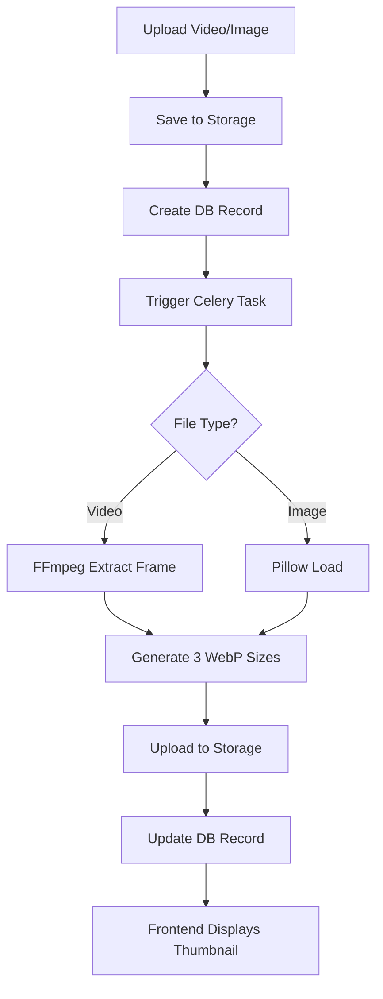

# Thumbnail Generation System

<cite>
**Referenced Files in This Document**   
- [THUMBNAIL_SYSTEM.md](file://THUMBNAIL_SYSTEM.md)
- [THUMBNAIL_QUICKSTART.md](file://THUMBNAIL_QUICKSTART.md)
- [THUMBNAIL_IMPLEMENTATION_SUMMARY.md](file://THUMBNAIL_IMPLEMENTATION_SUMMARY.md)
- [THUMBNAIL_USAGE_EXAMPLES.md](file://THUMBNAIL_USAGE_EXAMPLES.md)
- [app/tasks/thumbnail_generator.py](file://app/tasks/thumbnail_generator.py)
- [app/api/routes/ar_content.py](file://app/api/routes/ar_content.py)
- [alembic/versions/20251205_thumbnails.py](file://alembic/versions/20251205_thumbnails.py)
- [frontend/src/components/(media)/VideoPreview.tsx](file://frontend/src/components/(media)/VideoPreview.tsx)
- [frontend/src/components/(media)/ImagePreview.tsx](file://frontend/src/components/(media)/ImagePreview.tsx)
- [app/core/storage.py](file://app/core/storage.py)
- [app/models/video.py](file://app/models/video.py)
- [app/models/ar_content.py](file://app/models/ar_content.py)
- [Dockerfile](file://Dockerfile)
- [requirements.txt](file://requirements.txt)
</cite>

## Table of Contents
1. [Introduction](#introduction)
2. [Architecture Overview](#architecture-overview)
3. [Backend Implementation](#backend-implementation)
4. [Frontend Components](#frontend-components)
5. [Database Schema](#database-schema)
6. [Storage Structure](#storage-structure)
7. [Deployment and Configuration](#deployment-and-configuration)
8. [Performance and Optimization](#performance-and-optimization)
9. [Troubleshooting Guide](#troubleshooting-guide)
10. [Usage Examples](#usage-examples)
11. [Conclusion](#conclusion)

## Introduction

The Thumbnail Generation System is a production-ready solution for automatically generating optimized WebP thumbnails from images and videos. The system integrates seamlessly with the AR content management platform, providing responsive preview capabilities across various UI components. This documentation provides a comprehensive overview of the system architecture, implementation details, and integration patterns.

The system automatically generates thumbnails in three predefined sizes:
- **Small**: 200x112px (for lists/cards)
- **Medium**: 400x225px (for detailed pages)
- **Large**: 800x450px (for lightboxes/previews)

Built on a robust technology stack including FFmpeg for video processing, Pillow for image manipulation, and Celery for asynchronous task execution, the system ensures efficient and reliable thumbnail generation. The frontend components are implemented as React components with lazy loading and fallback mechanisms to enhance user experience.

**Section sources**
- [THUMBNAIL_SYSTEM.md](file://THUMBNAIL_SYSTEM.md#L1-L423)
- [THUMBNAIL_IMPLEMENTATION_SUMMARY.md](file://THUMBNAIL_IMPLEMENTATION_SUMMARY.md#L1-L318)

## Architecture Overview

The Thumbnail Generation System follows a distributed architecture with clear separation between frontend and backend components. The system processes thumbnail generation asynchronously to ensure optimal performance and responsiveness.



The architecture consists of several key components:
- **Frontend**: React components that display thumbnails with various interactive features
- **API Layer**: FastAPI endpoints that handle file uploads and trigger background tasks
- **Task Queue**: Celery workers that process thumbnail generation tasks asynchronously
- **Storage**: MinIO-based object storage for both original files and generated thumbnails
- **Database**: PostgreSQL with additional thumbnail URL fields for quick access

The system leverages FFmpeg for video frame extraction and Pillow for image processing, both optimized for WebP format with quality 85 and compression method 6. This combination provides excellent visual quality while maintaining small file sizes.

**Diagram sources**
- [THUMBNAIL_SYSTEM.md](file://THUMBNAIL_SYSTEM.md#L21-L34)

**Section sources**
- [THUMBNAIL_SYSTEM.md](file://THUMBNAIL_SYSTEM.md#L19-L34)
- [THUMBNAIL_IMPLEMENTATION_SUMMARY.md](file://THUMBNAIL_IMPLEMENTATION_SUMMARY.md#L82-L118)

## Backend Implementation

The backend implementation of the Thumbnail Generation System is centered around Celery tasks that handle the actual thumbnail generation process. These tasks are triggered automatically when new content is uploaded through the API.

### Celery Tasks

The system implements two primary Celery tasks for thumbnail generation:

#### Video Thumbnail Generation

The `generate_video_thumbnail` task processes video files by extracting a frame from the middle of the video using FFmpeg. The process involves:
1. Downloading the video from storage
2. Extracting a frame at the midpoint using FFmpeg
3. Generating three WebP thumbnails in different sizes
4. Uploading thumbnails to company-specific storage
5. Updating database records with thumbnail URLs

```python
@shared_task(bind=True, max_retries=3, default_retry_delay=60)
def generate_video_thumbnail(self, video_id: int):
    # Implementation details in thumbnail_generator.py
    pass
```

#### Image Thumbnail Generation

The `generate_image_thumbnail` task processes portrait images by creating three resized WebP versions. The process includes:
1. Downloading the original image from storage
2. Creating three resized versions with aspect ratio preservation
3. Converting to WebP format
4. Uploading to storage
5. Updating the AR content record with thumbnail URL

```python
@shared_task(bind=True, max_retries=3, default_retry_delay=60)
def generate_image_thumbnail(self, ar_content_id: int):
    # Implementation details in thumbnail_generator.py
    pass
```

Both tasks include error handling with automatic retry mechanisms (up to 3 attempts) and comprehensive logging using structlog. The tasks run asynchronously, ensuring that file uploads remain responsive even for large video files.

**Section sources**
- [app/tasks/thumbnail_generator.py](file://app/tasks/thumbnail_generator.py#L1-L265)
- [THUMBNAIL_SYSTEM.md](file://THUMBNAIL_SYSTEM.md#L40-L75)

## Frontend Components

The frontend implementation provides two React components for displaying thumbnails: VideoPreview and ImagePreview. These components are designed to be reusable across different parts of the application.

### VideoPreview Component

The VideoPreview component displays video thumbnails with several interactive features:

```typescript
interface VideoPreviewProps {
  video: Video;
  size?: 'small' | 'medium' | 'large';
  onClick?: () => void;
  showDuration?: boolean;
  showPlayIcon?: boolean;
  className?: string;
}
```

Key features include:
- Automatic selection of appropriate thumbnail size
- Fallback to available sizes when preferred size is missing
- Play icon overlay with hover effects
- Duration badge displaying video length in MM:SS format
- "Active" badge for active videos
- Lazy loading of images to improve performance

The component handles various states including loading, error, and hover interactions, providing a smooth user experience.

### ImagePreview Component

The ImagePreview component displays AR content thumbnails with additional metadata:

```typescript
interface ImagePreviewProps {
  arContent: ARContent;
  size?: 'small' | 'medium' | 'large';
  onClick?: () => void;
  showStatus?: boolean;
  loading?: boolean;
  className?: string;
}
```

Key features include:
- Automatic fallback to original image when thumbnail is unavailable
- Marker status badges (Ready/Processing/Error)
- "Active" badge for active content
- Skeleton loader during loading
- Hover overlay with visual feedback
- Error handling with placeholder images

Both components are designed with accessibility and performance in mind, implementing lazy loading and efficient rendering patterns.

**Section sources**
- [frontend/src/components/(media)/VideoPreview.tsx](file://frontend/src/components/(media)/VideoPreview.tsx#L1-L160)
- [frontend/src/components/(media)/ImagePreview.tsx](file://frontend/src/components/(media)/ImagePreview.tsx#L1-L191)
- [THUMBNAIL_SYSTEM.md](file://THUMBNAIL_SYSTEM.md#L150-L242)

## Database Schema

The Thumbnail Generation System requires specific database schema modifications to store thumbnail URLs. These changes are implemented through Alembic migrations.

### Videos Table

The videos table has been extended with additional thumbnail URL fields:

```sql
ALTER TABLE videos ADD COLUMN thumbnail_small_url VARCHAR(500);
ALTER TABLE videos ADD COLUMN thumbnail_large_url VARCHAR(500);
-- thumbnail_url already exists for medium size
```

The complete schema for the videos table includes:
- `thumbnail_url`: Medium size thumbnail (400x225)
- `thumbnail_small_url`: Small size thumbnail (200x112)
- `thumbnail_large_url`: Large size thumbnail (800x450)

### AR Content Table

The ar_content table already had a thumbnail_url field, which is used for medium-sized thumbnails:

```sql
-- thumbnail_url exists for portrait thumbnails (400x225)
```

The migration adds comments to clarify the purpose of each thumbnail field, improving database documentation and maintainability.

```python
op.execute("COMMENT ON COLUMN videos.thumbnail_url IS 'Medium size thumbnail (400x225)'")
op.execute("COMMENT ON COLUMN videos.thumbnail_small_url IS 'Small size thumbnail (200x112)'")
op.execute("COMMENT ON COLUMN videos.thumbnail_large_url IS 'Large size thumbnail (800x450)'")
```

These schema changes enable efficient querying of thumbnail URLs without requiring additional processing or joins.

**Section sources**
- [alembic/versions/20251205_thumbnails.py](file://alembic/versions/20251205_thumbnails.py#L1-L37)
- [app/models/video.py](file://app/models/video.py#L1-L35)
- [app/models/ar_content.py](file://app/models/ar_content.py#L1-L46)

## Storage Structure

The system implements a structured storage hierarchy to organize thumbnails and original content. This multi-tenant structure ensures separation between different companies and content types.

```text
storage/
├── ar_content/
│   └── {unique_id}/
│       ├── portrait.jpg (original)
│       └── videos/
│           └── video.mp4
└── thumbnails/
    ├── portraits/
    │   └── {ar_content_id}/
    │       ├── {uuid}_small.webp
    │       ├── {uuid}_medium.webp
    │       └── {uuid}_large.webp
    └── videos/
        └── {video_id}/
            ├── {uuid}_small.webp
            ├── {uuid}_medium.webp
            └── {uuid}_large.webp
```

The storage system uses MinIO as the object storage backend, configured with public read policies for efficient content delivery. Each thumbnail is stored with a unique UUID to prevent naming conflicts and ensure cache-busting.

The storage manager handles file operations including:
- Uploading files to MinIO
- Downloading files for processing
- Generating presigned URLs for temporary access
- Ensuring proper bucket creation and policy configuration

This structure supports multi-tenancy by organizing content under company-specific directories while maintaining a consistent naming convention across all stored assets.

**Section sources**
- [THUMBNAIL_SYSTEM.md](file://THUMBNAIL_SYSTEM.md#L282-L302)
- [app/core/storage.py](file://app/core/storage.py#L1-L71)

## Deployment and Configuration

The Thumbnail Generation System requires specific configuration and deployment steps to function correctly. These include Docker configuration, dependency management, and system initialization.

### Docker Configuration

The system requires FFmpeg to be installed in the Docker container. This is achieved through the Dockerfile:

```dockerfile
RUN apt-get update && apt-get install -y \
    ffmpeg \
    libavcodec-extra \
    libavformat-dev \
    libavutil-dev \
    libswscale-dev \
    && rm -rf /var/lib/apt/lists/*
```

The Docker build process must include rebuilding the app and celery-worker services to ensure FFmpeg is properly installed.

### Dependencies

Key dependencies are specified in requirements.txt:

```txt
ffmpeg-python==0.2.0
Pillow==10.2.0
```

These dependencies enable video processing with FFmpeg and image manipulation with Pillow, both essential for thumbnail generation.

### Deployment Checklist

The deployment process includes:
1. Rebuilding Docker images with updated dependencies
2. Applying the database migration for thumbnail fields
3. Restarting application and worker services
4. Verifying FFmpeg installation
5. Testing thumbnail generation with sample content

The system provides comprehensive quick start documentation to guide administrators through the deployment process, including troubleshooting steps for common issues.

**Section sources**
- [Dockerfile](file://Dockerfile#L1-L55)
- [requirements.txt](file://requirements.txt#L1-L36)
- [THUMBNAIL_QUICKSTART.md](file://THUMBNAIL_QUICKSTART.md#L1-L297)

## Performance and Optimization

The Thumbnail Generation System is optimized for both processing efficiency and user experience. The performance characteristics have been carefully considered during implementation.

### Processing Performance

Average generation times:
- Image: ~2-3 seconds
- Video (30 seconds): ~5-7 seconds
- Video (2 minutes): ~10-15 seconds

These times are achieved through several optimization techniques:
- WebP format with quality 85 (optimal balance)
- Compression method 6 (maximum compression)
- Asynchronous processing via Celery
- Efficient FFmpeg parameters for frame extraction

### Frontend Optimization

The frontend components implement several performance-enhancing features:
- Lazy loading of images to reduce initial page load
- Automatic fallback to available thumbnail sizes
- Efficient rendering with React memoization
- Skeleton loaders during content loading
- Error handling with graceful degradation

### System Optimization

Additional optimizations include:
- WebP format reducing file sizes by approximately 70% compared to JPEG
- CDN-ready storage structure for potential content delivery network integration
- Batch processing capabilities for future scalability
- Comprehensive logging for performance monitoring

The system is designed to handle increasing loads through horizontal scaling of Celery workers and optimized database queries.

**Section sources**
- [THUMBNAIL_SYSTEM.md](file://THUMBNAIL_SYSTEM.md#L388-L400)
- [THUMBNAIL_IMPLEMENTATION_SUMMARY.md](file://THUMBNAIL_IMPLEMENTATION_SUMMARY.md#L230-L242)

## Troubleshooting Guide

This section provides guidance for diagnosing and resolving common issues with the Thumbnail Generation System.

### Common Issues and Solutions

#### Thumbnails Not Generating

**Symptoms**: No thumbnails appear after content upload, database fields remain empty.

**Diagnosis**:
```bash
# Check Celery worker logs
docker-compose logs celery-worker

# Check Redis queue
docker-compose exec redis redis-cli
> LLEN celery
```

**Solutions**:
- Verify Celery worker is running
- Check for FFmpeg errors in logs
- Ensure Redis is properly connected
- Restart celery-worker service

#### FFmpeg Not Found

**Symptoms**: "FFmpeg not found" errors in logs.

**Solutions**:
```bash
# Rebuild Docker images with cache disabled
docker-compose build --no-cache app celery-worker
```

Ensure the Dockerfile includes FFmpeg installation and rebuild the images completely.

#### Permission Issues

**Symptoms**: Cannot create directories or write files in storage.

**Solutions**:
```bash
# Create missing directories with proper ownership
docker-compose exec app mkdir -p /app/storage/thumbnails/videos
docker-compose exec app mkdir -p /app/storage/thumbnails/portraits
docker-compose exec app chown -R appuser:appuser /app/storage
```

#### Migration Conflicts

**Symptoms**: "Migration already exists" errors.

**Solutions**:
```bash
# Roll back and reapply migration
docker-compose exec app alembic downgrade -1
docker-compose exec app alembic upgrade head
```

The system includes comprehensive logging with structlog, making it easier to trace issues through the processing pipeline. All critical operations are logged with appropriate context, including video_id, ar_content_id, and processing stages.

**Section sources**
- [THUMBNAIL_SYSTEM.md](file://THUMBNAIL_SYSTEM.md#L306-L347)
- [THUMBNAIL_QUICKSTART.md](file://THUMBNAIL_QUICKSTART.md#L176-L219)

## Usage Examples

This section provides practical examples of integrating the thumbnail components into various UI contexts.

### Video Preview Integration

#### In AR Content Detail Page

```tsx
import { VideoPreview } from '@/components/(media)';

<VideoPreview
  video={{
    id: 1,
    title: "Demo Video",
    video_url: "/storage/video.mp4",
    thumbnail_url: "/storage/thumbnails/medium.webp",
    thumbnail_small_url: "/storage/thumbnails/small.webp",
    thumbnail_large_url: "/storage/thumbnails/large.webp",
    duration: 125.5,
    is_active: true
  }}
  size="medium"
  onClick={() => playVideo(1)}
  showDuration={true}
  showPlayIcon={true}
/>
```

#### In Compact List View

```tsx
<ListItemAvatar sx={{ width: 120, height: 68, mr: 2 }}>
  <VideoPreview
    video={video}
    size="small"
    showPlayIcon={false}
    showDuration={true}
  />
</ListItemAvatar>
```

### Image Preview Integration

#### In AR Content Gallery

```tsx
<ImagePreview
  arContent={content}
  size="medium"
  onClick={() => handleContentClick(content.id)}
  showStatus={true}
/>
```

#### In Table View

```tsx
<TableCell>
  <Box width={150}>
    <ImagePreview
      arContent={content}
      size="small"
      showStatus={false}
    />
  </Box>
</TableCell>
```

### Best Practices

#### Lazy Loading for Large Lists

```tsx
import { FixedSizeGrid } from 'react-window';

<FixedSizeGrid
  columnCount={4}
  columnWidth={200}
  height={600}
  rowCount={Math.ceil(videos.length / 4)}
  rowHeight={150}
  width={1000}
>
  {Cell}
</FixedSizeGrid>
```

#### Component Memoization

```tsx
const VideoCard = memo<{ video: Video }>(({ video }) => {
  return <VideoPreview video={video} />;
}, (prev, next) => {
  return prev.video.thumbnail_url === next.video.thumbnail_url;
});
```

These examples demonstrate the flexibility and reusability of the thumbnail components across different UI patterns and layouts.

**Section sources**
- [THUMBNAIL_USAGE_EXAMPLES.md](file://THUMBNAIL_USAGE_EXAMPLES.md#L1-L547)
- [frontend/src/components/(media)/VideoPreview.tsx](file://frontend/src/components/(media)/VideoPreview.tsx#L1-L160)
- [frontend/src/components/(media)/ImagePreview.tsx](file://frontend/src/components/(media)/ImagePreview.tsx#L1-L191)

## Conclusion

The Thumbnail Generation System provides a comprehensive solution for automatic WebP thumbnail creation from images and videos. The system is production-ready and integrates seamlessly with the existing AR content platform.

Key achievements include:
- ✅ Backend: Celery tasks with FFmpeg + Pillow for efficient processing
- ✅ Database: Migration with fields for three thumbnail sizes
- ✅ API: Automatic generation triggered by file uploads
- ✅ Frontend: React components with fallback and lazy loading
- ✅ Docker: FFmpeg installed in container image
- ✅ Storage: Multi-tenant structure with organized hierarchy

The system follows best practices for asynchronous processing, error handling, and performance optimization. It provides a solid foundation for displaying rich media content with responsive previews across various device sizes and network conditions.

Future enhancements could include:
- Animated WebP support for GIFs
- Low-quality image placeholders (LQIP)
- Batch generation for existing files
- Webhook notifications on completion
- CDN integration for improved delivery

The comprehensive documentation, including quick start guides and usage examples, ensures smooth adoption and integration across the platform.

**Section sources**
- [THUMBNAIL_IMPLEMENTATION_SUMMARY.md](file://THUMBNAIL_IMPLEMENTATION_SUMMARY.md#L301-L318)
- [THUMBNAIL_SYSTEM.md](file://THUMBNAIL_SYSTEM.md#L413-L423)