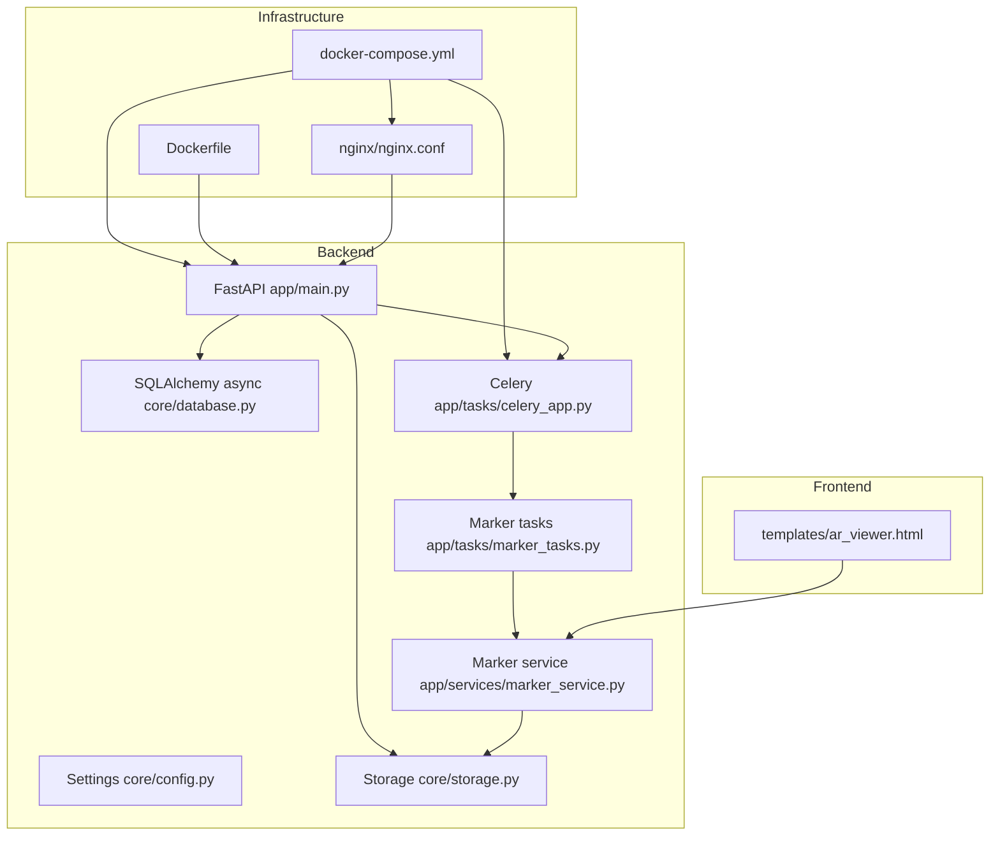
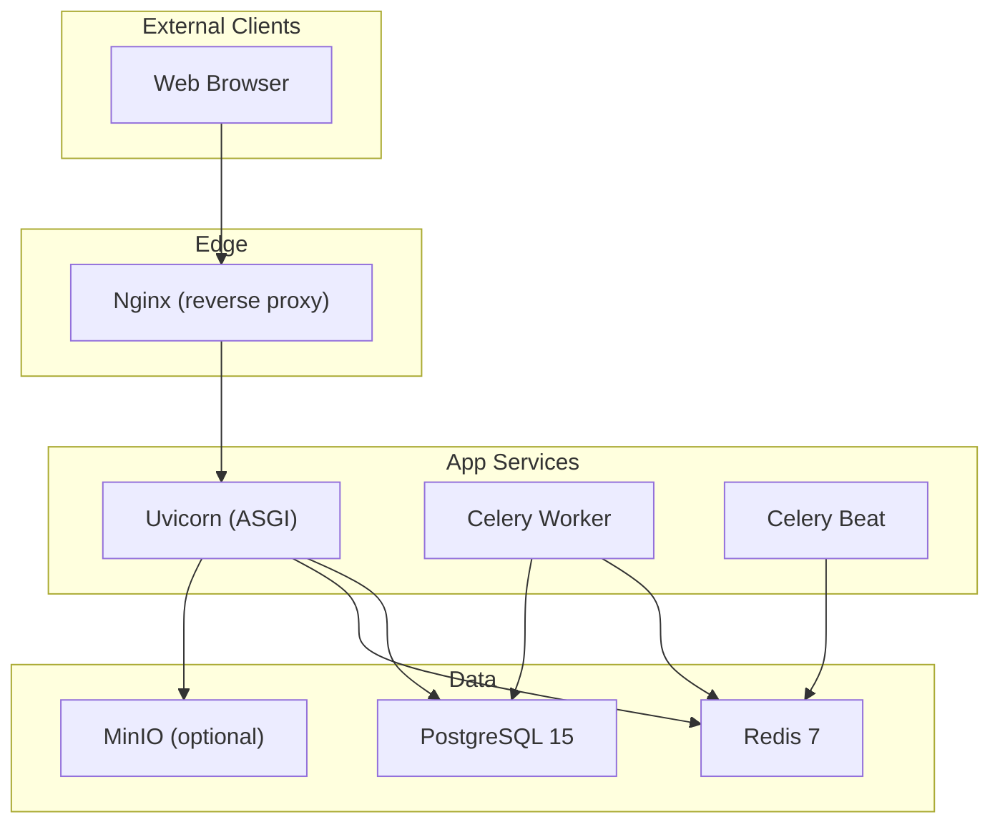
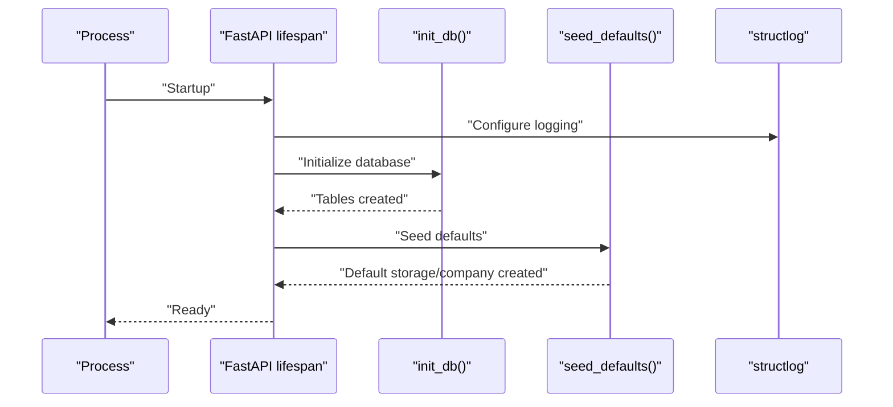
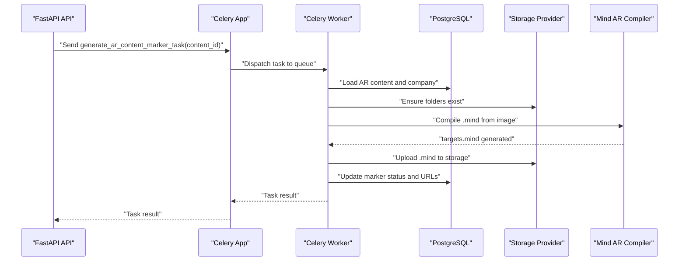
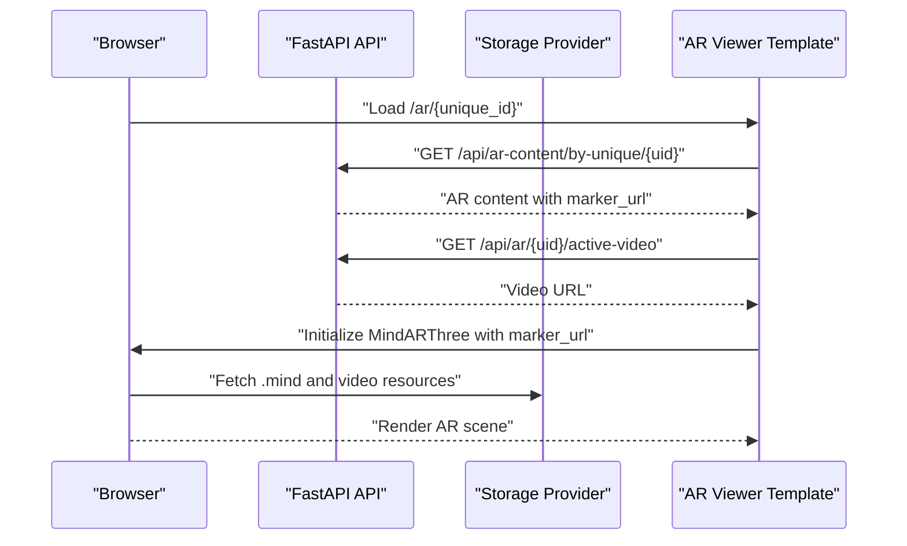
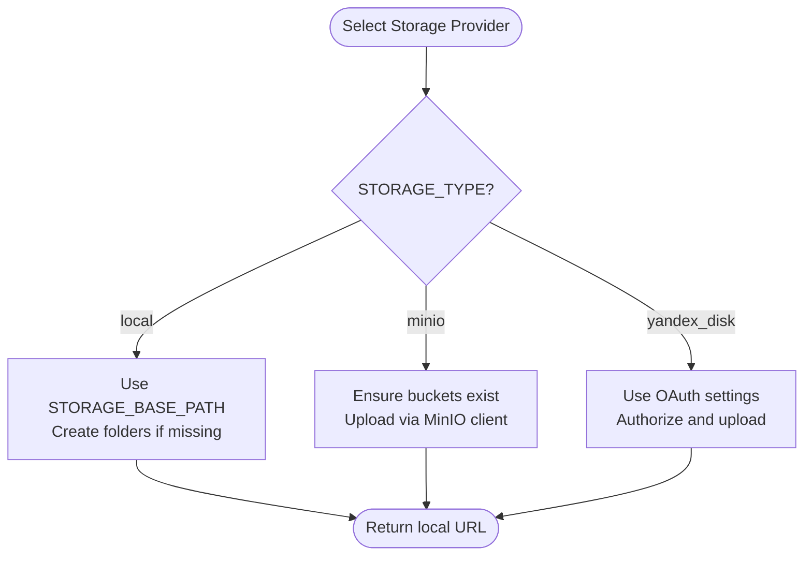
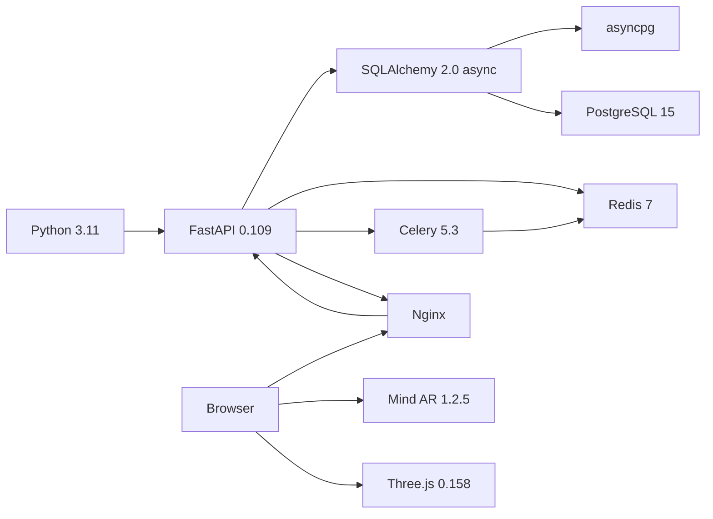

# Technology Stack & Dependencies

<cite>
**Referenced Files in This Document**
- [README.md](file://README.md)
- [requirements.txt](file://requirements.txt)
- [Dockerfile](file://Dockerfile)
- [docker-compose.yml](file://docker-compose.yml)
- [app/main.py](file://app/main.py)
- [app/core/config.py](file://app/core/config.py)
- [app/core/database.py](file://app/core/database.py)
- [app/core/storage.py](file://app/core/storage.py)
- [app/tasks/celery_app.py](file://app/tasks/celery_app.py)
- [app/tasks/marker_tasks.py](file://app/tasks/marker_tasks.py)
- [app/services/marker_service.py](file://app/services/marker_service.py)
- [.env.example](file://.env.example)
- [nginx/nginx.conf](file://nginx/nginx.conf)
- [templates/ar_viewer.html](file://templates/ar_viewer.html)
</cite>

## Table of Contents
1. [Introduction](#introduction)
2. [Project Structure](#project-structure)
3. [Core Components](#core-components)
4. [Architecture Overview](#architecture-overview)
5. [Detailed Component Analysis](#detailed-component-analysis)
6. [Dependency Analysis](#dependency-analysis)
7. [Performance Considerations](#performance-considerations)
8. [Troubleshooting Guide](#troubleshooting-guide)
9. [Conclusion](#conclusion)

## Introduction
This document explains the ARV technology stack and how its components interact. It covers the backend (FastAPI, SQLAlchemy 2.0 async, PostgreSQL 15, Python 3.11+), frontend (React 18, TypeScript, Material-UI 5, TailwindCSS), infrastructure (Docker, Docker Compose, Nginx), task queue (Celery 5.3 with Redis 7), AR engine (Mind AR 1.2.5, Three.js 0.158), storage options (Local, MinIO, Yandex Disk), monitoring (Prometheus, Grafana, Sentry), and logging (structlog). Practical examples illustrate how Celery workers process marker generation tasks, and common configuration issues and dependency conflicts are addressed.

## Project Structure
The repository organizes the backend under app/, the frontend under frontend/, infrastructure under Docker and Nginx, and runtime configuration via .env. The stack is containerized and orchestrated with Docker Compose, exposing the API and serving static assets through Nginx.

**Diagram sources**
- [docker-compose.yml](file://docker-compose.yml#L1-L144)
- [Dockerfile](file://Dockerfile#L1-L53)
- [nginx/nginx.conf](file://nginx/nginx.conf#L1-L118)
- [app/main.py](file://app/main.py#L1-L285)
- [app/core/config.py](file://app/core/config.py#L1-L134)
- [app/core/database.py](file://app/core/database.py#L1-L103)
- [app/core/storage.py](file://app/core/storage.py#L1-L71)
- [app/tasks/celery_app.py](file://app/tasks/celery_app.py#L1-L50)
- [app/tasks/marker_tasks.py](file://app/tasks/marker_tasks.py#L1-L173)
- [app/services/marker_service.py](file://app/services/marker_service.py#L1-L134)
- [templates/ar_viewer.html](file://templates/ar_viewer.html#L48-L172)

**Section sources**
- [README.md](file://README.md#L60-L68)
- [docker-compose.yml](file://docker-compose.yml#L1-L144)
- [Dockerfile](file://Dockerfile#L1-L53)
- [nginx/nginx.conf](file://nginx/nginx.conf#L1-L118)

## Core Components
- Backend framework: FastAPI 0.109 with lifespan management, structured logging, CORS, health/readiness endpoints, and templated AR viewer.
- Database: SQLAlchemy 2.0 async ORM with asyncpg, configured via settings and dependency-injected sessions.
- Queue and scheduler: Celery 5.3 with Redis 7 as broker/backend; scheduled tasks via Celery Beat.
- AR engine: Mind AR 1.2.5 and Three.js 0.158 loaded in the browser for marker detection and 3D rendering.
- Storage: Local disk, MinIO, and Yandex Disk support with unified provider abstraction.
- Monitoring: Prometheus multiprocess directory and Sentry DSN placeholders; Grafana is referenced conceptually.
- Logging: structlog configured for JSON or console renderers depending on environment.

**Section sources**
- [app/main.py](file://app/main.py#L1-L285)
- [app/core/config.py](file://app/core/config.py#L1-L134)
- [app/core/database.py](file://app/core/database.py#L1-L103)
- [app/tasks/celery_app.py](file://app/tasks/celery_app.py#L1-L50)
- [app/services/marker_service.py](file://app/services/marker_service.py#L1-L134)
- [app/core/storage.py](file://app/core/storage.py#L1-L71)
- [requirements.txt](file://requirements.txt#L1-L31)
- [README.md](file://README.md#L60-L68)

## Architecture Overview
The system runs as containers orchestrated by Docker Compose. Nginx acts as a reverse proxy and static file server. FastAPI serves the API and renders the AR viewer template. Celery workers consume tasks from Redis queues. PostgreSQL stores application data. Storage backends serve AR assets to clients.

**Diagram sources**
- [docker-compose.yml](file://docker-compose.yml#L1-L144)
- [nginx/nginx.conf](file://nginx/nginx.conf#L1-L118)
- [app/main.py](file://app/main.py#L1-L285)
- [app/tasks/celery_app.py](file://app/tasks/celery_app.py#L1-L50)

## Detailed Component Analysis

### Backend Stack: FastAPI, SQLAlchemy 2.0 Async, PostgreSQL 15, Python 3.11+
- FastAPI application initializes logging, database, and seeds defaults during startup. It exposes health/readiness endpoints and includes routers for API groups. Structured logging is configured via structlog with JSON renderer in production and console renderer in development.
- SQLAlchemy 2.0 async engine is configured with connection pooling and pre-ping. Sessions are dependency-injected and committed/rolled back automatically. Database initialization creates tables and seeds default storage/company records.
- PostgreSQL 15 is provisioned via Docker Compose with health checks and persistent volumes.

Practical example: Startup lifecycle and database seeding.

**Diagram sources**
- [app/main.py](file://app/main.py#L1-L285)
- [app/core/database.py](file://app/core/database.py#L1-L103)

**Section sources**
- [app/main.py](file://app/main.py#L1-L285)
- [app/core/database.py](file://app/core/database.py#L1-L103)
- [docker-compose.yml](file://docker-compose.yml#L1-L144)

### Task Queue System: Celery 5.3 with Redis 7
- Celery app is configured with broker and result backend URLs from settings. Queues are defined for markers, notifications, and default tasks. Beat schedule includes periodic tasks for expiring projects, expired content deactivation, scheduled video rotation, and daily notifications.
- Marker tasks include asynchronous generation using Mind AR compiler and storage provider uploads. Tasks bind to Celery to support retries and metadata.

Practical example: Celery worker processing marker generation.

**Diagram sources**
- [app/tasks/celery_app.py](file://app/tasks/celery_app.py#L1-L50)
- [app/tasks/marker_tasks.py](file://app/tasks/marker_tasks.py#L1-L173)
- [app/services/marker_service.py](file://app/services/marker_service.py#L1-L134)
- [app/core/storage.py](file://app/core/storage.py#L1-L71)

**Section sources**
- [app/tasks/celery_app.py](file://app/tasks/celery_app.py#L1-L50)
- [app/tasks/marker_tasks.py](file://app/tasks/marker_tasks.py#L1-L173)
- [docker-compose.yml](file://docker-compose.yml#L72-L117)

### AR Engine: Mind AR 1.2.5 and Three.js 0.158
- The AR viewer page loads Mind AR and Three.js libraries from CDN and initializes a MindARThree instance with a marker URL from the API. It attaches a video texture to a Three.js plane anchored to the detected marker and controls playback on target found/lost events.
- Backend generates .mind marker files and uploads them to storage; the frontend consumes marker URLs and video URLs to render AR experiences.

**Diagram sources**
- [templates/ar_viewer.html](file://templates/ar_viewer.html#L48-L172)
- [app/tasks/marker_tasks.py](file://app/tasks/marker_tasks.py#L120-L166)
- [app/services/marker_service.py](file://app/services/marker_service.py#L60-L96)

**Section sources**
- [templates/ar_viewer.html](file://templates/ar_viewer.html#L48-L172)
- [app/tasks/marker_tasks.py](file://app/tasks/marker_tasks.py#L120-L166)
- [app/services/marker_service.py](file://app/services/marker_service.py#L60-L96)

### Storage Options: Local, MinIO, Yandex Disk
- Local storage is the default with seeded base directories for portraits, videos, markers, QR codes, and thumbnails.
- MinIO client ensures required buckets and applies public read policy; uploads return public URLs. MinIO endpoints and bucket names are configurable.
- Yandex Disk OAuth settings are defined in configuration for future integration.

**Diagram sources**
- [app/core/config.py](file://app/core/config.py#L58-L111)
- [app/core/storage.py](file://app/core/storage.py#L1-L71)
- [app/core/database.py](file://app/core/database.py#L54-L99)

**Section sources**
- [app/core/config.py](file://app/core/config.py#L58-L111)
- [app/core/storage.py](file://app/core/storage.py#L1-L71)
- [app/core/database.py](file://app/core/database.py#L54-L99)

### Monitoring Tools: Prometheus, Grafana, Sentry
- Prometheus multiprocess directory is configured in settings for metrics collection.
- Sentry DSN is available as a setting for error reporting.
- Grafana is referenced conceptually as a dashboard tool.

**Section sources**
- [app/core/config.py](file://app/core/config.py#L96-L111)
- [README.md](file://README.md#L60-L68)

### Logging: structlog
- Structured logging is configured early in application startup. In production, logs are rendered as JSON; in development, console renderer is used. HTTP requests and exceptions are logged with contextual information.

**Section sources**
- [app/main.py](file://app/main.py#L1-L139)

## Dependency Analysis
- Python 3.11 is used in the base image and development workflow.
- FastAPI 0.109, SQLAlchemy 2.0 async, and asyncpg are pinned for async database operations.
- Celery 5.3 and Redis 7 are used for task processing and scheduling.
- Mind AR compiler is installed globally in the container; Mind AR 1.2.5 and Three.js 0.158 are loaded in the browser.
- Nginx proxies API and static assets, and serves storage content.

**Diagram sources**
- [Dockerfile](file://Dockerfile#L1-L53)
- [requirements.txt](file://requirements.txt#L1-L31)
- [docker-compose.yml](file://docker-compose.yml#L1-L144)
- [templates/ar_viewer.html](file://templates/ar_viewer.html#L74-L77)

**Section sources**
- [requirements.txt](file://requirements.txt#L1-L31)
- [Dockerfile](file://Dockerfile#L1-L53)
- [docker-compose.yml](file://docker-compose.yml#L1-L144)
- [README.md](file://README.md#L60-L68)

## Performance Considerations
- Database connection pooling: adjust pool size and overflow according to workload.
- Redis memory limits: tune maxmemory and policy for task queues.
- Nginx timeouts and body size: ensure adequate proxy timeouts for long-running tasks and large uploads.
- Celery concurrency: balance worker concurrency against CPU and I/O capacity.
- Storage latency: MinIO and Yandex Disk performance depend on network conditions; consider caching and CDN strategies.

[No sources needed since this section provides general guidance]

## Troubleshooting Guide
Common configuration issues and dependency conflicts:
- Version mismatches
  - Ensure Python 3.11+ is used consistently across local development and Docker images.
  - Align FastAPI, SQLAlchemy, and asyncpg versions with pinned requirements.
- Database connectivity
  - Verify DATABASE_URL and credentials in .env; confirm PostgreSQL health and reachable from the app container.
- Redis connectivity
  - Confirm REDIS_URL and that Redis is healthy; check queue names and broker backend URLs.
- Storage configuration
  - For MinIO, ensure MINIO_ENDPOINT, MINIO_ACCESS_KEY, MINIO_SECRET_KEY, and bucket names are correct; verify public read policy.
  - For Yandex Disk, ensure OAuth client credentials and redirect URI match the environment.
- AR marker generation
  - Confirm Mind AR compiler availability in the container and that the compiler path setting is correct.
  - Validate that marker tasks are dispatched to the correct queues and that Celery workers are running.
- Nginx routing
  - Verify proxy_pass directives for /api/, /ar/, and /storage/ paths; ensure static file serving and caching headers are appropriate.

**Section sources**
- [.env.example](file://.env.example#L1-L70)
- [app/core/config.py](file://app/core/config.py#L1-L134)
- [docker-compose.yml](file://docker-compose.yml#L1-L144)
- [nginx/nginx.conf](file://nginx/nginx.conf#L43-L117)
- [app/tasks/celery_app.py](file://app/tasks/celery_app.py#L1-L50)
- [app/tasks/marker_tasks.py](file://app/tasks/marker_tasks.py#L1-L173)

## Conclusion
The ARV stack combines modern backend and frontend technologies with robust infrastructure and task processing. FastAPI and SQLAlchemy 2.0 async deliver scalable API capabilities; Celery and Redis power asynchronous workflows; PostgreSQL persists data; Nginx provides reverse proxy and static asset serving; Mind AR and Three.js enable interactive AR experiences; and storage backends accommodate diverse deployment scenarios. Proper configuration of environment variables and container orchestration ensures reliable operation.