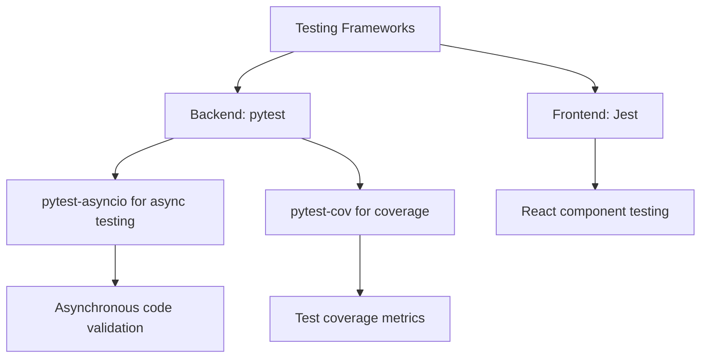
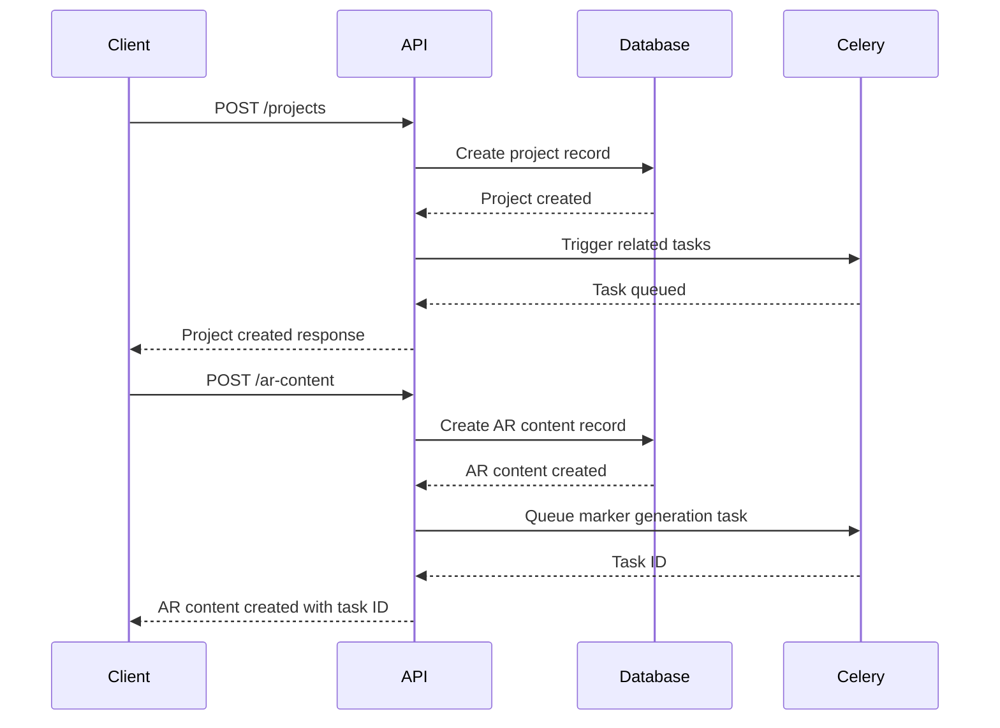
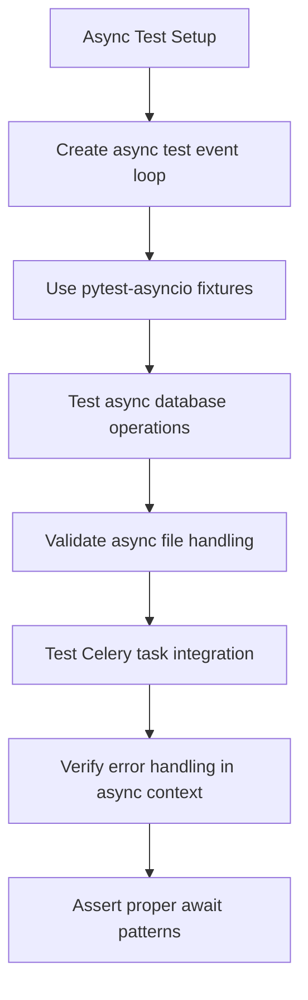
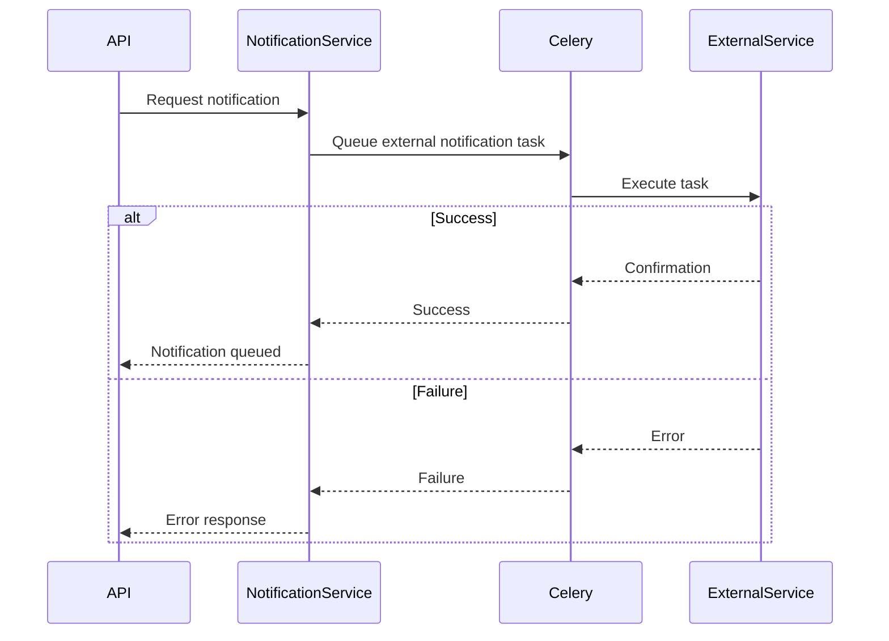

# Testing Strategy

<cite>
**Referenced Files in This Document**   
- [requirements.txt](file://requirements.txt)
- [README.md](file://README.md)
- [app/main.py](file://app/main.py)
- [app/core/database.py](file://app/core/database.py)
- [app/api/routes/projects.py](file://app/api/routes/projects.py)
- [app/api/routes/ar_content.py](file://app/api/routes/ar_content.py)
- [app/api/routes/notifications.py](file://app/api/routes/notifications.py)
- [app/tasks/celery_app.py](file://app/tasks/celery_app.py)
- [app/tasks/notification_tasks.py](file://app/tasks/notification_tasks.py)
- [app/tasks/marker_tasks.py](file://app/tasks/marker_tasks.py)
- [app/services/notification_service.py](file://app/services/notification_service.py)
- [app/models/project.py](file://app/models/project.py)
- [app/models/ar_content.py](file://app/models/ar_content.py)
- [app/models/notification.py](file://app/models/notification.py)
</cite>

## Table of Contents
1. [Testing Strategy Overview](#testing-strategy-overview)
2. [Testing Tools and Frameworks](#testing-tools-and-frameworks)
3. [Unit Testing Approach](#unit-testing-approach)
4. [Integration Testing Strategy](#integration-testing-strategy)
5. [End-to-End Testing](#end-to-end-testing)
6. [Test Coverage and Metrics](#test-coverage-and-metrics)
7. [Testing Asynchronous Code](#testing-asynchronous-code)
8. [Database Interaction Testing](#database-interaction-testing)
9. [External Service Integration Testing](#external-service-integration-testing)
10. [Development Workflow](#development-workflow)
11. [Test Quality Guidelines](#test-quality-guidelines)

## Testing Strategy Overview

The ARV platform implements a comprehensive testing strategy that encompasses unit, integration, and end-to-end testing to ensure the reliability and stability of the application. The testing approach is designed to validate core functionality, API endpoints, and complete user workflows across the platform's components. The strategy focuses on testing critical features such as project creation, AR content management, and notification processing, with particular attention to asynchronous operations, database interactions, and external service integrations.

**Section sources**
- [README.md](file://README.md#L100-L109)
- [requirements.txt](file://requirements.txt#L20-L22)

## Testing Tools and Frameworks

The ARV platform utilizes pytest as the primary testing framework for backend code, providing robust support for asynchronous testing through the pytest-asyncio plugin. The test suite is configured to generate coverage reports using pytest-cov, enabling quantitative measurement of test coverage. For frontend testing, Jest is employed to validate React components and their interactions within the admin panel. These tools are integrated into the development workflow, allowing developers to run tests locally and ensuring automated execution in CI/CD pipelines.

**Diagram sources**
- [requirements.txt](file://requirements.txt#L20-L22)
- [README.md](file://README.md#L100-L108)

**Section sources**
- [requirements.txt](file://requirements.txt#L20-L22)
- [README.md](file://README.md#L100-L108)

## Unit Testing Approach

Unit testing in the ARV platform focuses on validating individual functions and methods in isolation, ensuring that core business logic operates correctly. The strategy emphasizes testing pure functions, data transformations, and utility methods across various components. For example, unit tests verify the proper creation of projects with validation of required fields, correct handling of date parsing in project management, and accurate processing of tags and metadata. The tests are designed to be fast and deterministic, providing immediate feedback on code changes.

**Section sources**
- [app/api/routes/projects.py](file://app/api/routes/projects.py#L14-L41)
- [app/api/routes/ar_content.py](file://app/api/routes/ar_content.py#L18-L22)
- [app/api/routes/projects.py](file://app/api/routes/projects.py#L128-L145)

## Integration Testing Strategy

Integration testing validates the interaction between different components of the system, particularly focusing on API endpoints and their integration with database operations and external services. The ARV platform implements integration tests for key workflows such as project creation, AR content management, and notification processing. These tests verify that API endpoints correctly handle requests, interact properly with the database through SQLAlchemy models, and trigger appropriate background tasks via Celery. The integration tests ensure that data flows correctly through the system and that error conditions are handled appropriately.

**Diagram sources**
- [app/api/routes/projects.py](file://app/api/routes/projects.py#L14-L41)
- [app/api/routes/ar_content.py](file://app/api/routes/ar_content.py#L24-L70)
- [app/tasks/marker_tasks.py](file://app/tasks/marker_tasks.py)

**Section sources**
- [app/api/routes/projects.py](file://app/api/routes/projects.py#L14-L41)
- [app/api/routes/ar_content.py](file://app/api/routes/ar_content.py#L24-L70)
- [app/tasks/marker_tasks.py](file://app/tasks/marker_tasks.py)

## End-to-End Testing

End-to-end testing in the ARV platform validates complete user workflows, ensuring that all components work together as expected. These tests simulate real user scenarios, such as creating a project, uploading AR content, generating markers, and receiving notifications. The end-to-end tests verify that the entire system functions correctly from the API layer through database operations, background task processing, and external service integrations. This approach helps identify issues that might not be apparent in unit or integration tests, particularly those related to timing, state management, and complex interactions between components.

**Section sources**
- [app/api/routes/projects.py](file://app/api/routes/projects.py)
- [app/api/routes/ar_content.py](file://app/api/routes/ar_content.py)
- [app/api/routes/notifications.py](file://app/api/routes/notifications.py)

## Test Coverage and Metrics

The ARV platform tracks test coverage using pytest-cov to ensure comprehensive testing of the codebase. The goal is to achieve high coverage percentages for critical components while maintaining focus on testing meaningful functionality rather than simply increasing coverage numbers. Coverage metrics are collected for core modules including project management, AR content processing, and notification systems. These metrics are used to identify untested code paths and prioritize test development. The coverage reports are integrated into the CI/CD pipeline, preventing merges that significantly reduce test coverage.

**Section sources**
- [requirements.txt](file://requirements.txt#L22)
- [README.md](file://README.md#L104)

## Testing Asynchronous Code

The ARV platform extensively uses asynchronous code for database operations, file handling, and background task processing. Testing asynchronous code requires special consideration to ensure proper handling of coroutines and async/await patterns. The platform leverages pytest-asyncio to create test functions that can await asynchronous operations, allowing for direct testing of async methods. Tests for asynchronous code validate proper execution flow, error handling in async contexts, and correct integration between synchronous and asynchronous components. Particular attention is paid to testing Celery tasks that process AR content markers and send notifications.

**Diagram sources**
- [app/core/database.py](file://app/core/database.py#L30-L45)
- [app/tasks/celery_app.py](file://app/tasks/celery_app.py)
- [app/api/routes/ar_content.py](file://app/api/routes/ar_content.py#L38-L43)

**Section sources**
- [app/core/database.py](file://app/core/database.py#L30-L45)
- [app/tasks/celery_app.py](file://app/tasks/celery_app.py)
- [app/api/routes/ar_content.py](file://app/api/routes/ar_content.py#L38-L43)

## Database Interaction Testing

Database interaction testing focuses on validating the correctness of SQLAlchemy ORM operations, query construction, and data persistence. The ARV platform implements tests that verify model creation, relationship handling, and query execution against a test database. These tests ensure that database migrations are properly applied, constraints are enforced, and data integrity is maintained. Special attention is given to testing multi-tenant data isolation, where company-specific data is properly segregated in the database. The tests also validate proper handling of database transactions and error conditions such as constraint violations.

**Section sources**
- [app/core/database.py](file://app/core/database.py)
- [app/models/project.py](file://app/models/project.py)
- [app/models/ar_content.py](file://app/models/ar_content.py)
- [app/api/routes/projects.py](file://app/api/routes/projects.py#L14-L41)

## External Service Integration Testing

External service integration testing validates the platform's interactions with third-party services such as email providers, Telegram, and storage systems. The ARV platform implements tests that verify proper configuration of external service credentials, correct API request formatting, and appropriate handling of responses and errors. For notification services, tests validate that email and Telegram messages are properly queued for delivery through Celery tasks. The testing strategy includes both successful integration scenarios and error conditions, such as network failures or authentication issues with external services.

**Diagram sources**
- [app/api/routes/notifications.py](file://app/api/routes/notifications.py#L35-L39)
- [app/tasks/notification_tasks.py](file://app/tasks/notification_tasks.py)
- [app/services/notification_service.py](file://app/services/notification_service.py)

**Section sources**
- [app/api/routes/notifications.py](file://app/api/routes/notifications.py#L35-L39)
- [app/tasks/notification_tasks.py](file://app/tasks/notification_tasks.py)
- [app/services/notification_service.py](file://app/services/notification_service.py)

## Development Workflow

The development workflow for testing in the ARV platform is designed to be efficient and integrated into the daily development process. Developers can run tests locally using the pytest command, with options to run specific test files or individual test cases. The workflow includes pre-commit hooks that run tests automatically before code is committed, preventing broken code from entering the repository. In the CI/CD pipeline, tests are executed in a containerized environment that closely mirrors production, ensuring consistent results across different development and deployment environments.

**Section sources**
- [README.md](file://README.md#L100-L108)

## Test Quality Guidelines

The ARV platform follows specific guidelines to maintain high test quality and effectiveness. Tests are designed to be independent, with proper setup and teardown of test data to prevent interference between test cases. The guidelines emphasize writing clear, readable test code with descriptive names that clearly indicate the purpose of each test. Tests focus on verifying behavior rather than implementation details, making them more resilient to code refactoring. The platform also emphasizes testing edge cases and error conditions to ensure robustness in production environments.

**Section sources**
- [README.md](file://README.md#L100-L108)
- [requirements.txt](file://requirements.txt#L20-L22)