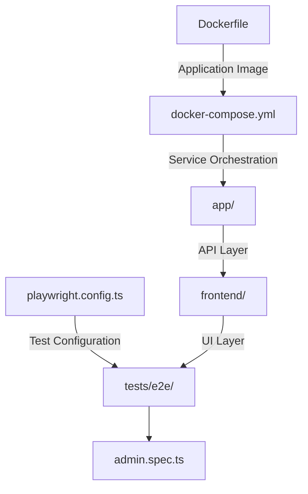
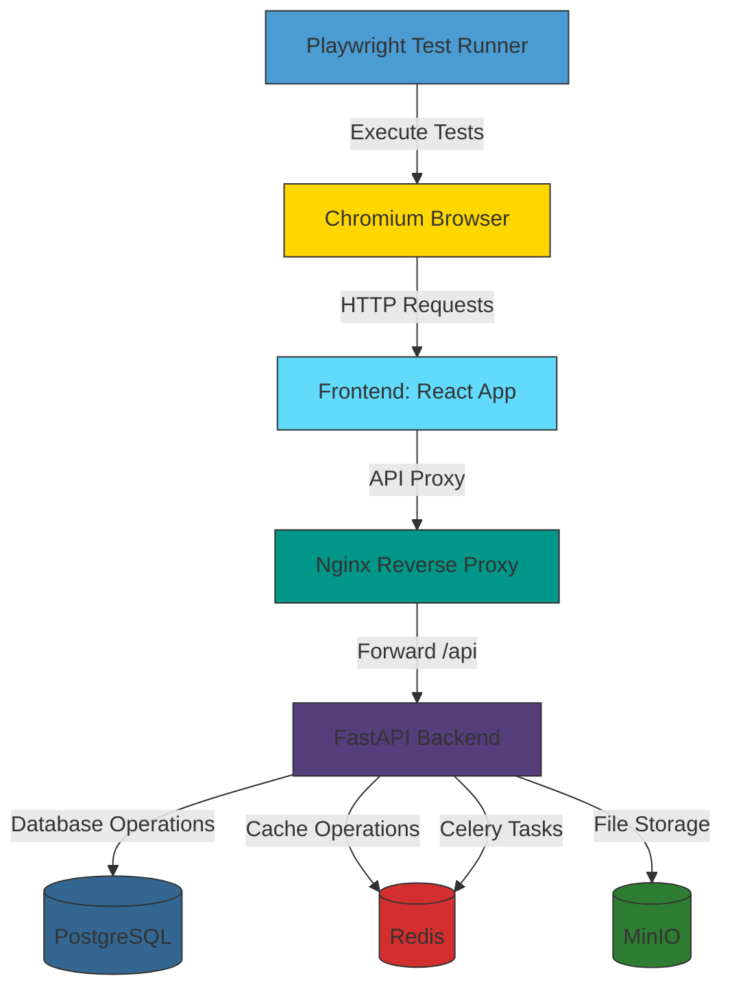
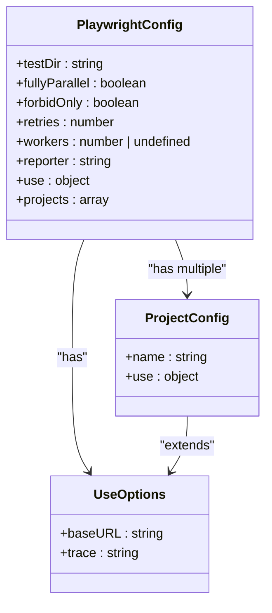
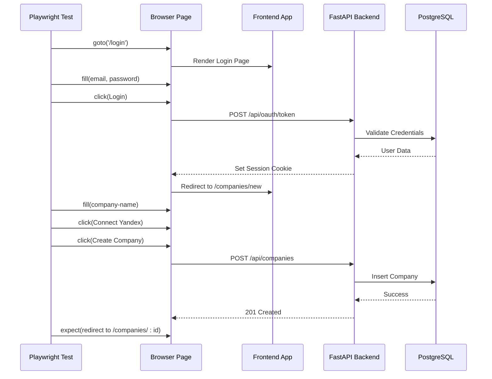
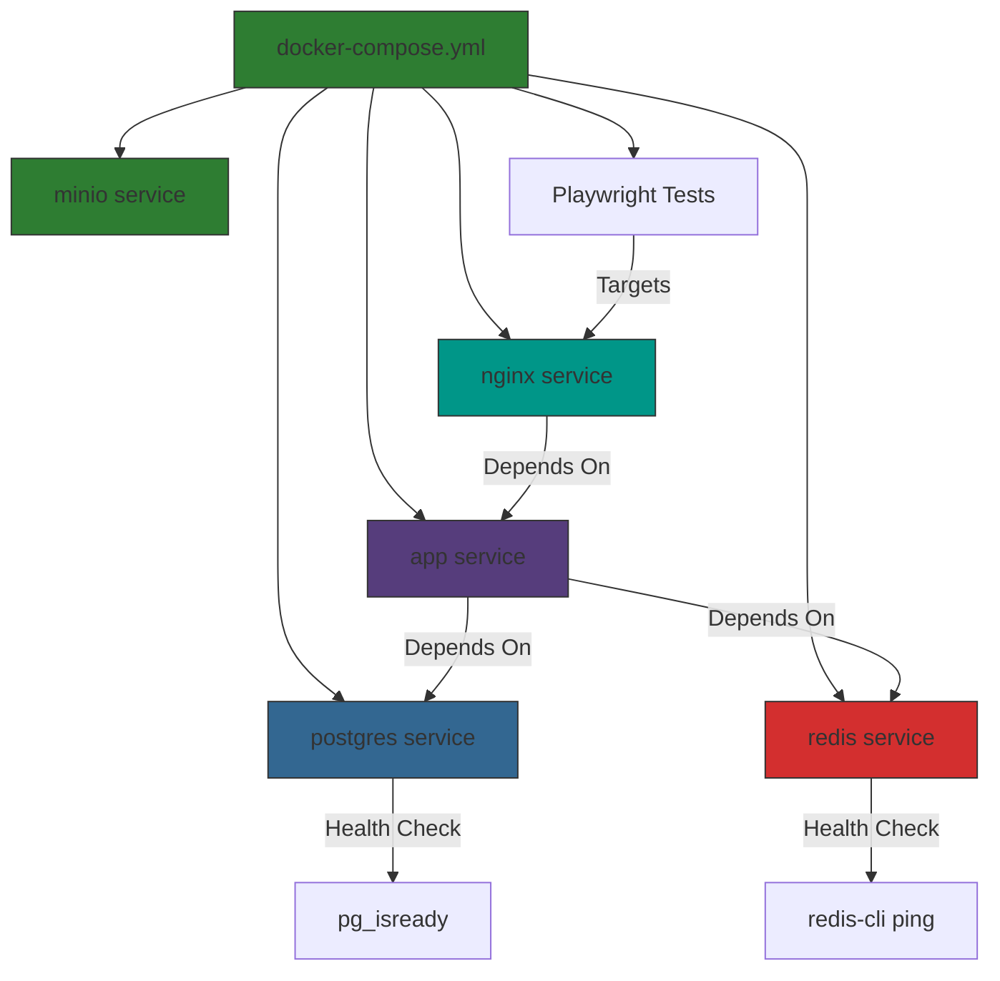

# Playwright End-to-End Testing

<cite>
**Referenced Files in This Document**   
- [playwright.config.ts](file://playwright.config.ts)
- [admin.spec.ts](file://tests/e2e/admin.spec.ts)
- [docker-compose.yml](file://docker-compose.yml)
- [Dockerfile](file://Dockerfile)
- [main.py](file://app/main.py)
- [vite.config.ts](file://frontend/vite.config.ts)
- [package.json](file://frontend/package.json)
</cite>

## Table of Contents
1. [Introduction](#introduction)
2. [Project Structure](#project-structure)
3. [Core Components](#core-components)
4. [Architecture Overview](#architecture-overview)
5. [Detailed Component Analysis](#detailed-component-analysis)
6. [Dependency Analysis](#dependency-analysis)
7. [Performance Considerations](#performance-considerations)
8. [Troubleshooting Guide](#troubleshooting-guide)
9. [Conclusion](#conclusion)

## Introduction
This document provides a comprehensive analysis of the Playwright end-to-end testing setup in the ARV project, a B2B SaaS platform for creating augmented reality (AR) content based on image recognition. The E2E tests validate the complete user journey from company creation to AR content generation and QR code deployment. The testing infrastructure is integrated with Docker Compose for environment consistency and uses structured logging, health checks, and CI/CD best practices.

## Project Structure



**Diagram sources**
- [playwright.config.ts](file://playwright.config.ts#L1-L20)
- [tests/e2e/admin.spec.ts](file://tests/e2e/admin.spec.ts#L1-L24)
- [docker-compose.yml](file://docker-compose.yml#L1-L254)

**Section sources**
- [playwright.config.ts](file://playwright.config.ts#L1-L20)
- [docker-compose.yml](file://docker-compose.yml#L1-L254)

## Core Components

The Playwright E2E testing framework is configured to run against a full-stack application composed of a React frontend, FastAPI backend, PostgreSQL database, Redis cache, and MinIO storage. The test suite simulates real user interactions including authentication, company creation, project setup, AR content upload, and QR code generation. The configuration supports parallel execution, trace recording on failure, and HTML reporting for test results visualization.

**Section sources**
- [playwright.config.ts](file://playwright.config.ts#L1-L20)
- [admin.spec.ts](file://tests/e2e/admin.spec.ts#L1-L24)

## Architecture Overview



**Diagram sources**
- [docker-compose.yml](file://docker-compose.yml#L1-L254)
- [vite.config.ts](file://frontend/vite.config.ts#L1-L21)
- [main.py](file://app/main.py#L1-L268)

## Detailed Component Analysis

### Playwright Configuration Analysis



**Diagram sources**
- [playwright.config.ts](file://playwright.config.ts#L1-L20)

**Section sources**
- [playwright.config.ts](file://playwright.config.ts#L1-L20)

### E2E Test Flow Analysis



**Diagram sources**
- [admin.spec.ts](file://tests/e2e/admin.spec.ts#L1-L24)
- [main.py](file://app/main.py#L1-L268)
- [docker-compose.yml](file://docker-compose.yml#L1-L254)

**Section sources**
- [admin.spec.ts](file://tests/e2e/admin.spec.ts#L1-L24)

### Docker Orchestration Analysis



**Diagram sources**
- [docker-compose.yml](file://docker-compose.yml#L1-L254)
- [Dockerfile](file://Dockerfile#L1-L53)

**Section sources**
- [docker-compose.yml](file://docker-compose.yml#L1-L254)
- [Dockerfile](file://Dockerfile#L1-L53)

## Dependency Analysis

```mermaid
dependency-graph
playwright.config.ts --> admin.spec.ts
playwright.config.ts --> frontend/package.json
admin.spec.ts --> docker-compose.yml
docker-compose.yml --> Dockerfile
Dockerfile --> app/main.py
frontend/vite.config.ts --> app/main.py
app/main.py --> docker-compose.yml
```

**Diagram sources**
- [playwright.config.ts](file://playwright.config.ts#L1-L20)
- [admin.spec.ts](file://tests/e2e/admin.spec.ts#L1-L24)
- [docker-compose.yml](file://docker-compose.yml#L1-L254)
- [Dockerfile](file://Dockerfile#L1-L53)
- [main.py](file://app/main.py#L1-L268)
- [vite.config.ts](file://frontend/vite.config.ts#L1-L21)

**Section sources**
- [playwright.config.ts](file://playwright.config.ts#L1-L20)
- [docker-compose.yml](file://docker-compose.yml#L1-L254)

## Performance Considerations
The Playwright configuration is optimized for CI environments with conditional retry logic and worker count adjustments. The `fullyParallel: true` setting enables maximum test concurrency, while trace recording is limited to first retry to balance debugging capability with storage efficiency. The Docker Compose setup includes health checks to prevent race conditions during service startup, ensuring reliable test execution. The frontend proxy configuration in Vite enables seamless API integration during development and testing.

## Troubleshooting Guide

When E2E tests fail, consider the following diagnostic steps:
1. Verify all Docker services are healthy using `docker-compose ps`
2. Check the Playwright HTML report for detailed trace information
3. Validate the frontend is served on port 3000 and backend on 8000
4. Confirm the proxy configuration in vite.config.ts is correctly forwarding API requests
5. Check application logs for authentication or database errors
6. Ensure test fixtures are properly loaded in the database

**Section sources**
- [playwright.config.ts](file://playwright.config.ts#L1-L20)
- [vite.config.ts](file://frontend/vite.config.ts#L1-L21)
- [docker-compose.yml](file://docker-compose.yml#L1-L254)

## Conclusion
The Playwright E2E testing setup in the ARV project provides a robust framework for validating the complete application workflow. The integration with Docker Compose ensures environment consistency across development and CI/CD pipelines. The test configuration follows best practices for parallel execution, failure recovery, and result reporting. The architecture enables reliable testing of complex user journeys involving authentication, data creation, and external service integration.