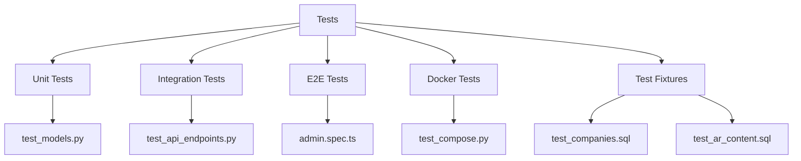
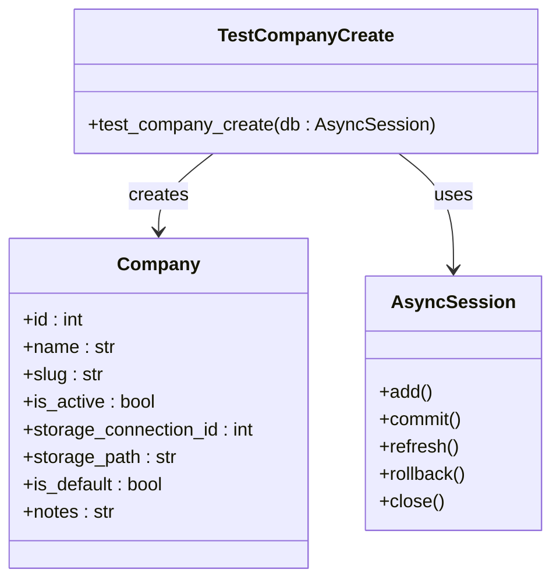
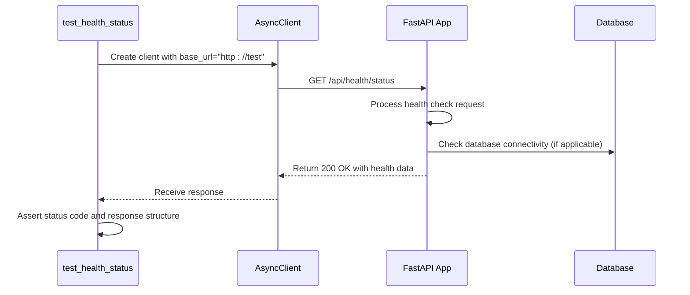
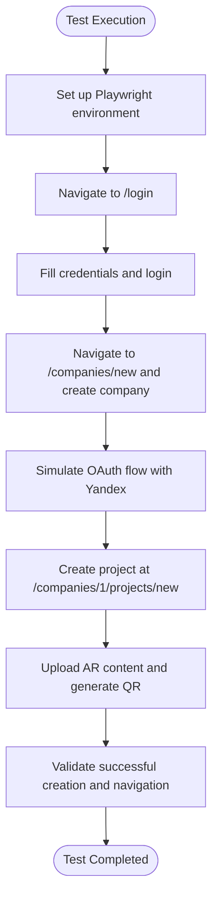
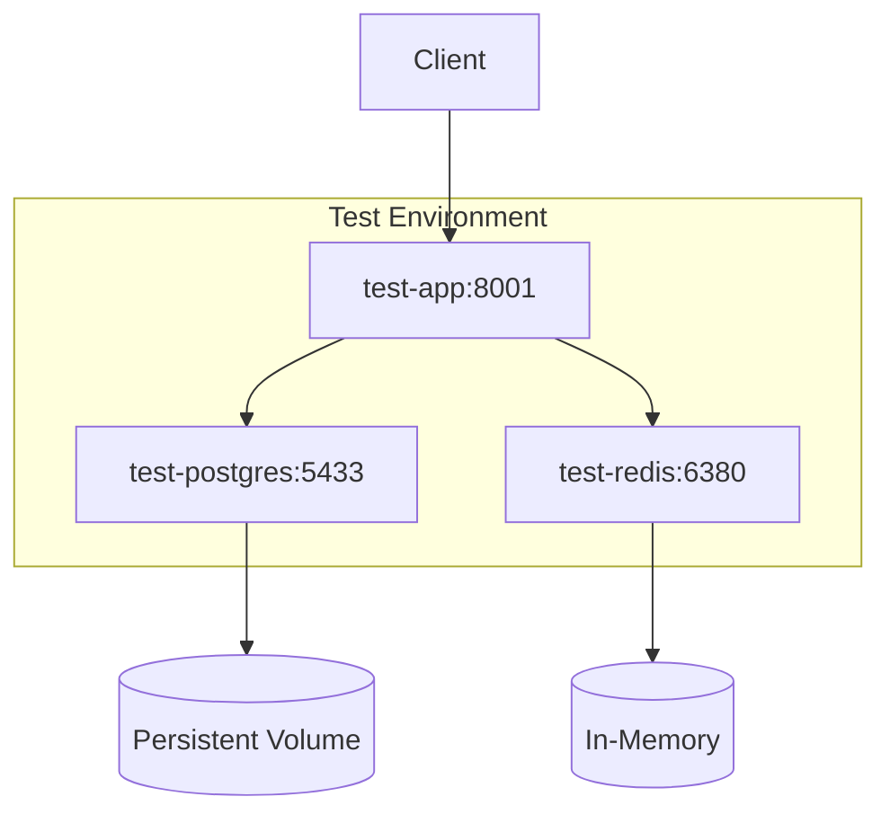
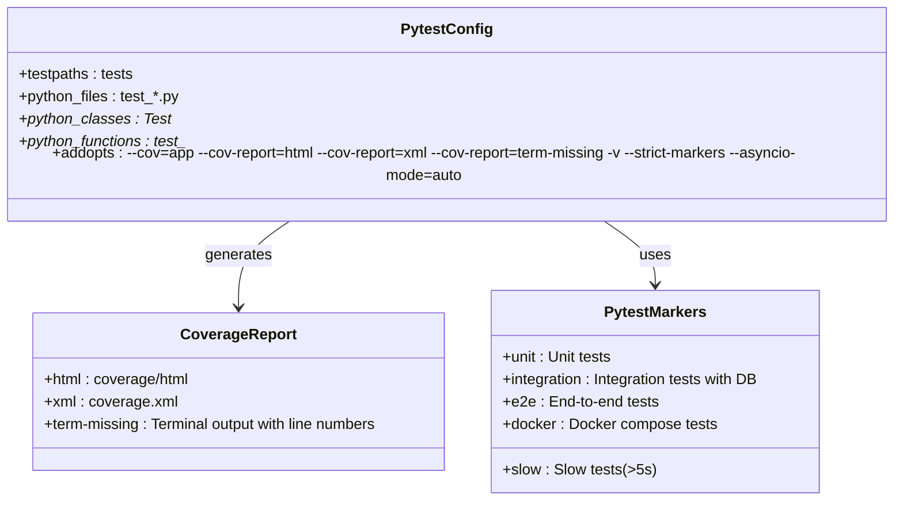
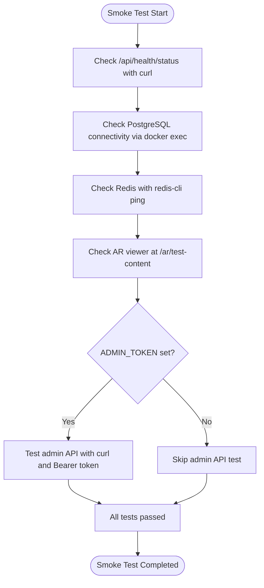
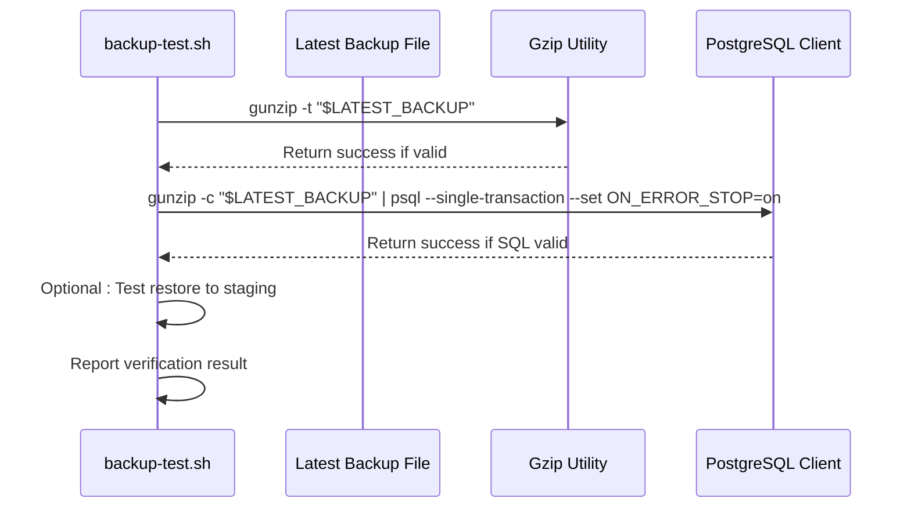

# Testing Infrastructure

<cite>
**Referenced Files in This Document**   
- [pytest.ini](file://pytest.ini)
- [Dockerfile.test](file://Dockerfile.test)
- [docker-compose.test.yml](file://docker-compose.test.yml)
- [playwright.config.ts](file://playwright.config.ts)
- [test_models.py](file://tests/unit/test_models.py)
- [test_api_endpoints.py](file://tests/integration/test_api_endpoints.py)
- [admin.spec.ts](file://tests/e2e/admin.spec.ts)
- [test_compose.py](file://tests/docker/test_compose.py)
- [test_companies.sql](file://tests/fixtures/test_companies.sql)
- [test_ar_content.sql](file://tests/fixtures/test_ar_content.sql)
- [smoke-test.sh](file://scripts/smoke-test.sh)
- [backup-test.sh](file://scripts/backup-test.sh)
- [continuous-backup.sh](file://scripts/continuous-backup.sh)
- [config.py](file://app/core/config.py)
- [database.py](file://app/core/database.py)
- [main.py](file://app/main.py)
</cite>

## Table of Contents
1. [Introduction](#introduction)
2. [Test Suite Organization](#test-suite-organization)
3. [Unit Testing Framework](#unit-testing-framework)
4. [Integration Testing Strategy](#integration-testing-strategy)
5. [End-to-End Testing with Playwright](#end-to-end-testing-with-playwright)
6. [Docker-Based Testing Environment](#docker-based-testing-environment)
7. [Test Configuration and Coverage](#test-configuration-and-coverage)
8. [Production Smoke Testing](#production-smoke-testing)
9. [Backup Verification Procedures](#backup-verification-procedures)
10. [Conclusion](#conclusion)

## Introduction
The ARV project implements a comprehensive multi-layered testing infrastructure designed to ensure reliability across development, staging, and production environments. The testing strategy encompasses unit, integration, end-to-end (E2E), and infrastructure validation tests, supported by containerized test environments and automated verification scripts. This document details the architecture and implementation of the testing ecosystem, highlighting how different test types are organized, executed, and integrated into the development workflow.

## Test Suite Organization
The testing infrastructure is organized into distinct categories based on test scope and purpose, located under the `tests/` directory:

- **Unit tests**: Located in `tests/unit/`, focusing on isolated model validation and business logic
- **Integration tests**: Found in `tests/integration/`, validating API endpoints and database interactions
- **End-to-end tests**: Implemented in `tests/e2e/` using Playwright for browser automation
- **Docker integration tests**: Stored in `tests/docker/`, verifying container orchestration
- **Test fixtures**: SQL files in `tests/fixtures/` providing seed data for testing

This hierarchical organization enables selective test execution based on development phase and validation requirements.

**Diagram sources**
- [tests/unit/test_models.py](file://tests/unit/test_models.py)
- [tests/integration/test_api_endpoints.py](file://tests/integration/test_api_endpoints.py)
- [tests/e2e/admin.spec.ts](file://tests/e2e/admin.spec.ts)
- [tests/docker/test_compose.py](file://tests/docker/test_compose.py)
- [tests/fixtures/test_companies.sql](file://tests/fixtures/test_companies.sql)
- [tests/fixtures/test_ar_content.sql](file://tests/fixtures/test_ar_content.sql)

**Section sources**
- [tests/unit/test_models.py](file://tests/unit/test_models.py)
- [tests/integration/test_api_endpoints.py](file://tests/integration/test_api_endpoints.py)
- [tests/e2e/admin.spec.ts](file://tests/e2e/admin.spec.ts)
- [tests/docker/test_compose.py](file://tests/docker/test_compose.py)

## Unit Testing Framework
The unit testing framework is built on pytest and focuses on validating individual components in isolation, particularly data models and core utilities. The `test_models.py` file contains asynchronous tests that verify SQLAlchemy model behavior, including object creation, persistence, and attribute validation.

Unit tests leverage the application's async database session to interact with a test database, ensuring that model definitions and relationships function correctly. The testing approach uses pytest markers like `@pytest.mark.asyncio` to support asynchronous execution, maintaining consistency with the application's async architecture.

**Diagram sources**
- [tests/unit/test_models.py](file://tests/unit/test_models.py#L6-L21)
- [app/models/company.py](file://app/models/company.py)
- [app/core/database.py](file://app/core/database.py)

**Section sources**
- [tests/unit/test_models.py](file://tests/unit/test_models.py#L1-L21)
- [app/core/database.py](file://app/core/database.py)

## Integration Testing Strategy
Integration tests validate the interaction between application components, particularly API endpoints and the database layer. The `test_api_endpoints.py` file contains tests that use `httpx.AsyncClient` to make requests to the FastAPI application, verifying endpoint behavior, response formats, and status codes.

The integration test suite includes both active tests and conditionally skipped tests. For example, `test_health_status` verifies the health check endpoint returns proper status information, while `test_create_company_minio` is marked for skipping due to external dependency requirements. This approach allows the test suite to remain functional even when certain infrastructure components are not available.

**Diagram sources**
- [tests/integration/test_api_endpoints.py](file://tests/integration/test_api_endpoints.py#L5-L12)
- [app/main.py](file://app/main.py)
- [app/api/routes/health.py](file://app/api/routes/health.py)

**Section sources**
- [tests/integration/test_api_endpoints.py](file://tests/integration/test_api_endpoints.py#L1-L25)
- [app/main.py](file://app/main.py)

## End-to-End Testing with Playwright
The end-to-end testing infrastructure uses Playwright to automate browser interactions and validate the complete user journey through the application. The `admin.spec.ts` file contains a comprehensive test scenario that simulates an administrator creating a company, project, AR content, and QR code through the frontend interface.

Playwright tests are configured through `playwright.config.ts`, which specifies the test directory, parallel execution settings, retry policies, and reporting options. The configuration supports different browsers and devices, with the current setup focused on Desktop Chrome. The tests run against a locally hosted frontend, using the baseURL `http://localhost:3000`.

**Diagram sources**
- [tests/e2e/admin.spec.ts](file://tests/e2e/admin.spec.ts#L1-L24)
- [playwright.config.ts](file://playwright.config.ts#L1-L21)

**Section sources**
- [tests/e2e/admin.spec.ts](file://tests/e2e/admin.spec.ts#L1-L24)
- [playwright.config.ts](file://playwright.config.ts#L1-L21)

## Docker-Based Testing Environment
The project includes a dedicated Docker-based testing environment defined in `docker-compose.test.yml`. This configuration creates isolated test services for PostgreSQL, Redis, and the application itself, ensuring consistent test conditions across different development environments.

The test environment uses `Dockerfile.test` as its build specification, which installs dependencies and sets the TESTING environment variable. The test containers use different ports than production services to avoid conflicts, with PostgreSQL on 5433 and Redis on 6380. The `test_app` service depends on both database and cache services, ensuring proper startup ordering.

**Diagram sources**
- [docker-compose.test.yml](file://docker-compose.test.yml#L1-L30)
- [Dockerfile.test](file://Dockerfile.test#L1-L8)

**Section sources**
- [docker-compose.test.yml](file://docker-compose.test.yml#L1-L30)
- [Dockerfile.test](file://Dockerfile.test#L1-L8)

## Test Configuration and Coverage
The testing infrastructure is configured through `pytest.ini`, which defines test discovery patterns, command-line options, and coverage reporting. The configuration specifies that tests should be discovered in the `tests` directory, with test files following the `test_*.py` pattern and test functions using the `test_*` naming convention.

Code coverage is measured using pytest-cov, with reports generated in multiple formats: HTML, XML, and terminal output with missing line information. The configuration also defines custom pytest markers for test categorization, including `unit`, `integration`, `e2e`, `slow`, and `docker`, enabling selective test execution based on type or performance characteristics.

**Diagram sources**
- [pytest.ini](file://pytest.ini#L1-L19)

**Section sources**
- [pytest.ini](file://pytest.ini#L1-L19)

## Production Smoke Testing
The project includes shell scripts for production smoke testing and backup verification. The `smoke-test.sh` script performs basic health checks on a running production system, validating API endpoints, database connectivity, Redis availability, and AR viewer functionality.

The smoke test script uses curl to check the health status endpoint, docker exec to verify database connectivity, and redis-cli to test Redis functionality. It also includes conditional testing of admin API endpoints when an ADMIN_TOKEN is provided, allowing for more comprehensive validation in secure environments.

**Diagram sources**
- [scripts/smoke-test.sh](file://scripts/smoke-test.sh#L1-L28)

**Section sources**
- [scripts/smoke-test.sh](file://scripts/smoke-test.sh#L1-L28)

## Backup Verification Procedures
The backup infrastructure includes automated verification procedures to ensure data integrity and recovery capability. The `backup-test.sh` script validates the integrity of the latest PostgreSQL backup by checking gzip compression and SQL syntax, while `continuous-backup.sh` implements a WAL-based continuous backup strategy.

The backup verification process includes three key steps: testing gzip integrity with `gunzip -t`, validating SQL syntax by parsing the decompressed backup, and optionally testing restoration to a staging environment. The continuous backup script uses `pg_basebackup` for daily base backups and synchronizes WAL archives to S3 for point-in-time recovery.

**Diagram sources**
- [scripts/backup-test.sh](file://scripts/backup-test.sh#L1-L20)
- [scripts/continuous-backup.sh](file://scripts/continuous-backup.sh#L1-L13)

**Section sources**
- [scripts/backup-test.sh](file://scripts/backup-test.sh#L1-L20)
- [scripts/continuous-backup.sh](file://scripts/continuous-backup.sh#L1-L13)

## Conclusion
The ARV project's testing infrastructure provides a comprehensive, multi-layered approach to quality assurance, encompassing unit, integration, end-to-end, and infrastructure validation tests. The combination of pytest for backend testing, Playwright for frontend automation, Docker for test environment isolation, and custom shell scripts for production validation creates a robust testing ecosystem that ensures application reliability across all deployment stages. The coverage reporting and selective test execution capabilities enable developers to maintain high code quality while efficiently managing test execution time and resource usage.