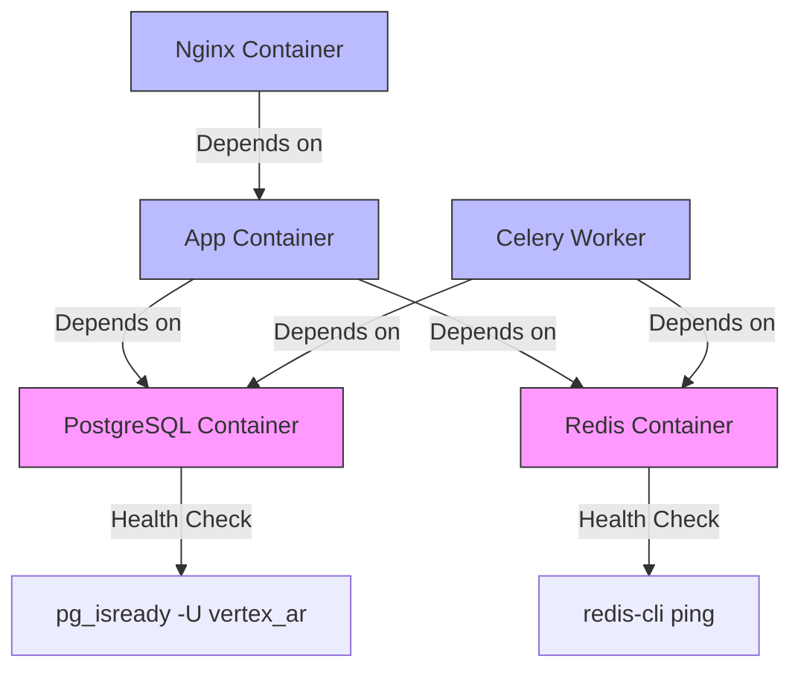
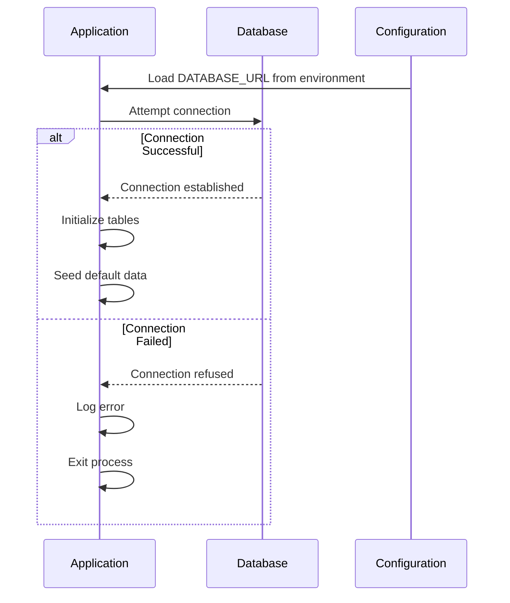
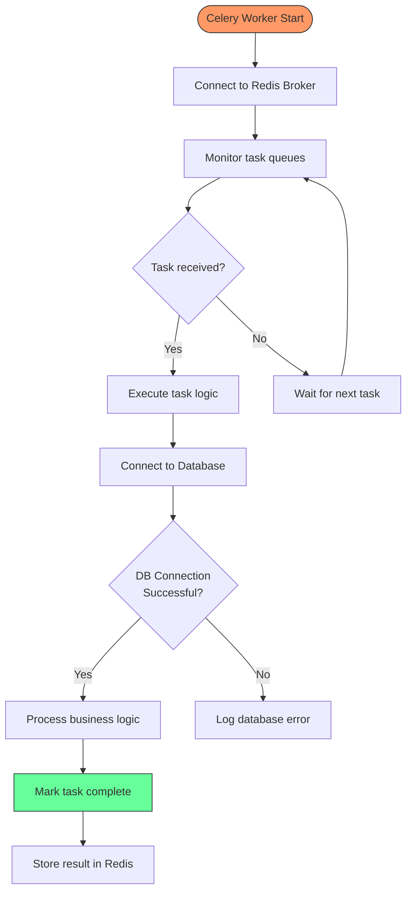
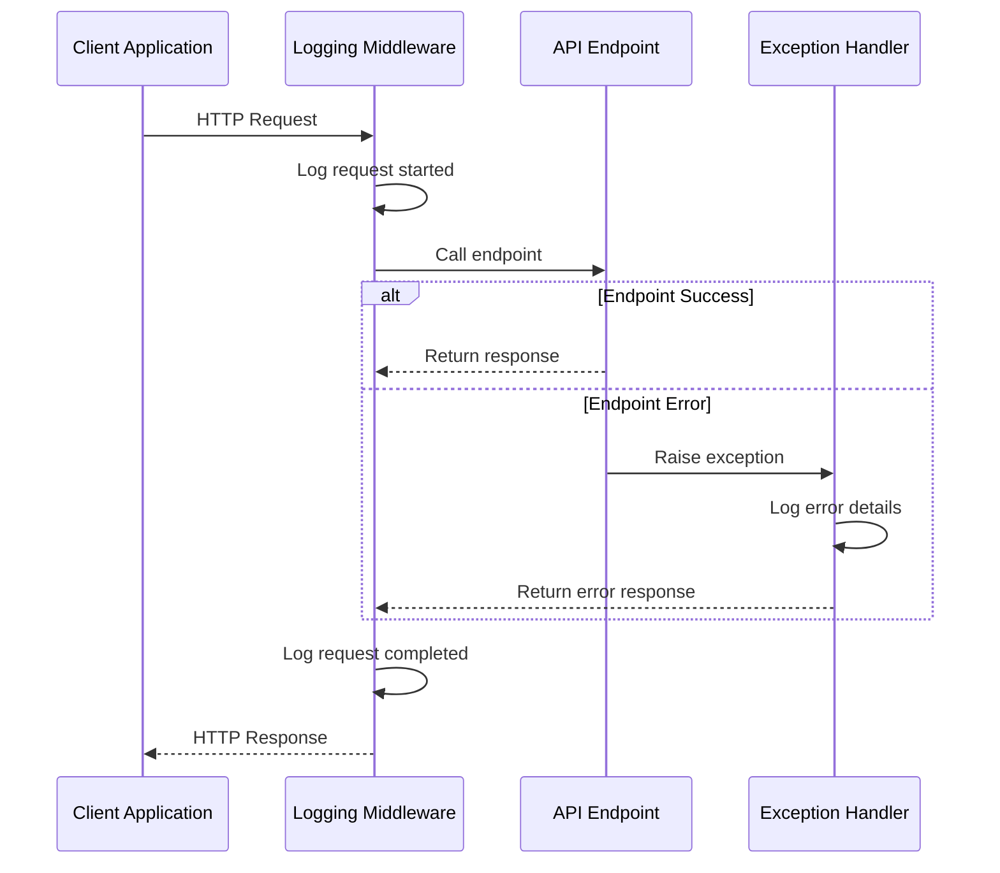
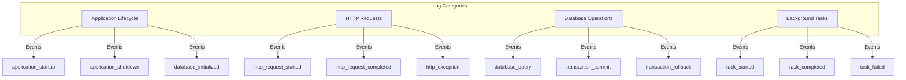
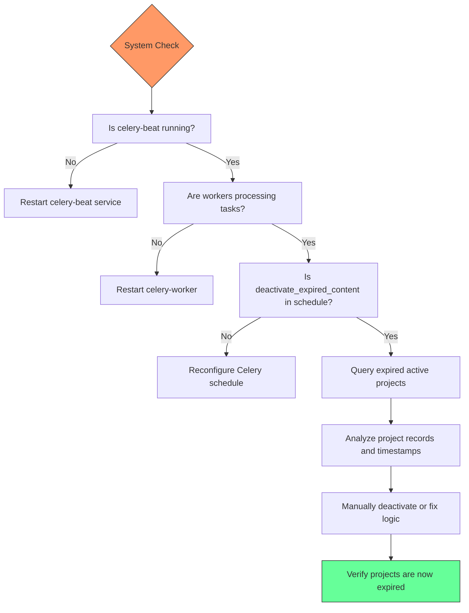
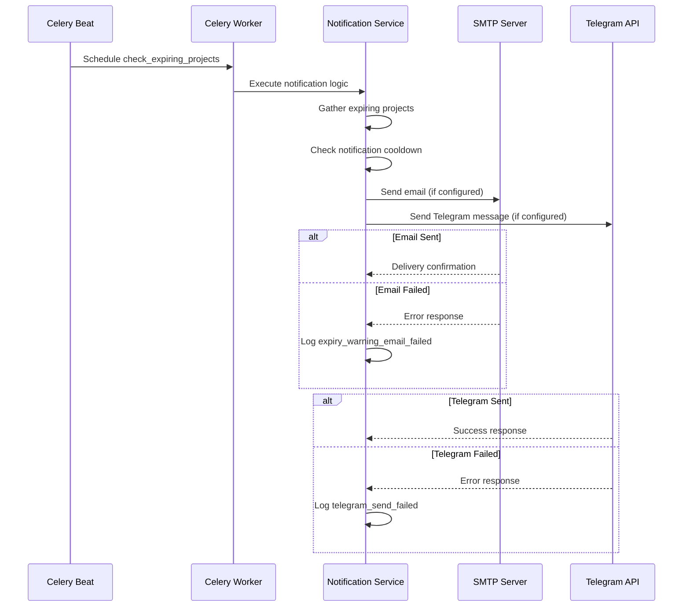

# Troubleshooting

<cite>
**Referenced Files in This Document**   
- [main.py](file://app/main.py)
- [config.py](file://app/core/config.py)
- [database.py](file://app/core/database.py)
- [celery_app.py](file://app/tasks/celery_app.py)
- [expiry_tasks.py](file://app/tasks/expiry_tasks.py)
- [notification_service.py](file://app/services/notification_service.py)
- [health.py](file://app/api/routes/health.py)
- [storage.py](file://app/core/storage.py)
- [Dockerfile](file://Dockerfile)
- [docker-compose.yml](file://docker-compose.yml)
</cite>

## Table of Contents
1. [Common Issues Overview](#common-issues-overview)
2. [Docker Container Failures](#docker-container-failures)
3. [Database Connection Problems](#database-connection-problems)
4. [Celery Task Errors](#celery-task-errors)
5. [API Endpoint Failures](#api-endpoint-failures)
6. [Error Codes and Meanings](#error-codes-and-meanings)
7. [Logs Analysis Techniques](#logs-analysis-techniques)
8. [Configuration Issues](#configuration-issues)
9. [Critical Scenarios](#critical-scenarios)
10. [Support Resources](#support-resources)

## Common Issues Overview

The ARV platform consists of multiple interconnected components including FastAPI application, PostgreSQL database, Redis message broker, MinIO storage, Celery workers, and Nginx reverse proxy. Common issues typically arise from configuration mismatches, service dependencies, resource constraints, or network connectivity problems between these components.

**Section sources**
- [docker-compose.yml](file://docker-compose.yml#L1-L163)
- [main.py](file://app/main.py#L1-L266)

## Docker Container Failures

Docker container failures can occur due to various reasons including image build issues, resource constraints, or service dependencies. The platform uses Docker Compose to manage multiple services with specific health checks and dependency conditions.

Container startup failures often stem from:
- Missing or incorrect environment variables
- Port conflicts with existing services
- Insufficient system resources (memory, CPU)
- Failed health checks preventing dependent services from starting

The Docker Compose configuration includes health checks for critical services like PostgreSQL and Redis, ensuring that dependent services (app, celery-worker) only start when their dependencies are healthy.



**Diagram sources**
- [docker-compose.yml](file://docker-compose.yml#L5-L84)
- [Dockerfile](file://Dockerfile#L48-L49)

**Section sources**
- [docker-compose.yml](file://docker-compose.yml#L1-L163)
- [Dockerfile](file://Dockerfile#L1-L53)

## Database Connection Problems

Database connection issues typically manifest as application startup failures or API endpoint errors. The ARV platform uses PostgreSQL as its primary database with connection settings configured through environment variables.

Common causes include:
- Incorrect DATABASE_URL configuration
- Network connectivity issues between application and database containers
- Authentication failures due to mismatched credentials
- Database service not running or unresponsive

The application implements connection pooling with configurable pool size and overflow settings. During startup, the application attempts to initialize the database connection and will exit if initialization fails.



**Diagram sources**
- [main.py](file://app/main.py#L58-L71)
- [config.py](file://app/core/config.py#L38-L43)
- [database.py](file://app/core/database.py#L8-L15)

**Section sources**
- [main.py](file://app/main.py#L58-L71)
- [database.py](file://app/core/database.py#L8-L103)
- [config.py](file://app/core/config.py#L38-L43)

## Celery Task Errors

Celery task errors can occur in background processing for marker generation, content expiration, video rotation, and notifications. The platform uses Redis as both broker and result backend for Celery tasks.

Common Celery issues include:
- Worker processes not running or crashed
- Broker (Redis) connectivity problems
- Task time limits exceeded
- Database connection issues during task execution
- Missing task modules in worker configuration

The system includes several periodic tasks configured through Celery Beat:
- Daily check for expiring projects
- Minute-by-minute deactivation of expired content
- Five-minute video rotation schedules
- Daily notification checks



**Diagram sources**
- [celery_app.py](file://app/tasks/celery_app.py#L6-L49)
- [expiry_tasks.py](file://app/tasks/expiry_tasks.py#L55-L178)
- [main.py](file://app/main.py#L16-L17)

**Section sources**
- [celery_app.py](file://app/tasks/celery_app.py#L1-L50)
- [expiry_tasks.py](file://app/tasks/expiry_tasks.py#L1-L178)

## API Endpoint Failures

API endpoint failures can result from various issues including validation errors, authentication problems, or internal server errors. The platform uses FastAPI with comprehensive exception handling and structured logging.

Common API failure patterns:
- 422 Unprocessable Entity: Request validation failures
- 404 Not Found: Resource not found in database
- 500 Internal Server Error: Unhandled exceptions
- 401 Unauthorized: Authentication failures
- 403 Forbidden: Authorization failures

The application implements middleware for request logging, capturing method, path, client host, status code, and duration for every request, which aids in troubleshooting endpoint issues.



**Diagram sources**
- [main.py](file://app/main.py#L109-L141)
- [main.py](file://app/main.py#L145-L209)

**Section sources**
- [main.py](file://app/main.py#L109-L209)

## Error Codes and Meanings

The ARV platform uses standardized error responses with HTTP status codes and application-specific error messages. All error responses follow a consistent JSON structure with code, message, and timestamp.

### HTTP Status Codes
| Code | Meaning | Description |
|------|-------|-------------|
| 200 | OK | Request successful |
| 201 | Created | Resource created successfully |
| 400 | Bad Request | Invalid request parameters |
| 401 | Unauthorized | Authentication required |
| 403 | Forbidden | Insufficient permissions |
| 404 | Not Found | Resource not found |
| 422 | Unprocessable Entity | Validation error |
| 500 | Internal Server Error | Unexpected server error |
| 502 | Bad Gateway | Upstream service failure |
| 503 | Service Unavailable | Service temporarily unavailable |

### Application-Specific Error Messages
- **database_initialization_failed**: Database connection could not be established during startup
- **defaults_seeding_failed**: Failed to create default storage connection or company
- **http_exception**: Standard HTTP exception with status code and detail
- **validation_error**: Request validation failed with detailed field errors
- **unhandled_exception**: Internal server error with optional debug information
- **expiry_warning_email_failed**: Failed to send expiration warning email
- **telegram_send_failed**: Telegram notification delivery failed

**Section sources**
- [main.py](file://app/main.py#L145-L209)
- [health.py](file://app/api/routes/health.py#L105-L113)

## Logs Analysis Techniques

The platform uses structured JSON logging through structlog, making log analysis more efficient and consistent. Logs are formatted as JSON in production and as colored console output in debug mode.

### Log Structure
All log entries include:
- **event**: Descriptive event name (e.g., "http_request_started")
- **timestamp**: ISO format UTC timestamp
- **level**: Log level (info, warning, error, etc.)
- **contextual data**: Additional fields specific to the event

### Key Log Events for Troubleshooting
- **application_startup**: Application initialization with environment details
- **database_initialized**: Successful database connection
- **database_initialization_failed**: Database connection failure
- **http_request_started**: Inbound HTTP request details
- **http_request_completed**: Response details including status and duration
- **http_exception**: HTTP exceptions with status code and path
- **validation_error**: Request validation failures with field details
- **unhandled_exception**: Internal server errors with stack trace
- **health_check**: Comprehensive system health assessment

### Request Tracing
The system supports request tracing through:
- Correlating request start and completion logs by path and method
- Tracking Celery task execution with task IDs
- Monitoring database transaction success/failure
- Following the lifecycle of background tasks from scheduling to completion



**Diagram sources**
- [main.py](file://app/main.py#L22-L37)
- [main.py](file://app/main.py#L118-L139)
- [main.py](file://app/main.py#L149-L154)

**Section sources**
- [main.py](file://app/main.py#L20-L209)

## Configuration Issues

Configuration issues are a common source of problems in the ARV platform, typically related to environment variables, storage connections, or network settings.

### Environment Variables
Critical environment variables include:
- **DATABASE_URL**: PostgreSQL connection string
- **REDIS_URL**: Redis connection URL
- **CELERY_BROKER_URL**: Celery broker URL (typically Redis)
- **CELERY_RESULT_BACKEND**: Celery result backend URL
- **STORAGE_TYPE**: Storage backend type (local, minio, yandex_disk)
- **MINIO_ENDPOINT**: MinIO server endpoint
- **MINIO_ACCESS_KEY/MINIO_SECRET_KEY**: MinIO credentials
- **SECRET_KEY**: JWT secret key for authentication

### Storage Connection Issues
Storage configuration problems often involve:
- Incorrect MinIO endpoint or credentials
- Missing required buckets
- Insufficient permissions on local storage paths
- Network connectivity issues to external storage providers

The system automatically ensures required buckets exist on startup and configures public read access policies.

### Network Settings
Network-related issues may include:
- Port conflicts in docker-compose configuration
- Incorrect service hostnames in connection URLs
- Firewall rules blocking required ports
- DNS resolution issues between containers

**Section sources**
- [config.py](file://app/core/config.py#L1-L134)
- [storage.py](file://app/core/storage.py#L8-L43)
- [docker-compose.yml](file://docker-compose.yml#L1-L163)

## Critical Scenarios

### Failed Deployments
Deployment failures can occur due to:
1. Docker image build failures
2. Database migration issues
3. Configuration validation errors
4. Health check timeouts
5. Resource constraints

**Troubleshooting Steps:**
1. Check Docker build logs for compilation errors
2. Verify environment variables are correctly set
3. Examine container logs for startup errors
4. Validate database connectivity from the application container
5. Check resource utilization (CPU, memory)

### Expired Projects Not Deactivating
When projects exceed their expiration date but remain active, the issue typically lies with the Celery beat scheduler or the deactivation task.

**Root Causes:**
- Celery beat service not running
- Celery worker not processing the "deactivate_expired_content" task
- Database transaction failures in the deactivation logic
- Clock synchronization issues between services

**Troubleshooting Steps:**
1. Verify celery-beat container is running
2. Check celery-worker logs for task processing errors
3. Examine the `deactivate_expired_content` task in Celery's periodic task schedule
4. Query the database for expired projects with active status
5. Test the task execution manually



**Diagram sources**
- [celery_app.py](file://app/tasks/celery_app.py#L36-L38)
- [expiry_tasks.py](file://app/tasks/expiry_tasks.py#L94-L128)

**Section sources**
- [expiry_tasks.py](file://app/tasks/expiry_tasks.py#L94-L128)
- [celery_app.py](file://app/tasks/celery_app.py#L36-L38)

### Notification Delivery Failures
Notification delivery issues affect email and Telegram alerts for project expiration warnings.

**Common Causes:**
- SMTP server configuration issues
- Invalid email credentials
- Telegram bot token not configured
- Company chat ID missing
- Network connectivity to external services

**Troubleshooting Steps:**
1. Verify SMTP and Telegram configuration in environment variables
2. Check notification task logs for delivery attempts
3. Validate that companies have configured notification channels
4. Test external service connectivity from the application container
5. Examine the notification_service.py implementation



**Diagram sources**
- [expiry_tasks.py](file://app/tasks/expiry_tasks.py#L55-L92)
- [notification_service.py](file://app/services/notification_service.py#L13-L47)

**Section sources**
- [expiry_tasks.py](file://app/tasks/expiry_tasks.py#L55-L92)
- [notification_service.py](file://app/services/notification_service.py#L1-L81)

## Support Resources

When troubleshooting issues in the ARV platform, the following resources are available:

### Internal Monitoring
- **Health Check Endpoint**: GET /api/health/status provides comprehensive system status
- **Prometheus Metrics**: Available at /api/health/metrics for performance monitoring
- **Structured Logs**: JSON-formatted logs with consistent event naming
- **Application Logs**: Located in container logs or configured log destination

### Escalation Paths
For unresolved issues, follow this escalation path:
1. **Initial Diagnosis**: Review container logs and health check responses
2. **Configuration Review**: Verify environment variables and configuration files
3. **Database Inspection**: Query relevant tables to verify data state
4. **Task Queue Examination**: Check Celery task status and worker availability
5. **Network Connectivity Tests**: Verify connectivity between services
6. **Code Review**: Examine relevant source files for logic issues
7. **Development Team**: Escalate to developers for complex issues

### Key Diagnostic Commands
```bash
# Check container status
docker-compose ps

# View container logs
docker-compose logs app
docker-compose logs celery-worker
docker-compose logs postgres

# Execute health check
curl http://localhost:8000/api/health/status

# Check database connectivity
docker-compose exec postgres psql -U vertex_ar -d vertex_ar -c "SELECT 1"

# List Celery tasks
celery -A app.tasks.celery_app inspect registered
```

**Section sources**
- [health.py](file://app/api/routes/health.py#L36-L119)
- [docker-compose.yml](file://docker-compose.yml#L1-L163)
- [main.py](file://app/main.py#L219-L227)