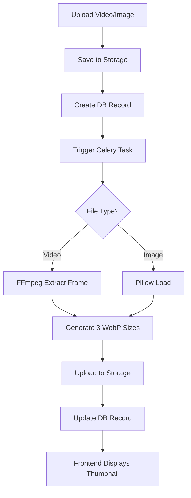

# 🖼️ Система генерации превью (Thumbnail System)

Production-ready решение для автоматической генерации WebP превью изображений и видео.

## 📋 Обзор

Система автоматически генерирует оптимизированные превью в трёх размерах:
- **Small**: 200x112px (списки/карточки)
- **Medium**: 400x225px (детальные страницы)
- **Large**: 800x450px (лайтбоксы/превью)

### Технологии
- **Backend**: FFmpeg (видео) + Pillow (изображения) + Celery (фоновые задачи)
- **Format**: WebP с качеством 85 и методом сжатия 6
- **Frontend**: React компоненты с lazy loading и fallback

---

## 🏗️ Архитектура



---

## 🔧 Backend

### 1. Celery Tasks

**Файл**: `app/tasks/thumbnail_generator.py`

#### Генерация превью видео

```python
from app.tasks.thumbnail_generator import generate_video_thumbnail

# Автоматически вызывается при загрузке видео
task = generate_video_thumbnail.delay(video_id)
```

**Процесс**:
1. Скачивает видео из хранилища
2. Извлекает кадр из середины через FFmpeg
3. Генерирует 3 размера WebP превью
4. Загружает в хранилище компании
5. Обновляет поля `thumbnail_url`, `thumbnail_small_url`, `thumbnail_large_url`

#### Генерация превью изображения

```python
from app.tasks.thumbnail_generator import generate_image_thumbnail

# Автоматически вызывается при загрузке портрета
task = generate_image_thumbnail.delay(ar_content_id)
```

**Процесс**:
1. Скачивает оригинал из хранилища
2. Создает 3 размера с сохранением пропорций
3. Конвертирует в WebP
4. Загружает в хранилище
5. Обновляет поле `thumbnail_url`

### 2. Database Schema

**Videos Table** (обновлено):
```sql
ALTER TABLE videos ADD COLUMN thumbnail_small_url VARCHAR(500);
ALTER TABLE videos ADD COLUMN thumbnail_large_url VARCHAR(500);

-- thumbnail_url уже существует
```

**AR Content Table** (без изменений):
```sql
-- thumbnail_url уже существует
```

### 3. API Endpoints

#### Upload Video

**POST** `/api/ar-content/{content_id}/videos`

```bash
curl -X POST http://localhost:8000/api/ar-content/1/videos \
  -F "file=@video.mp4" \
  -F "title=My Video" \
  -F "is_active=true"
```

**Response**:
```json
{
  "id": 42,
  "video_url": "/storage/videos/42.mp4",
  "is_active": true,
  "thumbnail_task_id": "abc-123-def"
}
```

#### Upload AR Content (Portrait)

**POST** `/api/ar-content`

```bash
curl -X POST http://localhost:8000/api/ar-content \
  -F "company_id=1" \
  -F "project_id=5" \
  -F "title=AR Portrait" \
  -F "image=@portrait.jpg"
```

**Response**:
```json
{
  "id": 10,
  "unique_id": "550e8400-e29b-41d4-a716-446655440000",
  "image_url": "/storage/ar_content/...",
  "marker_status": "pending",
  "marker_task_id": "xyz-789",
  "thumbnail_task_id": "qwe-456"
}
```

### 4. Миграция

**Файл**: `alembic/versions/20251205_thumbnails.py`

```bash
# Применить миграцию
docker-compose exec app alembic upgrade head
```

---

## 🎨 Frontend

### React Компоненты

#### VideoPreview

**Файл**: `frontend/src/components/(media)/VideoPreview.tsx`

**Props**:
```typescript
interface VideoPreviewProps {
  video: Video;
  size?: 'small' | 'medium' | 'large';  // По умолчанию 'medium'
  onClick?: () => void;
  showDuration?: boolean;  // Показывать badge с длительностью
  showPlayIcon?: boolean;  // Показывать play icon
  className?: string;
}
```

**Пример использования**:
```tsx
import { VideoPreview } from '@/components/(media)';

<VideoPreview
  video={{
    id: 1,
    title: "Demo Video",
    video_url: "/storage/video.mp4",
    thumbnail_url: "/storage/thumbnails/medium.webp",
    thumbnail_small_url: "/storage/thumbnails/small.webp",
    thumbnail_large_url: "/storage/thumbnails/large.webp",
    duration: 125.5,
    is_active: true
  }}
  size="medium"
  onClick={() => playVideo(1)}
  showDuration={true}
  showPlayIcon={true}
/>
```

**Features**:
- ✅ Автоматический выбор размера превью
- ✅ Fallback на доступные размеры
- ✅ Play icon overlay с hover эффектом
- ✅ Badge с длительностью (MM:SS)
- ✅ Badge "Активно" для активных видео
- ✅ Lazy loading изображений

#### ImagePreview

**Файл**: `frontend/src/components/(media)/ImagePreview.tsx`

**Props**:
```typescript
interface ImagePreviewProps {
  arContent: ARContent;
  size?: 'small' | 'medium' | 'large';
  onClick?: () => void;
  showStatus?: boolean;  // Показывать статус маркера
  loading?: boolean;     // Skeleton loader
  className?: string;
}
```

**Пример использования**:
```tsx
import { ImagePreview } from '@/components/(media)';

<ImagePreview
  arContent={{
    id: 1,
    unique_id: "550e8400...",
    title: "AR Portrait",
    image_url: "/storage/portrait.jpg",
    thumbnail_url: "/storage/thumbnails/medium.webp",
    marker_status: "completed",
    is_active: true
  }}
  size="medium"
  onClick={() => openDetails(1)}
  showStatus={true}
/>
```

**Features**:
- ✅ Автоматический fallback на оригинал
- ✅ Badge статуса маркера (Готов/Обработка/Ошибка)
- ✅ Badge "Активно"
- ✅ Skeleton loader при загрузке
- ✅ Hover overlay
- ✅ Error handling с placeholder

---

## 🐳 Docker

### Dockerfile обновления

**Установка FFmpeg**:
```dockerfile
RUN apt-get update && apt-get install -y \
    ffmpeg \
    libavcodec-extra \
    libavformat-dev \
    libavutil-dev \
    libswscale-dev \
    && rm -rf /var/lib/apt/lists/*
```

### Requirements.txt

```txt
ffmpeg-python==0.2.0
Pillow==10.2.0
```

### Rebuild и deploy

```bash
# Rebuild образа
docker-compose build app celery-worker

# Применить миграцию
docker-compose exec app alembic upgrade head

# Restart services
docker-compose restart app celery-worker
```

---

## 📊 Структура хранилища

```
storage/
├── ar_content/
│   └── {unique_id}/
│       ├── portrait.jpg (оригинал)
│       └── videos/
│           └── video.mp4
└── thumbnails/
    ├── portraits/
    │   └── {ar_content_id}/
    │       ├── {uuid}_small.webp
    │       ├── {uuid}_medium.webp
    │       └── {uuid}_large.webp
    └── videos/
        └── {video_id}/
            ├── {uuid}_small.webp
            ├── {uuid}_medium.webp
            └── {uuid}_large.webp
```

---

## 🔍 Troubleshooting

### Проблема: Превью не генерируются

**Проверка**:
```bash
# Проверить логи Celery
docker-compose logs celery-worker

# Проверить задачи в Redis
docker-compose exec redis redis-cli
> LLEN celery

# Ручной запуск задачи (Python shell)
from app.tasks.thumbnail_generator import generate_video_thumbnail
result = generate_video_thumbnail.delay(1)
print(result.get())
```

### Проблема: FFmpeg не найден

**Решение**:
```bash
# Проверить установку FFmpeg
docker-compose exec app ffmpeg -version

# Если не установлен, rebuild образ
docker-compose build --no-cache app
```

### Проблема: Превью искажены

**Причина**: Неправильное соотношение сторон

**Решение**: Изменить размеры в `thumbnail_generator.py`:
```python
THUMBNAIL_SIZES = {
    'small': (200, 200),  # Квадратные
    'medium': (400, 400),
    'large': (800, 800)
}
```

---

## ✅ Тестирование

### Manual Test

```bash
# 1. Upload видео
curl -X POST http://localhost:8000/api/ar-content/1/videos \
  -F "file=@test.mp4" \
  -F "title=Test"

# 2. Проверить задачу
docker-compose logs celery-worker | grep thumbnail

# 3. Проверить превью в БД
docker-compose exec postgres psql -U vertex_ar -c \
  "SELECT id, thumbnail_url, thumbnail_small_url FROM videos WHERE id = 1;"
```

### Unit Tests

```python
# tests/unit/test_thumbnail_generator.py
import pytest
from app.tasks.thumbnail_generator import generate_video_thumbnail

@pytest.mark.asyncio
async def test_video_thumbnail_generation(db_session, sample_video):
    result = generate_video_thumbnail.delay(sample_video.id)
    thumbnails = result.get(timeout=60)
    
    assert 'small' in thumbnails
    assert 'medium' in thumbnails
    assert 'large' in thumbnails
```

---

## 📈 Performance

**Среднее время генерации**:
- Изображение: ~2-3 секунды
- Видео (30сек): ~5-7 секунд
- Видео (2мин): ~10-15 секунд

**Оптимизация**:
- ✅ WebP качество 85 (оптимальный баланс)
- ✅ Метод сжатия 6 (максимальная компрессия)
- ✅ Lazy loading на фронтенде
- ✅ Асинхронная генерация через Celery

---

## 🚀 Roadmap

- [ ] Поддержка animated WebP для GIF
- [ ] Blur placeholder (LQIP - Low Quality Image Placeholder)
- [ ] Batch генерация для множественных файлов
- [ ] Webhook уведомления при завершении
- [ ] CDN интеграция для превью

---

## 📝 Summary

✅ **Backend**: Celery tasks с FFmpeg + Pillow  
✅ **Database**: Новые поля для 3 размеров превью  
✅ **API**: Автоматическая генерация при загрузке  
✅ **Frontend**: React компоненты с fallback  
✅ **Docker**: FFmpeg установлен в образе  
✅ **Storage**: Multi-tenant структура  

**Status**: ✅ Production Ready
