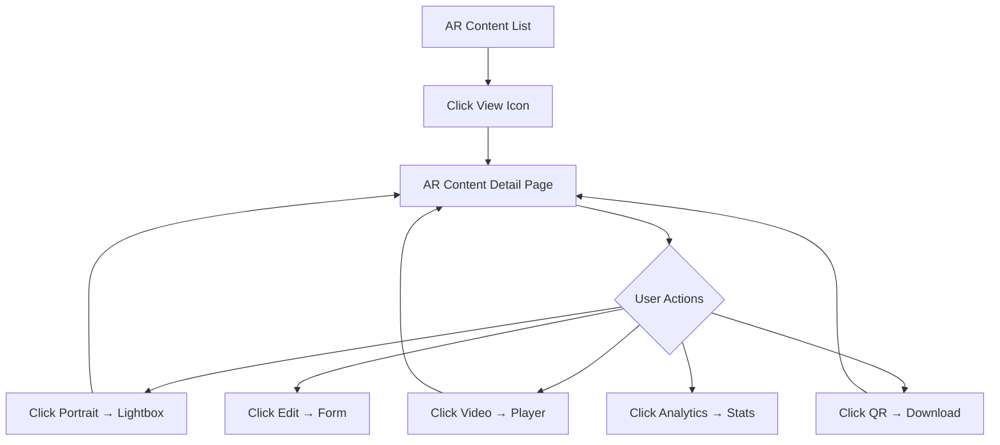

# 🎬 AR Content Detail Page

Полная страница детальной информации AR-контента с превью, лайтбоксами, QR-кодами и расписанием видео-ротации.

## 📁 Файлы

- `frontend/src/pages/ar-content/ARContentDetail.tsx` - Основной компонент детальной страницы
- **Маршрут**: `/ar-content/:arContentId`

## 🎨 Структура страницы

### 1. Header (Шапка)
- Заголовок с названием AR-контента
- Кнопки действий:
  - **QR-код** - открывает диалог с QR-кодом для печати
  - **Редактировать** - переход на форму редактирования
  - **Удалить** - удаление контента

### 2. Info Bar (Информационная панель)
Chips с ключевой информацией:
- 🏢 Компания
- 📁 Проект
- 👤 Создатель (email)
- 📅 Дата создания

### 3. Portrait + File Info (Grid 2 колонки)

#### Левая колонка: Preview портрета
- Клик открывает лайтбокс с полноразмерным изображением
- Размер: 400x400px
- Подсказка: "Кликните для просмотра в полный размер"

#### Правая колонка: Информация о файле
**📊 Информация о файле**:
- 📏 Размер: 1920×1080 px
- 🏷️ Формат: image/jpeg
- 📁 Размер файла: 2.5 MB

**🎯 NFT Маркеры**:
- Статус: ✅ Сгенерирован / ⏳ Генерация
- 📁 Файл: targets.mind (245 KB)
- 🔍 Feature points: 1,247
- ⏱️ Время генерации: 8.2s

### 4. Links & QR Code (Ссылки и QR-код)
- **Ссылка**: `https://ar.vertexar.com/view/{uniqueId}`
  - Кнопки: 📋 Копировать | 🔗 Открыть
- **QR-код**:
  - Preview (200x200px)
  - Кнопки скачивания: PNG | SVG | PDF

### 5. Videos List (Список видео)
Grid с карточками видео (2 колонки на desktop):

**Каждая карточка содержит**:
- Превью изображение (клик → лайтбокс с video player)
- 🎥 Название файла
- Метаданные: Длительность (15s) • Размер (12MB) • Кодек (MP4)
- Статус: ⭐ Активное сейчас (для текущего видео)
- Расписание: 📅 Дата | 🔔 Повтор (ежегодно)
- Кнопка ▶️ для просмотра

**Примеры видео**:
1. **Простая анимация** (default, 3 года)
2. **Новогодняя** (31 декабря, ежегодно)
3. **Снегопад** (25 декабря, ежегодно)

### 6. Rotation Schedule (Расписание ротации)
Список правил:
- По умолчанию: Простая анимация (3 года)
- 25 декабря: Снегопад
- 31 декабря: Новогодняя
- **Следующая смена**: 25 декабря 2025 00:00

### 7. Statistics (Статистика за 30 дней)
4 карточки с метриками:
- 👁️ Всего просмотров: 3,245
- 👤 Уникальных сессий: 2,890
- ⏱️ Средняя сессия: 28 сек
- 📈 Средний FPS: 26.4

**Breakdown по устройствам**:
- Android: 72%
- iOS: 25%
- Другое: 3%

### 8. Footer Actions (Действия внизу)
- ⬅️ Назад
- 📊 Детальная аналитика

---

## 🖼️ Лайтбоксы (Dialogs)

### Portrait Lightbox
**Открытие**: Клик на портрет в preview

**Функции**:
- Полноразмерное изображение (оригинал)
- Зум: 50% - 200% (шаг 25%)
- Кнопки:
  - 🔍 Zoom In / Out
  - ⬇️ Скачать оригинал
  - ✂️ Редактировать
  - ❌ Закрыть

**Информация**:
- Размеры: 1920×1080 px
- Качество NFT: 1,247 feature points (отлично)

### Video Lightbox
**Открытие**: Клик на video preview

**Функции**:
- HTML5 Video Player с controls
- Метаданные:
  - Размер файла: 12 MB (H.264 1080p)
  - Разрешение: 1920×1080 • 30fps
  - Bitrate: 8.2 Mbps | Кодек: H.264
- Кнопки:
  - ⬇️ Скачать
  - ❌ Закрыть

### QR Code Dialog
**Открытие**: Кнопка "QR-код" в header

**Функции**:
- Большой QR-код (300x300px)
- URL для AR viewer
- Кнопки скачивания:
  - PNG (готово)
  - SVG
  - PDF

---

## 🔗 API Integration

### GET /api/ar-content/:arContentId

**Response**:
```typescript
{
  arContent: {
    id: number;
    title: string;
    uniqueId: string;
    imageUrl: string;
    imageWidth: number;
    imageHeight: number;
    imageSize: number;
    mimeType: string;
    markerStatus: 'pending' | 'processing' | 'ready' | 'failed';
    markerFileName?: string;
    markerSize?: number;
    markerFeaturePoints?: number;
    markerGenerationTime?: number;
    createdAt: string;
    createdBy: string;
  };
  company: { name: string };
  project: { name: string };
  videos: VideoInfo[];
  stats: {
    totalViews: number;
    uniqueSessions: number;
    avgSessionDuration: number;
    avgFps: number;
    deviceBreakdown: { device: string; percentage: number }[];
  };
}
```

---

## 📱 Responsive Design

### Desktop (>= 960px)
- Grid: 2 колонки (Portrait + Info)
- Videos: 2 колонки
- Все функции доступны

### Tablet (600-960px)
- Grid: 1 колонка
- Videos: 2 колонки
- Compact layout

### Mobile (< 600px)
- Stack layout (1 колонка)
- Videos: 1 колонка
- Touch-friendly buttons

---

## 🎯 User Flow



---

## ✅ Features

**Реализовано**:
- ✅ Полная структура компонента (585 строк)
- ✅ Portrait Lightbox с зумом
- ✅ Video Lightbox с HTML5 player
- ✅ QR Code Dialog с скачиванием
- ✅ Grid layout для портрета и метаданных
- ✅ Видео карточки с расписанием
- ✅ Статистика просмотров
- ✅ Responsive design (MUI Grid)
- ✅ TypeScript типизация
- ✅ Маршрут добавлен в App.tsx
- ✅ Кнопка "View" в ARContentList

**TODO** (требуется подключение к API):
- [ ] Загрузка данных из `/api/ar-content/:id`
- [ ] Генерация PDF для QR-кода
- [ ] SVG export для QR-кода
- [ ] Редактирование портрета
- [ ] Удаление контента с подтверждением
- [ ] Real-time обновление статистики
- [ ] Loading states
- [ ] Error handling

---

## 🚀 Использование

### Навигация
```typescript
// Из списка AR Content
navigate(`/ar-content/${contentId}`);

// Прямая ссылка
<Link to={`/ar-content/456`}>View Details</Link>
```

### Programmatic navigation
```typescript
import { useNavigate } from 'react-router-dom';

const navigate = useNavigate();
navigate(`/ar-content/${arContentId}`);
```

---

## 📦 Dependencies

**React libraries**:
- `react-router-dom` - routing
- `@mui/material` - UI components
- `@mui/icons-material` - icons
- `qrcode.react` - QR code generation
- `date-fns` - date formatting

**Utils**:
- `formatBytes()` - форматирование размеров файлов
- `copyToClipboard()` - копирование в clipboard
- `downloadQR()` - скачивание QR-кодов

---

## 🎨 UI/UX Highlights

### Цветовая схема
- **Success** (green): ✅ Готово, Активное
- **Default** (gray): ⏳ Processing
- **Error** (red): ❌ Failed

### Иконки
- 🎬 AR Content title
- 🏢 Company
- 📁 Project
- 👤 Creator
- 📅 Date
- 📸 Portrait
- 🎯 Markers
- 🎥 Videos
- 📊 Stats
- 🌐 Links
- 🖨️ QR Code

### Interactive Elements
- **Кликабельный портрет** - Hover effect + cursor pointer
- **Video preview** - Play button overlay
- **Copy button** - Clipboard icon в TextField
- **Zoom controls** - +/- buttons в lightbox
- **Download buttons** - File format icons

---

**Готово к интеграции с API! 🚀**
