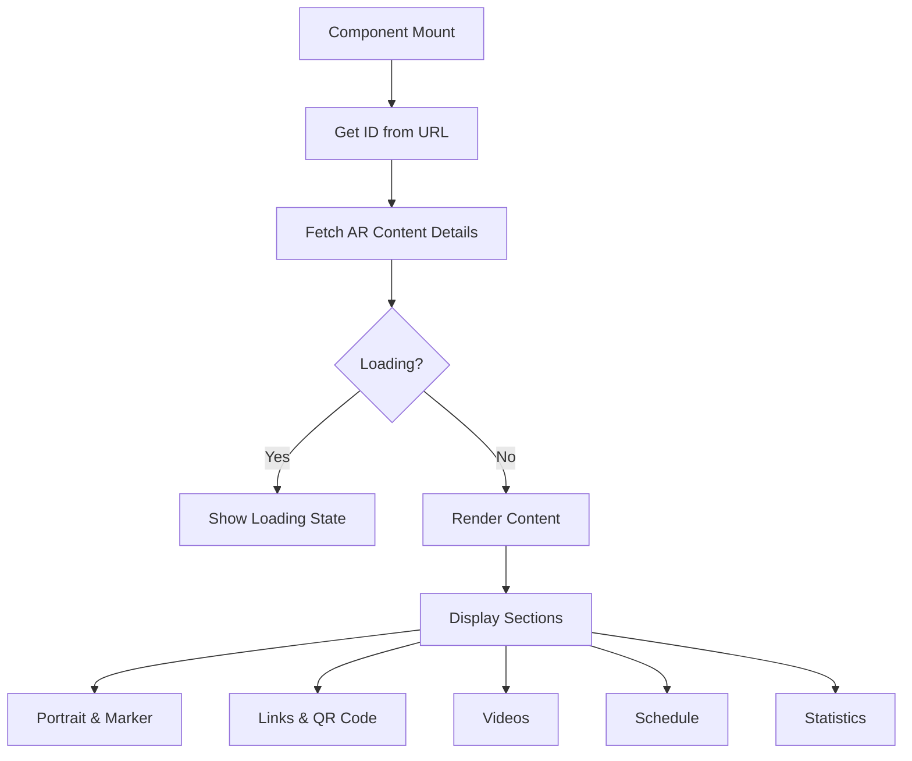

# 📄 AR Content Detail Page Documentation

## 📋 Overview

The AR Content Detail Page displays comprehensive information about a specific AR content item, including portrait image, NFT marker, videos, schedule, QR code, and statistics.

## 🏗️ Component Structure

**File**: `src/pages/ar-content/ARContentDetailPage.tsx`

### Dependencies

- `react` and `react-router-dom` for routing
- `@tanstack/react-query` for data fetching
- MUI components for UI
- Custom components from `@/components/(media)`
- `arContentApi` service for API calls

### Props

None - uses route parameters

### Route Parameters

- `id` - AR content ID from URL

## 🧩 Key Features

### 1. Data Fetching
- Uses `useQuery` hook to fetch AR content details
- Handles loading and error states
- Implements mock data for demonstration

### 2. Layout
- Responsive grid layout (2 columns on desktop, 1 column on mobile)
- Left column: Portrait image and NFT marker
- Right column: Links, QR code, videos, schedule, and statistics

### 3. Interactive Elements
- Lightbox for portrait image and videos
- Copy to clipboard for public URL
- QR code generation and download options
- Marker regeneration button

### 4. Components Used
- `AppLayout` - Main application layout
- `PageHeader` - Page title and navigation
- `MarkerStatusBadge` - Visual marker status indicator
- `QRCodeCard` - QR code display and export
- `VideoPreview` - Video thumbnails with play overlay
- `Lightbox` - Fullscreen media viewer

## 🎨 UI/UX Design

### Desktop (>960px)
- Two-column layout
- Portrait and marker info on left
- Links, QR, videos, schedule, and stats on right

### Tablet (600-960px)
- Single column layout
- Stacked sections

### Mobile (<600px)
- Single column layout
- Touch-friendly buttons
- Optimized spacing

## 🔄 Data Flow



## 📡 API Integration

### Endpoint
`GET /api/ar-content/{id}`

### Response Structure
```typescript
{
  id: number;
  unique_id: string;
  title: string;
  description: string;
  company_id: number;
  company_name: string;
  project_id: number;
  project_name: string;
  image_url: string;
  thumbnail_url: string;
  image_width: number;
  image_height: number;
  image_size_readable: string;
  image_path: string;
  marker_status: 'pending' | 'processing' | 'ready' | 'failed';
  marker_url?: string;
  marker_path?: string;
  marker_feature_points?: number;
  videos: VideoInfo[];
  rotation_rule?: VideoRotationRule;
  stats: StatsInfo;
  created_at: string;
  updated_at: string;
}
```

## 🧪 Testing

### Unit Tests
Located in: `tests/unit/pages/ARContentDetailPage.test.tsx`

Tests cover:
- Loading state rendering
- Content display when data is loaded
- Error handling

### Integration Tests
Located in: `tests/integration/pages/ARContentDetailPage.test.tsx`

Tests cover:
- Full page rendering
- User interactions
- API integration

## 🛠️ Implementation Notes

### Routing
Defined in `src/Routes.tsx`:
```tsx
<Route path="/ar-content/:id" element={<ARContentDetailPage />} />
```

### Type Definitions
Located in: `src/types/ar-content-detail.ts`

### Service Layer
Located in: `src/services/ar-content.ts`
- `arContentApi.get(id)` - Fetch content details
- `arContentApi.generateMarker(id)` - Regenerate marker

## 🚀 Future Enhancements

1. **Real-time Updates**
   - WebSocket integration for live stats
   - Auto-refresh for marker generation status

2. **Advanced Analytics**
   - Device breakdown charts
   - Geographic distribution maps
   - Time-based view analytics

3. **Enhanced Media Handling**
   - 360° image viewer
   - Video playlist management
   - Thumbnail customization

4. **Export Features**
   - PDF report generation
   - CSV data export
   - Bulk QR code download

## 📈 Performance Considerations

- Lazy loading for images and videos
- Memoization of expensive calculations
- Virtualized lists for large video collections
- Efficient re-rendering with React.memo

## 🎯 Accessibility

- Proper ARIA labels
- Keyboard navigation support
- Screen reader compatibility
- Color contrast compliance

## 📱 Responsive Design

- Flexible grid layouts
- Adaptive font sizes
- Touch-friendly controls
- Mobile-optimized interactions